# 数学基础

## 向量求导，分母/分子布局

**1.标量方程对向量导数**

标量函数（scalar function）是指其**输出为标量**（即一个实数或复数）的函数。

| 函数类型 | 自变量         | 因变量（输出） | 示例                                             |
| -------- | -------------- | -------------- | ------------------------------------------------ |
| 标量函数 | 标量/向量/矩阵 | **标量**       | \( f(\mathbf{x}) = \mathbf{a}^\top \mathbf{x} \) |
| 向量函数 | 标量/向量      | **向量**       | \( \mathbf{f}(t) = [\cos t, \sin t]^\top \)      |
| 矩阵函数 | 标量/向量/矩阵 | **矩阵**       | \( \mathbf{F}(t) = e^{t\mathbf{A}} \)            |

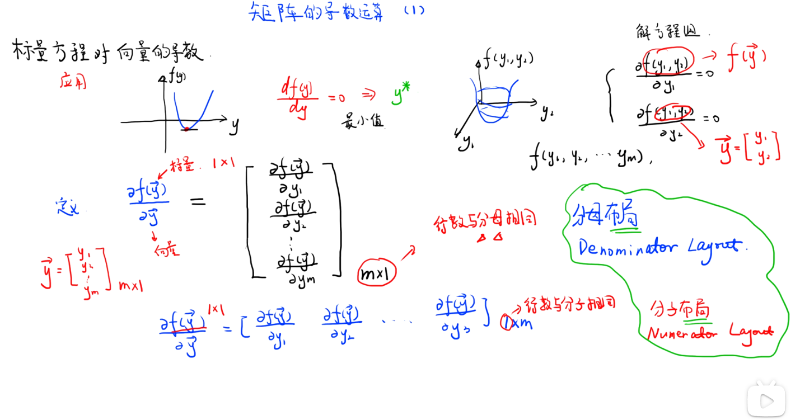

**2.向量方程对向量导数**

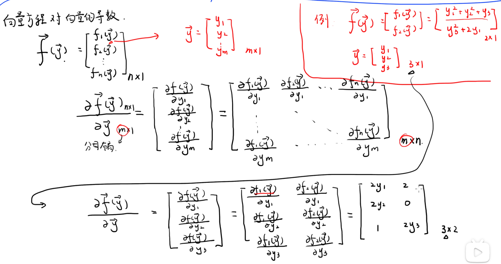

**3.常用特例（分母布局）**

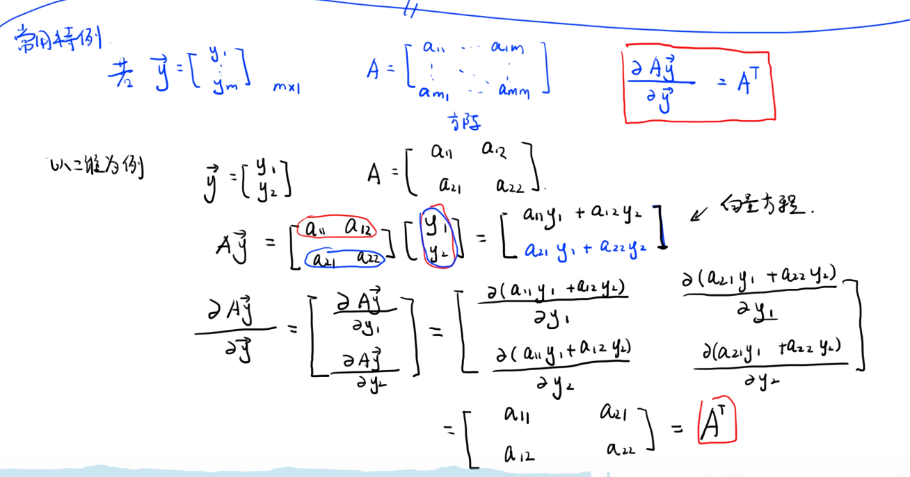

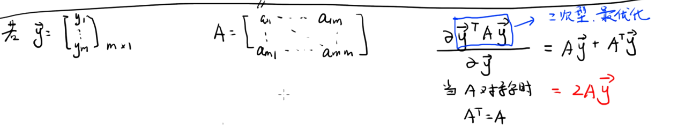

## 矩阵求导的链式法则

标量对矩阵导数

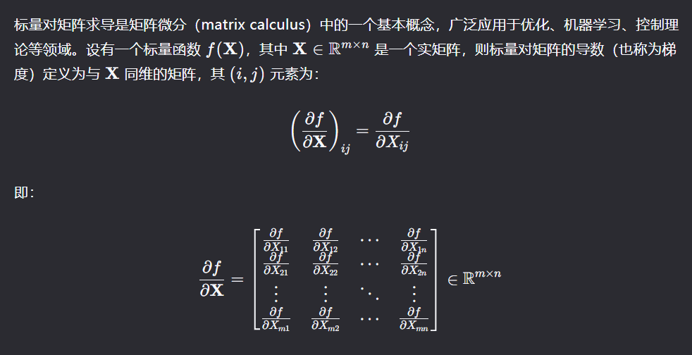

什么是外积？

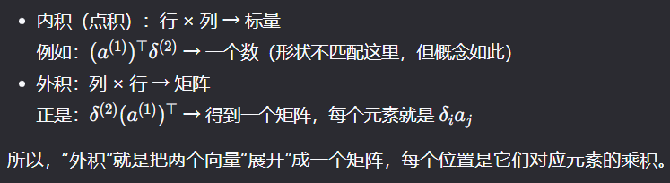

核心概念：**多元链式法则**

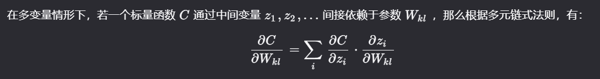

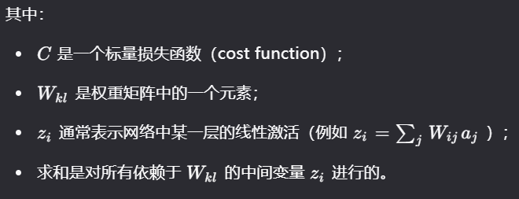


反向传播从输出层开始计算误差，逐层反向传递。

每层根据**后层误差**、**本层激活函数导数**以及**前层输出**，计算**本层权重梯度**。

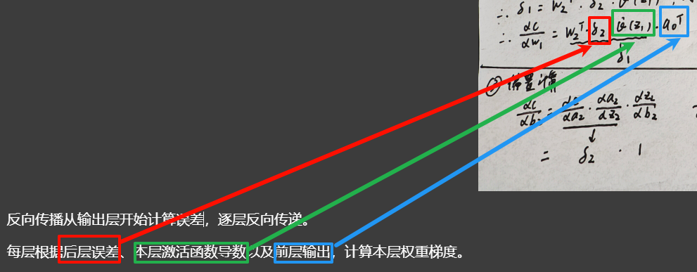

最后用梯度下降更新所有权重。

**实际上，在Pytorch中的运算**（行向量）（矩阵存储时进行转置）：

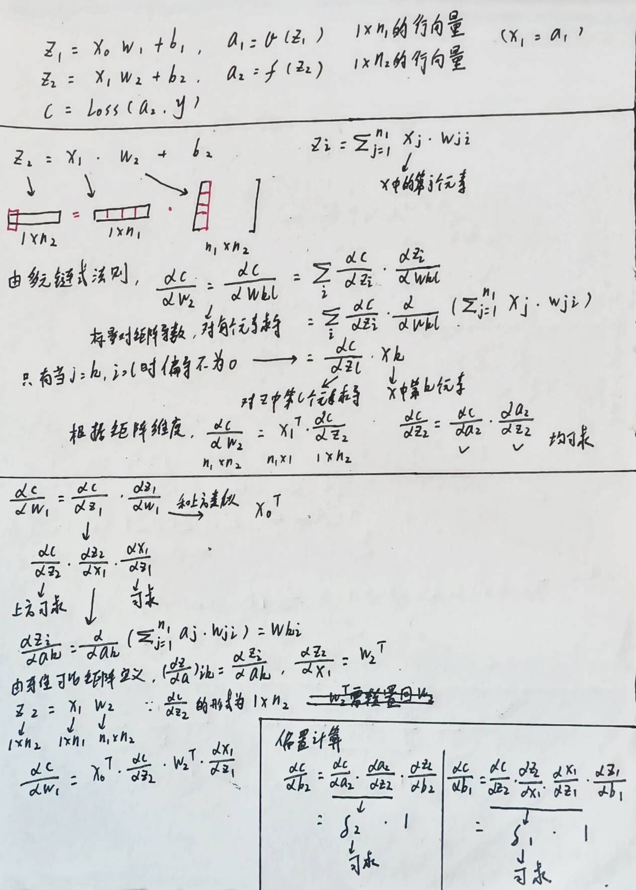

总结一下，**神经网络中需要进行求导的内容包括**（单指隐藏层，最后一层需另外计算）：

损失函数对**后层未激活输出z2**的导数（也称后层误差）、**本层激活函数**的导数（a1 对 z1）。


整体上，由**前层激活输出a0**、**本层误差**（后层误差、后层权重、本层激活函数导数 联合求出）可求出**损失函数对各层权重导数**，基于各层误差可求出**偏置项导数**，

在backward时保存梯度至Tensor.grad中，optimizer.step时进行参数更新。

每层实际需要做的事情：自动微分（Automatic Differentiation）的物理实现

```
1.计算当前层权重导数
a.接收下层传递的下层权重 * 下层误差
b.计算本层误差 = 下层权重 * 下层误差 * 本层激活函数导数
c.计算损失函数对当前层权重导数 = 上层输出 * 本层误差

2.向上层传递：本层权重 * 本层误差
（= =损失函数对当前层输入的导数）
```

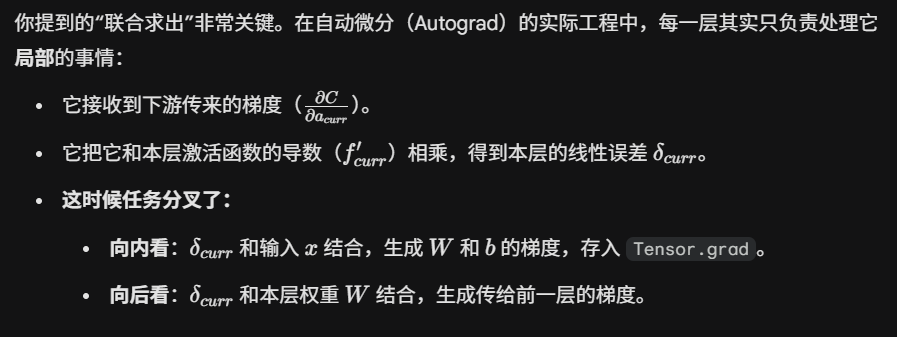

# 神经网络

## 线性模型

X：左横右竖（维度n）；Y：朝向与X相同（维度m）。

针对单个样本下的计算：X(1,n) × W(n,m) = Y(1,m)

如有seq_len：X(s,n) × W(n,m) = Y(s,m)，

如有Batch样本：X(b,s,n) × W(n,m) = Y(b,s,m)，这里其实是将(b,s,n)先变为(b*s,n)批量处理，再自动还原回(b,s,m)，因此pytorch可以处理任意维度的多维张量。每个 token 独立过线性层，互不影响，只是批量处理而已。（详见RNN部分）

在Pytorch存储过程中，常将W以(m,n)的形式存储，运算过程中以W^T(n,m)的形式计算。

```
设每次计算单个W对N个样本的的取值结果，则每次N个样本将输出N个预测值构成N维向量，将这个预测向量与实际向量（即标签）进行误差对比，对应的N个样本元素做减法，求平方，再除以N（即取N个样本的均值），可得出MSE，也就是损失函数。

每次对W进行测试都将输出一个损失值（针对N个样本的），则k次测试将生成k个损失值（1个Epoch中有k次iteration，每次iteration遍历batchsize个样本，每个Epoch结束时保留checkpoint）。最终选出Epoch次下的某个checkpoint，使得对应损失值最小。
```

**总结：**

1。使用单个权重，去乘以多个样本，获取结果作为预测值集合。

2。将预测值集合与真实值集合计算获取单个权重下的误差。

3。对权重更新，使得对应误差最小。  

**每个Batch计算1次损失并更新1次W，每个Epoch保存1次W**

```
实际上，在每一个Epoch开始时，数据都将重新打乱一次
train_loader = DataLoader(dataset, batch_size=32, shuffle=True)
```

## 梯度下降

```
如何使得损失函数最小？求解最合适的W值？有2种方法：
正规方程：直接通过公式求导，得出结果（缺点:当特征过多过复杂时，求解速度太慢并且得不到结果）（并不常用）
梯度下降：通过递推公式，不断设置不同参数，找出最佳结果，点将随着梯度下降最快/最陡的方向移动（常用）

学习率：点移动的步长

偏置：类似截距，可保证线不会始终过原点
```

梯度下降原理：设损失函数为L，对L求W（权重）的导数，通过导数大于或者小于0，判断L基于W下降的方向，不断靠近L的最低点（贪心算法）。 

W更新：W=W-αL‘，这里α是学习率，即每次向最低点移动的步长，过大会导致模型无法收敛。

局部最优：由于点是连续进行移动的，当点移动至某个位置时，导数可能接近0，但是此时只是局部最优点，而不是全局最优点（但实际上深度学习中，这样的局部最优点很少）。

鞍点：一段曲线内，导数值均为0，将导致点无法移动，模型无法继续迭代，解决方式：随机梯度下降（SGD）：在计算误差时，每次只使用一个样本。如每次选用一小组样本，则称为mini-Batch方法（最常用）。

## 反向传播

在图上进行梯度传播，创建更具有弹性的模型结构。


输入X是5维向量，第1层h(1)输出的Y是6维向量，则W只能是5行6列，即存放权重矩阵需要30个元素。

这里的点看作是X中的每个特征，连接线看作是W与X进行线性组合的匹配计算过程，例如这里（Pytorch中实际上常是X*W^T的形式）：


神经元：针对变量指的是向量维数，而针对矩阵则是通道数量。


在一个神经网络中，权重*输入+偏置量=第1层


问题：如果每次都类似上面进行计算，函数展开后形式将始终不变化，变换失去意义。为此，在每次结果输出时需要对结果向量做一个**非线性函数的变换**（即**激活函数**）。


回忆链式法则（chain rule）：(f(g(x)))' = f'(g(x)) * g'(x)，它解决了什么问题？其实就是嵌套过多层函数时，多层求导难度较大的问题。也就是在多层网络中，L对W如何得出求导结果的问题。


这里，Z表示X和W的运算规则，知道Z函数表达式即可轻松获取Z对X导数、Z对W导数。

之后从Loss处返回损失函数L对于Z的导数，

目标是计算L对X的偏导数（这里需要计算的原因是，X不一定就代表数据输入，它可能是一个中间层输出，因此需要有对它进行计算的能力）、以及L对W的偏导数，此时再采用链式法则，由于先前Z对X导数、Z对W导数、L对于Z导数都已经获取，可直接计算出结果。

整体上，先前馈传播，再反向传播，最终得出L对W的梯度（导数）、L对X的梯度。

问：为何此处需要求L对X1的导数？见下方解释，实际上是 后层误差 * 后层权重 的结果。


```
1.计算当前层权重导数
a.接收下层传递的下层权重 * 下层误差
b.计算本层误差 = 下层权重 * 下层误差 * 本层激活函数导数
c.计算损失函数对当前层权重导数 = 上层输出 * 本层误差

2.向上层传递：本层权重 * 本层误差

接收下层传递的下层权重 * 下层误差，这里的下层权重 * 下层误差，就是损失函数对下层输入的导数
因此，每层也可以看作，1.计算本层权重导数 2.计算本层输入导数（本层权重 * 本层误差）并向上传递
```

PyTorch中最基础的数据结构是Tensor（张量），它可以存储一维向量、矩阵、多维矩阵等，

它是一个类，属性包括**W的数值data**和**损失函数对W的导数grad**。


```python
import torch

#这里以列表形式设置了初始数据
x_data = [1.0, 2.0, 3.0]
y_data = [2.0, 4.0, 6.0]

#设置初始权重值
#可以看到这里设置的是一维权重，因为x_data中每列是一个样本，且单个样本的特征维度是1，Y的维度也是1。
w = torch.Tensor([1.0])
#此处设置了需要计算梯度。即设定之后会需要对这个参数进行更新。
w.requires_grad = True

#forward 前向传播（前面提及的Z函数的表达式）
def forward(x):
    return x * w
#这里w是Tensor，所以x * w自动重载为两个Tensor间的数乘运算，x直接被自动转换为Tensor类型以参与计算。
#针对此处，因为输入时w是需要计算梯度的，所以输出结果z=x * w这个Tensor也被设置为需要计算梯度（回忆之前内容中，存在着L对z求梯度的过程）
 
#定义损失函数，这里每运行一次，就构建一个“计算图”
def loss(x, y):
    y_pred = forward(x)
    return (y_pred - y) ** 2
 
#输出预测数值
print("predict (before training)", 4, forward(4).item())

#设置epoch=100，进行100次完整的样本训练
for epoch in range(100):
    #在每个epoch中，每次是针对单个样本计算，这里的计算方式是随机梯度下降SGD
    for x, y in zip(x_data, y_data):
        #构建“计算图”，获取损失函数的Tensor
        l = loss(x, y)
        #调用backward函数后，将“计算图”中所有设置的-需要梯度的地方计算对应梯度，并保存在对应Tensor中。之后释放“计算图”。
        #这里释放“计算图”，是因为每次构建的“计算图”可能是不同的，因此选择不保留，这种方式也使得Pytorch较为灵活。
        #区别：w.grad.data允许在张量层面进行运算并对梯度值进行更新，而w.grad.item()则只能在标量层面进行操作。基于w.grad.data这种方式可对梯度进行更新，同时不会修改“计算图”。
        l.backward()
        #展示梯度值和权重数值
        print('\tgrad:', x, y, w.grad.item(), w.data)
        #W更新：W=W-αL'
        w.data = w.data - 0.01 * w.grad.data
        print(w.data)
        #PyTorch 会自动将梯度累积到.grad属性中。也就是说，如果不清除梯度，它们会在每次迭代时叠加，导致梯度越来越大。w.grad.data.zero_()用于将梯度清空为0。
        w.grad.data.zero_()
        #展示更新后的权重数值和更新后的梯度（这里是0）
        print(w.data, w.grad.item())
	#展示每个epoch结束时对应的损失值
    print('progress:', epoch, l.item())
 
print('predict (after taining)', 4, forward(4).item())

#总结：总计3个步骤：
#1.前向：算损失
#2.反向：算梯度
#3.更新：更新W权重
```

```
print(w)  # Tensor，需构造计算图
print(w.data)  # Tensor，不构造计算图
print(w.data.item())
print(w.grad)  # Tensor，构造计算图，可发现实际上w.grad==w.grad.data
print(w.grad.item())
print(w.grad.data)  # Tensor，不构造计算图
print(w.grad.data.item())

w.grad.data这种操作，目前已过时，更推荐使用：
with torch.no_grad():
    w.grad += 1  # 安全地修改梯度

OUT PUT:
tensor([2.0000], requires_grad=True)
tensor([2.0000])
2.0000007152557373
tensor([0.])
0.0
tensor([0.])
0.0
```

## 线性回归

广播机制：不同形状的矩阵计算中，对矩阵进行自动扩充。即将空的维度部分复制补充至最高维。


```python
import torch

# 和先前不同的地方在于这里将初始数据直接设置为张量，数据集：样本量为3，X和Y的特征维度均为1。
x_data = torch.Tensor([[1.0], [2.0], [3.0]])
y_data = torch.Tensor([[2.0], [4.0], [6.0]])


# 自己想要实现的方式Pytorch难以实现：
# 1.如果可以使用Python基础方法实现，则将其封装为模型类（继承torch.nn.Module）。
# 2.如果求导效率不高，需要自己手动实现反向传播的计算块，可以继承Functions类，如继承Functions类则需要手动额外实现反向传播（因为反向传播过程涉及求导）。

# 这里将模型定义为继承自Module的类（因Module中具有较多合适方法）
class LinearModel(torch.nn.Module):
    # 这里模型至少需要设置2个函数：构造函数和forward函数
    # 1）设置构造函数，初始化对象时可进行属性定义
    def __init__(self):
        super(LinearModel, self).__init__()
        self.linear = torch.nn.Linear(1, 1)
        # torch.nn.Linear是一个类，此处在构造对象，torch.nn.Linear(in features, out features, bias=True)
        # 这里，in features=每一个输入样本（X）的特征维数，out features=每一个输出样本（Y）的维数，bias=是否需要偏置项，这里通过in features和out features可确定每一个权重矩阵W的形状。

    # 2）必须定义并实现forward函数，用于定义前馈计算Z
    # 此处实际上是重载了父类方法，类似_call_方法，当调用对象时会直接使用该函数中的内容。也称为magic method
    # 之后要使用该类时，直接：model=LinearModel(), model(x)即可，其内部做的就是：xw+b，返回的是y_pred
    def forward(self, x):
        y_pred = self.linear(x)
        return y_pred
 


# _call_方法示例：
class Shit:
    def __init__(self):
        pass

    def __call__(self, *args, **kwargs):
        print(args)
        print(kwargs)


# 当实例化对象时，隐式调用的是__init__
shit = Shit()
# 当直接调用对象时，调用的是__call__
shit(1, 2, 3, x=6, y=7)
'''
输出结果：
(1, 2, 3)
{'x': 6, 'y': 7}
'''

# 定义线性模型对象
model = LinearModel()

# 定义损失函数，此处设置为MSE，在 PyTorch 的新版本中，size_average 已经被弃用，
# 取而代之的是 reduction 参数。这个参数有三个选项：
# reduction='mean'：类似于 size_average=True，计算损失的平均值。
# reduction='sum'：类似于 size_average=False，计算损失的总和。
# reduction='none'：不进行任何平均或求和，返回每个样本的损失值。
criterion = torch.nn.MSELoss(reduction='mean')

# 构建对W进行更新的优化器（W=W-αL'），此处设置SGD随机梯度下降
# 但是实际上，SGD是一个方法类，确定是使用单个样本，还是全样本，还是mini-batch，是根据输入数据确定。类似此处使用的就是全样本进行统一计算，对所有样本计算损失均值，并更新W权重。Batch-SGD。
# 在机器学习中，“SGD” 通常泛指 使用 mini-batch 的梯度下降，即使 batch_size > 1。PyTorch 的 SGD 优化器正是为这种通用情形设计的。 
# 实例化了一个SGD类，model是LinearModel，LinearModel里有linear，而linear有parameters。
# 这里使用model.parameters()，目的是找出所有LinearModel中需要进行更新的权重参数。
# 设定固定学习率为0.01
optimizer = torch.optim.SGD(model.parameters(), lr=0.01)

# 训练过程，这里对全样本进行计算更新
for epoch in range(1000):
    # 1.前馈计算，算出y_pred
    y_pred = model(x_data)
    # 2.计算损失，传入y_pred（预测）和y_data（真实），返回损失的Tensor
    loss = criterion(y_pred, y_data)
    # 展示迭代次数和对应Tensor的损失数值
    print(epoch, loss.data.item())
    # 3.先将优化器中的梯度值清零（防止在上一次迭代中遗留下W的梯度）
    optimizer.zero_grad()
    # 4.利用损失的Tensor进行反向传播 
    loss.backward()
    # 5.利用优化器进行权值W和偏置b的迭代
    optimizer.step()

print('w = ', model.linear.weight.item())
print('b = ', model.linear.bias.item())

x_test = torch.Tensor([[4.0]])
y_test = model(x_test)
print('y_pred = ', y_test.data) 
```

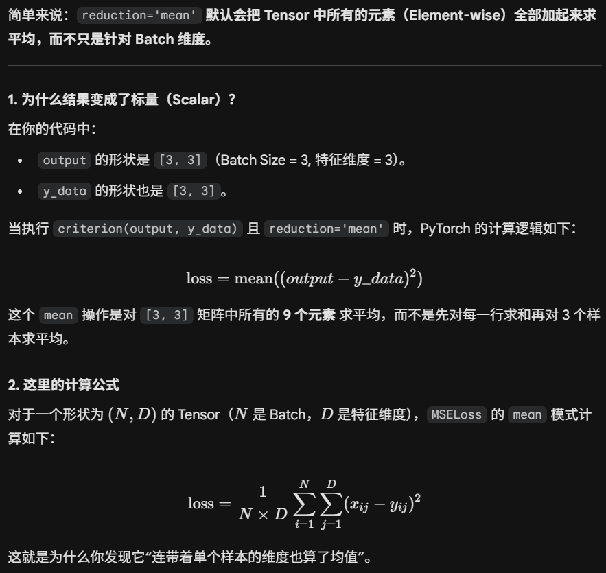

不同优化器的效果展示：

torch.optim.Adagrad
torch.optim.Adam
torch.optim.Adamax
torch.optim.ASGD
torch.optim.LBFGS
torch.optim.RMsprop
torch.optim.Rprop
torch.optim.SGD


## Logistic

n分类问题：和回归问题不同，分类模型的输出应该是和为1的n个概率值，并最终判别结果属于哪个类（概率最大项）。

P(x∈Z) = n

Logistic回归是针对二分类问题的。

经典激活函数Sigmod：用于将线性回归的结果映射至[0, 1]区间内。其导函数类似正态分布形状。

考虑：当线性回归的预测值非常大（正负）时，Sigmoid函数的输出会接近0或1吗？

实际上是会的，解决方案：

1. 特征标准化（缩放特征为0至1范围内）。
2. L1、L2正则化，防止W矩阵调节程度过大。
3. 使用其它激活函数。


常见的Sigmod函数：


使用激活函数之后，仍只能获取范围在[0 ,1]区间的预测值集合。

此时损失函数不再是计算数值之间的距离，而是用于计算两个分布概率值之间的差异。可用KL散度（又称相对熵）、交叉熵等作为损失函数。

例如BCE损失（Binary Cross-Entropy Loss，二元交叉熵损失）的计算公式：


当Y_ac（实际值）=1时，Y_pre（线性回归结果经Sigmod映射后的数值）越接近1，将使得整体函数数值越小（类似先前内容中，预测值和真实值越接近，会导致损失函数越小）；Y_pre越接近0，整体函数数值越大。

当Y_ac=0时，Y_pre越接近0，整体函数数值越小；Y_pre越接近1，整体函数数值越大。


```python
import torch
import numpy as np
import matplotlib.pyplot as plt
import matplotlib

plt.rcParams['font.family'] = 'Times New Roman'
plt.rcParams['font.size'] = '18'
matplotlib.use('TkAgg')

x_data = torch.Tensor([[1.0], [2.0], [3.0]])
# 真实数据Y变为类别0, 1，而不是数值类型
y_data = torch.Tensor([[0], [0], [1]])


class LogisticRegressionModel(torch.nn.Module):
    def __init__(self):
        super(LogisticRegressionModel, self).__init__()
        self.linear = torch.nn.Linear(1, 1)

    # 区别1，前向传播对预测值进行计算时，添加了sigmoid函数映射
    def forward(self, x):
        y_pred = torch.sigmoid(self.linear(x))
        return y_pred


model = LogisticRegressionModel()
# 区别2，定义BCE为损失函数
criterion = torch.nn.BCELoss(reduction='mean')
optimizer = torch.optim.SGD(model.parameters(), lr=0.01)

for epoch in range(1000):
    y_pred = model(x_data)
    loss = criterion(y_pred, y_data)
    optimizer.zero_grad()
    loss.backward()
    optimizer.step()

# 针对不同的x生成预测值并展示
x = np.linspace(0, 10, 200)
# reshape操作
x_t = torch.Tensor(x).view((200, 1))  
y_t = model(x_t)
y = y_t.data.numpy()
plt.plot(x, y)
plt.plot([0, 10], [0.5, 0.5], c='r')
plt.xlabel('Hours')
plt.ylabel('Probability of Pass')
plt.grid()
plt.show()
```

## 多维特征变换

假设对8维特征的N个样本进行Mini-Batch计算：

注意此处**Sigmod函数**进行的是**向量化运算**（即对一个列表中的每个元素，进行逐个元素的计算）。偏置项b直接通过广播机制进行扩充。

这里，Z代表函数值。X矩阵中，每行代表一个样本。


假设需要按照上面的方式进行调整，只需修改此处模型的输入维数即可。 

为什么需要调整输出维度：

可以看作，这里只是调整中间步骤输出的维度，需要在进行多次变换后，最后再次转换为一维输出结果。

思想：通过多个层的线性变换，去拟合非线性变换。

神经网络目的：寻找一种非线性变换的空间函数。

```python
import numpy as np
import torch
from sklearn.datasets import load_diabetes

diabetes = load_diabetes()
x = diabetes.data
y = diabetes.target

# 这里使用32位浮点数，而不使用64位Double，是因为N卡一般支持32位浮点。
xy = np.array(np.concatenate([x, np.array([y]).T], axis=1), dtype=np.float32)
# 取numpy数据构造tensor
x_data = torch.from_numpy(xy[:, :-1])
# 这里[-1]表示取出的是矩阵，否则是向量
y_data = torch.from_numpy(xy[:, [-1]])


class Model(torch.nn.Module):
    def __init__(self):
        super(Model, self).__init__()
        self.linear1 = torch.nn.Linear(10, 6)
        self.linear2 = torch.nn.Linear(6, 4)
        self.linear3 = torch.nn.Linear(4, 1)
        # 这里定义Sigmoid模块，注意和之前定义的函数torch.sigmod()是不同的，这里定义一个模块用于多次调用，构建计算图。
        self.sigmoid = torch.nn.Sigmoid()

    def forward(self, x):
        # 这里每层都可以设置不同的激活函数
        x = self.sigmoid(self.linear1(x))
        x = self.sigmoid(self.linear2(x))
        # 这里如果设置激活函数为Relu，所有小于0的数值将映射为0，因此最后一层一般设置为sigmod
        x = self.sigmoid(self.linear3(x))
        return x


model = Model()
criterion = torch.nn.BCELoss(reduction='mean')
optimizer = torch.optim.SGD(model.parameters(), lr=0.01)

for epoch in range(100):
    y_pred = model(x_data)
    loss = criterion(y_pred, y_data)
    print(epoch, loss.item())
    optimizer.zero_grad()
    loss.backward()
    optimizer.step()
```

不同激活函数的对比：

[torch.nn — PyTorch 2.5 documentation](https://pytorch.org/docs/stable/nn.html#non-linear-activations-weighted-sum-nonlinearity)


## Dataset/DataLoader

**对比 SGD 和 Mini-batch GD**

- **纯 SGD（单样本）**：每次迭代使用一个样本，随机性最强，有助于逃离局部极小值。**单次迭代速度快，但收敛过程不稳定，需要更多迭代才能达到较好的收敛效果**。
- **Mini-batch SGD**：每次迭代使用一个小批量样本（例如 Batch Size=32 或 64）。兼顾了**收敛速度、稳定性、计算效率**。
- **Batch GD（全数据）**：没有随机性，每次迭代使用全数据，存在鞍点问题。单次迭代**最慢**，不适合大规模数据。

因此，**Mini-batch SGD** 是实际应用中最常用的形式，它在效率和梯度波动之间找到了一个平衡点。

常用词汇解释：

**Epoch**：整个数据集被完整训练一次。一般来说，模型将在1个Epoch结束时保存。

**Batch Size**：每次迭代时所处理的数据量。

**Iteration**：一次权重更新，处理一个Batch。

1个Epoch中，Iteration = 数据样本总数 / Batch Size


Dataset：用于数据索引

DataLoader：用于数据加载mini-batch


```python
import numpy as np
import pandas as pd
import torch
from sklearn.datasets import load_diabetes

# 这里，Dataset是一个抽象类（不能被实例化，只能被继承）
from torch.utils.data import Dataset, DataLoader

# 读取并创建数据集
diabetes = load_diabetes()
x = diabetes.data
y = diabetes.target
data = np.array(np.concatenate([x, np.array([y]).T], axis=1), dtype=np.float32)
pd.DataFrame(data).to_csv('diabetes.csv', index=False)


class DiabetesDataset(Dataset):
    # 初始化读取数据：一般2种方式
    # 1.如果数据集不大，可直接全部加载进入内存。
    # 2.如果数据集较大，仅保存数据样本的索引，在getitem被调用时再实时读取数据。
    def __init__(self, filepath):
        xy = pd.read_csv(filepath)
        self.len = xy.shape[0]
        self.x_data = xy.iloc[:, :-1].values.astype('float32')
        self.y_data = xy.iloc[:, xy.shape[1] - 1:xy.shape[1]].values.astype('float32')

    # 这里__getitem__是一个magic method，当对象使用下标时自动调用该方法
    # 此处返回（样本数据，标签）元组
    def __getitem__(self, index):
        return self.x_data[index], self.y_data[index]

    # 这里__len__也是一个magic method，当对象调用len()时自动调用该方法
    def __len__(self):
        return self.len


dataset = DiabetesDataset('diabetes.csv')
# 这里，num_workers代表设置去读取batch_size数据的并行线程数。当数据集较小时，使用多线程反而可能降低运行速度。
train_loader = DataLoader(dataset=dataset,
                          batch_size=32, 
                          shuffle=True,
                          num_workers=2)


class Model(torch.nn.Module):
    def __init__(self):
        super(Model, self).__init__()
        self.linear1 = torch.nn.Linear(10, 6)
        self.linear2 = torch.nn.Linear(6, 4)
        self.linear3 = torch.nn.Linear(4, 1)
        self.sigmoid = torch.nn.Sigmoid()

    def forward(self, x):
        x = self.sigmoid(self.linear1(x))
        x = self.sigmoid(self.linear2(x))
        x = self.sigmoid(self.linear3(x))
        return x


model = Model()
criterion = torch.nn.BCELoss(reduction='mean')
optimizer = torch.optim.SGD(model.parameters(), lr=0.01)

# 此处设置if __name__ == '__main__'，是为了防止进程并发时发生 运行时异常 错误
if __name__ == '__main__':
    # 设置epoch为100
    for epoch in range(100):
        # 这里采用enumerate获取iteration次数i
        # 此处，train_loader将X和Y数据进行封装，形成各个Batch下的数据矩阵（X和Y分别形成矩阵）
        for i, data in enumerate(train_loader, 1):
            inputs, labels = data
            y_pred = model(inputs)
            loss = criterion(y_pred, labels)
            print(epoch, i, loss.item())
            optimizer.zero_grad()
            loss.backward()
            optimizer.step()

```


总结流程顺序：1.准备数据集 2.设置模型 3.构造损失和优化器 4.训练周期

```python
import numpy as np
import torch
import torch.nn as nn
from sklearn.datasets import load_diabetes
from sklearn.model_selection import train_test_split
from sklearn.metrics import mean_squared_error, mean_absolute_error, r2_score
from torch.utils.data import Dataset, DataLoader

# 使用 sklearn 内置数据
data = load_diabetes()
x = data.data
y = data.target.reshape(-1, 1)

# 划分训练集和测试集
x_train, x_test, y_train, y_test = train_test_split(
    x, y, test_size=0.2, random_state=42
)


# 自定义 Dataset
class MyDataset(Dataset):
    def __init__(self, x, y):
        self.x = torch.from_numpy(x).float()
        self.y = torch.from_numpy(y).float()

    def __getitem__(self, index):
        return self.x[index], self.y[index]

    def __len__(self):
        return len(self.x)


train_loader = DataLoader(dataset=MyDataset(x_train, y_train), batch_size=32, shuffle=True, num_workers=0)
val_loader = DataLoader(dataset=MyDataset(x_test, y_test), batch_size=32, shuffle=False, num_workers=0)


# 定义模型
class Net(nn.Module):
    def __init__(self):
        super(Net, self).__init__()
        self.network = nn.Sequential(
            nn.Linear(10, 8),
            nn.ReLU(),
            nn.Linear(8, 4),
            nn.ReLU(),
            nn.Linear(4, 2),
            nn.ReLU(),
            nn.Linear(2, 1)
        )

    def forward(self, x):
        return self.network(x)


# 初始化
model = Net()
optimizer = torch.optim.Adam(model.parameters(), lr=0.001)
loss_fn = nn.MSELoss()

device = torch.device("cuda:0" if torch.cuda.is_available() else "cpu")
model.to(device)

# 训练
epochs = 200
for epoch in range(epochs):
    model.train()
    for i, (inputs, labels) in enumerate(train_loader):
        inputs, labels = inputs.to(device), labels.to(device)

        optimizer.zero_grad()
        output = model(inputs)
        loss = loss_fn(output, labels)
        loss.backward()
        optimizer.step()

    if (epoch + 1) % 50 == 0:
        print(f"Epoch [{epoch + 1}/{epochs}], Loss: {loss.item():.4f}")

# 测试
model.eval()
all_preds = []
all_trues = []

with torch.no_grad():
    for inputs, labels in val_loader:
        inputs, labels = inputs.to(device), labels.to(device)
        outputs = model(inputs)

        all_preds.append(outputs.cpu().numpy())
        all_trues.append(labels.cpu().numpy())

# 合并所有 batch 的结果
pred = np.concatenate(all_preds).flatten()
true = np.concatenate(all_trues).flatten()

# 计算指标
mse = mean_squared_error(true, pred)
rmse = np.sqrt(mse)
mae = mean_absolute_error(true, pred)
r2 = r2_score(true, pred)

print("\n" + "=" * 30)
print("最终测试集性能评估：")
print("=" * 30)
print(f"MSE:  {mse:.4f}")
print(f"RMSE: {rmse:.4f}")
print(f"MAE:  {mae:.4f}")
print(f"R²:   {r2:.4f}")
print("=" * 30)

```

model.train() - 训练模式
作用：

- 启用 Batch Normalization 的统计量更新
- 启用 Dropout 层（按概率随机丢弃神经元）
- 让模型知道当前处于训练阶段

model.eval() - 评估模式
作用：

- 固定 Batch Normalization 的统计量（使用训练阶段的统计量）
- 关闭 Dropout 层（使用所有神经元）
- 禁用梯度计算（通常与 torch.no_grad() 一起使用）

## 交叉熵多分类

第1种方式：将多分类看作多个二分类问题，将某种类别标签记作1，其它类别标签记作0，针对每种类别构造并训练分类器。

“一对多”方法的最大缺点是它将每个类别独立看待，忽视了类别之间的相似性、关系和层次结构。它通过多个独立的二分类器来处理多分类问题，但这可能导致以下问题：

1. 类别之间的相似性被忽视。
2. 决策边界可能过于复杂，不自然。
3. 类别之间的决策可能不一致。
4. 无法捕捉类别的层次结构。
5. 无法处理“新类别”的问题。

所希望的针对各类别的输出：

1.**输出均大于零**，

2.**输出的和等于1**，

解决方案：神经网络保持先前层的激活函数不变，输出层激活使用**softmax**。

这里，直接控制输出的预测值y_pre维数为样本类别数：

例如，设样本类别为k（k分类问题），输入x为n维（即特征维数），则进行变换的权重矩阵w的形状（n，k）。


**对数似然损失**：

将**标签**构造成为**One-hot编码**形式，例如有5种类别，该样本真实样本标签属于第4类，则对应标签表示为：[0，0，0，1，0]

将**Softmax层输出**的预测值结果（例如：[0.3，0.2，0.1，0.3，0.1]）和该列表（[0，0，0，1，0]）计算对数似然损失。因为计算过程中的真实标签有很多0项所以相乘为零，只看真实项（此处实际只计算第4类）。

为什么会设计这样的函数：目标是希望第4类预测值结果输出地尽可能接近1，当Y=1时，Y_pre越接近1，整体损失越接近0；Y_pre越接近0，损失越接近无穷大。


**交叉熵（CE）**：Softmax + Negative Log Likelihood Loss

回忆：之前的二元交叉熵，叫做BCE，BCE需要先做sigmod


对数据损失计算过程进行测试验证：

```python
import torch

# 定义损失函数，此处设置reduction='none'，返回每个样本的损失值而不是批量计算均值
criterion = torch.nn.CrossEntropyLoss(reduction='none')

# 设置真实样本类别
Y = torch.LongTensor([2, 0, 1, 0])

# 这里有4个样本，3个类别，在输入softmax层之前已控制每个样本的输出维度为3。
# 针对4个样本，依次大概率预测：2,0,1,0（softmax不会改变最大值位置，只是等比例缩放）
Y_pred1 = torch.Tensor([[0.1, 0.2, 0.9], 
                        [1.1, 0.1, 0.2],
                        [0.2, 2.1, 0.1],
                        [1.2, 0.1, 0.3]])
# 大概率预测：0,2,2,1
Y_pred2 = torch.Tensor([[0.8, 0.2, 0.3],
                        [0.2, 0.3, 0.5],
                        [0.2, 0.2, 0.5],
                        [0.1, 0.7, 0.4]])

l1 = criterion(Y_pred1, Y)
l2 = criterion(Y_pred2, Y)
print("Loss1 = ", l1.data, "\nLoss2 = ", l2.data)

```

每张图像都可以看作矩阵形式，使用8位（1字节）来表示每个像素的灰度值，8位可以表示的整数范围是0到255（2^8=256）。

将（0-255）进行标准化，则可以构成数据集矩阵。例如下图是（1，28，28）（C(channel)，H(height)，W(width)）。

channel指颜色通道，RGB通道数为3，此处黑白则为1。


```python
import torch
from torchvision import transforms
from torchvision import datasets
from torch.utils.data import DataLoader
import torch.nn.functional as F

# 设置批量处理的样本数=64
batch_size = 64
# 构造对图像进行处理的转换器transform，对每个元素进行进行pipline处理：
# 首先将每张图片转换为（C，H，W）的Tensor形式，transforms.ToTensor() 会把图像像素从 [0, 255] 缩放到 [0.0, 1.0]
# 然后将每个Tensor进行标准化缩放，此处缩放至均值0.1307，标准差0.3081的正态分布（MNIST数据集图像的均值和标准差）。
transform = transforms.Compose([transforms.ToTensor(),
                                transforms.Normalize((0.1307,), (0.3081,))
                                ])

# 加载训练和测试数据集，并构造Dataset和DataLoader
train_dataset = datasets.MNIST(root='../dataset/mnist/',
                               train=True,
                               download=True,
                               transform=transform)
train_loader = DataLoader(train_dataset,
                          shuffle=True,
                          batch_size=batch_size, num_workers=0)
test_dataset = datasets.MNIST(root='../dataset/mnist/',
                              train=False,
                              download=True,
                              transform=transform)
test_loader = DataLoader(test_dataset,
                         shuffle=False,
                         batch_size=batch_size, num_workers=0)


class Net(torch.nn.Module):
    def __init__(self):
        super(Net, self).__init__()
        # 这里为何输入是784？因为将28*28的矩阵按行展开后再拼接，构造了一个（1，784）的向量。
        # 全连接网络通常要求输入是一维向量。
        # 因此，如果将一个 28x28 的图像输入到一个全连接网络（例如MLP）时，
        # 通常需要将其展平（flatten）为一个一维向量。
        # 这是因为全连接层将每个输入像素与一个神经元连接，不能直接处理多维结构。
        self.l1 = torch.nn.Linear(784, 512)
        self.l2 = torch.nn.Linear(512, 256)
        self.l3 = torch.nn.Linear(256, 128)
        self.l4 = torch.nn.Linear(128, 64)
        # 为何输出10？因为MNIST数据集的图像有10种类别（0-9）
        self.l5 = torch.nn.Linear(64, 10)

    def forward(self, x):
        # 通过view()函数改变Tensor形状。-1代表设置列数后，行数将进行自动计算。
        x = x.view(-1, 784)
        x = F.relu(self.l1(x))
        x = F.relu(self.l2(x))
        x = F.relu(self.l3(x))
        x = F.relu(self.l4(x))
        # 返回时，最后一层无需再做Relu激活，因为交叉熵函数自身将使用Softmax进行激活，并计算对数似然损失
        return self.l5(x)


# 设置模型在GPU上运行
# 2步：1将模型迁移至GPU；2将数据迁移至GPU
model = Net()
device = torch.device("cuda:0" if torch.cuda.is_available() else "cpu")
model.to(device)

# 设置损失函数和优化器
# 定义交叉熵损失函数
criterion = torch.nn.CrossEntropyLoss(reduction='mean')
# momentum=0.5：动量方法通过考虑过去梯度的累积来调整当前梯度更新的方向和幅度。缩短训练时间。
# 通常在0到1之间，越接近1，历史梯度的影响越大。
# 简单来说，动量方法在每一步的梯度更新中不仅考虑当前的梯度，还会加上一部分之前更新方向的“记忆”，
# 从而在优化过程中起到“惯性”作用。
optimizer = torch.optim.SGD(model.parameters(), lr=0.01, momentum=0.5)


# 分别将每个epoch的训练和测试过程封装为函数
def train(epoch):
    # 定义累计损失
    running_loss = 0.0
    for batch_idx, data in enumerate(train_loader, 0):

        inputs, target = data
        inputs, target = inputs.to(device), target.to(device)
        optimizer.zero_grad()

        outputs = model(inputs)
        loss = criterion(outputs, target)
        loss.backward()
        optimizer.step()

        # 每300轮iteration输出1次平均损失（对累计损失求300次的平均），而不是等待epoch结束
        running_loss += loss.item()
        if batch_idx % 300 == 299:
            print('[%d, %5d] loss: %.3f' % (epoch + 1, batch_idx + 1, running_loss / 300))
            running_loss = 0.0


# 定义测试过程的函数
def test():
    # 定义正确数量和总数量
    correct = 0
    total = 0
    # 设置不需要计算梯度，因为此处没有任何训练过程，只验证模型结果的准确性
    with torch.no_grad():
        # 多个Batch，这里的循环次数为：测试集样本总数/Mini-Batch(64)
        for data in test_loader:
            images, labels = data
            images, labels = images.to(device), labels.to(device)
            # 针对单个Batch的样本，每次输出的是64个10维向量，10维表示其对10个类别的预测概率。
            # 目标是在对应类别的向量位置上，数据尽可能地相比其它类别大。
            # 注意此处还未经过Softmax层和对数似然损失，目标就是在计算损失前，让该层输出结果尽可能大。
            # （Softmax层不会改变原始数据的大小分布情况）
            outputs = model(images)
            # 针对64个样本按行拼接构成的矩阵，每次按列找出最大值及其对应索引。
            # 其中detach()表示获取数值。dim=1表示按列进行操作并计算最大值。返回=（最大值，最大值索引）。
            _, predicted = torch.max(outputs.detach(), dim=1)
            # 计算真实标签矩阵形状的第1个维度（这里是64）并进行累加
            total += labels.size(0)
            # 计算每64个样本里分类正确的样本数，并将其累加
            correct += (predicted == labels).sum().item()
    # 计算分类的准确率：即分类正确的样本数/总样本数
    print('Accuracy on test set: %d %%' % (100 * correct / total))


if __name__ == '__main__':
    # 在每个epoch中，每次训练完就进行测试，展示模型性能变化
    for epoch in range(10):
        train(epoch)
        test()

```

# 概念

## 多标签分类

**二分类**：Sigmoid + BCE
注：通常使用PyTorch的BCEWithLogitsLoss（或BCELoss：手动Sigmod+BCE损失）

**单标签多分类**：交叉熵（Softmax + 对数似然损失）
注：通常使用PyTorch的CrossEntropyLoss，内部完成Softmax+NLL

**多标签多分类**：Sigmoid + BCE（逐类别进行，损失默认reduction='mean'）
注：通常使用PyTorch的BCEWithLogitsLoss，其内部结合Sigmoid和BCE并做数值优化，相比二分类只需将输出层设置为类别数即可。

多标签 + 类别不平衡：BCEWithLogitsLoss(pos_weight=...)


```
# 假设有 3 个类别，统计出的正负样本数量如下：
# 类别0: 10个正, 90个负 -> 权重应为 9
# 类别1: 50个正, 50个负 -> 权重应为 1
# 类别2: 1个正,  99个负 -> 权重应为 99

pos_weight = torch.tensor([9.0, 1.0, 99.0])
criterion = nn.BCEWithLogitsLoss(pos_weight=pos_weight)
```

对于标签：

二分类：[0] 或 [1]

单标签多分类：[5] = = [0, 0, 0, 0, 1]

多标签多分类：[0, 1, 0, 1, 0]

## 训练测试划分

```python
# 生成特定Batch、特定维度、特定数量的训练和测试集，以对模型测试
import torch

num_batches = 5
batch_size = 32
train_loader = []
test_loader = []

for i in range(num_batches):
    data = torch.randn(batch_size, 1, 28, 28)
    target = torch.randint(0, 10, (batch_size,))
    train_loader.append((data, target))


for i in range(num_batches):
    data = torch.randn(batch_size, 1, 28, 28)
    target = torch.randint(0, 10, (batch_size,))
    test_loader.append((data, target))
```

模型训练一般流程：

1. **划分出测试集（Hold-out Test Set）** → 保留到最后，**不参与任何训练/调参过程**。

2. **剩余数据用于“训练+验证”** → 这部分可使用交叉验证。

3. **在“训练+验证”部分上做 K 折交叉验证** → 用于选择超参数、比较模型等。

4. **选定最佳模型和超参数后，用整个“训练+验证”数据重新训练最终模型**。

5. **最后，在测试集上评估一次最终模型性能**。

   ✅ 交叉验证只在“训练+验证”部分进行。（也可进行最终评估，如LOSO）
   ✅ 测试集**永远不参与交叉验证**。
   ✅ 交叉验证的目的是**更可靠地估计模型在未知数据上的表现（用于调参）**，而不是最终评估。 

   实际处理流程中，可以先只划分训练和测试集。验证集如有需要，可在中间处理过程中，再次通过train_test_split细分。
   
   对于划分验证集的目的，还有一层原因，是在训练的同时记录模型性能，通过对比 **训练损失** 和 **验证损失**，判断模型是否**过拟合**。

```python
from sklearn.datasets import load_iris
from sklearn.model_selection import train_test_split

'''
x_train, x_test：特征 训练和测试集
y_train, y_test：标签 训练和测试集

深度学习中，常与DataSet和DataLoader配合使用
'''
iris = load_iris()
x_train, x_test, y_train, y_test = train_test_split(
    iris.data,  # 特征
    iris.target,  # 标签  
    test_size=0.2,  # 80%训练，20%测试 - 常见比例
    random_state=42,  # 设置随机种子确保结果可复现
    stratify=iris.target,  # 保持训练集、测试集中各类别比例相同=原始数据集类别比例
    shuffle=True  # 显式指定打乱（默认True）
)

```

## Norm归一化

“内部协变量偏移”（Internal Covariate Shift，简称 **ICS**）是深度学习中的一个概念。指在深层神经网络中，**由于前一层参数的更新，导致后一层输入的分布发生剧烈变化**现象。

Batch Normalization 通过“强行干预”解决此问题：

1. **标准化分布**：无论前一层怎么变，BN 都会把输出拉回到均值为 0、方差为 1 的标准分布。
2. **解耦层间关系**：每一层的输入分布相对固定，后一层不再需要苦苦追赶前一层的变化，从而可独立进行优化。
3. **允许更大的学习率**：因为输入被控制在了激活函数的非饱和区（梯度较大区域），可放心调高学习率，加快训练速度。

------

> **直观比喻**： 想象在做一个“传声筒”游戏。每个人（神经网络层）都会根据听到的声音稍作修改再传给下一个人。如果第一个人说话的声音忽大忽小、一会儿高音一会儿低音，后面的人会听得很痛苦。 **BN 就像是给每个人配了一个调音台**：无论前一个人怎么喊，调音台都会把声音调整到标准音量和音调，再传给下一个人，这样沟通效率就极大地提高了。

尽管Batch Normalization的名字里带有“Normalization”（归一化），但从其数学本质和操作上看，它执行的是 **标准化** 的过程。

| **归一化**                                                   | **标准化**                                                   |
| :----------------------------------------------------------- | :----------------------------------------------------------- |
| **线性缩放**到固定区间，受异常值影响非常大（因用到最大/最小值） | **基于分布**的缩放（均值、标准差），受异常值影响较小（因使用均值、标准差） |

常见**Batch Normalization**（批归一化）和 **Layer Normalization**（层归一化）：

| 特性            | BatchNorm             | LayerNorm                   |
| --------------- | --------------------- | --------------------------- |
| 归一化维度      | 跨样本（batch 维度）  | 跨特征（单样本内）          |
| 依赖 batch size | 是（小 batch 效果差） | 否                          |
| 适用模型        | CNN（图像）           | RNN / Transformer（NLP）    |
| 训练/推理一致性 | 不一致（需移动平均）  | 一致                        |
| 对序列长度敏感  | 否                    | 是（但通常能适应变长序列）  |
| 参数            | 每通道有 γ, β         | 每特征位置有 γ, β（或共享） |

BatchNorm归一化的是“同一特征在不同样本间”的分布，有助于稳定特征分布。

LayerNorm归一化的是“同一个样本内不同特征”的分布，有助于处理特征尺度差异。


同时可见，BatchNorm中的EMA相比Adam并没有进行偏差修正（V_t / (1 - β_t)）

- **BatchNorm**：
  - 训练时：使用**当前 batch** 的均值和方差。
  - 推理时：使用训练过程中累积的**移动平均**的均值和方差。
  - 需要额外保存统计量。
- **LayerNorm**：
  - 训练和推理完全一致，无需保存统计量，实现更简单。

- 图像分类、检测等 CNN 任务 → **BatchNorm**
- NLP、Transformer、RNN、小 batch 或变长序列 → **LayerNorm**
- 有些模型（如 Vision Transformer）也会在图像任务中使用 LayerNorm
- 测试：


```python
import torch
import torch.nn as nn

# 1️⃣ Batch Normalization（批归一化）
# 在标准 CNN 中，BN 用在卷积后
x = torch.randn(4, 32, 28, 28)  # [B, C, H, W]
bn = nn.BatchNorm2d(32)
x_bn = bn(x)  # 对每个通道 C，在 B×H×W 上归一化

# 假设 batch_size=4, 序列长度=10, 特征维度=64
x = torch.randn(4, 10, 64)  # [B, L, D]

# 强行用在 [B, L, D] 上（比如全连接层后），可以 reshape
x_flat = x.view(-1, 64)  # [40, 64]
bn = nn.BatchNorm1d(64)
x_bn = bn(x_flat)  # [40, 64]
x_bn = x_bn.view(4, 10, 64)  # 恢复 [B, L, D]

# 2️⃣ Layer Normalization（层归一化）
# LayerNorm 默认对最后一个维度（特征维度）归一化
ln = nn.LayerNorm(normalized_shape=64)  # 64 = embed_dim
x_ln = ln(x)  # 输入 [4, 10, 64] → 输出 [4, 10, 64]
```

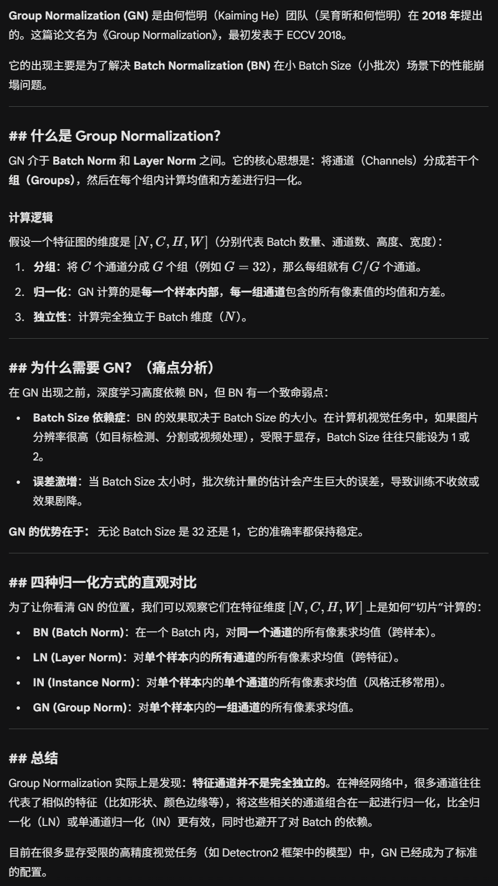

在使用 `Conv -> BN` 或 `Linear -> BN` 的结构时，总是习惯性地将前一层的偏置关掉（设置 `bias=False`）

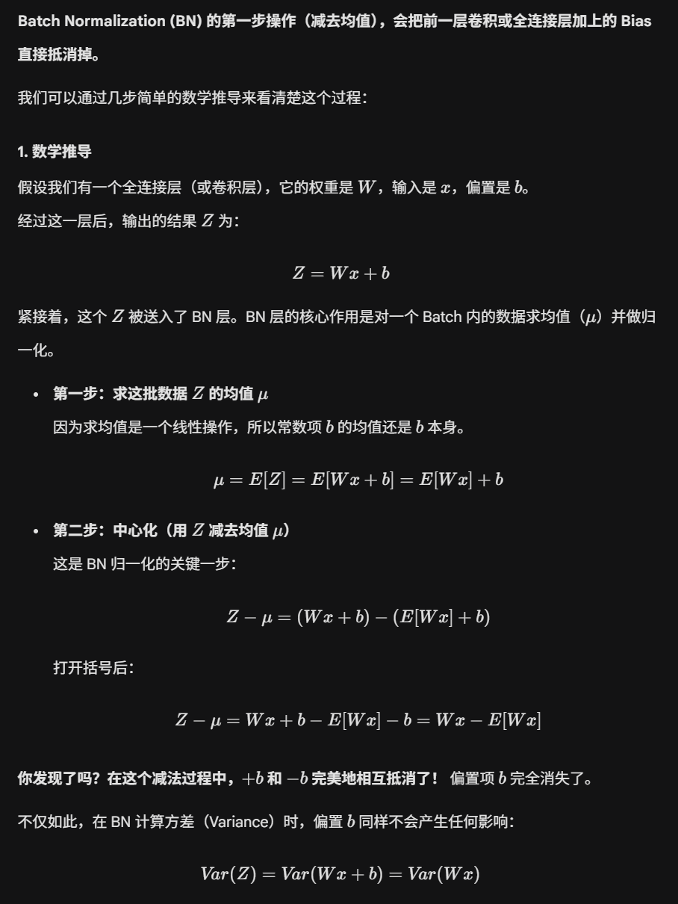

## 特征降维

| 类别                               | 方法名称                | 核心思想                                | 是否保留原始特征 | 线性/非线性      | 输出是否“不相关”          | 是否具备特征选择能力 | 典型应用场景                   |
| ---------------------------------- | ----------------------- | --------------------------------------- | ---------------- | ---------------- | ------------------------- | -------------------- | ------------------------------ |
| **特征选择（Feature Selection）**  | 方差选择法              | 去除方差过小的特征（认为变化小=信息少） | ✅ 是             | —                | —                         | ✅ 是                 | 预处理、高维稀疏数据（如文本） |
|                                    | 相关系数法              | 保留与目标变量相关性高的特征            | ✅ 是             | —                | —                         | ✅ 是                 | 回归、分类初步筛选             |
|                                    | 卡方检验 / 互信息       | 衡量特征与目标的统计依赖性              | ✅ 是             | —                | —                         | ✅ 是                 | 分类任务（尤其离散特征）       |
|                                    | 递归特征消除（RFE）     | 基于模型反复剔除最不重要特征            | ✅ 是             | —                | —                         | ✅ 是                 | 与SVM、决策树等结合使用        |
| **特征提取（Feature Extraction）** | **线性方法**            |                                         |                  |                  |                           |                      |                                |
|                                    | 主成分分析（PCA）       | 投影到方差最大的正交方向                | ❌ 否（新特征）   | ✅ 线性           | ✅ 是（主成分正交/不相关） | ❌ 否                 | 数据压缩、可视化、去噪         |
|                                    | 线性判别分析（LDA）     | 投影到类间差异最大、类内差异最小的方向  | ❌ 否             | ✅ 线性           | ✅（在类别条件下）         | ❌ 否                 | 有监督降维、分类前处理         |
|                                    | 因子分析（FA）          | 假设观测变量由潜在因子线性生成          | ❌ 否             | ✅ 线性           | ✅（因子间独立）           | ❌ 否                 | 心理学、社会科学建模           |
|                                    | **非线性方法**          |                                         |                  |                  |                           |                      |                                |
|                                    | t-SNE                   | 保持局部邻域相似性，用于可视化          | ❌ 否             | ❌ 非线性         | ❌ 否                      | ❌ 否                 | 高维数据可视化（2D/3D）        |
|                                    | UMAP                    | 保持局部和全局结构，比t-SNE更快         | ❌ 否             | ❌ 非线性         | ❌ 否                      | ❌ 否                 | 可视化、聚类预处理             |
|                                    | 自编码器（Autoencoder） | 神经网络学习压缩-重建表示               | ❌ 否             | ❌ 非线性（通常） | ❌ 否                      | ❌ 否                 | 深度学习中的表示学习           |
|                                    | 核PCA（Kernel PCA）     | 通过核技巧实现非线性PCA                 | ❌ 否             | ❌ 非线性（隐式） | ✅（在核空间正交）         | ❌ 否                 | 非线性结构数据降维             |

```python
# PCA降维

import numpy as np
from sklearn.decomposition import PCA

'''
sklearn.decomposition.PCA(n_components=None) 将数据分解为较低维数空间
n_components:
小数：表示保留百分之多少的信息
整数：减少到多少个特征
'''

data = np.array([[2, 8, 4, 5],
                 [6, 3, 0, 8],
                 [5, 4, 9, 1]])
# n<min(np.shape)，因此如transfer = PCA(4) 将报错
transfer = PCA(3)
dataN = transfer.fit_transform(data)
print(dataN)

```

## 优化器设置

任务为预测当前值，思路变化：

1.使用前6天平均

2.对前6天加权平均

3.修改加权值使其更合理

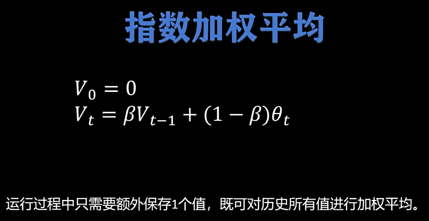

已知前6天数据，如何推出第7天数据？

注：此处Vt-1是历史数据，θt是当前数据

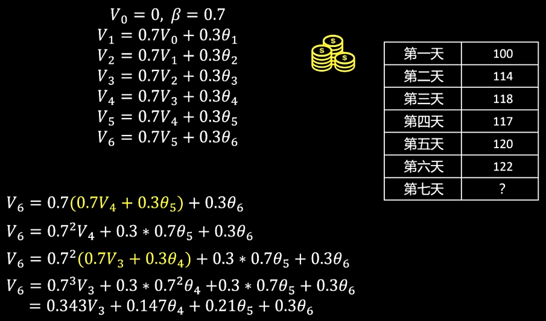

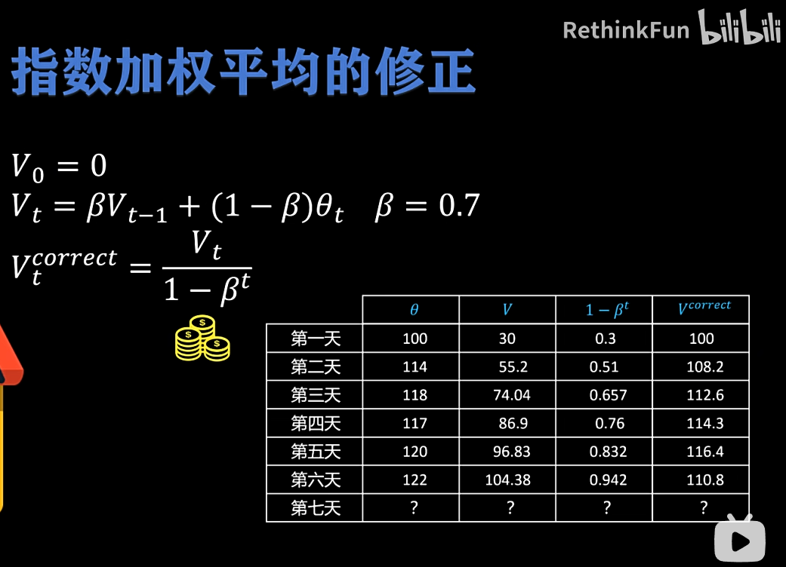

模型训练过程中，常出现梯度不稳定的情况，如何解决？

Momentum：在对模型权重的更新过程中（W=W-αL‘），对梯度L‘应用先前指数加权平均的思想计算（记录历史梯度，且根据最新梯度决定大小，类似“惯性”）

RMSProp：考虑让梯度除以一个代表过去梯度的值，使得当前梯度不会过大或过小。

Adam：结合Momentum和RMSProp算法。

AdamW：加个权重衰减项。

| Momentum                                                     | RMSProp                                                      | Adam                                                         | AdamW                                                        |
| ------------------------------------------------------------ | ------------------------------------------------------------ | ------------------------------------------------------------ | ------------------------------------------------------------ |
| 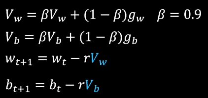 | 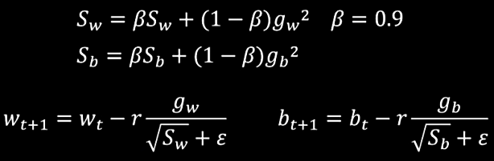 | 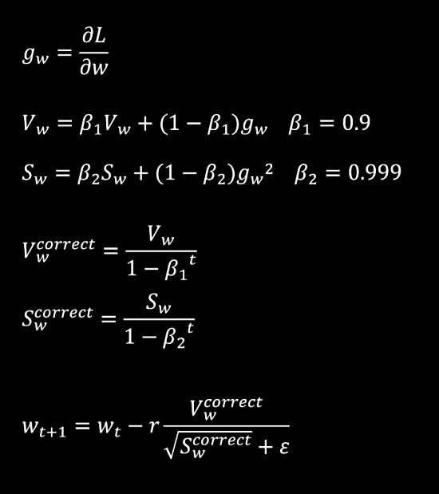 | 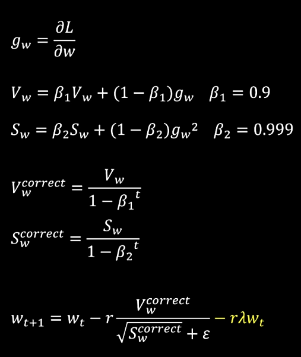 |

Adam & AdamW：每个参数都要额外保存两个值。每个值都需要用float32位来存储。如果参数用float16存储，这两个值占用大小将是参数大小的4倍。

当我们说 “Adam 有动态学习率”，其实是说：

**每个参数的有效学习率会根据其历史梯度的大小自动调整**，而不是所有参数共享同一个固定步长比例。实际上α并没有改变，但通过历史梯度的方差为每个参数动态缩放更新步长，等效于每个参数有自己的学习率。

Hugging Face Transformers 及深度学习生态支持的**主流与前沿优化器**已形成完整谱系，涵盖**内存优化、收敛加速、大模型训练**等场景。

| 优化器名称          | 配置值                | 内存开销      | 核心特性                 | 适用场景             | 额外依赖             |
| ------------------- | --------------------- | ------------- | ------------------------ | -------------------- | -------------------- |
| AdamW               | "adamw_torch" (默认)  | 2×参数量      | 权重衰减解耦，稳定训练   | 通用训练（BERT/LLM） | 无                   |
| AdamW (8-bit)       | "adamw_bnb_8bit"      | ~0.25×参数量  | 8-bit 量化状态           | 显存受限场景         | bitsandbytes         |
| AdamW (4-bit)       | "adamw_bnb_4bit"      | ~0.125×参数量 | 4-bit 量化（实验性）     | 极端显存限制         | bitsandbytes>=0.42.0 |
| Adafactor           | "adafactor"           | ~1×参数量     | 行/列因子分解二阶梯矩    | 大模型训练（T5）     | 无                   |
| Apollo              | "apollo_adamw"        | ~1×参数量     | 标量自适应 + 随机投影    | 单卡大模型微调       | apollo-torch         |
| LAMB                | "lamb"                | 2×参数量      | 层级自适应学习率         | 超大 batch 训练      | torch_optimizer      |
| RMSProp             | "rmsprop"             | 1×参数量      | 梯度平方移动平均         | CNN 训练             | 无                   |
| SGD                 | "sgd"                 | 0×            | 基础动量                 | 理论研究/小模型      | 无                   |
| Schedule-Free AdamW | "schedule_free_adamw" | 2×参数量      | 无需预热，收敛更快       | 快速实验/小数据集    | schedulefree         |
| Schedule-Free SGD   | "schedule_free_sgd"   | 0×            | 无需预热的 SGD           | 快速收敛需求         | schedulefree         |
| Sophia-G            | "sophia_g"            | 2×参数量      | 曲率感知，防 loss spikes | 稳定大模型训练       | sophia               |
| SOAP                | "soap"                | 2×参数量      | 二阶梯矩+动量解耦 (2024) | 高精度模型优化       | soap                 |

## 拟合/正则化/Dropout

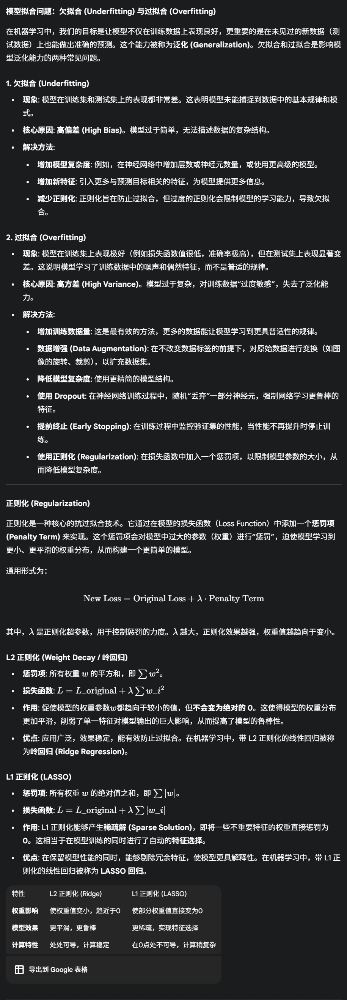

**Dropout ≠ L2 正则化** 

- L2 正则化：约束**权重大小**
- Dropout：随机**屏蔽神经元**
- 两者可**同时使用**，效果更好

关于**作用时间**：L2 正则化作用于损失计算(L=L+λW^2)，在 Adam 更新参数(W=W-αL', L' = XXXXXX)之前执行


```python
import torch
import torch.nn as nn
import torch.optim as optim


# 定义一个简单的神经网络模型
class SimpleNet(nn.Module):
    def __init__(self):
        super(SimpleNet, self).__init__()
        self.fc1 = nn.Linear(784, 128)
        self.fc2 = nn.Linear(128, 10)
        # 设置dropout随机丢弃神经元
        self.dropout = nn.Dropout(p=0.5)

    def forward(self, x):
        x = torch.relu(self.fc1(x))
        x = self.dropout(x)
        x = self.fc2(x)
        return x


model = SimpleNet()
criterion = nn.CrossEntropyLoss()

# --- 添加 L2 正则化 ---
# 在定义优化器时，通过 weight_decay 参数设置正则化强度 lambda
# 这里的 1e-4 是一个常用的正则化强度值
# Adam 优化器自动将权重衰减项应用到所有它管理的参数（即 model.parameters()）上
optimizer = optim.Adam(model.parameters(), lr=0.001, weight_decay=1e-4)

# 模拟训练过程
inputs = torch.randn(64, 784)
labels = torch.randint(0, 10, (64,))
optimizer.zero_grad()
outputs = model(inputs)
loss = criterion(outputs, labels)
# PyTorch 的优化器在进行梯度下降时，会自动加上L2正则化项梯度
loss.backward()
optimizer.step()

print(f"Calculated Loss: {loss.item()}")

```

## 全局平均池化

**全局平均池化（Global Average Pooling, GAP）** 是卷积神经网络（CNN）中一种常用的池化操作，主要用于**替代全连接层（Fully Connected Layer）**，实现**降维、减少参数、防止过拟合**，并增强模型的**可解释性**。

对**每个特征图（feature map）**，计算其**所有空间位置（H × W）上的平均值**，从而将一个二维特征图压缩为**一个标量**。

💡 例如：如果某一层输出是 `[batch_size, C, H, W]`，经过 GAP 后变成 `[batch_size, C, 1, 1]`，通常再展平为 `[batch_size, C]`。 

例如，在ViT模型中，Encoder输出分类的两种方法：
1.增加一个分类头[cls]token。用最后Encoder这个token的输出提取全局信息。
2.不增加token，对最后Encoder的所有token的向量的GAP提取全局信息。

目的是保留特征信息，并聚合全局信息。

| 模型类型            | 输入结构     | GAP 操作                      | 输出   |
| ------------------- | ------------ | ----------------------------- | ------ |
| CNN                 | [B, C, H, W] | 对每个通道在 H×W 上平均       | [B, C] |
| Transformer (Token) | [B, N, D]    | 对所有 N 个 token 在 N 上平均 | [B, D] |

```python
import torch
import torch.nn as nn

# 面向CNN
x = torch.randn(32, 512, 7, 7)
gap = nn.AdaptiveAvgPool2d((1, 1))  # 全局平均池化
out = gap(x)  # shape: [32, 512, 1, 1]
out = out.view(out.size(0), -1)  # shape: [32, 512]

# 面向Transformer
x = torch.randn(32, 197, 768)  # [B, N, D]
global_repr = x.mean(dim=1)  # shape: [32, 768]
```

## Register parameter/buffer

| **属性类型**         | **自动随 to(device) 移动？** | **包含在 state_dict 中？** | **是否计算梯度 (Update)？** | **典型例子**                             |
| -------------------- | ---------------------------- | -------------------------- | --------------------------- | ---------------------------------------- |
| **Parameter**        | ✅ 是                         | ✅ 是                       | ✅ 是                        | 卷积核权重、偏置                         |
| **Buffer**           | ✅ 是                         | ✅ 是                       | ❌ 否                        | Focal Loss 的 alpha、BN 层均值、位置编码 |
| **Normal Attribute** | ❌ 否                         | ❌ 否                       | ❌ 否                        | 普通的 Python 变量                       |

```
register_parameter : 和Parameter用法一样，两种写法一致

self.parameter1 = nn.Parameter(torch.randn(3))
self.register_parameter("parameter2",nn.Parameter(torch.randn(3)))

行为：
1.将此parameter放至model parameters中，可一并传入优化器，训练优化
2.将此parameter放至model.state_dict()中，可随模型参数保存
3.model.to_device('gpu')，可一并转移参数

register_buffer：注册一个不需要训练的变量
self.register_buffer('fixed_bias', torch.tensor([1.0, 2.0, 3.0]))
```

## 二分类评估指标

TP（真正例）、TN（真负例）、FP（假正例）、FN（假负例）是分类结果的四种基本构成。（第2个PN是预测结果，第1个TF代表预测是否正确）

TP指实际为正且预测为正，TN指实际为负且预测为负，FP是实际为负却被预测为正，FN则是实际为正却被预测为负。值构成了混淆矩阵。

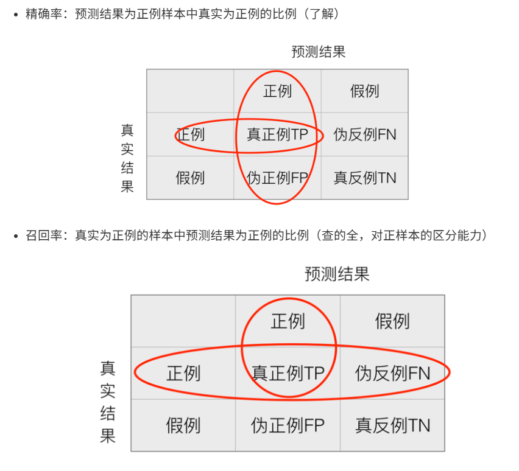

准确率（Accuracy）衡量的是模型**预测正确的样本占总样本**的比例，即（TP+TN）/（TP+TN+FP+FN）；

精准率（Precision）关注的**是预测为正类**的样本中有多少是真正的正类，计算为TP/（TP+FP）；

召回率（Recall，也称查全率）则衡量**实际正类**中被正确识别的比例，即TP/（TP+FN）。

三者侧重点不同：准确率反映整体性能，精准率强调预测正类的可靠性，召回率强调对正类样本的覆盖能力。

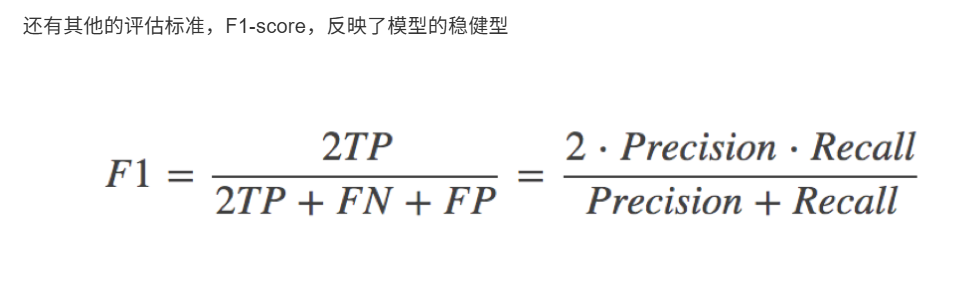

假设99个样本癌症，1个样本非癌症，只要全都预测正例（默认癌症为正例）,准确率就为99%，这就是样本不均衡下的评估问题。

问题：如何衡量样本不均衡下的评估？

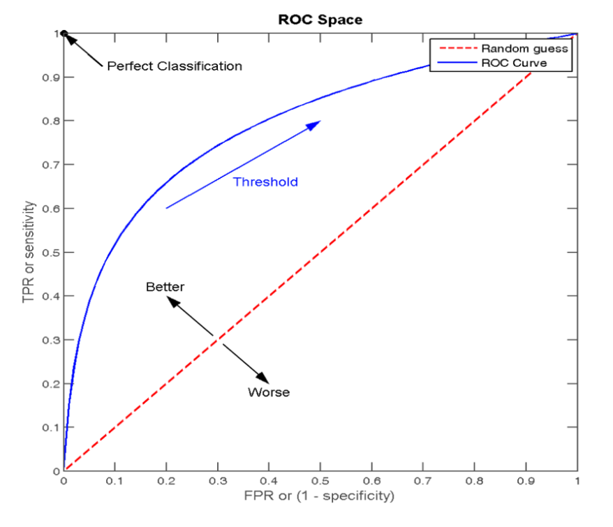

```
1. 定义模型阈值
分类模型通常会输出预测的概率值，例如，模型可能会预测某个样本属于正类的概率是0.7。
为了将这些概率转换为具体的类别标签（例如，正类或负类），需要设置一个阈值。
例如，若阈值为0.5，则概率大于0.5的样本被预测为正类，小于等于0.5的样本被预测为负类。

2. 计算真阳性率和假阳性率
对于不同的阈值，计算模型的真阳性率（True Positive Rate, TPR）和假阳性率（False Positive Rate, FPR）。
TPR = TP / TP + FN
FPR = FP / FP + TN

3. 绘制ROC曲线
选择多个阈值：通常会选择一系列不同的阈值（例如从0到1），计算每个阈值下的TPR和FPR。
绘制图形：以FPR为x轴，以TPR为y轴绘制点，并连接这些点形成ROC曲线。

4. 计算AUC（Area Under the Curve）
AUC（曲线下面积）是ROC曲线下的面积，用来量化模型的总体性能。AUC值的范围是0到1：
AUC = 1：表示完美的分类性能，模型能够正确分类所有的样本。
AUC = 0.5：表示模型没有分类能力，模型的性能与随机猜测相当。
AUC < 0.5：表示模型性能不如随机猜测。

注：AUC只能用于二分类问题
```

## 非均衡样本

几个层面对非平衡样本问题进行解决：

**数据**：数据插值 / 图像数据增强（数据增强也是过拟合解决方法之一）

**采样器**：添加sampler采样器，WeightedRandomSampler，按类别数进行数据重采样

**损失函数**：a.基于Focal Loss设计修改新损失（针对易分类样本修改其损失值）b.或直接在现有Loss函数中添加weight=[ ]、pos_weight=[]

**二阶段训练**：主要针对长尾分布问题，不改变损失函数公式，而是在推理或训练的输出层加上一个基于类别频率的偏移量（Logit），效果往往比加 weight 更好且更稳定。

### 数据增强

- **欠采样 (Undersampling):** 减少多数类样本。
  - *适用场景：* 数据量非常大时。
  - *缺点：* 可能会丢失重要信息。
  - *方法：* 随机删除、EasyEnsemble。
- **过采样 (Oversampling):** 增加少数类样本。
  - *适用场景：* 数据量较小时。
  - *缺点：* 简单的复制会导致过拟合。
  - *方法：*
    - **SMOTE (Synthetic Minority Over-sampling Technique):** 通过插值合成新的少数类样本，而非简单复制。
    - **ADASYN:** 根据学习难度自适应地生成样本。

```python
import numpy as np
from imblearn.over_sampling import SMOTE
from sklearn.model_selection import train_test_split

# 假设 X 是特征，y 是标签 (0 为多数类, 1 为少数类)
# X shape: (1000, 20), 
# y shape: (1000,)，包括200个1，800个0

X = np.random.random(size=(1000, 20))
y1 = np.ones(200)
y2 = np.zeros(800)
y = np.concatenate((y1, y2), axis=0)

X_train, X_test, y_train, y_test = train_test_split(X, y, test_size=0.2)

print(f"重采样前 标签1的数量: {sum(y_train == 1)}")

# --- 关键步骤 ---
# 初始化 SMOTE
smote = SMOTE(random_state=42)

# 注意，仅在【训练集】上进行过采样，不要在测试集上做
X_train_res, y_train_res = smote.fit_resample(X_train, y_train)

print(f"重采样后 标签1的数量: {sum(y_train_res == 1)}")

```

图像领域 SMOTE 的替代方案：**针对性数据增强** (Targeted Augmentation)

**核心逻辑：** 不是“合成”新图，而是对现有的少数类图片进行“变形”。

只对**少数类**样本进行强力的数据增强，多数类保持不变或轻微增强。

- **几何变换：** 旋转、翻转、缩放、裁剪、透视变换。

- **色彩变换：** 修改亮度、对比度、饱和度、添加高斯噪声。

- **Mixup / CutMix：** 这是一个特例，虽然也是混合，但在图像领域很有效（将两张图按透明度叠加，标签也按比例叠加），可以提升鲁棒性。

- **合成数据 (AIGC)：** 这是一个新趋势。利用 Stable Diffusion 或 GAN 生成极少数类样本，用来填补数据分布空缺，比简单插值要高级且有效得多。

```
Mixup / CutMix 的 少数类重采样 + 增强：
在每个 Epoch 中，通过复制或随机抽取，强制让少数类的数量和多数类一样多。

物理样本：1000 张多数类，100 张少数类。
采样器（Sampler）：在抽取时，让少数类被抽中的概率放大 10 倍。

单次 Epoch 看到的量：
多数类：1000 张（每张看 1 次）。
少数类：1000 张（100 张原始图，每张被抽中约 10 次，且这 10 次每次都会触发不同的随机增强）。

结果：在每一个 Epoch 里，模型看到的多数类和少数类数量完全是 1:1（都是 1000 次），并且少数类的每次曝光都不重样。
```

- | 维度                         | 说明                                                         |
  | ---------------------------- | ------------------------------------------------------------ |
  | **磁盘/内存中的样本数**      | ❌ **不变**。例如，原始有 100 张少数类图像，应用此增强后，**数据集长度仍是 100**，不会生成新的 `.jpg` 文件或额外的内存副本（除非显式缓存）。 |
  | **训练时模型“看到”的样本数** | ✅ **实质增加**。由于增强是**随机且每次不同**，模型在每个 epoch 中看到的少数类样本都是**该原始图像的一个新“视图”**（view）。例如，同一张图在 epoch 1 被旋转 +15°，在 epoch 2 被调暗并翻转…… |

```
from torchvision import transforms

# 针对少数类的“强力”增强
minority_transforms = transforms.Compose([
    transforms.RandomHorizontalFlip(p=0.5),
    transforms.RandomRotation(degrees=30),  # 旋转幅度大一点
    transforms.ColorJitter(brightness=0.4, contrast=0.4), # 色彩变化
    transforms.ToTensor(),
])

# 多数类只做基础处理
majority_transforms = transforms.Compose([
    transforms.ToTensor(),
])
```

### 采样器

**关于sampler采样器**

默认情况（Shuffle=True）

> **[数据集所有索引]** --> **[随机打乱]** --> **[按 batch_size 切分]** --> **[去 Dataset 拿数据]**

使用 WeightedRandomSampler

> **[给每个索引分配权重]** --> **[Sampler 按权重“抽签”生成索引流]** --> **[按 batch_size 切分]** --> **[去 Dataset 拿数据]**

如正确设置权重（即权重与类别样本数成反比），在一个 Epoch 结束时，模型看到的各类别样本总数比例**理论上趋近于 1:1:1...**

**WeightedRandomSampler**

**核心逻辑：** 不产生新文件，也不删文件。而是在 `DataLoader` 抓取数据时，**强行让它多抓取少数类的图片**。

通常配合更强的正则化（如 Dropout 或更大的权重衰减）一起使用。或采用 **Two-stage 训练法**：先用原始非平衡数据训练提取特征的能力，最后几个 Epoch 再开启采样器微调分类头。

```python
import torch
from torch.utils.data import DataLoader, WeightedRandomSampler

# 假设 dataset.targets 是所有图片的标签列表 [0, 0, 1, 0, 1, ...]
targets = dataset.targets 
class_count = [900, 100] # 假设 0类有900个，1类有100个

# 1. 计算每个类别的权重 (倒数，数量越少权重越大)
class_weights = 1. / torch.tensor(class_count, dtype=torch.float)

# 2. 为数据集中的【每一张图片】分配一个权重
# 这一步会生成一个和数据集长度一样的列表
samples_weights = [class_weights[t] for t in targets]

# 3. 创建采样器
sampler = WeightedRandomSampler(
    weights=samples_weights, 
    num_samples=len(samples_weights), # 通常设为数据集大小
    replacement=True # 允许重复抽样 (必须为True，否则少数类抽完就没了)
)

# 4.放入 DataLoader (关键：使用了 sampler 就不要设置 shuffle=True)
train_loader = DataLoader(
    dataset, 
    batch_size=32, 
    sampler=sampler # <--- 这里传入
)
```

### 损失函数

**weight和pos_weight区别**：


- **类别权重 (Class Weights):** 给少数类样本赋予更高的权重（Penalty）。

  - *操作：* 在 `CrossEntropyLoss` 或 XGBoost/LightGBM 中设置 `scale_pos_weight` 或 `class_weight='balanced'`。

  - ```python
    import torch
    import torch.nn as nn
    
    # 假设：类别 0 有 1000 个，类别 1 有 100 个
    # 计算权重：总数 / (类别数 * 当前类数) 或者 简单地取倒数比例
    # 这里简单的设定：类别 1 的权重是 类别 0 的 10 倍
    weights = torch.tensor([1.0, 10.0]).to("cuda") # 传到 GPU
    
    # --- 关键步骤 ---
    # 在 Loss 函数中直接传入 weight 参数
    criterion = nn.CrossEntropyLoss(weight=weights)
    #  nn.BCEWithLogitsLoss(pos_weight=pos_weight) 对比先前二元损失中的pos_weight参数
    # ----------------
    
    # 后续训练代码不变
    # loss = criterion(outputs, labels)
    # loss.backward()
    ```
    

- **调整损失函数 (Loss Function):** 使用专门针对难分类样本的损失函数。

  - **Focal Loss:** 降低易分类样本的权重，专注于难分类（通常是少数类）样本。
  - 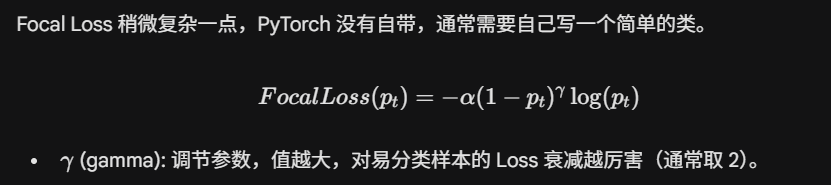
  - 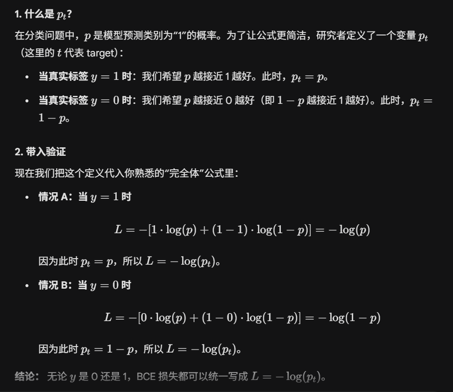

```python
import torch
import torch.nn as nn
import torch.nn.functional as F

class FocalLoss(nn.Module):
    def __init__(self, alpha=0.25, gamma=2.0, reduction='mean'):
        super(FocalLoss, self).__init__()
        self.alpha = alpha
        self.gamma = gamma
        self.reduction = reduction

    def forward(self, inputs, targets):
        # 1. 计算标准的 Binary Cross Entropy Loss (不进行 reduction)
        # inputs 应该是 logits (未经过 sigmoid，因为函数中已包含)
        BCE_loss = F.binary_cross_entropy_with_logits(inputs, targets, reduction='none')
        
        # 2. 计算 pt (模型预测正确的概率)
        # 如果损失值高（样本很难预测），pt就接近0，
        # 如果损失值低（样本容易预测），pt就接近1，
        # pt 本质是模型对当前样本预测正确的置信度
        pt = torch.exp(-BCE_loss)
        
        # 3. 计算 Focal Loss 公式
        F_loss = self.alpha * (1 - pt)**self.gamma * BCE_loss

        if self.reduction == 'mean':
            return torch.mean(F_loss)
        elif self.reduction == 'sum':
            return torch.sum(F_loss)
        else:
            return F_loss

# --- 使用方法 ---
model = MyNeuralNetwork()
criterion = FocalLoss(alpha=0.25, gamma=2) # 初始化

# 训练循环中
# outputs = model(images)
# loss = criterion(outputs, labels.float())
```

```python
import torch
import torch.nn as nn
import torch.nn.functional as F

class MultiClassFocalLoss(nn.Module):
    def __init__(self, alpha=None, gamma=2.0, reduction='mean'):
        """
            alpha (Tensor, optional): 针对每一类的权重，解决样本不平衡问题。
                                      形状应为 [num_classes]。
                                      例如：[0.1, 0.9, 0.5] 对应类别 0, 1, 2。
            gamma (float): 聚焦参数，控制难易样本的挖掘程度。默认 2.0。
            reduction (str): 'mean', 'sum' 或 'none'。
        """
        super(MultiClassFocalLoss, self).__init__()
        self.gamma = gamma
        self.reduction = reduction
        
        # 将 alpha 注册为 buffer，这样它会跟随模型移动到 GPU/CPU，且保存模型时会被保存
        if alpha is not None:
            if isinstance(alpha, (list, tuple)):
                alpha = torch.tensor(alpha).float()
            # 注册 buffer 后，不需要手动 .to(device)
            self.register_buffer('alpha', alpha) 
        else:
            self.alpha = None

    def forward(self, inputs, targets):
        """
            inputs: 模型的输出 Logits (未经过 Softmax)，形状 [Batch_Size, Num_Classes]
            targets: 真实标签，形状 [Batch_Size]，类型为 Long (int64)
        """
        # 1. 计算标准的 Cross Entropy Loss (不进行 reduction)
        # 这里 F.cross_entropy 等价于 LogSoftmax + NLLLoss
        # CE_loss 的形状是 [Batch_Size]
        CE_loss = F.cross_entropy(inputs, targets, reduction='none')
        
        # 2. 计算 pt (模型对 Ground Truth 类别的预测概率)
        # 因为 CE = -log(pt)，所以 pt = exp(-CE)
        pt = torch.exp(-CE_loss)
        
        # 3. 计算 Focal Loss 核心公式: (1 - pt)^gamma * CE
        F_loss = (1 - pt) ** self.gamma * CE_loss

        # 4. 应用 Alpha (类别权重)
        if self.alpha is not None:
            # 根据 targets 的索引获取对应样本的 alpha 值
            # self.alpha[targets] 的形状也是 [Batch_Size]
            alpha_t = self.alpha[targets]
            F_loss = alpha_t * F_loss

        # 5. Reduction
        if self.reduction == 'mean':
            return torch.mean(F_loss)
        elif self.reduction == 'sum':
            return torch.sum(F_loss)
        else:
            return F_loss

# --- 使用方法示例 ---

# 假设有 3 个类别，样本分布极度不平衡
# 类别 0: 1000个样本 (多) -> 权重设小一点
# 类别 1: 100 个样本 (中)
# 类别 2: 10  个样本 (少) -> 权重设大一点

# 计算权重的常见方法：Total / (Class_Count) 或者使用 sklearn 的 compute_class_weight
weights = [0.1, 0.5, 0.9] 

# 初始化 Loss
criterion = MultiClassFocalLoss(alpha=weights, gamma=2.0)

# 模拟数据
batch_size = 4
num_classes = 3
inputs = torch.randn(batch_size, num_classes) # Logits
targets = torch.tensor([0, 2, 1, 0]) # 真实的类别索引

# 计算 Loss
loss = criterion(inputs, targets)
print(f"Loss: {loss.item()}")
```

| **属性类型**         | **自动随 to(device) 移动？** | **包含在 state_dict 中？** | **是否计算梯度 (Update)？** | **典型例子**                         |
| -------------------- | ---------------------------- | -------------------------- | --------------------------- | ------------------------------------ |
| **Parameter**        | ✅ 是                         | ✅ 是                       | ✅ 是                        | 卷积核权重、偏置                     |
| **Buffer**           | ✅ 是                         | ✅ 是                       | ❌ 否                        | **Focal Loss 的 alpha**、BN 层的均值 |
| **Normal Attribute** | ❌ 否                         | ❌ 否                       | ❌ 否                        | 普通的 Python 变量                   |

```python
import torch

alpha = torch.tensor([0.1,0.9,0.5])
targets = torch.tensor([1, 0, 2, 0, 1, 2, 0, 1, 1, 1, 1, 1, 2])
print(alpha[targets])
'''
tensor([0.9000, 0.1000, 0.5000, 0.1000, 0.9000, 0.5000, 0.1000, 0.9000, 0.9000,
        0.9000, 0.9000, 0.9000, 0.5000])
'''
```

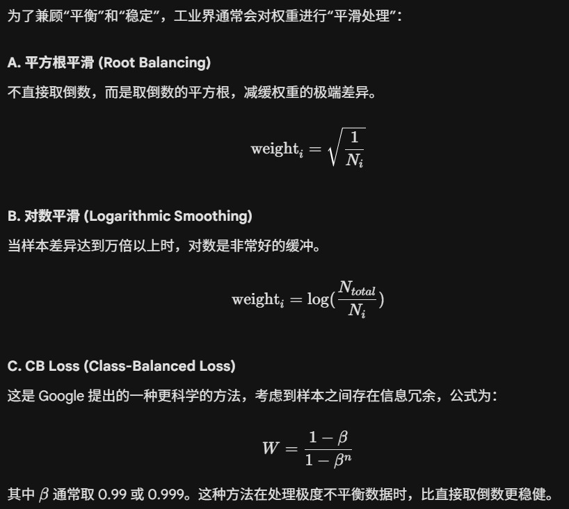

CB Loss中，n指类别样本数量。

### 二阶段训练

**解耦训练 (Decoupling)：** 现在的共识是，长尾分布下，**特征提取器**和**分类器**受到的影响是不一样的。

- **第一阶段：** 用最原始的数据训练，保证特征提取器（Backbone）学到最自然的特征。
- **第二阶段：** 冻结 Backbone，只用平衡采样（第2点）或调整损失函数（第3点）来微调最后的分类层（FC Layer）。
- **结论：** 这种两阶段策略通常比从头开始就加权训练效果更好。

#### Logit Adjustment分类

**Logit Adjustment** 是 Google 在 ICLR 2021 提出的一种简单但极其有效的方法。它的核心思想是：**与其在 Loss 里加权重，不如直接在模型的输出（Logit）上加一个“偏置”。**


```python
import torch
import torch.nn as nn
import torch.optim as optim
import torch.nn.functional as F
from torch.utils.data import DataLoader, TensorDataset


# ==========================================
# 1. 定义 Logit Adjustment Loss
# ==========================================
class LogitAdjustedLoss(nn.Module):
    def __init__(self, cls_num_list, tau=1.0):
        super(LogitAdjustedLoss, self).__init__()
        cls_num_list = torch.FloatTensor(cls_num_list)
        prior = cls_num_list / cls_num_list.sum()
        # 1e-12：避免 log(0) 导致无穷大 / 浮点数精度保护 / 代码健壮性
        self.logit_adj = tau * torch.log(prior + 1e-12)
        self.tau = tau

    def forward(self, x, target):
        device = x.device
        # 先做对应类别的加法
        adj_logits = x + self.logit_adj.to(device)
        # 再算损失
        return F.cross_entropy(adj_logits, target)


# ==========================================
# 2. 定义解耦型模型结构 (Backbone + FC)
# ==========================================
class DecoupledNet(nn.Module):
    def __init__(self, input_dim, hidden_dim, num_classes):
        super(DecoupledNet, self).__init__()
        # 特征提取器 (Backbone)
        self.backbone = nn.Sequential(
            nn.Linear(input_dim, hidden_dim),
            nn.BatchNorm1d(hidden_dim),
            nn.ReLU(),
            nn.Linear(hidden_dim, hidden_dim),
            nn.ReLU()
        )
        # 分类器 (FC Layer)
        self.fc = nn.Linear(hidden_dim, num_classes)

    def forward(self, x):
        features = self.backbone(x)
        logits = self.fc(features)
        return logits


# ==========================================
# 3. 模拟长尾数据准备
# ==========================================
def get_fake_long_tailed_data():
    # 假设3个类，样本比例为 1000:100:10 (极端长尾)
    cls_num_list = [1000, 100, 10]
    input_dim = 64

    all_x, all_y = [], []
    for i, num in enumerate(cls_num_list):
        # 创建特征数据，利用+ i * 2.0 形成不同的数据分布
        x = torch.randn(num, input_dim) + i * 2.0
        # 创建一个形状为 (num,) 的一维张量（Tensor），并用数值 i 填充所有元素
        y = torch.full((num,), i, dtype=torch.long)
        all_x.append(x)
        all_y.append(y)

    x_train = torch.cat(all_x, dim=0)
    y_train = torch.cat(all_y, dim=0)
    dataset = TensorDataset(x_train, y_train)
    return DataLoader(dataset, batch_size=32, shuffle=True), cls_num_list


# ==========================================
# 4. 完整训练流程
# ==========================================
def main():
    input_dim = 64
    hidden_dim = 128
    num_classes = 3
    epochs_stage1 = 10
    epochs_stage2 = 5

    # 获取数据
    train_loader, cls_num_list = get_fake_long_tailed_data()

    # 初始化模型
    model = DecoupledNet(input_dim, hidden_dim, num_classes)
    device = torch.device("cuda" if torch.cuda.is_available() else "cpu")
    model.to(device)

    # --- STAGE 1: 表现学习 (Representation Learning) ---
    # 目标：训练整个模型，使用原始分布，学习高质量特征
    print(f"\n>>> Stage 1: Training on Original Distribution ({epochs_stage1} epochs)")
    optimizer_s1 = optim.Adam(model.parameters(), lr=0.001)
    criterion_s1 = nn.CrossEntropyLoss()  # 使用标准交叉熵

    for epoch in range(epochs_stage1):
        model.train()
        total_loss = 0
        for data, target in train_loader:
            data, target = data.to(device), target.to(device)
            optimizer_s1.zero_grad()
            output = model(data)
            loss = criterion_s1(output, target)
            loss.backward()
            optimizer_s1.step()
            total_loss += loss.item()
        print(f"Epoch {epoch + 1}/{epochs_stage1} - Loss: {total_loss / len(train_loader):.4f}")

    # --- STAGE 2: 分类器解耦微调 (Classifier Re-training) ---
    # 目标：冻结 Backbone，只调整 FC 层，配合 Logit Adjustment
    print(f"\n>>> Stage 2: Freezing Backbone, Tuning FC with Logit Adjustment ({epochs_stage2} epochs)")

    # 1. 冻结参数
    for param in model.backbone.parameters():
        param.requires_grad = False

    # 2. 仅对 FC 层设置优化器 (学习率通常更小)
    optimizer_s2 = optim.Adam(model.fc.parameters(), lr=0.0005)

    # 3. 使用 Logit Adjustment Loss
    criterion_s2 = LogitAdjustedLoss(cls_num_list=cls_num_list, tau=1.0)

    for epoch in range(epochs_stage2):
        model.train()
        total_loss = 0
        for data, target in train_loader:
            data, target = data.to(device), target.to(device)
            optimizer_s2.zero_grad()
            output = model(data)  # Backbone 输出已冻结
            loss = criterion_s2(output, target)
            loss.backward()
            optimizer_s2.step()
            total_loss += loss.item()
        print(f"Epoch {epoch + 1}/{epochs_stage2} - Loss: {total_loss / len(train_loader):.4f}")

    print("\n训练完成！模型已完成长尾分布下的解耦优化。")


if __name__ == "__main__":
    main()

```

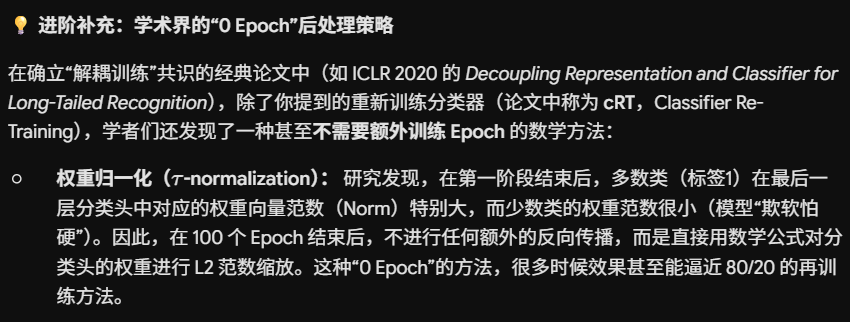

#### LDS/FDS回归

LDS：

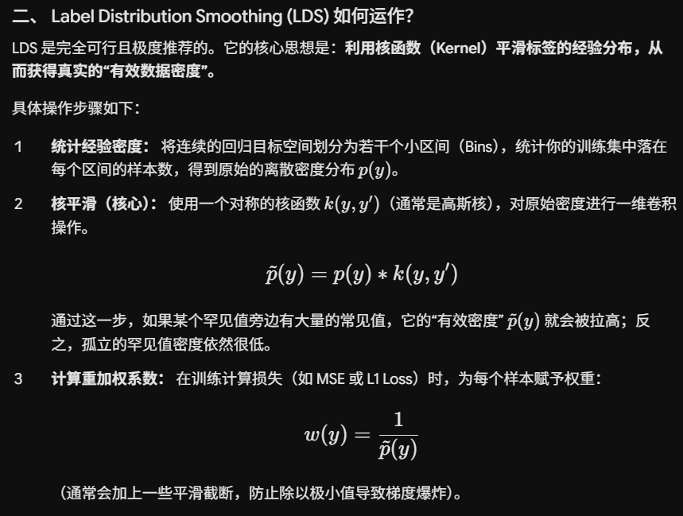

FDS：

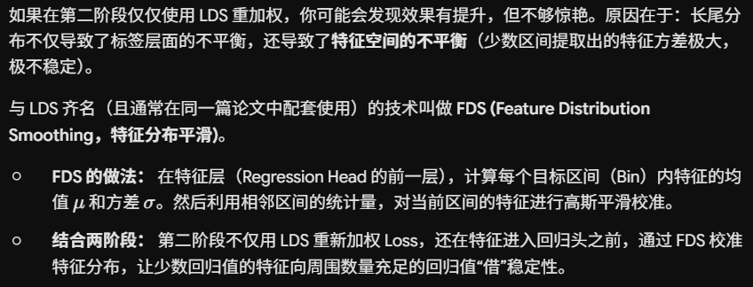

FDS和长尾分类区别：

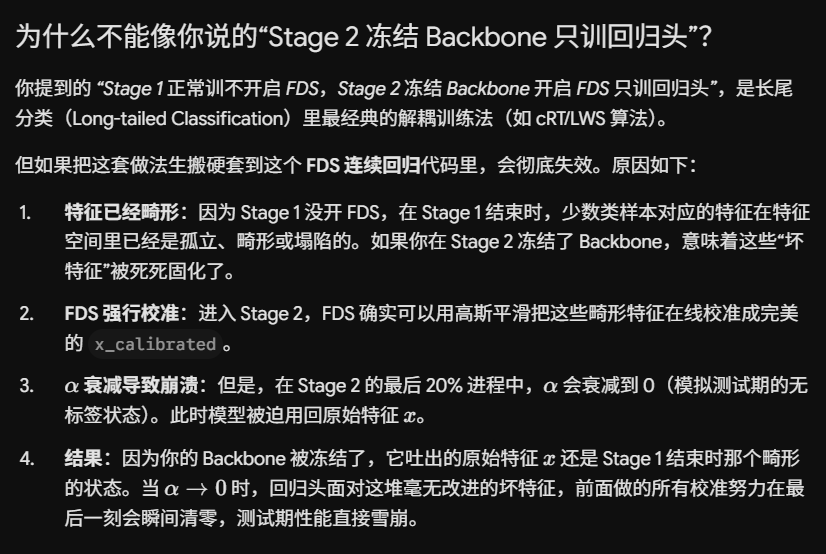

## 置信区间

置信区间是对“真实性能值可能落在哪个范围”的一个统计估计。

由于只在**有限样本**（如 100 条测试数据）上评估模型，得到的准确率（如 93%）只是一个**点估计**，它可能因为样本随机性而偏离真实值。

Hugging Face 的 `bootstrap` 默认使用 **95% 置信水平**，得到结果 [90.6%, 94.1%]，表示：

有 95% 的把握认为：这个模型在“整个测试数据总体”上的真实准确率，落在 90.6% 到 94.1% 之间。

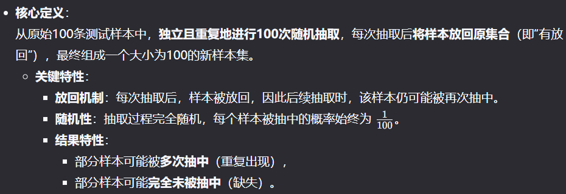

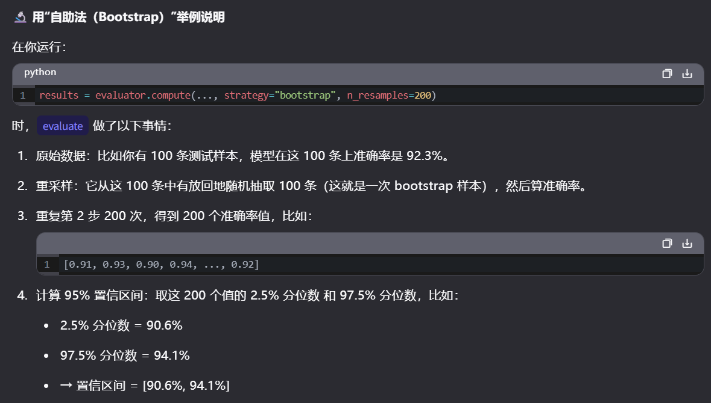

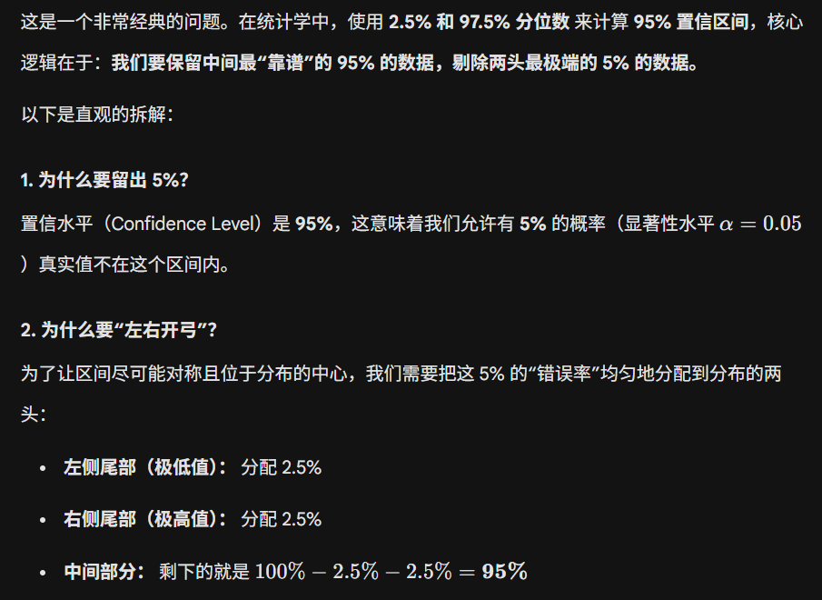

## 权重初始化

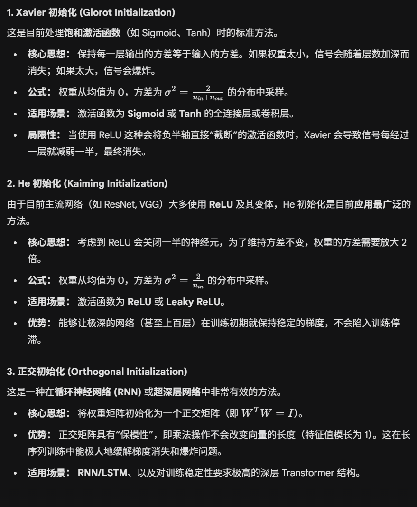

| 激活函数            | 推荐初始化方法                 | 典型库调用 (PyTorch 示例) |
| ------------------- | ------------------------------ | ------------------------- |
| ReLU / Leaky ReLU   | He (Kaiming) Initialization    | nn.init.kaiming_normal_   |
| Sigmoid / Tanh      | Xavier (Glorot) Initialization | nn.init.xavier_normal_    |
| RNN 隐藏层权重      | Orthogonal Initialization      | nn.init.orthogonal_       |
| Batch Normalization | 固定初始化                     | γ=1,β=0                   |

如网络中使用了 **Batch Normalization (BN)** 层，则对初始化的敏感度会降低很多，因为 BN 会在训练过程中自动重新调整分布。但在这种情况下，通常默认使用 **He 初始化** 仍是较优实践。

## Optuna超参数优化

| 方法                                     | 原理                                                         | 优点                                | 缺点                       | 适用场景                     |
| ---------------------------------------- | ------------------------------------------------------------ | ----------------------------------- | -------------------------- | ---------------------------- |
| 1. 网格搜索（Grid Search）               | 遍历所有参数组合                                             | 简单、确定性、结果可复现            | 计算成本高，维度灾难       | 参数少、搜索空间小           |
| 2. 随机搜索（Random Search）             | 随机采样参数组合（固定次数）                                 | 效率高，常比网格搜索更快找到较好解  | 不保证最优，结果有随机性   | 参数多、部分参数更重要       |
| 3. 贝叶斯优化（Bayesian Optimization）   | 基于历史结果建模（如高斯过程），智能选择下一个最有希望的参数 | 样本效率极高，收敛快                | 实现复杂，调参本身也有超参 | 计算昂贵的模型（如深度学习） |
| 4. 进化算法（如遗传算法）                | 模拟自然选择，迭代优化参数种群                               | 全局搜索能力强，适合非连续/离散空间 | 计算开销大，收敛慢         | 复杂、非凸、混合参数空间     |
| 5. 基于梯度的优化（如 HyperOpt, Optuna） | 使用代理模型+采集函数（如 TPE）                              | 高效、灵活、支持条件参数            | 需要额外库                 | 通用，尤其适合自动化调参     |

```python
import numpy as np
import torch
import torch.nn as nn
from sklearn.datasets import load_diabetes
from sklearn.model_selection import train_test_split
from sklearn.metrics import mean_squared_error, mean_absolute_error, r2_score
from torch.utils.data import Dataset, DataLoader
import optuna
from optuna.exceptions import TrialPruned
from sklearn.preprocessing import StandardScaler

# 检查是否有可用的 GPU
device = torch.device("cuda:0" if torch.cuda.is_available() else "cpu")
print(f"Using device: {device}")

# 1. 数据准备
# 使用 sklearn 内置数据
diabetes = load_diabetes()
x = diabetes.data
y = diabetes.target.reshape(-1, 1)

# 划分训练（train）、验证（val）和测试集（test）
# 70% 训练, 30% 临时集
x_train, x_temp, y_train, y_temp = train_test_split(x, y, test_size=0.3, random_state=42)
# 剩下30%中，一半（15%）做验证，一半（15%）做测试。
# 如使用交叉验证，此处直接划分训练和测试即可。在参数调优过程中，再使用交叉验证进一步划分训练+验证集。
# 当进行10交叉验证时，先选好特定参数，再利用对应参数训练和验证，并计算出10折均值作为验证结果。
x_val, x_test, y_val, y_test = train_test_split(x_temp, y_temp, test_size=0.5, random_state=42)

# 进行特征的标准化预处理
scaler = StandardScaler()
x_train = scaler.fit_transform(x_train)
x_val = scaler.transform(x_val)
x_test = scaler.transform(x_test)


# 自定义 Dataset
class MyDataset(Dataset):
    def __init__(self, x, y):
        self.x = torch.from_numpy(x).float()
        self.y = torch.from_numpy(y).float()

    def __getitem__(self, index):
        return self.x[index], self.y[index]

    def __len__(self):
        return len(self.x)


# 2. 定义 Optuna 的目标函数 (Objective Function)
def objective(trial):
    """
    一个 Study 基于目标函数的优化过程，Trial 是目标函数的单次执行过程。
    Optuna 通过多次 Trial 来找出最佳的超参数值集。
    """
    # ---- 定义超参数搜索空间 ----
    n_layers = trial.suggest_int('n_layers', 1, 3)  # 尝试 1 到 3 个隐藏层
    layers = []
    in_features = x.shape[1]  # 输入特征维度 (10)

    for i in range(n_layers):
        # 为每一层建议神经元数量
        out_features = trial.suggest_int(f'n_units_l{i}', 8, 128)
        layers.append(nn.Linear(in_features, out_features))
        layers.append(nn.ReLU())
        in_features = out_features
    layers.append(nn.Linear(in_features, 1))  # 输出层

    # 创建模型
    model = nn.Sequential(*layers).to(device)

    # 建议优化器
    optimizer_name = trial.suggest_categorical('optimizer', ['Adam', 'RMSprop', 'SGD'])
    # 建议学习率
    lr = trial.suggest_float('lr', 1e-5, 1e-1, log=True)
    optimizer = getattr(torch.optim, optimizer_name)(model.parameters(), lr=lr)
    # 建议批处理大小
    batch_size = trial.suggest_categorical('batch_size', [16, 32, 64])

    # 创建 DataLoader
    train_loader = DataLoader(dataset=MyDataset(x_train, y_train), batch_size=batch_size, shuffle=True)
    val_loader = DataLoader(dataset=MyDataset(x_val, y_val), batch_size=batch_size, shuffle=False)

    loss_fn = nn.MSELoss()
    epochs = 100  # 在调参时可使用较少的 epoch 以加快速度

    # 训练和验证循环
    for epoch in range(epochs):
        # ---- 训练循环 ----
        model.train()
        for i, (inputs, labels) in enumerate(train_loader):
            inputs, labels = inputs.to(device), labels.to(device)
            optimizer.zero_grad()
            output = model(inputs)
            loss = loss_fn(output, labels)
            # 如果训练过程中出现NAN，中止当前试验
            if torch.isnan(loss) or torch.isinf(loss):
                print(f"Trial {trial.number}: NaN/INF loss detected! Pruning trial.")
                raise TrialPruned()
            loss.backward()
            optimizer.step()

        # ---- 验证循环 ----
        model.eval()
        val_preds = []
        with torch.no_grad():
            for inputs, labels in val_loader:
                inputs, labels = inputs.to(device), labels.to(device)
                outputs = model(inputs)
                val_preds.append(outputs.cpu().numpy())

        val_preds = np.concatenate(val_preds).flatten()
        # 计算验证集上的 MSE 作为优化的目标
        validation_mse = mean_squared_error(y_val.flatten(), val_preds)

        # 报告中间值
        trial.report(validation_mse, epoch)
        # 检查是否应该剪枝
        if trial.should_prune():
            raise TrialPruned()  # 中止当前试验

    # 循环正常结束后，返回最后一次的验证 MSE
    return validation_mse


# 3. 创建并运行 Optuna Study
# 在创建 study 时加入 Pruner剪枝
pruner = optuna.pruners.MedianPruner()
study = optuna.create_study(direction='minimize', pruner=pruner)  # 目标是最小化 MSE
study.optimize(objective, n_trials=100)  # 运行 100 次试验

print("=" * 50)
print("Optuna 超参数搜索完成！")
# 打印被剪枝的试验数量
pruned_trials = study.get_trials(deepcopy=False, states=[optuna.trial.TrialState.PRUNED])
print(f"总共试验次数: {len(study.trials)}")
print(f"  - 完成的试验: {len(study.get_trials(deepcopy=False, states=[optuna.trial.TrialState.COMPLETE]))}")
print(f"  - 被剪枝的试验: {len(pruned_trials)}")
print(f"最佳试验:")
best_trial = study.best_trial

print(f"  > 验证集 MSE: {best_trial.value:.4f}")
print(f"  > 最佳超参数: ")
for key, value in best_trial.params.items():
    print(f"    - {key}: {value}")
print("=" * 50)

# 4. 使用最佳超参数训练最终模型
print("\n使用找到的最佳超参数，在`训练集+验证集`上训练最终模型...")

# 从最佳试验中获取参数
best_params = study.best_params
n_layers = best_params['n_layers']
optimizer_name = best_params['optimizer']
lr = best_params['lr']
batch_size = best_params['batch_size']

# 重新构建最佳模型结构
layers = []
in_features = x.shape[1]
for i in range(n_layers):
    out_features = best_params[f'n_units_l{i}']
    layers.append(nn.Linear(in_features, out_features))
    layers.append(nn.ReLU())
    in_features = out_features
layers.append(nn.Linear(in_features, 1))

final_model = nn.Sequential(*layers).to(device)

# 定义最终的优化器和损失函数
final_optimizer = getattr(torch.optim, optimizer_name)(final_model.parameters(), lr=lr)
final_loss_fn = nn.MSELoss()

# 合并训练集和验证集
final_x_train = np.concatenate((x_train, x_val), axis=0)
final_y_train = np.concatenate((y_train, y_val), axis=0)

# 创建最终的 DataLoader
final_train_loader = DataLoader(dataset=MyDataset(final_x_train, final_y_train), batch_size=batch_size, shuffle=True)
test_loader = DataLoader(dataset=MyDataset(x_test, y_test), batch_size=batch_size, shuffle=False)

# 训练最终模型
epochs = 200  # 使用更多的 epoch 进行最终训练
for epoch in range(epochs):
    final_model.train()
    for i, (inputs, labels) in enumerate(final_train_loader):
        inputs, labels = inputs.to(device), labels.to(device)
        final_optimizer.zero_grad()
        output = final_model(inputs)
        loss = final_loss_fn(output, labels)
        loss.backward()
        final_optimizer.step()

    if (epoch + 1) % 50 == 0:
        print(f"Epoch [{epoch + 1}/{epochs}], Loss: {loss.item():.4f}")

# 5. 在测试集上评估最终模型
final_model.eval()
all_preds = []
all_trues = []

with torch.no_grad():
    for inputs, labels in test_loader:
        inputs, labels = inputs.to(device), labels.to(device)
        outputs = final_model(inputs)
        all_preds.append(outputs.cpu().numpy())
        all_trues.append(labels.cpu().numpy())

# 合并所有 batch 的结果
pred = np.concatenate(all_preds).flatten()
true = np.concatenate(all_trues).flatten()

# 计算指标
mse = mean_squared_error(true, pred)
rmse = np.sqrt(mse)
mae = mean_absolute_error(true, pred)
r2 = r2_score(true, pred)

print("\n" + "=" * 30)
print("最终测试集性能评估：")
print("=" * 30)
print(f"MSE:  {mse:.4f}")
print(f"RMSE: {rmse:.4f}")
print(f"MAE:  {mae:.4f}")
print(f"R²:   {r2:.4f}")
print("=" * 30)

```

## LLM

### 显存占用

显存 ≈ 参数量 × 存放参数对应的字节 (1 byte = 1 B)

以Llama13B为例，
b Batch Size : 1
s Sequence Len : 1024
h Hidden Size: 5120
a Attention头：40
L层数：40

**1.输入输出**

Embedding后输入: b * s * h * 2 / 1024 / 1024
FP16: 10 MB
输入输出（入和出相同）：20 MB

**2.模型参数** (FP16)

13B，即13 Billion（10亿），

1B = 1000 ^ 3，1GB = 1024 ^ 3 byte

FP16: 13 * 1000 ^ 3 * 2 / 1024 ^ 3 ≈ 26 GB

**3.优化器** (FP32)

以Adam优化器为例

梯度指数平滑值：13 * 4 = 52GB
梯度平方指数平滑值：13 * 4 = 52GB
模型参数：13 * 4 = 52GB
共156GB

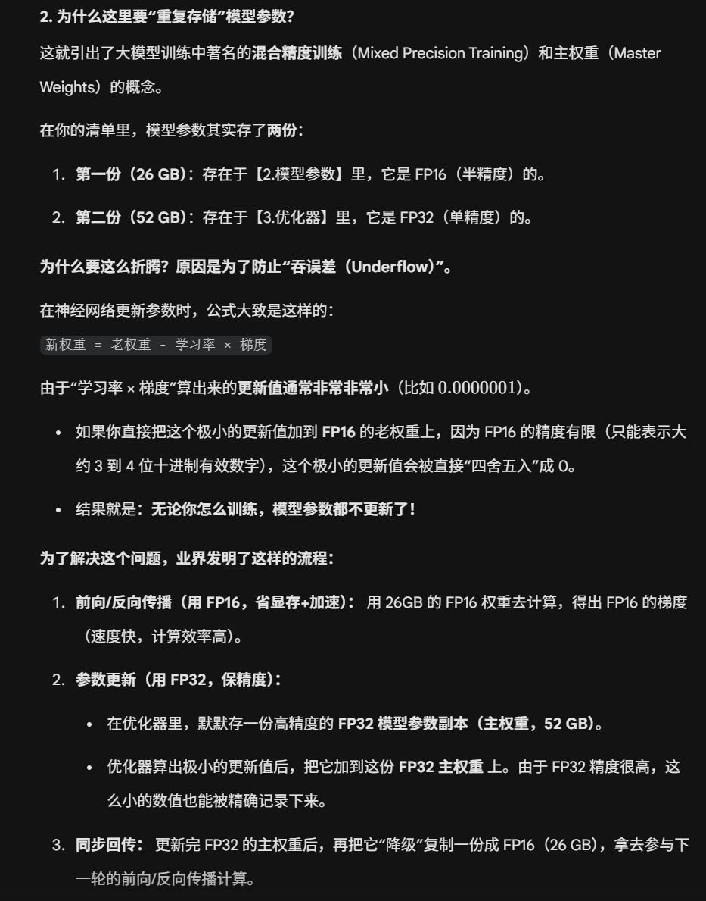

**4.中间各层激活值**

FP16:
s * b * h * (34 + 5 * a * s/h) * L/1024/1024/1024 GB
=14.5GB（和batchsize、seqlen相关，seqlen增加时将以指数形式增长）

**5.梯度值**

FP16：13B * 2 = 26G

总计222.5GB

### 梯度检查点

梯度检查点 (Gradient CheckPointing)、激活值检查点 (Activation CheckPointing) 用于节省显存，用“计算时间”换“显存空间”

| **训练阶段**                  | **传统训练模式**                                             | **开启梯度检查点（Gradient Checkpointing）**                 |
| ----------------------------- | ------------------------------------------------------------ | ------------------------------------------------------------ |
| **1. 前向传播** (Forward)     | 计算每一层的激活值（Activations），并**把它们全部保存在显存中**，留给反向传播用。 | **只保留部分关键层（检查点）的激活值**，其余中间层的激活值在计算完后直接从显存中**丢弃**。 |
| **2. 反向传播** (Backward)    | 利用前向传播存好的激活值，直接计算每一层的梯度。             | 正常计算梯度。如果遇到刚才被丢弃的激活值，就**从最近的检查点开始，临时重新做一次前向计算**，把缺失的激活值补回来，算完梯度后立即释放。 |
| **3. 优化器更新** (Optimizer) | 此时梯度已计算完毕。优化器（如 AdamW）根据梯度更新模型参数。 | **不参与此阶段。** 此时梯度检查点的工作早已结束。            |

```
Hugging Face Transformers 库中 TrainingArguments 的配置代码

training_args = TrainingArguments(
    per_device_train_batch_size=1,
    gradient_accumulation_steps=4,
    gradient_checkpointing=True, # 启用梯度检查点以节省显存
    **default_args
)
```

### 推理参数


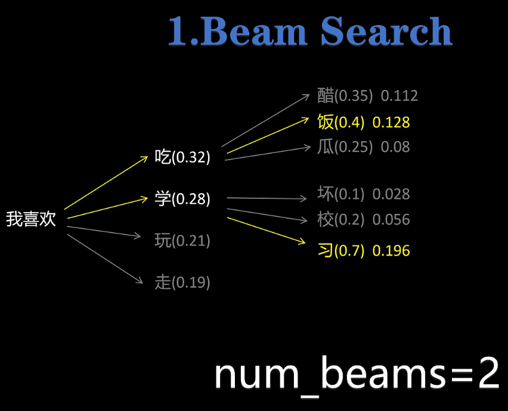

**Beam search**：如采用贪心算法，每次只会选取概率最高的值，但可能并非整条路径的最优值。

当设置 num_beams=2 时，模型在每一步会保留两个得分最高的序列路径。但这样设置将导致每次输出固定，只会选择概率最大的token。

因此实际操作中，会**对所有token按概率进行采样**，以增加随机性。

```
原来进行选择时，是选择概率最大的前2个beam；
现在是针对beam按概率进行采样选择2个，每个beam的概率是整个beam目前所有token的概率乘积（通常在代码中会转化成对数概率之和 Log Probability，再通过 Softmax 归一化）
```

**TOP_K**：将除前K个以外的概率置零

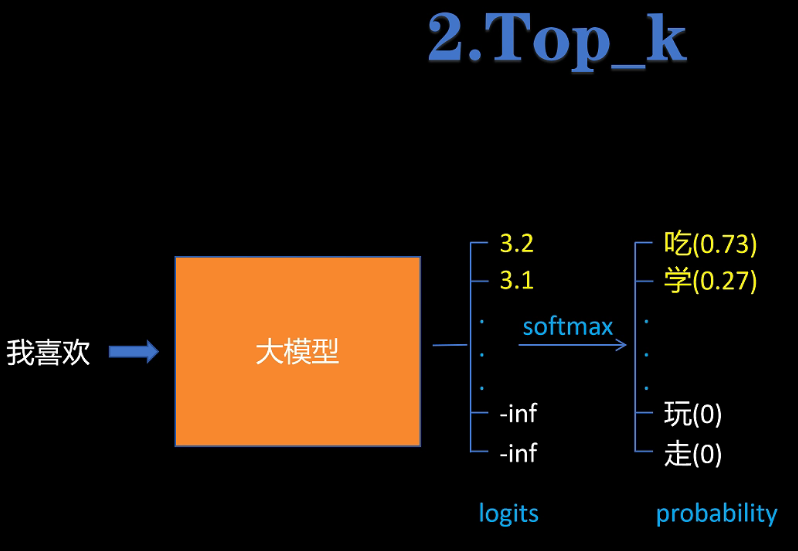

**TOP_P**：根据累计概率取值

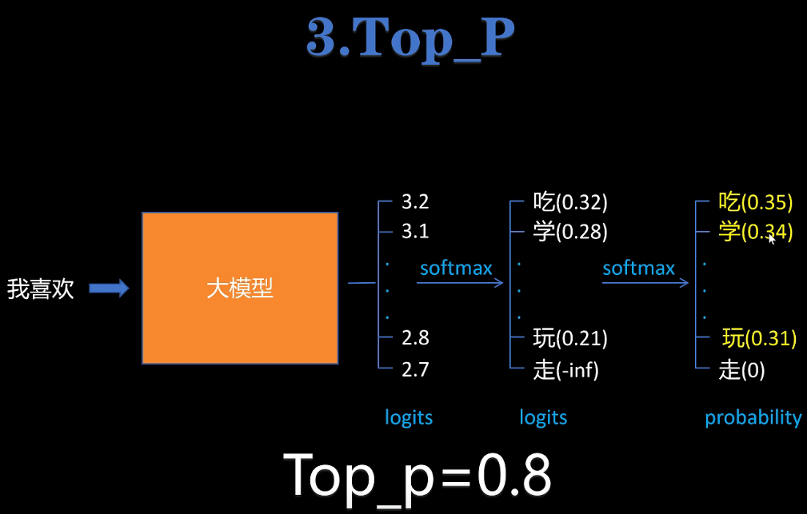

 **Temperature**：温度值用于调整模型输出的自由度

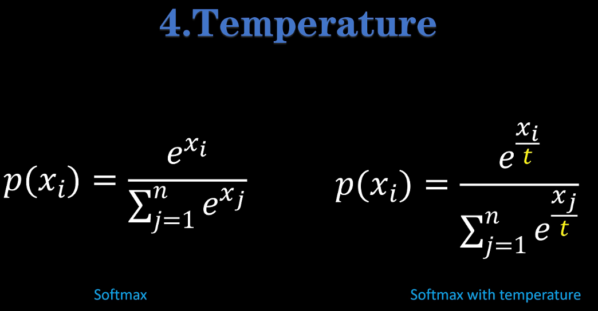

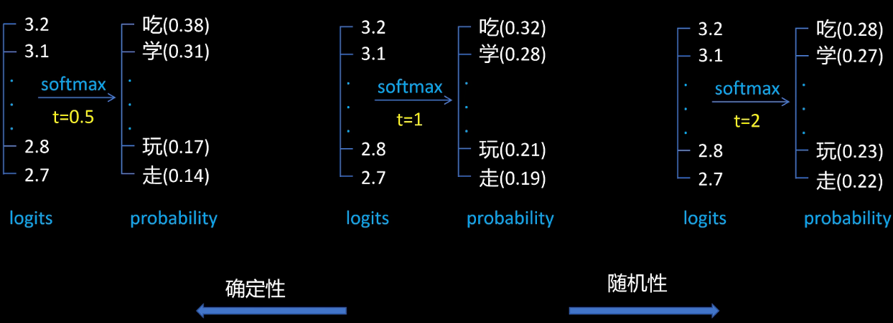

整体流程，在每个beam进行：

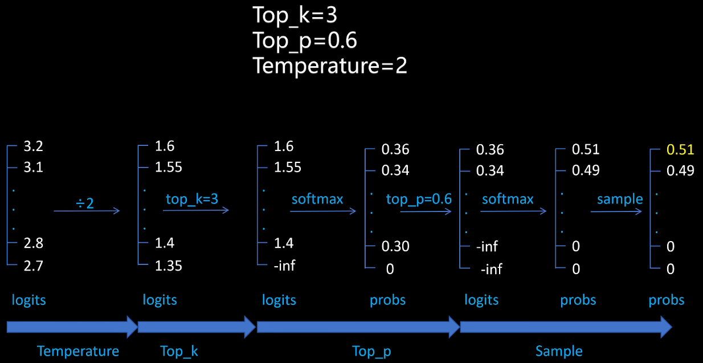

在 Hugging Face 的 transformers 框架中，generate() 方法的 do_sample 参数（默认 False）决定是否使用采样。如果启用，则会从每个时间步的 softmax 分布中随机采样 token，使生成结果具备随机性与多样性。

但单纯的采样容易导致模型胡言乱语，尤其当尾部 token 概率很小但仍可能被选中时。因此，常搭配使用 temperature, top-k, top-p 等策略来控制采样空间。 

温度会影响 softmax 概率的平滑程度，高温度会使概率差距缩小，从而增加低概率 token 被选中的机会。虽然温度不会改变 token 的排序，所以对 top-k 没影响，但会影响 top-p 的候选范围，因为它是按累计概率截断的。 

Beam search 则是另一种解码策略，当设置 num_beams=2 时，模型在每一步会保留两个得分最高的序列路径。若同时启用 do_sample=True，则进入 beam sampling 模式，此时每个 beam 路径是通过随机采样生成的，结合了随机性与路径评分。

### 评估指标

困惑度计算


实际流程中，先取对数相加，再取指数。防止小概率值连乘，导致数值向下溢出。


| **指标/数据集名称** | **全称**                                    | **评估核心 / 领域**                                      | **测试形式**                                         | **特点与重要性**                                             |
| ------------------- | ------------------------------------------- | -------------------------------------------------------- | ---------------------------------------------------- | ------------------------------------------------------------ |
| **PPL**             | Perplexity (困惑度)                         | 语言建模能力、文本流畅度与预测能力                       | 基础语言模型计算（计算预测下一个词的概率）           | **基础指标：** 越低代表模型对语言的理解越好。常用于基座模型（Base Model）的内部训练评估，不适合直接作为应用层能力对比。 |
| **MMLU**            | Massive Multitasking Language Understanding | 跨学科综合知识（涵盖人文、社科、STEM等57个学科）         | 四选一单选题 (Multiple-choice)                       | **行业风向标：** 目前最普及的通用能力基准，涵盖从初等数学到专业法律、医学的广泛知识。 |
| **MATH**            | Mathematics Dataset                         | 深度数学逻辑与多步骤推理能力                             | 自由文本输出（需要模型给出最终答案和解题步骤）       | **硬核推理：** 包含高中数学联赛级别的难题。通常需要配合链式思考（CoT）触发，是检验模型“硬核理科脑”的关键。 |
| **GPQA**            | Graduate-Level Google-Proof Q&A Benchmark   | 专家级前沿科学推理（生物、物理、化学等）                 | 四选一单选题（由相关领域的博士专家设计）             | **博士级难度：** 题目极其硬核，高学历人类专家正确率也仅约65%。具有“谷歌防作弊”特性，极难通过简单搜索或记忆找到答案。 |
| **BBH**             | BIG-bench Hard                              | 复杂多步骤推理、逻辑、常识与语言理解                     | 混合题型（多选、符号操作、自由回答等）               | **高难度子集：** 从BIG-bench综合任务中抽选出的、早期模型表现不如人类的23个艰巨任务，侧重考察模型的逻辑链条是否会断裂。 |
| **IF-EVAL**         | Instruction Following Evaluation            | 精准指令遵循能力（如字数限制、特定格式、特定词汇排除等） | 自由文本生成（通过基于规则的程序进行自动化硬性检测） | **对齐能力检测：** 不测知识量，只测模型“听不听话”。例如“写一篇500字文章，不能包含字母 'e'”，看模型能否严格执行。 |
| **MMLU-PRO**        | MMLU - Professional                         | 高难度多任务学术理解与深度推理                           | 十选一单选题（选项从4个增加到10个）                  | **MMLU升级版：** 针对近年大模型能力飙升、MMLU出现“分数饱和”而推出。剔除了单纯靠记忆的题目，极大地增加了推理难度。 |

### VLLM推理加速

#### KV Cache

KV Cache详见：自然语言处理-Deepseek-KV Cache

在大模型推理时，按照可生成最长序列长度分配显存。但会造成三种类型的浪费：
1.预分配，但不会用到。
2.预分配，但尚未用到。

3.显存之间的间隔碎片，不足以预分配给下一个文本生成。

#### PageAttention

1.借鉴操作系统中的**页管理**技术。


2.借鉴**虚拟内存**技术，将物理显存并非连续的block，通过一个映射表，映射至连续逻辑。

虚拟内存的作用就是让程序在使用内存时，感觉自己使用的是连续内存。


优点：按需分配，不提前预分配。按Block分配，减少碎片大小。虚拟内存，方便实现调用。

3.**KV Block**的共享

在大模型推理中，有一些场景下不同的生成任务会包含**完全相同的输入前缀（Prompt）**。如果没有共享机制，每个任务都要为这段相同的输入独立复制一份 KV Cache，这会极大地浪费显存。

例如，将一句话翻译为2个不同结果，此时有2个prompt，但对应起始部分的prompt采用共同物理地址。


共享机制同样可以应用于Beam Search中，以节省显存。


实际使用代码

```python
from vllm import LLM, SamplingParams
prompts = [
    "Hello, my name is",
    "The president of the United States is",
    "The capital of France is",
    "The future of AI is",
]
sampling_params = SamplingParams(temperature=0.8, top_p=0.95, max_tokens=10)
llm = LLM(model="/mnt/d/work/models/Yi-1.5-6B-Chat")
outputs = llm.generate(prompts, sampling_params)

# Print the outputs.
for output in outputs:
    prompt = output.prompt
    generated_text = output.outputs[0].text
    print(f"Prompt: {prompt!r}, Generated text: {generated_text!r}")
```

### TensorCore

并行运算的特点，使GPU更适合于深度学习工作。

GPU内部SM单元：


各部分计算速度


计算应该尽可能在L1缓存中进行，提高速度


### Flash Attention

目标：避免Attention Matrix从HBM的读写
1.通过分块计算，融合多个操作，减少中间结果缓存。
2.反向传播时，重新计算中间结果。

```
pip install packaging ninja
pip install flash-attn --no-build-isolation
```

实现代码

```python
import torch
import torch.nn.functional as F

# Flash Attention 必须在 GPU 上运行
device = "cuda" if torch.cuda.is_available() else "cpu"

# 准备数据：PyTorch 原生 SDPA 期待的 Shape 为 (Batch, Heads, Seq_Len, Head_Dim)
# 推荐使用 bfloat16 或 float16 精度
q = torch.randn(2, 8, 1024, 64, dtype=torch.bfloat16, device=device)
k = torch.randn(2, 8, 1024, 64, dtype=torch.bfloat16, device=device)
v = torch.randn(2, 8, 1024, 64, dtype=torch.bfloat16, device=device)

# 方式 1：默认调用（PyTorch 会自动选择 Flash Attention 作为后端）
output = F.scaled_dot_product_attention(q, k, v, is_causal=True) # is_causal=True 用于 GPT 等自回归模型

# 方式 2：强行指定必须使用 Flash Attention（若不满足条件会直接报错，方便调试）
with torch.backends.cuda.sdp_kernel(enable_flash=True, enable_math=False, enable_mem_efficient=False):
    output_forced = F.scaled_dot_product_attention(q, k, v, is_causal=True)
```

```python
from transformers import AutoModelForCausalLM

model = AutoModelForCausalLM.from_pretrained(
    "meta-llama/Meta-Llama-3-8B",
    torch_dtype=torch.bfloat16,
    device_map="auto",
    attn_implementation="flash_attention_2"  # 模型注意力层全部自动替换成 Flash Attention 2
)
```

```python
import torch
import torch.nn as nn

# 直接调官方的 Transformer 编码器层
# 在内部自行调用 F.scaled_dot_product_attention
encoder_layer = nn.TransformerEncoderLayer(d_model=512, nhead=8, batch_first=True)
transformer_encoder = nn.TransformerEncoder(encoder_layer, num_layers=6)

# 数据格式对（GPU + 半精度），Flash Attention 就会隐式启动
x = torch.randn(32, 100, 512).cuda().bfloat16()
encoder_layer.cuda().bfloat16()

output = transformer_encoder(x)
```

# CNN

## 基础概念

相比先前全连接神经网络中，直接将图像矩阵展开并构造为一维向量形式。卷积神经网络选择保留图像空间信息，并将输入设置为原始图像矩阵，且首先需确定输入数据通道信息和输出的通道信息，步骤： 

1 输入

2 特征提取（做卷积变换）

3 分类（将卷积最后层按照一维展开，并输入全连接层，再通过softmax层映射，对数似然损失）

注：近年来，部分高效架构（如ResNet、GoogLeNet）倾向于使用**全局平均池化（Global Average Pooling, GAP）** 替代展平和全连接层。GAP直接对每个特征图进行空间平均，输出通道维度的向量，再连接softmax层。


卷积的过程：对每一小块图像进行遍历，遍历时对小块图像进行卷积操作。


单通道卷积操作：按卷积核对矩阵元素进行**数乘**（注意不是矩阵乘法），遍历整个图像，将结果数值放入输出矩阵。

共享权重：同一个卷积核（filter 或 kernel）在整个输入数据上滑动时，使用相同的权重参数进行计算。


多通道卷积操作：分别使用3个卷积核对每个通道进行卷积操作，并将获取的输出矩阵**求和**。


输入为n个通道时，采用的卷积核通道数也应为n，并输出通道数为1的卷积结果。


当进一步将结果输出通道数设定为m，则将以上处理的n通道卷积组数量增多至m个，进行m次运算后将卷积结果**堆叠**可形成m个通道：


当输入通道数为n，输出通道数为m时，将卷积层设定为4维张量（m，n，k，k）：

类似先前线性回归时的矩阵乘法，通过输入和输出的通道维度，可确定权重矩阵的通道维度。


演示计算的进行过程：

```python
import torch

in_channels, out_channels = 5, 10
width, height = 100, 100
kernel_size = (3, 3)
batch_size = 1

# 随机生成一个批量大小为1，形状（5，100，100）（C，H，W）的输入张量
input = torch.randn(batch_size,
                    in_channels,
                    height,
                    width)

# 设置卷积层，必须的参数：输入通道、输出通道、卷积核形状
# 卷积层与图像输入的W和H没有关系
conv_layer = torch.nn.Conv2d(in_channels,
                             out_channels,
                             kernel_size=kernel_size)

output = conv_layer(input)

print(input.shape)
# 此处输出的W和H为什么是98：
# 因为卷积核是3，减去中心=2列，即在输入张量中，移动至极限时的左边距和右边距相加等于2，
# 使用100-2=98=卷积核在输入张量中部的可移动距离。
# 只要确定了输入张量的W和H，输出张量的W和H可自动确定。
print(output.shape)
print(conv_layer.weight.shape)

```

原始输入矩阵为5×5，卷积核3×3，因此结果=3×3（5-3+1），但如果想让输出结果=5×5（即保持输出尺寸的W、H=输入尺寸的W、H）？

对原始矩阵填充1圈均为0的padding，使结果输出矩阵变为5×5。

in + 2p - (k - 1) = out = in

p = (k-1) / 2


填充padding的代码实现：

```python
import torch

in_channels, out_channels = 1, 1

# 手动设置输入的数据
input = [3, 4, 6, 5, 7,
         2, 4, 6, 8, 2,
         1, 6, 7, 8, 4,
         9, 7, 4, 6, 2,
         3, 7, 5, 4, 1]

input = torch.Tensor(input).view(1, in_channels, 5, 5)

# 和先前的不同在于对卷积层设置padding=1
conv_layer = torch.nn.Conv2d(in_channels=in_channels, out_channels=out_channels,
                             kernel_size=(3, 3), padding=1, bias=False)

# 手动设置卷积核数据
# 注意此处.weight.data，先out_channels, 再in_channels（不像先前Conv2d中，固定先设置输入通道数，再输出通道数）
kernel = torch.Tensor([1, 2, 3, 4, 5, 6, 7, 8, 9]).view(out_channels, in_channels, 3, 3)
conv_layer.weight.data = kernel.data

output = conv_layer(input)
print(output)

```

设置stride：即设置卷积核移动的步长

(in + 2p - k) / s + 1 = out

整体公式：


设置stride的代码实现：

```python
conv_layer = torch.nn.Conv2d(in_channels=in_channels, out_channels=out_channels, 
                             stride=2, # 只需修改卷积层中设置参数即可
                             kernel_size=(3, 3), bias=False)
```

Max Pooling最大池化（属于下采样Downsampling），不会改变通道数，只会改变图像大小。

- `kernel_size=2` 表示使用一个 **2×2** 的滑动窗口，在输入特征图的每个局部区域中取最大值作为输出。
- 若未显式指定 `stride`，则默认 `stride = kernel_size`，即不重叠滑动。
- 对于 `kernel_size=2`，输出的空间尺寸（高和宽）通常会减半（假设输入尺寸为偶数且无填充）。


Max Pooling层代码实现：

```python
input = [3, 4, 6, 5,
         2, 4, 6, 8,
         1, 6, 7, 8,
         9, 7, 4, 6]
input = torch.Tensor(input).view(1, 1, 4, 4)

# 设置Max Pooling层
maxpooling_layer = torch.nn.MaxPool2d(kernel_size=2)
 
output = maxpooling_layer(input)
```

接下来，使用以下架构为例的CNN进行实现：


基础神经网络实现代码（这里直接在先前 多分类全连接神经网络的基础上，修改模型定义部分即可）：

```python
import torch
from torchvision import transforms
from torchvision import datasets
from torch.utils.data import DataLoader
import torch.nn.functional as F

batch_size = 64
transform = transforms.Compose([transforms.ToTensor(),
                                transforms.Normalize((0.1307,), (0.3081,))
                                ])

train_dataset = datasets.MNIST(root='../dataset/mnist/',
                               train=True,
                               download=True,
                               transform=transform)
train_loader = DataLoader(train_dataset,
                          shuffle=True,
                          batch_size=batch_size, num_workers=0)
test_dataset = datasets.MNIST(root='../dataset/mnist/',
                              train=False,
                              download=True,
                              transform=transform)
test_loader = DataLoader(test_dataset,
                         shuffle=False,
                         batch_size=batch_size, num_workers=0)


class Net(torch.nn.Module):
    def __init__(self):
        super(Net, self).__init__()
        # 修改此处，设置卷积层、池化层、全连接层
        # torch.nn.Conv2d 不需要传入 batch_size，原因在于：卷积操作是逐样本（per-sample）独立进行的，不依赖于批量大小（batch size）。
        self.conv1 = torch.nn.Conv2d(1, 10, kernel_size=(5, 5))
        self.conv2 = torch.nn.Conv2d(10, 20, kernel_size=(5, 5))
        self.pooling = torch.nn.MaxPool2d(2)
        self.fc = torch.nn.Linear(320, 10)

    def forward(self, x):
        batch_sizes = x.size(0)
        # 由于卷积操作是线性的，通过激活函数引入非线性操作
        # Conv -> BN -> ReLU -> Pool -> Dropout
        x = self.pooling(F.relu(self.conv1(x)))
        x = self.pooling(F.relu(self.conv2(x)))
        # 将输出数据（1个batch-size）展平为一维后输入全连接层：64×20×4×4 -> 64×320
        x = x.view(batch_sizes, -1)
        # 此处无需激活，后面函数中包含了Softmax操作
        x = self.fc(x)
        return x


model = Net()
device = torch.device("cuda:0" if torch.cuda.is_available() else "cpu")
model.to(device)

criterion = torch.nn.CrossEntropyLoss(reduction='mean')
optimizer = torch.optim.SGD(model.parameters(), lr=0.01, momentum=0.5)


def train(epoch):
    running_loss = 0.0
    for batch_idx, data in enumerate(train_loader, 0):

        inputs, target = data
        inputs, target = inputs.to(device), target.to(device)
        optimizer.zero_grad()

        outputs = model(inputs)
        loss = criterion(outputs, target)
        loss.backward()
        optimizer.step()

        running_loss += loss.item()
        if batch_idx % 300 == 299:
            print('[%d, %5d] loss: %.3f' % (epoch + 1, batch_idx + 1, running_loss / 300))
            running_loss = 0.0


def test():
    correct = 0
    total = 0

    with torch.no_grad():
        for data in test_loader:
            images, labels = data
            images, labels = images.to(device), labels.to(device)
            outputs = model(images)
            _, predicted = torch.max(outputs.detach(), dim=1)
            total += labels.size(0)
            correct += (predicted == labels).sum().item()
    print('Accuracy on test set: %d %%' % (100 * correct / total))


if __name__ == '__main__':

    for epoch in range(10):
        train(epoch)
        test()

```

## GoogleNet

之前所学习的多层感知机（即全连接神经网络）、卷积神经网络，在网络架构上都是穿行结构，此处介绍几类更复杂架构。

GoogleNet：可发现其中存在大量重复卷积模块，称为Inception。


Inception模块中提供了多类卷积核组合预选，通过训练计算权重后，将自动选择其中较优的组合方式。


其中Concatenate：将卷积结果按照通道的方向进行拼接（因此要求W和H必须相同，而C可以不同）。

Average Pooling：均值池化（Max Pool是取区域内最大保留，Average Pooling则是对区域求均值并保留）。

其中，针对3×3、5×5卷积核下的卷积操作，做padding即可保证图像W和H不变。

而针对AveragePooling也可做padding实现类似效果（类似卷积操作，但并没有卷积核进行运算，而是求卷积核范围内的均值）。


**1×1 卷积**的主要目标是**调整特征图的通道数**（同时还有“信息融合”的作用，将多通道信息汇聚在一起），而**不改变W和H**。

对于（C，H，W）的图像，进行1×1卷积后均变为（1，H，W），如需要输出通道数为m，则设置卷积层为m个即可（m，C，1，1）。

相较于直接在大尺寸卷积核上改变通道数，引入 1×1 卷积构建‘瓶颈结构’，可以在保持（或增强）非线性表达能力的同时，大幅降低运算量。


针对Inception模块的实现代码如下：


```python
import torch

from torchvision import transforms
from torchvision import datasets
from torch.utils.data import DataLoader
import torch.optim as optim
import torch.nn as nn

batch_size = 64
transform = transforms.Compose([transforms.ToTensor(),
                                transforms.Normalize((0.1307,), (0.3081,))
                                ])

train_dataset = datasets.MNIST(root='../dataset/mnist',
                               train=True,
                               download=True,
                               transform=transform)
train_loader = DataLoader(train_dataset,
                          shuffle=True,
                          batch_size=batch_size)

test_dataset = datasets.MNIST(root='../dataset/mnist',
                              train=False,
                              download=True,
                              transform=transform)
test_loader = DataLoader(test_dataset,
                         shuffle=False,
                         batch_size=batch_size)


# 定义Inception模型
class Inceptions(nn.Module):
    def __init__(self, in_channels):
        super(Inceptions, self).__init__()
        self.branch1 = nn.Sequential(
            nn.AvgPool2d(kernel_size=3, stride=1, padding=1),
            nn.Conv2d(in_channels=in_channels, out_channels=24, kernel_size=1)
        )
        self.branch2 = nn.Sequential(
            nn.Conv2d(in_channels=in_channels, out_channels=16, kernel_size=1)
        )
        self.branch3 = nn.Sequential(
            nn.Conv2d(in_channels=in_channels, out_channels=16, kernel_size=1),
            nn.Conv2d(in_channels=16, out_channels=24, kernel_size=5, padding=2)
        )
        self.branch4 = nn.Sequential(
            nn.Conv2d(in_channels=in_channels, out_channels=16, kernel_size=1),
            nn.Conv2d(in_channels=16, out_channels=24, kernel_size=3, padding=1),
            nn.Conv2d(in_channels=24, out_channels=24, kernel_size=3, padding=1)
        )

    def forward(self, x):
        b1 = self.branch1(x)
        b2 = self.branch2(x)
        b3 = self.branch3(x)
        b4 = self.branch4(x)
        # 连接4个branch的输出张量，dim=1表示按照通道拼接
        out = torch.cat((b1, b2, b3, b4), dim=1)
        return out


# 定义GoogleNet模型，其中包含Inception模块
class Net(nn.Module):
    def __init__(self):
        super(Net, self).__init__()
        # 注意此处顺序，一般来说在进行卷积后都会立马进行激活操作
        # 卷积 -> relu -> 最大池化 -> inception1
        # -> 卷积 -> relu -> 最大池化 -> inception2
        # -> GAP全局平均池化 -> 全连接输出
        self.network = nn.Sequential(
            nn.Conv2d(in_channels=1, out_channels=10, kernel_size=5),
            nn.ReLU(),
            nn.MaxPool2d(kernel_size=2, stride=2),
            Inceptions(in_channels=10),

            nn.Conv2d(in_channels=88, out_channels=20, kernel_size=5),
            nn.ReLU(),
            nn.MaxPool2d(kernel_size=2, stride=2),
            Inceptions(in_channels=20),

            nn.AdaptiveAvgPool2d(output_size=(1, 1)),
        )
        self.linear = nn.Linear(in_features=88, out_features=10)

    def forward(self, x):
        out = self.network(x)
        out = self.linear(out.view(out.size(0), -1))
        return out


net = Net()
device = torch.device('cuda' if torch.cuda.is_available() else 'cpu')
net.to(device)
criterion = nn.CrossEntropyLoss()
optimizer = optim.Adam(net.parameters(), lr=0.001)


def train(epoch):
    net.train()
    for batch_idx, (data, target) in enumerate(train_loader, start=1):
        data = data.to(device)
        target = target.to(device)

        optimizer.zero_grad()
        output = net(data)
        loss = criterion(output, target)
        loss.backward()
        optimizer.step()
        if batch_idx % 100 == 0:
            print('Train Epoch: {}, batch_idx:{}, Loss: {:.6f}'.format(epoch, batch_idx, loss.item()))


def test():
    net.eval()
    all_count = 0
    correct = 0
    for data, target in test_loader:
        data = data.to(device)
        target = target.to(device)
        output = net(data)
        _, predicted = torch.max(output.data, 1)
        all_count += target.size(0)
        correct = correct + predicted.eq(target).cpu().sum()
    print(f"accuracy: {100 * correct / all_count :.2f}%")


if __name__ == '__main__':
    # 在构建模型的过程中，可通过对模型维度测试输出，无需自己手动计算
    # model = Net()
    # result = model(torch.randn(1, 1, 28, 28))
    # print(result.shape)
    # inception1输出：torch.Size([1, 88, 12, 12])
    # relu2后，inception2前输出：torch.Size([1, 20, 4, 4])

    epochs = 2
    for epoch in range(epochs):
        train(epoch)
    test()

```

## ResNet 

梯度消失问题：在链式法则中，当每次乘以的梯度都小于1，梯度将会越来越小，最终W将无法有效更新。（如果每次相乘的梯度都大于1则称为梯度爆炸问题，梯度过大将导致模型无法有效收敛）

老方法：划分输入层、多个隐藏层和输出层。逐层训练隐藏层，在对应隐藏层训练完毕后将其锁住，继续训练下一层，以解决梯度消失问题。该方法难以实现，因为神经网络中层数过多。

**ResNet（Residual Network）**引入残差连接：输入x经过2个卷积层后得到F（x），先不激活，将F（x）与x相加后再通过Relu激活。·

F（x）与x做加法，意味着其**C，W，H均要一致**。


使用以下网络结构为例进行ResNet实现：


```python
import torch

from torchvision import transforms
from torchvision import datasets
from torch.utils.data import DataLoader

import torch.nn.functional as F
import torch.optim as optim
import torch.nn as nn

batch_size = 64
transform = transforms.Compose([transforms.ToTensor(),
                                transforms.Normalize((0.1307,), (0.3081,))
                                ])

train_dataset = datasets.MNIST(root='../dataset/mnist',
                               train=True,
                               download=True,
                               transform=transform)
train_loader = DataLoader(train_dataset,
                          shuffle=True,
                          batch_size=batch_size)

test_dataset = datasets.MNIST(root='../dataset/mnist',
                              train=False,
                              download=True,
                              transform=transform)
test_loader = DataLoader(test_dataset,
                         shuffle=False,
                         batch_size=batch_size)


# 此处定义残差块
class ResidualBlock(nn.Module):
    def __init__(self, channels):
        super(ResidualBlock, self).__init__()
        # 定义输入的通道数
        self.channels = channels
        # 这里为保证最后x能够与F（x）相加，需保证通道数不变，故设置卷积层的输入输出不变。
        # 同时设置padding=1保证W和H不变
        self.conv1 = nn.Conv2d(channels, channels,
                               kernel_size=(3, 3), padding=1)
        self.conv2 = nn.Conv2d(channels, channels,
                               kernel_size=(3, 3), padding=1)

    def forward(self, x):
        # 卷积 -> 激活 -> 卷积 -> 相加 -> 激活
        y = F.relu(self.conv1(x))
        y = self.conv2(y)
        # 注意此处顺序，先相加，后激活
        return F.relu(x + y)


class Net(nn.Module):
    def __init__(self):
        super(Net, self).__init__()
        self.conv1 = nn.Conv2d(1, 16, kernel_size=(5, 5))
        self.conv2 = nn.Conv2d(16, 32, kernel_size=(5, 5))
        self.mp = nn.MaxPool2d(2)

        self.rblock1 = ResidualBlock(16)
        self.rblock2 = ResidualBlock(32)

        self.fc = nn.Linear(512, 10)

    def forward(self, x):
        in_size = x.size(0)
        # 卷积 -> 激活 -> 最大池化 -> 残差
        x = self.mp(F.relu(self.conv1(x)))
        x = self.rblock1(x)
        x = self.mp(F.relu(self.conv2(x)))
        x = self.rblock2(x)
        x = x.view(in_size, -1)
        x = self.fc(x)

        return x


model = Net()
device = torch.device("cuda:0" if torch.cuda.is_available() else "cpu")
model.to(device)
criterion = torch.nn.CrossEntropyLoss()
optimizer = optim.SGD(model.parameters(), lr=0.01, momentum=0.5)


def train(epoch):
    running_loss = 0.0
    for batch_idx, data in enumerate(train_loader, 0):
        inputs, target = data
        inputs, target = inputs.to(device), target.to(device)
        optimizer.zero_grad()

        outputs = model(inputs)
        loss = criterion(outputs, target)
        loss.backward()
        optimizer.step()

        running_loss += loss.item()
        if batch_idx % 300 == 299:
            print('[%d, %5d] loss: %.3f' % (epoch + 1, batch_idx + 1, running_loss / 2000))
            running_loss = 0.0


def test():
    correct = 0
    total = 0
    with torch.no_grad():
        for data in test_loader:
            images, labels = data
            images, labels = images.to(device), labels.to(device)
            outputs = model(images)
            _, predicted = torch.max(outputs.data, dim=1)
            total += labels.size(0)
            correct += (predicted == labels).sum().item()

    print('Accuracy on test set: %d %%' % (100 * correct / total))


if __name__ == '__main__':
    for epoch in range(10):
        train(epoch)
        test()
```

# RNN

RNN思想：针对带有时序特征的数据，使用权重共享（例如CNN中，对一张图像使用相同的卷积核进行滑动，因此权重数量少）的概念，减少权重运算的计算量。考虑数据序列前后具有依赖关系。

## RNNCell

在RNN Cell中进行循环计算，每次接收上次计算的输出和本次输入进行运算。


1.输入数据xt维度是i，输出隐藏层ht维度是h，则wih表示线性变换矩阵是i*h

2.输入上个隐层ht-1的维度是h，输出隐藏层ht维度是h，则whh表示线性变换矩阵是h*h

3.先将1和2中进行线性变换的结果相加，再通过tanh进行非线性激活（取值-1至+1），输出隐层ht，并作为下次循环运算的输入

4.此处实际整体上只进行了一次线性层运算：


在Pytorch中，实现RNN有2种方式（按照输入分别设置为数据列表中单个向量/全部向量）：

1.定义RNN Cell，并自己实现循环

```python
import torch

batch_size = 1
seq_len = 3
input_size = 4
hidden_size = 2

# 定义RNNCell，需要的定义参数有输入维度和隐藏层维度
cell = torch.nn.RNNCell(input_size=input_size, hidden_size=hidden_size)

# 设置数据集：序列长度，批量大小，输入维度
dataset = torch.randn(seq_len, batch_size, input_size)
# 设置隐藏层（初始设置为0）：批量大小，隐藏层维度
hidden = torch.zeros(batch_size, hidden_size)
print(dataset)

# 遍历数据集序列，将每次的序列数据和上次输出作为当前输入
for idx, input in enumerate(dataset):
    print('=' * 20, idx, '=' * 20)
    # 将当前序列数据、隐藏层输入RNNCell中计算，获取hidden作为输出（也是下次输入）
    hidden = cell(input, hidden)
    print('outputs size: ', hidden.shape)
    print(hidden)

```

由观察可知，RNNCell只要设置输入输出的维度即可，**无需设置Batch**。而输入数据和输出数据则均需要设置维度和批量大小（输入还需设置序列长度）。

## RNN

直接使用RNN，不用自己实现循环。

其中，输入设置为整个序列集合，输出包括隐藏层序列集合(out)+最终隐藏层输出结果(hidden)，且可设置RNN层数。


本质上，多层RNN在单个RNN的基础上，将当前时刻输入修改为上层输出。这样RNN便完成了空间上的数据变换。


```python
import torch

batch_size = 1
seq_len = 3
input_size = 4
hidden_size = 2
num_layers = 1

# 直接定义RNN，参数：输入维度、隐藏层维度、RNN层数
cell = torch.nn.RNN(input_size=input_size, hidden_size=hidden_size,
                    num_layers=num_layers)

# 定义输入，参数：序列长度、批量大小、输入维度
inputs = torch.randn(seq_len, batch_size, input_size)
# 定义初始隐藏层，参数：RNN层数、批量大小、隐藏层维度
hidden = torch.zeros(num_layers, batch_size, hidden_size)

# 获取结果：最后一层Cell的输出结果集合（上），最终时序于不同层下的输出结果（右）
# 这里，out的最后一个输出应该等于hidden的最后一个输出
out, hidden = cell(inputs, hidden)
print('Output size: ', out.shape)
print('Output: ', out)
print('Hidden size: ', hidden.shape)
print('Hidden: ', hidden)
```

RNN可以设置参数batch_first使得BatchSize和序列长度进行位置交换：


```python
import torch

batch_size = 1
seq_len = 3
input_size = 4
hidden_size = 2
num_layers = 1

# 设置交换顺序
cell = torch.nn.RNN(input_size=input_size, hidden_size=hidden_size,
                    num_layers=num_layers, batch_first=True)

# 输入数据：交换顺序
inputs = torch.randn(batch_size, seq_len, input_size)
# 注意这里不要交换顺序
hidden = torch.zeros(num_layers, batch_size, hidden_size)

out, hidden = cell(inputs, hidden)
print('Output size: ', out.shape)
print('Output: ', out)
print('Hidden size: ', hidden.shape)
print('Hidden: ', hidden)
```

总结：

```
RNNCELL: inputsize,hiddensize
input: seqlen,batchsize,inputsize
output: batchsize,hiddensize

RNN: inputsize,hiddensize,numlayers
input: seqlen,batchsize,inputsize
out: seqlen,batchsize,hiddensize
hidden: numlayers,batchsize,hiddensize

RNN: inputsize,hiddensize,numlayers,batch_first=True
input: batchsize,seqlen,inputsize
out: batchsize,seqlen,hiddensize
hidden: numlayers,batchsize,hiddensize

batch_first 只是一个“接口适配器”，它改变的是输入、输出数据的排布方式，而不是 RNN 的数学本质，其内部数学运算是完全一致的
```

## RNNCell-Seq2Seq

以针对“hello”单词的处理为例，进行序列到序列（Sequence-to-Sequence，常简写为Seq2Seq）的转换任务：

RNN只能处理向量形式，如何将“hello”单词转换为向量序列？


1.使用RNNCell进行实现

```python
import numpy as np
import torch

# 定义对应字典
dic_cha = ['e', 'h', 'l', 'o']
# 构造one_hot索引矩阵
dic_num = [
    [1, 0, 0, 0],
    [0, 1, 0, 0],
    [0, 0, 1, 0],
    [0, 0, 0, 1]
]

# 对应输入：hello
inputs = [1, 0, 2, 2, 3]
# 对应输出：olleh
labels = [3, 2, 2, 0, 1]

batch_size = 1
# 因此处构建ont-hot矩阵来表示向量，因此输入维度为4
input_size = 4
hidden_size = 4

# 定义输入的向量序列
input_x = torch.tensor([dic_num[i] for i in inputs]).view(-1, batch_size, input_size).to(torch.float32)
label_y = torch.tensor(labels).view(-1, 1).to(torch.long)


class CellNet(torch.nn.Module):
    def __init__(self):
        super(CellNet, self).__init__()
        self.cell = torch.nn.RNNCell(input_size, hidden_size)

    # 1次前向传播，就是进行1次RNN的input、hidden输入和hidden输出
    def forward(self, x, hidden):
        hidden = self.cell(x, hidden)
        return hidden


net = CellNet()
device = torch.device("cuda:0" if torch.cuda.is_available() else "cpu")
net = net.to(device)
# 设置交叉熵为损失函数
criterion = torch.nn.CrossEntropyLoss()
optimizer = torch.optim.Adam(net.parameters(), lr=0.001)

if __name__ == '__main__':
    epochs = 1000
    for epoch in range(epochs):
        """
            损失函数？计算hidden和label的对比（hidden维度=类别数）
            在序列建模任务中（如文本生成、时间序列预测），一个样本通常指一个完整的序列。
            （此处示例中，相当于1次完整循环中只有1个样本“hello”）
            （可发现，RNN中，单个样本序列元素中每个元素都有label标签，但是整体也算作一个样本）
            （序列中的每个元素（如每个字符）对应一个时间步。每个时间步的输入和输出可能都有标签，但这些时间步的标签共同构成一个样本的标签序列。）
            损失在单个样本（"hello"）中累加：计算累计loss，并反向传播计算grad（注意grad清零位置）
        """
        loss_sum = 0
        # 初始化输入的hidden
        hidden = torch.zeros(batch_size, hidden_size).to(torch.float32).to(device)
        optimizer.zero_grad()
        # 这里实际上就是按seq_len遍历向量列表，累加损失和梯度
        for x, y in zip(input_x, label_y):
            x, y = x.to(device), y.to(device)
            hidden = net(x, hidden=hidden)
            loss_sum += criterion(hidden, y)
        loss_sum.backward()
        optimizer.step()

    # 测试训练后输出
    hidden = torch.zeros(batch_size, hidden_size).to(torch.float32).to(device)
    li = []
    for x in input_x:
        hidden = net(x.to(device), hidden=hidden)
        li.append(dic_cha[torch.argmax(hidden).item()])
    print(li)

```

## RNN-Seq2Seq

2.使用RNN进行实现

```python
import torch

dic_cha = ['e', 'h', 'l', 'o']
dic_num = [
    [1, 0, 0, 0],
    [0, 1, 0, 0],
    [0, 0, 1, 0],
    [0, 0, 0, 1]
]

inputs = [1, 0, 2, 2, 3]
labels = [3, 2, 2, 0, 1]

batch_size = 1
input_size = 4
hidden_size = 4
# 添加定义了序列长度
seq_length = 5
num_layers = 1

input_x = torch.tensor([dic_num[i] for i in inputs]).view(batch_size, seq_length, input_size).to(torch.float32)
label_y = torch.tensor(labels).to(torch.long)
init_hidden = torch.zeros(num_layers, batch_size, hidden_size).to(torch.float32)


class RNNNet(torch.nn.Module):
    def __init__(self):
        super(RNNNet, self).__init__()
        # 记得定义num_layers
        self.rnn = torch.nn.RNN(input_size=input_size, hidden_size=hidden_size, num_layers=1, batch_first=True)

    def forward(self, x):
        # RNN针对整个数据序列（就算是整个序列，也属于单个样本）进行处理，可忽视中间对序列的遍历过程
        # 最终输出：最后1层每个Cell的输出集合output，最后1个时间步上的各层输出hidden
        # output输出结果：(batchsize, seqlen, hiddensize)
        output, hidden = self.rnn(x, init_hidden)
        # 返回结果：(batchsize × seqlen, hiddensize)，这里将前2个维度拼接在一起，方便后续交叉熵计算
        return output.view(-1, hidden_size)


net = RNNNet()
device = torch.device("cuda:0" if torch.cuda.is_available() else "cpu")
net = net.to(device)
criterion = torch.nn.CrossEntropyLoss()
optimizer = torch.optim.Adam(net.parameters(), lr=0.001)

if __name__ == '__main__':
    net.train()
    epochs = 1000
    for epoch in range(epochs):
        # 使用的是RNN，没有对序列的循环过程
        input_x, label_y, init_hidden = input_x.to(device), label_y.to(device), init_hidden.to(device)
        optimizer.zero_grad()
        # 返回结果：(batchsize × seqlen, hiddensize)
        output = net(input_x)
        # 这里label的维度：(batchsize × seqlen, 1)，直接与(batchsize × seqlen, hiddensize)进行交叉熵计算
        # 默认对所有时间步的损失求平均。若需与先前RNNCell的累加结果一致，需设置reduction='sum'。
        # 一般采用求均值的方式更优。
        loss = criterion(output, label_y)
        loss.backward()
        optimizer.step()

    net.eval()
    output = net(input_x.to(device))
    li = [dic_cha[i] for i in output.argmax(dim=1).tolist()]
    print(li)

```

## Embedding和线性变换

在进行自然语言处理时，独热向量存在哪些缺点？

1.维度过高（例如，词级别进行划分？每个向量都是万级维度，维度诅咒）

2.分布稀疏（万级节点仅映射至坐标轴上一个点）

3.硬编码（一 一对应，1个向量特征的独热向量固定）

能否变为：1.低维度 2.稠密 3.可学习？

为此引入**EMBEDDING**（嵌入层），进行数据降维。


关键参数：词汇表维度（inputSize）和嵌入维度（embeddingSize）。

根据对应元素在词汇表中位置，索引寻找对应向量即可。


具体如何做到？

举个例子，输入是hello，inputs = [1, 0, 2, 2, 3]，向量矩阵就是4维且seqlen=5：
[0, 1, 0, 0], ->h
[1, 0, 0, 0], ->e
[0, 0, 1, 0], ->l
[0, 0, 1, 0], ->l
[0, 0, 0, 1] ->o

针对第1个h：[0, 1, 0, 0]，对其进行线性变换，与一个矩阵做乘法得出embedding维的输出向量（也可看作取出字典中的第1行元素）：

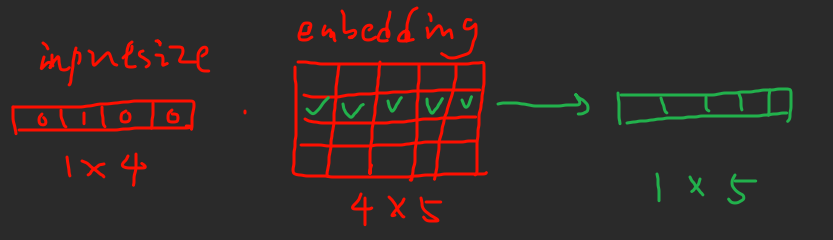

使用时，在序列输入RNN之前，对序列元素（维度是one-hot类别）分别进行embedding映射（输入需要是长整形）即可。

最后接一个线性层，将hiddensize映射至需分类维度（隐藏层维度hiddensize未必等于需分类维度。有时隐藏层需足够大，以编码中间特征）。


案例实现

```python
import torch

dic_cha = ['e', 'h', 'l', 'o']

inputs = [1, 0, 2, 2, 3]
labels = [3, 2, 2, 0, 1]

batch_size = 1
input_size = 4

# 嵌入层设置为10
embedding_size = 10

# 隐藏层设置为8，需进行线性变换
hidden_size = 8

seq_length = 5

# 设置了2层RNN
num_layers = 2

# 设置了类别数
# 此时 input_size == num_class 是任务特性决定的，
# 属于字符级自回归语言模型的典型场景（输入和输出共享同一符号集）。但这不是普遍规律。
num_class = 4

# 注意此处输入数据为非独热向量
# embedding的输入需要长整形
input_x = torch.tensor([inputs]).view(batch_size, seq_length).to(torch.long)
label_y = torch.tensor(labels).to(torch.long)
init_hidden = torch.zeros(num_layers, batch_size, hidden_size).to(torch.float32)


class RNNNet(torch.nn.Module):
    def __init__(self):
        super(RNNNet, self).__init__()
        # 设置嵌入层
        self.embedding = torch.nn.Embedding(num_embeddings=input_size, embedding_dim=embedding_size)
        # RNN
        self.rnn = torch.nn.RNN(input_size=embedding_size, hidden_size=hidden_size, num_layers=num_layers,
                                batch_first=True)
        # 线性层定义
        self.linear = torch.nn.Linear(hidden_size, num_class)

    def forward(self, x):
        # 这里embedding层只能输入Long、Int类型，需转换后再to(torch.float32)
        x = self.embedding(x).to(torch.float32)
        output, hidden = self.rnn(x, init_hidden)
        # 此处是逐元素计算
        output = self.linear(output)
        return output.view(-1, num_class)


net = RNNNet()
device = torch.device("cuda:0" if torch.cuda.is_available() else "cpu")
net = net.to(device)
criterion = torch.nn.CrossEntropyLoss()
optimizer = torch.optim.Adam(net.parameters(), lr=0.001)

if __name__ == '__main__':
    net.train()
    epochs = 100
    for epoch in range(epochs):
        input_x, label_y, init_hidden = input_x.to(device), label_y.to(device), init_hidden.to(device)
        optimizer.zero_grad()
        output = net(input_x)
        loss = criterion(output, label_y)
        loss.backward()
        optimizer.step()

    net.eval()
    output = net(input_x.to(device))
    li = [dic_cha[i] for i in output.argmax(dim=1).tolist()]
    print(li)

```

## GRU


问题描述：输入名字，输出对应国家（18种）。

此处不是Seq2Seq任务，而是分类任务，所采用的模型可以简化，直接输出最后1个时间步上最后1层RNNCell输出的hidden即可，以下以GRU为例进行实现。


数据预处理：如何将原始姓名列表转换为向量列表？

先划分为字符，再转换为ASCLL表（每个字母都可看作128维独热向量）


词汇表中每行序列的长短不一？对序列进行padding（按0填充），使得输入模型的seq_len统一


label怎么获取？统计国家，作出词典映射即可


改进的双向循环神经网络：

对序列进行正向递归计算，同时对序列进行反向递归计算，并将正向与反向的递归结果拼接。


输出是2倍（结果按特征维度拼接）


打包的原理：对变长序列排序后，进行拼接操作（左图中每列是一个样本；右图中竖向堆叠）


```python
import numpy as np
import pandas as pd
import torch
import torch.nn as nn
from torch.nn.utils.rnn import pack_padded_sequence, pad_packed_sequence
from torch.utils.data import Dataset, DataLoader

device = torch.device('cuda' if torch.cuda.is_available() else 'cpu')

# 样本形式：（人名，国家）
train_origin_data = pd.read_csv('names_train.csv.gz', header=None)
test_origin_data = pd.read_csv('names_test.csv.gz', header=None)

batch_size = 256
input_size = 128
hidden_size = 100
num_classes = 18
epochs = 100

# 国家字典，用于构造label
unique_countries = sorted(set(train_origin_data[1].values))
country_dict = dict(zip(unique_countries, range(len(unique_countries))))


# 定义dataset
class GetDataset(Dataset):
    def __init__(self, origin_data):
        self.names = origin_data[0].values.tolist()
        self.labels = origin_data[1].values.tolist()

    def __getitem__(self, index):
        # 转换名称和标签
        names = [ord(n_chr) for n_chr in self.names[index]]
        labels = country_dict[self.labels[index]]
        return torch.tensor(names, dtype=torch.long), torch.tensor(labels, dtype=torch.long)

    def __len__(self):
        return len(self.names)


# 定义函数处理name和label
# DataLoader 传给 collate_fn 的 batch 参数是一个列表，列表中每个元素是 Dataset.__getitem__ 返回的结果
def my_collate_fn(batch):
    # 使用 zip(*batch) 解压为两个元组
    name_tensors, label_tensors = zip(*batch)
    # 填充前先获取长度列表
    lengths = torch.tensor([len(name) for name in name_tensors], dtype=torch.long)
    # 对序列进行padding
    padded_names = nn.utils.rnn.pad_sequence(name_tensors, batch_first=True, padding_value=0)
    # 设置标签格式
    labels = torch.stack(label_tensors).long()
    return padded_names, labels, lengths


# 获取训练和测试数据
train_dataset = GetDataset(origin_data=train_origin_data)
train_loader = DataLoader(dataset=train_dataset, batch_size=batch_size, collate_fn=my_collate_fn, shuffle=True,
                          num_workers=0)
test_dataset = GetDataset(origin_data=test_origin_data)
test_loader = DataLoader(dataset=test_dataset, batch_size=batch_size, collate_fn=my_collate_fn, shuffle=False,
                         num_workers=0)


# 定义模型
class Net(nn.Module):
    def __init__(self):
        super(Net, self).__init__()
        self.embedding = nn.Embedding(num_embeddings=input_size, embedding_dim=hidden_size)
        self.gru = nn.GRU(hidden_size, hidden_size, num_layers=3, batch_first=True, bidirectional=True)
        self.fc = nn.Linear(hidden_size * 2, num_classes)

    def forward(self, x, lengths):
        x = self.embedding(x)
        # 将填充数据压缩为 PackedSequence，enforce_sorted=False 允许输入序列不按长度降序排列
        x = pack_padded_sequence(x, lengths.cpu(), batch_first=True, enforce_sorted=False)
        '''
            双向网络：
            output 沿着“特征方向”叠加 (batch_size, seq_len, 2 * hidden_size)
            h_n 沿着“层数方向”堆叠 (num_layers * 2, batch_size, hidden_size)，先按正反向交替，再按层数递增堆叠
            最后一层（第 3 层）的状态存储在最后两个索引中：
                h_n[-2, :, :]：第 3 层正向读取完最后一个词后的状态。
                h_n[-1, :, :]：第 3 层反向读取完第一个词（即反向看完全文）后的状态。
        '''
        gru_out, h_n = self.gru(x)
        '''
            是否需要将输出解压回 Padding 状态（pad_packed_sequence）：
                gru_out：包含了所有时间步信息。因为不同样本时间步长度不等，在 Packed 状态下是乱的，所以必须还原成带 Padding 的整齐形状才能按索引取值
                h_n：只包含最后一步信息。它已经把不相等的时间维度“压缩”掉了，留下的形状本身就是整齐的，所以可以直接拿来传给 Linear 层
        '''
        last_layer_h = torch.cat((h_n[-2, :, :], h_n[-1, :, :]), dim=-1)
        output = self.fc(last_layer_h)
        return output


net = Net()
net.to(device)
criterion = nn.CrossEntropyLoss()
optimizer = torch.optim.Adam(net.parameters(), lr=0.001)


def train(e):
    net.train()
    batches = 0
    total = len(train_origin_data[1].values)
    for i, (padded_names, labels, lengths) in enumerate(train_loader, 0):
        padded_names, labels, lengths = padded_names.to(device), labels.to(device), lengths.to(device)
        optimizer.zero_grad()
        outputs = net(padded_names, lengths)
        loss = criterion(outputs, labels)
        loss.backward()
        optimizer.step()
        batches += len(labels)
        if i % 10 == 0:
            print(f'Epoch {e}, {batches}/{total}, Train Loss: {loss.item():.4f}')


def test(e):
    net.eval()
    correct = 0
    total = 0
    with torch.no_grad():
        for i, (padded_names, labels, lengths) in enumerate(test_loader, 0):
            padded_names, labels, lengths = padded_names.to(device), labels.to(device), lengths.to(device)
            outputs = net(padded_names, lengths)
            _, predicted = torch.max(outputs.data, 1)
            total += labels.size(0)
            predicted = predicted.cpu().numpy()
            labels = labels.cpu().numpy()
            correct += np.sum(predicted == labels)
        print('Epoch[%d] Test Accuracy: %.2f%%' % (e, 100 * correct / total))


if __name__ == '__main__':
    for epoch in range(1, epochs + 1):
        train(epoch)
        test(epoch)

```

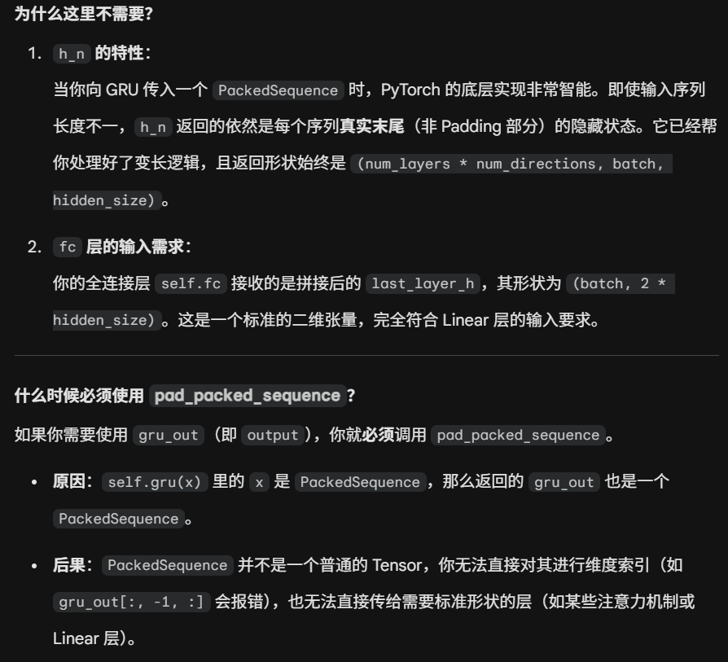

## LSTM

对于LSTM的基本原理，其形式基本与GRU相同，
不同点在于，LSTM需要两个初始隐藏状态张量：**h_0（隐藏状态）和 c_0（细胞状态）**，
而GRU和RNN类似，只需一个初始隐藏状态张量 h_0。 

```python
import torch
import torch.nn as nn

batch_size = 32
sequence_length = 3
input_size = 5
hidden_size = 10
num_layers = 6

# 输入数据
x = torch.randn(batch_size, sequence_length, input_size)

print("--- 1. GRU 示例 ---")
gru = nn.GRU(input_size, hidden_size, num_layers=num_layers, batch_first=True)  # GRU 只需要一个初始状态 h_0
h_0_gru = torch.zeros(num_layers, batch_size, hidden_size)  # 单个隐藏状态
output_gru, h_n_gru = gru(x, h_0_gru)  # 直接传入 h_0
print(f"GRU 初始状态数量: 1个 (h_0)")
print(f"GRU 输出隐藏状态形状: {h_n_gru.shape}\n")

print("--- 2. LSTM 示例 ---")
lstm = nn.LSTM(input_size, hidden_size, num_layers=num_layers, batch_first=True)  # LSTM 需要两个初始状态：h_0 和 c_0
h_0_lstm = torch.zeros(num_layers, batch_size, hidden_size)  # 隐藏状态（工作便签）
c_0_lstm = torch.zeros(num_layers, batch_size, hidden_size)  # 细胞状态（中央档案）
output_lstm, (h_n_lstm, c_n_lstm) = lstm(x, (h_0_lstm, c_0_lstm))  # LSTM 传入和返回的都是一个元组 (h_0, c_0)
print(f"LSTM 初始状态数量: 2个 (h_0 和 c_0 拼成元组)")
print(f"LSTM 最终隐藏状态(h_n)形状: {h_n_lstm.shape}")
print(f"LSTM 最终细胞状态(c_n)形状: {c_n_lstm.shape}")

```

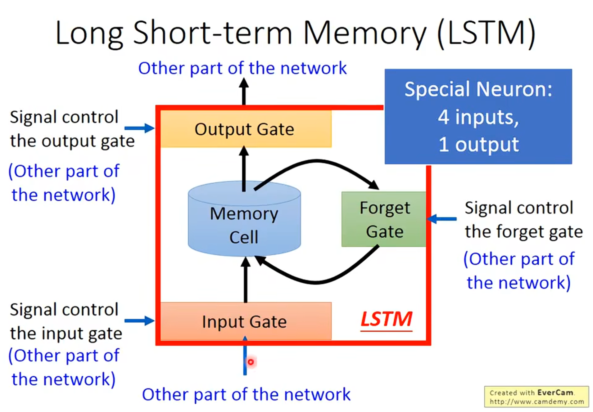

整个**LSTM有4个输入、1个输出**。
在这4个输入中，一个输入是想要存在记忆元里的值（但不一定能存进去），
其他3个输入分别是操控输入门的信号、操控输出门的信号、操控遗忘门的信号。

RNN的记忆元里的值，只要有新的输入进来，旧的值就会被遗忘掉，这个记忆周期是非常短的。但如果是LSTM，则记忆周期会更长一些，只要遗忘门不决定忘记，值就会被存起来。

特点：**比较长的短时记忆网络**，下图展示了LSTM如何通过激活元控制信号

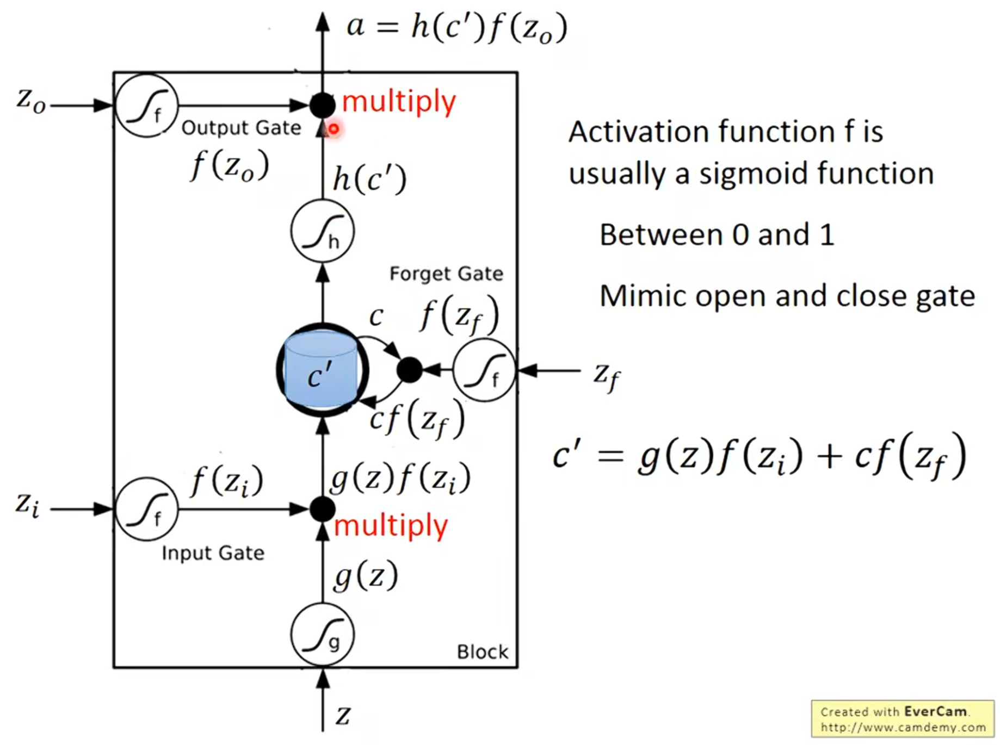

为了简化，假设隐藏层只有两个神经元，将输入 x₁ 和 x₂ 乘以不同的权重并当作 LSTM 不同的输入. 

输入（x₁ 和 x₂）被乘以不同的权重以操控输出门、输入门、底部输入和遗忘门. 第二个 LSTM 也是一样的. 

所以 LSTM 有 4 个输入和一个输出，对于 LSTM 来说，这 4 个输入是不一样的. 

在普通的神经网络里，一个输入对应一个输出. 所以如果 LSTM 网络和普通网络拥有相同数量的神经元，则 **LSTM 网络需要的参数量是普通神经网络的 4 倍**.

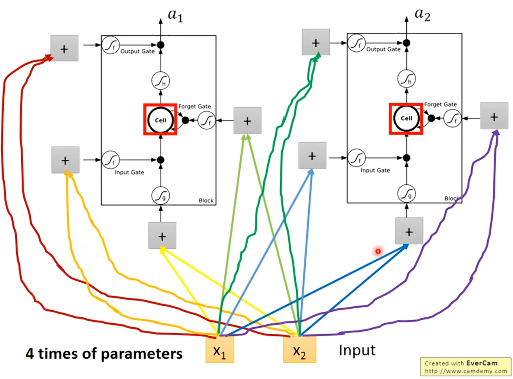

真正的 LSTM 网络会把上一个时间点的输出接进来，当作下一个时间点的输入，即下一个时间点在操控这些门的值时，不仅看那个时间点的输入 $x_{t+1}$，还看前一个时间点的输出 $h_t$。

其实不仅如此，还会添加 **peephole 连接**，如下图所示。peephole 连接就是把存在记忆单元里的值也考虑进来。

在操控 LSTM 的 4 个门时，需要**同时考虑 $x_{t+1}$、$h_t$、$c_t$**，先将这**三个向量并在一起执行不同的变换**，得到 **4 个不同的向量**，之后再操控 LSTM。

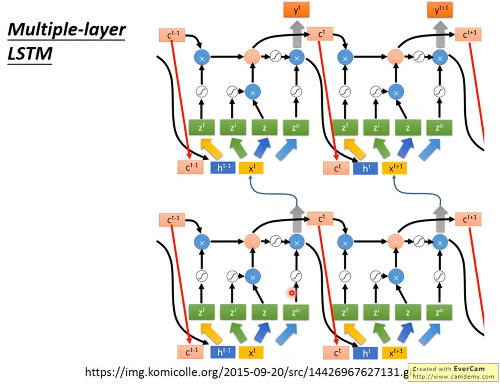

# Transformer

## 自注意力机制

全连接网络不是只考虑一个非常小的范围或一个个小的窗口，而是考虑整个序列的信息，从而决定应该输出什么样的结果，这就是自注意力模型。

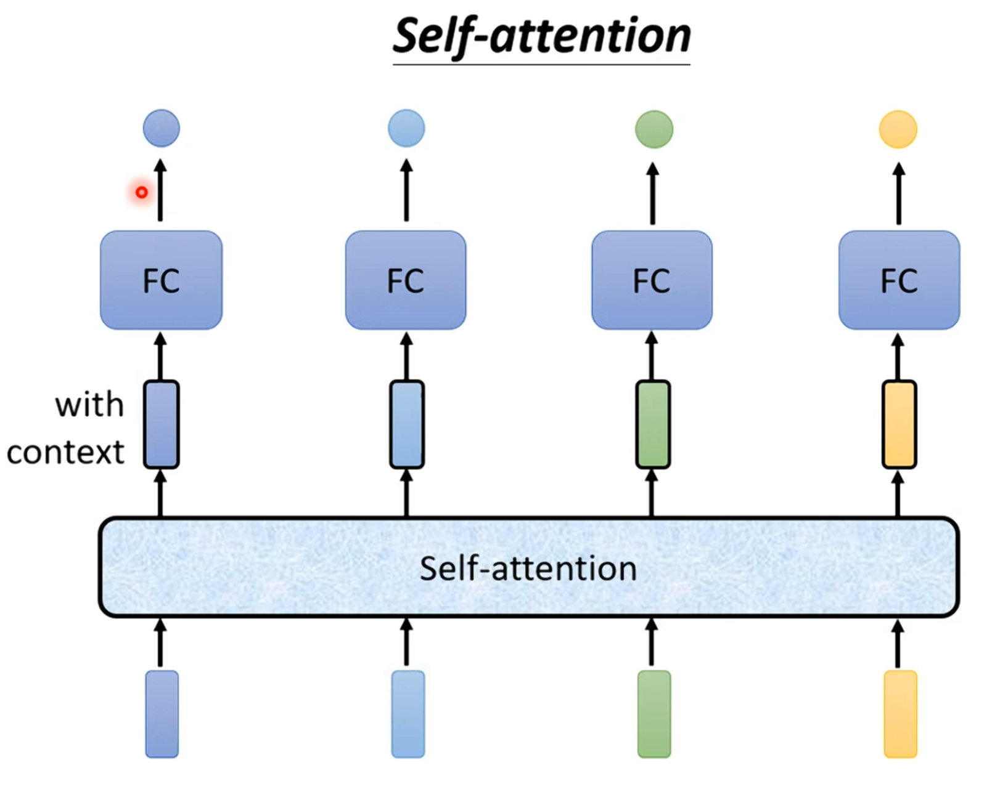

计算向量关联程度的方法（一般使用点积）：


在自注意力机制中使用点积：

一般在实践的时候， $a^1$ 跟自身也有关联性。将 $a^1$ 乘以 $W^k$，得到 $k^1$，即可用 $q^1$ 和 $k^1$ 来计算 $a^1$ 与自身的关联性。

在计算出 $a^1$ 与每一个向量的关联性以后，对所有的关联性执行 softmax 操作。

对 $\alpha$ 全部取 $\mathrm{e}$ 的指数，再把指数的值全部加起来做归一化（normalize），得到 $\alpha'$. 这里的 softmax 操作与分类任务中的 softmax 操作一模一样。


根据$\alpha'$从序列中抽取出重要的信息：


从矩阵乘法的角度理解自注意力模型的运作过程：初始时，3个矩阵分别对整个序列向量进行变换即可。


自注意力层的操作较为复杂，但自注意力层中需要学习的参数只有 $\mathbf{W}^q$、$\mathbf{W}^k$、$\mathbf{W}^v$。

$\mathbf{W}^q$、$\mathbf{W}^k$、$\mathbf{W}^v$ 是未知的，需要通过训练数据进行学习。其他的操作都没有未知的参数，也就不需要通过训练数据进行学习。

下图是矩阵计算，对应上方整个流程。


## 多头自注意力

怎么从 $q$ 得到 $q^1$、$q^2$，又怎么从 $k$ 得到 $k^1$、$k^2$，以及怎么从 $v$ 得到 $v^1$、$v^2$ 呢？

其实就是把 $q$、$k$、$v$ 分别乘以两个矩阵，得到不同的头. 对另一个位置做同样的事情，另一个位置在输入 $a$ 以后，也会得到两个 $q$、两个 $k$、两个 $v$.

接下来怎么实现自注意力呢？跟之前的操作一模一样，只是现在 1 所代表那一类的一起做，2 所代表那一类的一起做。

假设分2个子头，则每个子注意力头中的特征向量维度减半。


多头自注意力的另一个头的计算过程：


得到 $b^{i,1}$ 和 $b^{i,2}$ 后，把 $b^{i,1}$ 和 $b^{i,2}$ 拼起来，先通过一个变换（即乘以一个矩阵，得到 $b^i$），再送到下一层，这就是自注意力的变体——多头自注意力。

从矩阵乘法的角度理解：


## 位置编码

在实现自注意力的时候，如果觉得位置信息很重要，就要用到**位置编码（positional encoding）**。

位置编码为每一个位置设定一个向量，即**位置向量（positional vector）**。

位置向量用 $e^i$ 来表示，上标 $i$ 代表位置，不同的位置就有不同的向量，且都有一个专属的 $e^i$。把 $e^i$ 加到 $a^i$ 上面就可以了，这相当于提供了位置信息。

如果看到 $a^i$ 被加上 $e^i$，就可以判定现在出现的位置应该是在 $i$ 这个位置。


人为设定的向量有很多问题，比如在设定这个向量的时候向量长度只定到 128，但序列的长度是 129，怎么办呢？

在“Attention Is All You Need”中，位置向量是通过正弦函数和余弦函数产生的，这避免了人为设定固定长度向量的尴尬。


**RoPE（旋转位置编码）**

原始长度r，初始角度α，通过矩阵乘法：逆时针旋转β角度


2个性质推导：


注意力q、k向量进行点积，这里q的位置是m，k的位置是n，

根据上方2性质可得（对q旋转m、对k旋转n）：


假设q、k长度不止2维？两两一组，每组在它们组成的子空间内旋转，

m代表在序列中位置（0，1，2，3）、f代表sin和cos频率、i：第几个二维分组的编号，2i =（0，2，4，6）、d：向量维度


不同维度对，将编码不同“尺度”的位置信息：

- 小 $i$：频率高，变化快，适合表示短距离、细粒度位置差异
- 大 $i$：频率低，变化慢，适合表示长距离、粗粒度位置差异

这样模型就能同时拿到“近处细节”和“远处结构”。


具体实现：注意此处是哈达玛积，即元素对应位置相乘

Seqlen每一个位置上维度为d的向量都需要 * 一个sin cos矩阵，通过m控制乘以不同的矩阵


```python
import torch
import torch.nn as nn
import torch.nn.functional as F


# 1. 生成旋转矩阵（实数版本，返回 cos 和 sin）
def precompute_freqs_cis(d: int, seq_len: int, theta: float = 10000.0):
    # 计算词向量元素两两分组之后，每组元素对应的旋转频率，选择偶数位置 f
    freqs = 1.0 / (theta ** (torch.arange(0, d, 2).float() / d))
    # 生成每个token位置索引 m = [0, 1,..., seq_len-1]
    m = torch.arange(seq_len, device=freqs.device)
    #  计算外积（所有位置的旋转角度矩阵m * f），[seq_len, d // 2]
    freqs = torch.outer(m, freqs).float()

    # 分别返回 cos(mf) 和 sin(mf)
    freqs_cos = freqs.cos()  # [seq_len, d // 2]
    freqs_sin = freqs.sin()  # [seq_len, d // 2]
    return freqs_cos, freqs_sin


# 2. 广播维度对齐函数
def reshape_for_broadcast(freqs: torch.Tensor, x: torch.Tensor):
    """
        x数据矩阵维度：[batch_size, seq_len, num_heads, head_dim]
        将 freqs [seq_len, head_dim // 2]
        重塑为适用于广播的形状 [1, seq_len, 1, head_dim // 2]
    """
    # 确保 x 至少有 2 个维度
    # 确保 freqs 的形状确实等于 [seq_len, head_dim]
    ndim = x.ndim
    assert ndim > 1, "x must have at least 2 dimensions"
    assert freqs.shape == (x.shape[1], x.shape[-1])

    # 动态构建形状，仅保留 seq_len 和 dim // 2 维度，其余设为 1
    shape = [d if i == 1 or i == ndim - 1 else 1 for i, d in enumerate(x.shape)]
    return freqs.view(*shape)


# 3. 旋转位置编码计算（实数版本，无复数运算）
def apply_rotary_emb(
        x: torch.Tensor,
        freqs_cos: torch.Tensor,
        freqs_sin: torch.Tensor,
) -> torch.Tensor:
    # x.shape = [batch_size, seq_len, num_heads, head_dim]
    # 将 head_dim 的相邻两维配对：x_reshaped.shape = [..., head_dim//2, 2]
    x_ = x.float().reshape(*x.shape[:-1], -1, 2)

    # 分离配对元素：[..., head_dim//2]
    x0, x1 = x_[..., 0], x_[..., 1]

    # 广播对齐 cos/sin
    cos = reshape_for_broadcast(freqs_cos, x0)
    sin = reshape_for_broadcast(freqs_sin, x1)

    # 实数旋转公式：(x0 + i*x1) * (cos + i*sin) = (x0*cos - x1*sin) + i*(x0*sin + x1*cos)
    x0_out = x0 * cos - x1 * sin
    x1_out = x0 * sin + x1 * cos

    # 将配对维度重新组合，展平为 [..., head_dim]
    x_out = torch.stack([x0_out, x1_out], dim=-1).flatten(-2)

    return x_out.type_as(x)


# 4. Attention 模块
class Attention(nn.Module):
    def __init__(self, dim, n_heads, max_seq_len):
        super().__init__()
        self.n_heads = n_heads
        self.head_dim = dim // n_heads  # RoPE 作用于 head_dim

        self.wq = nn.Linear(dim, n_heads * self.head_dim, bias=False)
        self.wk = nn.Linear(dim, n_heads * self.head_dim, bias=False)
        self.wv = nn.Linear(dim, n_heads * self.head_dim, bias=False)
        self.wo = nn.Linear(n_heads * self.head_dim, dim, bias=False)

        # 预计算频率矩阵（基于 head_dim），safetensors 不支持 complex64，需分别存储 cos 和 sin
        freqs_cos, freqs_sin = precompute_freqs_cis(self.head_dim, max_seq_len * 2)
        self.register_buffer('freqs_cos', freqs_cos.float())
        self.register_buffer('freqs_sin', freqs_sin.float())

    # 从预计算的 cos/sin buffer 截取指定长度的 (cos, sin) 元组
    def _freqs(self, seq_len: int, device: torch.device):
        return (
            self.freqs_cos[:seq_len].to(device),
            self.freqs_sin[:seq_len].to(device))

    def forward(self, query: torch.Tensor, key: torch.Tensor, value: torch.Tensor):
        batch_size, q_seq_len, _ = query.shape
        _, k_seq_len, _ = key.shape

        # Q/K/V 投影分别作用于各自输入
        xq = self.wq(query)  # [B, qL, n_heads * head_dim]
        xk = self.wk(key)  # [B, kL, n_heads * head_dim]
        xv = self.wv(value)  # [B, kL, n_heads * head_dim]

        # shape: [batch_size, seq_len, num_heads, head_dim]
        xq = xq.view(batch_size, q_seq_len, self.n_heads, self.head_dim)
        xk = xk.view(batch_size, k_seq_len, self.n_heads, self.head_dim)
        xv = xv.view(batch_size, k_seq_len, self.n_heads, self.head_dim)

        # 截取当前 seqlen 所需的 cos/sin
        freqs_cos_q, freqs_sin_q = self._freqs(q_seq_len, xq.device)
        freqs_cos_k, freqs_sin_k = self._freqs(k_seq_len, xk.device)

        # attention 操作之前，应用旋转位置编码
        xq = apply_rotary_emb(xq, freqs_cos=freqs_cos_q, freqs_sin=freqs_sin_q)
        xk = apply_rotary_emb(xk, freqs_cos=freqs_cos_k, freqs_sin=freqs_sin_k)

        # 为进行矩阵乘法，需将 num_heads 移至前面 [batch_size, num_heads, seq_len, head_dim]
        xq = xq.transpose(1, 2)
        xk = xk.transpose(1, 2)
        xv = xv.transpose(1, 2)

        # 使用 Flash Attention
        output = F.scaled_dot_product_attention(
            xq, xk, xv,
            is_causal=False,
            scale=None
        )  # [batch_size, num_heads, qL, head_dim]

        # 合并结果: [batch_size, qL, dim]
        output = output.transpose(1, 2).contiguous().view(batch_size, q_seq_len, -1)

        return self.wo(output)

```

可以不用相邻位置两两配对，只要有2个元素配对就行，可将维度拆分为上半和下半部分 ，然后将两者对应位置元素配对（LLama做法）。

具体实现：


下图可见，可将公式转换为2个复数运算，做乘法后获得复数的实部和虚部，分别对应结果向量的2个分量。


在标准的 Transformer 多头注意力机制（Multi-Head Attention）中，常将总的隐藏层维度均分给各个子注意力头。

```python
import torch
import torch.nn as nn
import torch.nn.functional as F


# 1. 生成旋转矩阵
def precompute_freqs_cis(d: int, seq_len: int, theta: float = 10000.0):
    # 计算词向量元素两两分组之后，每组元素对应的旋转频率，选择偶数位置 f
    freqs = 1.0 / (theta ** (torch.arange(0, d, 2).float() / d))
    # 生成每个token位置索引 m = [0, 1,..., seq_len-1]
    m = torch.arange(seq_len, device=freqs.device)
    #  计算外积（所有位置的旋转角度矩阵m * f），[seq_len, d // 2]
    freqs = torch.outer(m, freqs).float()

    # 转为复数向量，cos(mf) + i*sin(mf)，模长i=1
    freqs_cis = torch.polar(torch.ones_like(freqs), freqs)
    return freqs_cis


# 2. 广播维度对齐函数
def reshape_for_broadcast(freqs_cis: torch.Tensor, x: torch.Tensor):
    """
        x数据矩阵维度：[batch_size, seq_len, num_heads, head_dim]
        将 freqs_cis [seq_len, head_dim // 2]
        重塑为适用于广播的形状 [1, seq_len, 1, head_dim // 2]
    """
    # 确保 x 至少有 2 个维度
    # 确保 freqs_cis 的形状确实等于 [seq_len, head_dim]
    ndim = x.ndim
    assert ndim > 1, "x must have at least 2 dimensions"
    assert freqs_cis.shape == (x.shape[1], x.shape[-1])

    # 动态构建形状，仅保留 seq_len 和 dim // 2 维度，其余设为 1
    # shape = freqs_cis.unsqueeze(0).unsqueeze(2).shape
    shape = [d if i == 1 or i == ndim - 1 else 1 for i, d in enumerate(x.shape)]
    return freqs_cis.view(*shape)


# 3. 旋转位置编码计算
def apply_rotary_emb(
        x: torch.Tensor,
        freqs_cis: torch.Tensor,
) -> torch.Tensor:
    # x.shape = [batch_size, seq_len, num_heads, head_dim]
    # x_.shape = [batch_size, seq_len, num_heads, head_dim // 2, 2]
    x_ = x.float().reshape(*x.shape[:-1], -1, 2)

    # 转为复数域 [batch_size, seq_len, num_heads, head_dim // 2]
    x_ = torch.view_as_complex(x_)

    # 广播对齐 freqs_cis
    freqs_cis = reshape_for_broadcast(freqs_cis, x_)

    # 旋转操作，将结果转回实数域，并展平最后两维
    # 使用 flatten(-2) 将 [..., head_dim//2, 2] 展平为 [..., head_dim]
    x_out = torch.view_as_real(x_ * freqs_cis).flatten(-2)

    return x_out.type_as(x)


# 4. Attention 模块
class Attention(nn.Module):
    def __init__(self, dim, n_heads, max_seq_len):
        super().__init__()
        self.n_heads = n_heads
        self.head_dim = dim // n_heads  # RoPE 作用于 head_dim

        self.wq = nn.Linear(dim, n_heads * self.head_dim, bias=False)
        self.wk = nn.Linear(dim, n_heads * self.head_dim, bias=False)
        self.wv = nn.Linear(dim, n_heads * self.head_dim, bias=False)
        self.wo = nn.Linear(n_heads * self.head_dim, dim, bias=False)

        # 预计算频率矩阵（基于 head_dim），拆为实部/虚部两个 buffer
        # safetensors 不支持 complex64，需分别存储 cos 和 sin
        freqs_cis = precompute_freqs_cis(self.head_dim, max_seq_len * 2)
        self.register_buffer('freqs_cos', freqs_cis.real.float())
        self.register_buffer('freqs_sin', freqs_cis.imag.float())

    def _freqs(self, seq_len: int, device: torch.device) -> torch.Tensor:
        """从预计算的 cos/sin buffer 重构指定长度的复数旋转矩阵"""
        return torch.complex(
            self.freqs_cos[:seq_len].to(device),
            self.freqs_sin[:seq_len].to(device))

    def forward(self, query: torch.Tensor, key: torch.Tensor, value: torch.Tensor):
        batch_size, q_seq_len, _ = query.shape
        _, k_seq_len, _ = key.shape

        # Q/K/V 投影分别作用于各自输入
        xq = self.wq(query)  # [B, qL, n_heads * head_dim]
        xk = self.wk(key)  # [B, kL, n_heads * head_dim]
        xv = self.wv(value)  # [B, kL, n_heads * head_dim]

        # shape: [batch_size, seq_len, num_heads, head_dim]
        xq = xq.view(batch_size, q_seq_len, self.n_heads, self.head_dim)
        xk = xk.view(batch_size, k_seq_len, self.n_heads, self.head_dim)
        xv = xv.view(batch_size, k_seq_len, self.n_heads, self.head_dim)

        # 截取当前 seqlen 所需的旋转矩阵，由 cos/sin buffer 重构复数张量
        freqs_cis_q = self._freqs(q_seq_len, xq.device)
        freqs_cis_k = self._freqs(k_seq_len, xk.device)

        # attention 操作之前，应用旋转位置编码
        xq = apply_rotary_emb(xq, freqs_cis=freqs_cis_q)
        xk = apply_rotary_emb(xk, freqs_cis=freqs_cis_k)

        # 为进行矩阵乘法，需将 num_heads 移至前面 [batch_size, num_heads, seq_len, head_dim]
        xq = xq.transpose(1, 2)
        xk = xk.transpose(1, 2)
        xv = xv.transpose(1, 2)

        # 使用 Flash Attention
        output = F.scaled_dot_product_attention(
            xq, xk, xv,
            is_causal=False,
            scale=None
        )  # [batch_size, num_heads, qL, head_dim]

        # 合并结果: [batch_size, qL, dim]
        output = output.transpose(1, 2).contiguous().view(batch_size, q_seq_len, -1)

        return self.wo(output)

```


## 截断自注意力

截断自注意力（Truncated Self-attention）可以处理向量序列过长的问题。

截断自注意力在做自注意力的时候不会看一整句话，而是只看一个小的过程，整个范围是人为设定的。

在做自注意力的时候，也许没必要让自注意力考虑整个句子，从而提高运算的速度，这就是截断自注意力。


## 模型结构

一般的序列到序列模型可以分解成编码器和解码器，编码器负责处理输入序列，再把处理好的结果输入解码器，由解码器决定输出序列。

Transformer结构如下：


## 编码器

Transformer 编码器的每个块并不是神经网络的一层。块的结构如下图所示。在每个块里面，输入一组向量后做自注意力，考虑整个序列的信息，输出另一组向量。

接下来这一组向量会被输入全连接网络，输出另一组向量，这一组向量就是块的输出。


Transformer 增加了残差连接（residual connection）的设计，如下图所示，将最左边的向量 $b$ 输入自注意力层，得到向量 $a$，再将输出向量 $a$ 加上输入向量 $b$，得到新的输出。

得到残差结果以后，再做层归一化（layer normalization），详见常见概念：Nom归一化。

层归一化不需要考虑批量的信息，而批量归一化需要考虑批量的信息。层归一化能输入一个向量，输出另一个向量。层归一化会计算输入向量的均值和标准差。

得到层归一化的输出以后，将其作为全连接网络的输入。输入全连接网络的还有一个残差连接，把全连接网络的输入和输出加起来，得到新的输出。

对残差的结果再做一次层归一化，得到的输出才是 Transformer 编码器里面一个块的输出。


Transformer编码器的详细结构：


## 解码器

比较常见的Transformer解码器是自回归（Autoregressive）解码器

由于解码器的输入是它在前一个时间点的输出，它会把自己的输出作为接下来的输入，因此当解码器产生一个句子的时候，它有可能看到错误的内容，造成误差传播问题，一步错步步错。


Transformer 解码器的详细结构如下图所示. 类似于编码器，解码器也有多头注意力、残差连接和层归一化，以及全连接前馈神经网络. 

解码器在最后会执行 softmax 操作，以使其输出变成概率. 此外，解码器还使用了掩码多头自注意力，掩码多头自注意力可以通过一个掩码（mask）来阻止每个位置选择其后面的输入信息.


解码器的输出是一个个产生的，只能考虑左边已有的部分，而没有办法考虑右边的部分。

一般的自注意力产生b2的过程：


掩码多头自注意力产生b2的过程：


在实际应用中，输入长度和输出长度的关系是非常复杂的，我们无法从输入序列的长度知道输出序列的长度，因此解码器必须决定输出序列的长度。

要让解码器停止运作，就需要特别准备一个词元<EOS>。

输出“习”以后，把“习”当作解码器的输入，解码器看到<BOS>、“机”“器”“学”“习”以后，所产生向量里面<EOS>的概率最大，于是输出<EOS>，整个解码器产生序列的过程结束。


非自回归解码器：


## 编码器-解码器注意力

编码器和解码器通过编码器-解码器注意力（encoder-decoder attention）传递信息，编码器-解码器注意力是连接编码器和解码器的桥梁. 

如下图所示，解码器中编码器-解码器注意力的键和值来自编码器的输出，查询来自解码器中前一个层的输出.


编码器-解码器注意力的运作过程：


## 训练过程

训练解码器的情况下，在输入时就提供标准答案的做法称为教师强制（teacher forcing）


# GNN

**图神经网络基础知识**

1.同质图（节点和边的类型，在1张图中一样）；异质图
2.无向图；有向图；混合图
3.赋权图；无权图

同构图和同质图区别


邻接矩阵（节点-节点）和关联矩阵（节点-边）


邻居、度、入度、出度


下面这张图是一个**图神经网络“族谱”或“技术分解图”**，帮助我们理解不同GNN模型的核心组件和设计思想。它将复杂的GNN模型分解为三个核心模块：**传播模块（Propagation Module）**、**采样模块（Sampling Module）和池化模块（Pooling Module）**。


**1. 传播模块 (Propagation Module)**

这是GNN最核心的部分，负责定义节点如何聚合其邻居节点的信息来更新自身的表示（Representation）。这个过程就像在社交网络中，你的想法会受到朋友们的影响一样。该模块主要分为三类：

- **卷积算子 (Convolution Operator)**：这是目前最主流的传播方式，借鉴了卷积神经网络（CNN）的思想。它又分为两类：
  - **谱方法 (Spectral)**：这类方法基于图谱理论，将图信号转换到谱空间（频域）进行处理，理论性很强。代表模型有 **GCN (图卷积网络)** 和 **ChebNet**。
  - **空间方法 (Spatial)**：这类方法直接在图的空间结构上（即节点和其邻居）进行信息聚合，更直观、灵活。它又可细分为：
    - **基础 (Basic)**：如 **GraphSAGE**，它通过聚合邻居节点的特征来学习。
    - **注意力 (Attentional)**：如 **GAT (图注意力网络)**，它在聚合邻居信息时引入了注意力机制，可以为不同的邻居分配不同的重要性权重。
    - **框架 (Framework)**：如 **MPNN (消息传递神经网络)**，它提供了一个统一的框架来描述各种空间方法。
- **循环算子 (Recurrent Operator)**：这类方法借鉴了循环神经网络（RNN）的思想，通过迭代更新节点状态直至收敛。这在早期的GNN模型中比较常见，例如 **GNN** 和 **GGNN (门控图神经网络)**。
- **跳跃连接 (Skip Connection)**：借鉴于ResNet，这种技术允许信息从浅层直接“跳跃”到深层，以构建更深、更强大的GNN模型，有效缓解了深度网络中的梯度消失问题。代表模型有 **JKN (Jumping Knowledge Networks)** 和 **DeepGCN**。

**2. 采样模块 (Sampling Module)**

当图的规模非常巨大（例如，拥有数百万甚至数十亿个节点的社交网络或电商推荐网络）时，将所有节点的邻居信息都纳入计算是不现实的。采样模块就是为了解决这个问题，它通过对图进行采样来缩小计算规模。

- **节点采样 (Node)**：如 **GraphSAGE** 和 **PinSAGE** (由Pinterest提出)，它们为每个节点采样固定数量的邻居，而不是使用所有邻居。
- **层采样 (Layer)**：如 **FastGCN**，它在每一层都独立地采样一部分节点，进一步提高了效率。
- **子图采样 (Subgraph)**：如 **ClusterGCN** 和 **GraphSAINT**，它们将图划分为多个子图（Cluster），然后在子图上进行训练，大大减少了计算和内存开销。

**3. 池化模块 (Pooling Module)**

池化（或称“读出”，Readout）操作用于将图中所有节点的特征聚合成一个单一的、固定大小的向量，从而得到整个图的表示。这对于图分类、图属性预测等任务至关重要。

- **直接池化 (Direct)**：这类方法比较简单，例如直接对所有节点的特征进行求和、求平均或使用更复杂的 **Set2Set** 模型。
- **层次化池化 (Hierarchical)**：这类方法借鉴了CNN中池化层的思想，通过逐步“粗化”（Coarsening）或对节点进行聚类来学习图的层次化表示。代表模型有 **DiffPool** 和 **SAGPool**。

**使用NetworkX可视化图**

```python
import networkx as nx
import matplotlib.pyplot as plt
import numpy as np

# 创建有向图
G = nx.DiGraph()

# 添加节点
G.add_nodes_from(['A', 'B', 'C'])
# 添加边
G.add_edges_from([
    ('A', 'A'),
    ('A', 'B'),
    ('B', 'C'),
    ('C', 'B')
])

# 设置节点特征
node_feature = {
    'A': '[1,3]',
    'B': '[2,4]',
    'C': '[5,7]'
}
nx.set_node_attributes(G, node_feature, name='node_feature')
# 设置边权重
edge_weights = {
    ('A', 'B'): 4.5,
    ('B', 'C'): 2.0,
    ('C', 'B'): 6.0,
    ('A', 'A'): 1.0
}
nx.set_edge_attributes(G, edge_weights, name='edge_weights')

# 获取属性用于绘图
node_labels = nx.get_node_attributes(G, 'node_feature')
edge_labels = nx.get_edge_attributes(G, 'edge_weights')

# 绘图
plt.figure(figsize=(8, 6))
# 设置布局格式
pos = nx.spring_layout(G, seed=42)
# 创建基础绘图
nx.draw(G, pos, with_labels=True)
# 添加节点属性
nx.draw_networkx_labels(G, pos, labels=node_labels)
# 添加边权重
nx.draw_networkx_edge_labels(G, pos, edge_labels=edge_labels)
plt.show()

# 获取图信息
print(G.nodes)  # 获取节点
print(G.edges)  # 获取边
print(G.degree())  # 获取各个节点的度

# 判断图信息
print(nx.is_directed(G))  # 是否为有向图
print(nx.is_weighted(G))  # 是否为加权图

# 邻接矩阵
A = nx.adjacency_matrix(G)
print(A)
print(A.todense())

# 度矩阵
D = np.diag(list(dict(nx.degree(G)).values()))
print(D)
print(G.in_degree)  # 节点入度数
print(G.out_degree)  # 节点出度数
print(list(G.neighbors('A')))  # 获取某个节点的邻居

```

**理解图神经网络和信息传递机制**


1.挑选信息 2.聚合邻居信息 3.将聚合后的邻居信息与自身信息聚合。

消息传递机制：

```python
import torch
from torch_geometric.nn import MessagePassing

# 定义4个节点特征
x = torch.tensor([[1, 2],
                  [2, 3],
                  [8, 3],
                  [2, 4]])
# 定义边（2维矩阵形式，第1行：入，第2行：出）
edge_index = torch.tensor([[0, 0, 1, 2, 2, 3],
                           [0, 1, 2, 1, 3, 2]])


class MessagePassingLayer(MessagePassing):
    def __init__(self):
        # 设置邻居的聚合方式为相加
        super(MessagePassingLayer, self).__init__(aggr='add')

    def forward(self, x, edge_index):
        # propagate()内部调用message()函数，自动拆分edge_index为索引对应的节点特征，并将x_j传入给message()
        return self.propagate(x=x, edge_index=edge_index)

    def message(self, x_i, x_j):
        print(x_i)  # 中心节点特征（出）
        print(x_j)  # 邻居节点特征（入）
        # 返回邻居节点特征+自身特征，这里在求和前进行运算，对每条边的消息进行信息设置
        return x_j + x_i


MessagePassingLayer = MessagePassingLayer()
output = MessagePassingLayer(x, edge_index)
print(output)

```


**图卷积网络（GCN）的原理与实现**

邻接矩阵*特征矩阵=对节点特征的1次更新（这里直接作矩阵乘法，是特征相加）


但由于图结构不包含自环，邻接矩阵对角线上均为0，造成无法结合节点自身特征实现更新，因此常在原始邻接矩阵A上加上自环（即对角线上元素为1）。

此处，考虑对特征进行缩放，可采用度矩阵的逆。而在GCN过程中，度和图论中不同，自环在此处的度只增加1（图论中由于同时增加入度和出度，会增加2）。

此处，使用度矩阵对邻接矩阵进行左乘，实现行变换，使邻接矩阵数值缩放（不再是1），可看成对特征进行了加权，例如度是3时，将每个邻居节点的特征都*1/3。

但此时仅实现行变换而缺少列变换（对发送节点、接收节点均需要进行归一化），因此使用度矩阵对邻接矩阵进行右乘，实现列变换。同时因为做了2次变换，需要平衡一下所以开了根号。

整体上，GCN就是以节点的度为依据，对边的权重进行了修改缩放，并实现信息传递。GCN的规范化，使得中心节点本身和邻居特征聚合的权重发生变化；是一种根据度矩阵（连接数）加权的聚合方式；对中心节点而言，邻居的度越大，传递给中心节点的信息越少。


代码实现，核心公式：


```python
from typing import Optional, Union, List, Dict, Any

import torch
from torch.nn import Linear, Parameter
from torch_geometric.nn import MessagePassing, Aggregation
from torch_geometric.utils import add_self_loops, degree

device = torch.device("cuda" if torch.cuda.is_available() else "cpu")


class GCNConv(MessagePassing):
    # 初始化类，这里添加了（in_channels, out_channels）的输入定义
    def __init__(self, aggr: Optional[Union[str, List[str], Aggregation]] = 'sum', *,
                 aggr_kwargs: Optional[Dict[str, Any]] = None, flow: str = "source_to_target", node_dim: int = -2,
                 decomposed_layers: int = 1, in_channels, out_channels) -> None:
        super().__init__(aggr, aggr_kwargs=aggr_kwargs, flow=flow, node_dim=node_dim,
                         decomposed_layers=decomposed_layers)
        # 设置线性变换层
        self.lin = Linear(in_channels, out_channels)
        # 设置偏置项
        # Parameter() 函数的作用是将一个 Tensor 包装成模型的可学习参数，使其能够被自动管理并在训练过程中更新。
        self.bias = Parameter(torch.empty(out_channels))

    def forward(self, x, edge_index):
        # 添加自环信息
        edge_index, _ = add_self_loops(edge_index, num_nodes=x.size(0))

        # 对节点特征进行线性变换
        x = self.lin(x)

        # 获取输入（邻居节点xj）和输出（中心节点xi）的索引
        xj, xi = edge_index
        # 获取中心节点的度
        deg = degree(xi, x.size(0), dtype=x.dtype)
        # 计算中心节点度的-1/2次方
        deg_inv_sqrt = deg.pow(-0.5)
        deg_inv_sqrt[deg_inv_sqrt == float('inf')] = 0

        # 边权重缩放：入度^-1/2 * 出度^-1/2
        norm = deg_inv_sqrt[xj] * deg_inv_sqrt[xi]

        # 调用propagate函数，传入edge_index、特征x、和归一化计算方法norm
        # 内部调用message()函数，自动拆分edge_index为索引对应的节点特征，并将x_j传入给message()
        out = self.propagate(edge_index, x=x, norm=norm)

        # 最终添加偏置项
        out += self.bias

        return out

    def message(self, x_j, norm):
        # 边信息处理（优先于邻居加法聚合）：入度^-1/2 * 出度^-1/2 * 邻居节点特征
        return norm.view(-1, 1) * x_j


if __name__ == '__main__':
    # 定义4个节点属性
    x = torch.tensor([[1, 2],
                      [2, 3],
                      [8, 3],
                      [2, 4]], dtype=torch.float32)
    # 定义边（2维矩阵形式，第1行：入，第2行：出）
    edge_index = torch.tensor([[0, 0, 1, 2, 2, 3],
                               [0, 1, 2, 1, 3, 2]], dtype=torch.int64)

    x = x.to(device)
    edge_index = edge_index.to(device)
    gcn_conv = GCNConv(in_channels=2, out_channels=4).to(device)

    result = gcn_conv(x, edge_index)
    print(result)

```

```python
import torch
# 直接导入 PyG 官方封装好的 GCN 卷积层
from torch_geometric.nn import GCNConv

device = torch.device("cuda" if torch.cuda.is_available() else "cpu")

if __name__ == '__main__':
    # 1. 定义图数据
    x = torch.tensor([[1, 2],
                      [2, 3],
                      [8, 3],
                      [2, 4]], dtype=torch.float32).to(device)
                      
    edge_index = torch.tensor([[0, 0, 1, 2, 2, 3],
                               [0, 1, 2, 1, 3, 2]], dtype=torch.int64).to(device)

    # 2. 直接实例化官方的 GCNConv
    # 官方的 GCNConv 默认就已经开启了：自动添加自环、自动做度矩阵归一化
    gcn_conv = GCNConv(in_channels=2, out_channels=4).to(device)

    # 3. 前向传播
    result = gcn_conv(x, edge_index)
    
    print("输出结果形状:", result.shape)
    print(result)
```

# NLP

## 基础概念

在自然语言处理（NLP）和人工智能领域，**token**（中文常译为“词元”或“标记”）是文本处理中的一个基本单位。**token 是将原始文本分割后得到的最小有意义的单元**。常见的 token 类型包括：

1. **单词（Word）**
   在英文等以空格分隔单词的语言中，一个 token 通常就是一个单词。
   例如：
   文本：“Hello world!”
   Tokens：["Hello", "world", "!"]
2. **子词（Subword）**
   为了处理未登录词（OOV, out-of-vocabulary）或提高效率，现代模型（如 BERT、GPT）常使用子词分词方法，如 Byte Pair Encoding（BPE）、WordPiece 等。
   例如：
   文本：“unhappiness”
   Tokens（使用 WordPiece）：["un", "happiness"] 或 ["un", "happy", "##ness"]
3. **字符（Character）**
   有时 token 也可以是单个字符，尤其在处理中文、日文等没有明显词边界的语言时。
   例如：
   文本：“你好”
   Tokens（按字符）：["你", "好"]
4. **中文分词后的词**
   对于中文，通常需要先进行分词（如使用 jieba 分词），再将每个词作为 token。
   例如：
   文本：“我喜欢自然语言处理。”
   Tokens：["我", "喜欢", "自然语言处理", "。"]
5. **特殊符号**
   模型还会引入特殊 token，如：
   - `[CLS]`、`[SEP]`（BERT 中用于分类和分隔句子）
   - `<|endoftext|>`

```
1. 原始文本输入
所有 NLP 任务的起点，可以是用户输入、日志、社交媒体文本、文档等。
   ↓
2. 文本清洗与标准化（轻量级预处理）
去除无关字符（如 URL、邮箱、HTML 标签）
统一大小写（视任务而定，如命名实体识别通常保留大小写）
处理 Unicode 规范化（如 NFC/NFD）
纠正常见拼写错误（可选）
许多预训练模型（尤其是基于子词的模型如 BERT）对原始文本鲁棒性较强，因此轻量级预处理通常是足够的，甚至有时可跳过（如使用 LLM 时直接输入原始文本）。
   ↓
3. 分词（Tokenizer） + 向量化（Embedding）
Tokenizer 是模型专属的（如 BERT 用 WordPiece，T5 用 SentencePiece，LLaMA 用 BPE）。
向量化通常由模型内部完成：输入 token ID → 查找嵌入表（Embedding Layer）→ 得到向量。这一步通常不需要手动实现向量化，而是由模型框架（如 Hugging Face Transformers）自动处理。
   ↓
4. 输入预训练模型（如 BERT）
说明：将 tokenized 的输入送入预训练语言模型，获取上下文感知的表示（如 [CLS] 向量、token-level 表示等）。
除了 BERT，还可以选择：
Encoder-only（BERT、RoBERTa）：适合分类、NER
Encoder-Decoder（T5、BART）：适合生成、翻译
Decoder-only（GPT、LLaMA）：适合文本生成、对话
   ↓
5. 微调（Fine-tuning）或提示（Prompting）
微调（Fine-tuning）	：
有标注数据、任务明确（如情感分类），
性能通常更好、可定制性强，
需要标注数据、训练成本高。
提示（Prompting） / In-context Learning：
少样本/零样本、大模型（如 GPT-4、LLaMA），
无需训练、灵活，
对提示设计敏感、小模型效果差。
参数高效微调（PEFT）如 LoRA、Adapter，可在保持性能的同时大幅降低计算成本。
   ↓
6. 输出预测结果（分类、实体、生成等）
分类：softmax 概率 → 类别标签
NER：token-level 标签序列（如 BIO）
生成：自回归解码（beam search / sampling）
问答：抽取 span 或生成答案
   ↓
7. 部署与推理（API、服务化）
常见方式：REST API（FastAPI / Flask + Transformers）、ONNX/TensorRT 加速推理、云服务（AWS SageMaker、Google Vertex AI）、边缘部署（TensorFlow Lite、ONNX Runtime）
优化点：模型量化（INT8/FP16）、批处理（batching）、缓存与异步处理
```

## 无/自监督学习


## BERT

BERT仅采用了Transformer的Encoder部分


在最前方加入一个可学习的用于分类的Token，且有自己可学习的位置编码，这个分类Token参与注意力机制，能够获取序列上每个Token的信息


训练过程中，有概率给token加mask


## GPT

**GPT1**

GPT1只有Transformer的Decoder部分


在GPT1里embedding矩阵和最后分类头线性层共享权重


**GPT2**

GPT1、GPT2均需要进行微调，GPT2希望通过预训练模型，不进行微调直接实现下游任务

在GPT1，在微调时引入起始符，分割符，结束符来让模型进行下游任务。p(output|input)。

GPT2不进行微调，只能用预训练时见过的token，所以自然的引入了Prompt。p(output|input, task)

不需要修改模型结构来适应下游任务，而是直接在输入中添加Prompt，模型的输出也不是分类结果，而是自然语言输出，这是一个巨大的进步。


**GPT3&GPT4&GPT5**

GPT3在GPT2基础上进一步优化，引入稀疏注意力机制（每个token只选择它前边部分token做注意力计算）。

Fine-tuning微调就是给一个样本，传播梯度，修改模型参数。zero-shot就是直接给模型prompt执行任务。


GPT4、5（未透露过多技术细节）

## LLaMA

LLaMA的思想认为，增加训练数据所带来的收益高于模型参数

**LLaMA1**


**LLaMA2**

提出GQA注意力机制

“Key 数量少于 Query 数量”，是指**模型参数和注意力头的数量**被分组共享了，而不是对输入句子中的 Token 进行了下采样或丢弃。

每个 Token 依然会生成完整的 Key 和 Value 向量，只是这些向量被更少数量的“头”所表示，并在计算时通过广播机制与更多的 Query 头进行匹配。


矩阵乘法，只计算并获取对应头数量


实际操作时，复制1份头即可复用原有multi-head格式


**LLaMA3**

参数和训练数据翻倍，全面使用GQA

**LLaMA4**

架构全面转向 MoE（混合专家模型）：Llama 4 不再使用传统的稠密（Dense）架构，而是采用了类似 GPT-4、DeepSeek 的 **Mixture-of-Experts (MoE)** 架构。

## Deepseek

### MoE/DeepSeekMOE

MoE(Mixture of Experts)混合专家模型


相比传统稠密大模型，将每个token经过一个路由，输出给排名靠前的2个专家（可调节超参数），2个输出向量再根据路由网络输出的权重加权求和。


专家负载均衡，解决思路包括：
• 1.训练时对每个token最少选择2个专家。选择Top1专家和在剩余专家里按概率再选择一个。
• 2.给每个专家设置token容量，达到容量后，则跳过处理，输出为全0。通过残差连接后边。
• 3.设置一个负载均衡的辅助损失。


DeepSeekMOE的改进：1.专家数量变多，维度变少，每个专家更加精进 2.设置一个共享专家，每次都被激活


### KV-Cache/MLA

进行逐词预测时，第1个token会计算自身的k1、v1，但在计算第2个token时，q2需要寻找的k1、v1又重新计算了1次，是重复的。

**KV Cache**减少了推理时的计算量，加快推理速度。
但是：随着序列越来越长，KV Cache越来越大。占用大量显存。


**MLA(Multi-Head Leitent Attention)**多头潜在注意力机制

k和v不是直接缓存，而是先压缩再缓存，等需要用时再还原压缩的k和v


是否会引入额外计算：可以合并矩阵统一计算


旋转位置编码：


### MTP/DeepSeekMTP

**MTP（Multi-Token Prediction）**多token预测，每次不是逐个预测，而是预测一组


并行预测时，会参考第2、3、4个头的输出，直接依次拼接，让第1个头进行并行验证


可以将预测和验证放在一起加速


**DeepSeekMTP**改进：

每个token进行预测时，还会加入上个token信息，这样就不会导致距离很远的token预测效果非常差（例如第4个token，先前需要在不知道前3个token信息的前提下预测第4个token）


## 多模态

### CLIP

CLIP：Contrastive Language-Image Pre-Training

思想：基于自然语言训练一种不需要下游微调的图像分类模型，可分类所有而不是固定类别。

分别将句子和文本转换为向量，让它们之间的矩阵尽可能接近。因此训练数据需要图像-文本对。


### 对比学习

●无监督，没有具体类别
●训练的数据是分为anchor，positive，negative
●通过代理任务学习样本的特征表示
●相同的样本得到的特征表示越相似，差距越大的样本得到的特征表示越不相似
●模型就是一个编码器
●损失函数一般为InfoNCE

既然要准备正负样本对，为何说是无监督学习：因为有许多简单方法用于构建正负样本对，如图像领域的实例判别等。

小batch下的位置重合问题：


对比学习两个要求

要求一：负例要尽可能的多。要求二：负例要尽可能一致。MOCO改进了这一点。

### MOCO

MOCO：Momentum Contrast for Unsupervised Visual Representation Learning


Batch 中的“每一个样本”，都要和它**自己的 1 个正例以及 N 个负例**计算一次损失。 最后，将整个 Batch 内所有样本的损失**求平均**，以此来更新网络。


- **q** 是查询向量（query）
- **k₊** 是正样本键（positive key）
- **kᵢ** 是第 i 个样本键
- **τ** (tau) 是温度参数（temperature）
- **K** 是负样本的数量

### ALBEF

**Al**ign **be**fore **F**use: Vision and Language Representation Learning with Momentum Distillation

在融合前对齐：用动量蒸馏的办法进行视觉和语言的表示学习


观察并总结规律：1.图像编码器需要比文本编码器复杂 2.融合编码器不能过于简单


ALBEF：在“融合之前，先算一个对齐 LOSS；融合之后，再算另外两个融合 LOSS”


动量蒸馏：计算ITC、MLM过程中，模型输出与动量模型输出的概率分布之间的KL散度，加入先前LOSS中。

认为动量模型是教师模型，ALBEF是学生模型


### BLIP

**BLIP**: **B**ootstrapping **L**anguage-**I**mage **P**re-training for Unified Vision-Language Understanding and Generation

通过自举方式预训练的语言-图像模型，它统一了视觉-文本的理解和生成

问题一：训练一个模型既可以做检索又可以做生成。

通过在训练模型时，共享部分层参数，BLIP实现了多任务


问题二：解决网络收集图文对数据中的噪声问题。

Iw,Tw：网络图像文本对，质量较差

Ih,Th：高质量图像文本对

1.预训练BLIP模型（网络+高质量数据） 

2.根据不同任务Finetune微调2个模型（高质量数据）

3.Captioner基于网络图像生成文本

4.利用Filter筛选：a.Captioner网络图像文本对 b.网络图像文本对

5.最终，使用筛选后的2个图像文本对+原始高质量图像文本对，重新训练BLIP模型（重新初始化）


### Flamingo

Flamingo：a Visual Language Model for Few-shot Learning

一个少样本学习的视觉-语言模型

```
创新：
桥接强大的预训练视觉模型和大语言模型
可以处理任意图片，文本，视频混杂的数据
无缝接收图像或者视频作为输入
```

可以接收任意图（视频）文混排的序列作为输入，以文本作为输出。
Prompt里通过一些样例，做few-shot learning，可以完成VQACaptioning等多种任务。

Q：文本；KV：图像

tanh gating：开始训练时为0，随着训练逐渐展开融合


多个图文混排，只看1张图，依次做对应文本和图像的cross attention。实际上之后2和1会做self attention，2可以间接获取1的信息。


模型总揽，其中雪花表示该层被冻结：


### BLIP-2

动机

一.利用预训练的视觉模型和大语言模型。

二.在做生成任务之前需要先对齐和融合。

方法

通过一个桥接模型连接冻结的视觉编码器和大语言模型。

两阶段训练：
一.视觉语言表示学习
二. 基于图像的语言生成学习


### LLaVA系列

**LLaVA**：Large Language and Vision Assistant

实验数据基于prompt，用GPT生成对话数据。

模型架构：LLM:Vicuna，Vision Encoder:ViT-L/14


两阶段训练
	阶段1：特征对齐的预训练
		冻结视觉编码器和LLM，仅训练线性投影层。CC3M 数据集筛选至 595K 对图像-文本对。简单描述图片问答。
	阶段2：端到端微调
		冻结视觉编码器，训练线性投影层和LLM。GPT4生成的158K视觉指令跟随数据。

**LLaVA-1.5**

1网络线性映射变为2层线性层

2增加更多不同类型数据

3提高分别率，a先将图片进行切分，再拼接，b先resize再encode

提出：多模态的幻觉问题可以通过提高图片分辨率大大缓解，多模态大模型可以组合分项能力


**LLaVA-NeXT**

改进
更高分辨率支持（672x672, 336x1344, 1344x336）
高质量的用户指令数据（LAION-GPT-V，ShareGPT-4V，收集用户需求，用GPT-4V生成15K，用DocVQA和SynDog-EN代替TextCaps，增加ChartQA，DVQA，AI2D数据集)
在更大LLM上训练，能力增强

# Harness工程


### 概念


**CoT** 的核心思想是：不要让模型直接只给最终答案，而是引导它先把中间思路与步骤一步一步写出来，再得出结论。

**Agent** 可以理解为：为了完成一个目标，让大模型在“感知一决策一行动一反馈”的循环中持续工作，而不是只调用一次就结束。这种模式也常被称为**ReAct**模式

**Plan-and-Solve** 的核心思想是：先让模型制定一个解决问题的全局计划，再严格按照计划逐步执行、计算中间变量、定义任务交接，由最后一个子任务直接输出结果。

**Tree of Thoughts（ToT）**可以看作是在 ReAct 基础上的升级：模型在当前状态下不只生成一个下一步，而是生成多个可能的决策或 Action；根据执行结果继续展开新的候选方案，并在必要时回退，尝试其他路径。

深度优先(DFS)：优先探索更深的路径。广度优先（BFS）：优先探索更多同层节点。

ToT的本质不是单纯延长思维链，而是把LLM 推理改造成“受搜索控制的中间状态规划”。核心能力来自：多分支探索、中间评估、剪枝与回退。


第一个Harness 设计哲学是：凡是可以用程序、规则和固定流程稳定解决的部分，就优先用程序化控制；只有在程序难以直接解决的问题上，再调用大模型。

### RAG

**检索增强生成 (Retrieval-Augmented Generation, RAG)**

1.文档切片：无需检索整个文档，只需检索片段即可

2.将片段进行embedding，生成切片向量，存入向量数据库

3.将用户问题输入embedding，生成语义向量并与向量数据库进行相似度检索，返回候选的文本切片

4.使用Rerank模型对候选的文本切片、用户问题进行相似度top-k重排

5.将用户问题和top-k片段构建prompt，输入llm，使其获取外部知识


**切片方式**

1.固定长度+overlap（1024+256)

2.优先保留自然边界。（段落→句子)

3.按语义进行切片。（先对切片做embedding，再计算句子语义相似度决定是否合并切片，最后再对整个包括合并后的切片重新embedding）


4.为每个切片设置上下文

5.小切片-检索，再添加上下文形成大切片-生成

6.用可能的问题做Embedding，索引文本切片

**embedding模型功能和演变**


1.存储相关元数据便于回溯原文。
2.对于大规模数据，需要量化加速。
3.可以和关键词检索一起进行混合检索。

**Rerank模型**：常用Corss-Encoder、LLM-based Reranker

如出现类似：产品A的价格和保修年限是多少？最好先对2个子问题进行拆分。


PageIndex（页面索引）是指在对非结构化文档进行切片（Chunking）时，作为元数据（Metadata）显式记录并绑定在每个文本块上的原始页码标识符。

在 RAG 架构中，它的核心作用是实现向量检索后的精准物理溯源（Citation）与父子块上下文动态扩展（Context Enrichment）。

### Agent记忆


记忆的层级结构


**信息点的存储**建议存2套：

1.一套按照逻辑目录树的形式进行层级管理，优势是查找准确完整，冲突更新按照层级结构找到相关条目进行更新，

且存储格式为markdown文件，把关于同一个人的记忆都放入到同一个文件里，这样方便人直接进行阅读和管理。

2.另一套按照Embedding的方式存入向量库，按照原子信息逐条入库，不是按照文件进行embedding。

两套记忆内容必须保持一致。对于一个信息点，记忆系统应该保留：信息点的一些元信息 + 信息点上次更新时间 + 信息点不被修改所持续的时间。

如一个信息点长时间未重复出现，它在检索出来排序就非常靠后，模拟遗忘机制。


### Agent工具


### 沙箱技术


## Nero4j

### 概念

基于docker本地启动一个Nero4j数据库：

docker-compose.yml：

```yaml
services:
  neo4j:
    image: neo4j:2026.05.0-community-trixie
    container_name: industrial_neo4j
    ports:
      - "7474:7474"
      - "7687:7687"
    environment:
      - NEO4J_AUTH=neo4j/12345678
      - NEO4J_PLUGINS=["apoc"]
      - NEO4J_dbms_security_procedures_unrestricted=apoc.*
      - NEO4J_dbms_security_procedures_allowlist=apoc.*
      - NEO4J_apoc_export_file_enabled=true
      - NEO4J_apoc_import_file_enabled=true
      - NEO4J_apoc_import_file_use__neo4j__config=true
    volumes:
      - ./neo4j/data:/data
      - ./neo4j/logs:/logs
      - ./neo4j/import:/var/lib/neo4j/import
    restart: always
```

docker compose up -d

docker compose down

**节点（Node）**：代表图数据模型中的实体或离散对象。**节点**可通过**关系**相互连接，在**属性**中存储数据，并通过**标签**进行分类。

**关系（Relationships）**：表示图数据模型中**节点**之间的连接。**关系**将源节点连接到目标节点，在**属性**中存储数据，并按**类型（Type）**进行分类。

**属性（Property）**：是用于在**节点**和**关系**上存储数据的键值对。

**标签（Label）**：将节点标记为某个命名且已索引子集的成员。一个节点可以被分配零个或多个标签。


**节点**是图中的实体，它们可以：

- 被标记为标签 ，代表其在领域中的不同角色（例如，`Person`）。
- 持有任意数量的[键值对](https://neo4j.com/docs/cypher-manual/current/values-and-types/)作为属性（例如，`name`）。
- 被**索引**并受**约束**约束。

**关系**提供两个节点之间的命名连接（例如， *人* - `爱 `- *人* ），并且它们：

- 必须有一个**类型** （单一类型）来定义（分类）它属于哪种关系。
- 节点也可以与自身建立关系。
- 必须具有方向。
- 可以拥有属性，就像节点一样。
- 节点可以拥有多种类型的关系，且不会牺牲性能。

**属性**是用于在节点和关系上存储数据的键值对。属性的值部分：

- 可以容纳不同的数据类型，例如 `数字 `、` 字符串 `或 `布尔值 `。
- 可以容纳同质列表（数组），例如包含字符串、数字或布尔值。


```cypher
CREATE (:Person:Actor {name: 'Tom Hanks', born: 1956})-[:ACTED_IN {roles: ['Forrest']}]->(:Movie {title: 'Forrest Gump', released: 1994})<-[:DIRECTED]-(:Person {name: 'Robert Zemeckis', born: 1951})
```

节点标签、关系类型和属性（关键部分）是**区分大小写**的，这意味着，属性 `name` 与属性 `Name` 是不同的。

| Graph entity      | Recommended style    | Example                                      |
| :---------------- | :------------------- | :------------------------------------------- |
| Node label        | PascalCase           | `:VehicleOwner` rather than `:vehicle_owner` |
| Relationship type | Screaming snake case | `:OWNS_VEHICLE` rather than `:ownsVehicle`   |
| Property          | camelCase            | `firstName` rather than `first_name`         |

在 Neo4j 中，**模式（Schema）**指的是索引和约束。

Neo4j 常被描述为*模式可选* ，这意味着无需创建索引和约束。可以直接创建数据——节点、关系和属性——而无需预先定义模式。当需要提升性能或优化建模时，可以随时引入索引和约束。

### Cypher

#### Basic

```cypher
//清空数据库
MATCH (n) DETACH DELETE n

// =========================================================================
// 1. 创建节点（Nodes）、标签（Labels）与节点变量（Variables）
// =========================================================================
// * 节点（Nodes）：在 Cypher 中用圆括号 `()` 表示，象征图可视化中的圆形实体。通常代表名词或对象。
// * 标签（Labels）：紧跟在冒号后面（如 `:Person`），用于对节点进行分类（类似于关系型数据库中的表名）。
//   声明标签可以帮助 Cypher 缩小搜索范围，从而极大地优化查询性能。
// * 节点变量（Variables）：冒号前的小写字母或单词（如 `sally`、`john`），用于在 当前查询（⚠） 的后续子句中引用该节点。
// * 属性（Properties）：存储在花括号 `{}` 中的键值对，用于为节点或关系添加详细信息。
//   键后面跟冒号，字符串值使用单引号或双引号括起来。

CREATE (sally:Person {name: 'Sally'})
CREATE (john:Person {name: 'John'})
CREATE (graphs:Technology {type: 'Graphs'})
CREATE (neo4j:Company {name: 'Neo4j'})


// =========================================================================
// 2. 创建关系（Relationships）、关系类型、方向与关系变量
// =========================================================================
// * 关系（Relationships）：在 Cypher 中用方括号 `[]` 表示，它与节点一样是图数据库中的“一等公民”。
// * 关系类型（Relationship Types）：方括号内以冒号开头的名称（如 `:LIKES`），用于为关系分类，通常使用动词。
// * 关系变量（Relationship Variables）：如 `r`，用于在 当前查询（⚠）的后续子句（如 RETURN）中引用该关系。
// * 关系方向：必须带有箭头（如 `->` 或 `<-`）来指示方向。在创建关系时，必须指定方向。

MATCH (sally:Person {name: 'Sally'})
MATCH (graphs:Technology {type: 'Graphs'})
// MERGE 会先检查这条关系是否存在，不存在才会创建
// 创建 Sally 喜欢 Graphs 的关系，并在关系上添加属性 `{since: 2026}`
MERGE (sally)-[r:LIKES {since: 2026}]->(graphs)

// 也可以在单行代码中同时创建节点、属性以及它们之间的关系：
MATCH (sally:Person {name: 'Sally'})
MATCH (john:Person {name: 'John'})
MATCH (neo4j:Company {name: 'Neo4j'})
CREATE (sally)-[:IS_FRIENDS_WITH]->(john)
CREATE (sally)-[:WORKS_FOR]->(neo4j)


// =========================================================================
// 3. 模式匹配与数据检索（MATCH & RETURN）
// =========================================================================
// * 图模式匹配（Graph Pattern Matching）：是 Cypher 的核心机制。通过声明一个视觉化模式来导航和提取数据。
// * MATCH 关键字：用于在数据库中寻找符合特定模式的数据。
// * RETURN 关键字：用于指定查询需要返回的变量或属性。

// 示例 A：检索所有带有 :Person 标签的节点
MATCH (p:Person)
RETURN p

// 示例 B：使用节点和关系变量检索“某人喜欢某技术”的完整图结构
MATCH (p:Person)-[r:LIKES]->(t:Technology)
RETURN p, r, t


// =========================================================================
// 4. 精确模式匹配（利用属性进行过滤）
// =========================================================================
// 可以在 MATCH 子句的模式中直接写入属性键值对，以实现类似 SQL 中 WHERE 的过滤效果。
MATCH (sally:Person {name: 'Sally'})-[r:LIKES]->(t:Technology)
RETURN sally.name, r.since, t.type


// =========================================================================
// 5. 无向关系检索（Undirected Relationships）
// =========================================================================
// * 在查询（MATCH）时，如果不知道关系的确切方向，或者想进行双向遍历，可以省略箭头符号（只保留横线 `-`）。
// * 注意：虽然创建关系时必须有方向，但查询时可以使用无向匹配。
// * 提示：无向查询会使 Cypher 将该模式遍历两次（每个方向一次），这可能会在大型图数据库中对性能产生一定影响。
MATCH (p1:Person)-[:IS_FRIENDS_WITH]-(p2:Person)
RETURN p1.name, p2.name


// =========================================================================
// 6. 模式变量 / 路径变量（Pattern Variables）
// =========================================================================
// * 模式变量：可将一整段匹配的路径（Path）赋值给一个单一的变量（如下面的 `path`）。
// * 这样在 RETURN 时，可以直接返回整条路径的完整数据结构，而不需要单独列出每个节点和关系。
MATCH path = (:Person {name: 'Sally'})-[:WORKS_FOR]->(:Company)
RETURN path
```

#### Schema

使用索引（Indexes）和约束（Constraints）来优化查询性能并确保数据域规则的正确性。

```cypher
CREATE (forrestGump:Movie {title: 'Forrest Gump', released: 1994})
CREATE (robert:Person:Director {name: 'Robert Zemeckis', born: 1951})
CREATE (tom:Person:Actor {name: 'Tom Hanks', born: 1956})
CREATE (tom)-[:ACTED_IN {roles: ['Forrest']}]->(forrestGump)
CREATE (robert)-[:DIRECTED]->(forrestGump)

// =========================================================================
// 1.1 创建单属性节点索引：加速在大数据量下对特定标签属性的查找
// =========================================================================
CREATE INDEX actor_name_idx FOR (a:Actor) ON (a.name);

// =========================================================================
// 1.2 创建复合索引（Composite Index）：针对特定标签的多个属性组合
// 只有当节点同时拥有 name 和 born 属性时，该节点才会被收入此索引中
// =========================================================================
CREATE INDEX actor_multi_idx FOR (a:Actor) ON (a.name, a.born);

// =========================================================================
// 1.3 创建唯一性约束（Property Uniqueness）：确保 Movie 的 title 属性在全局唯一
// 提示：创建唯一性约束时，Neo4j 会自动在底层为其建立对应的加速索引
// =========================================================================
CREATE CONSTRAINT movie_title_unique FOR (movie:Movie) REQUIRE movie.title IS UNIQUE;

// =========================================================================
// 1.4 查看与管理：列出当前数据库中所有的索引和约束
// =========================================================================
SHOW INDEXES;       
                                              
SHOW CONSTRAINTS;

// 使用 APOC 一键删除所有约束
CALL apoc.schema.assert({}, {}, true);
```

既然**唯一性约束在底层已经自动包含了索引的加速功能**，那么在实际开发中：

- 如果一个属性（如 `Movie.title`、`User.id`）在现实业务中**不允许重复**，直接创建 **`CONSTRAINT`（约束）**。
- 如果一个属性（如 `Person.name`、`Movie.released`）**允许重复**，但经常需要根据它来查找节点，创建 **`INDEX`（索引）**。

#### Updating

安全地更改、移除和添加节点、关系和属性，并重点展示如何避免数据重复。（图数据的增删改与去重）

```cypher
// =========================================================================
// 2.1 动态添加或修改属性：使用 MATCH 定位，再使用 SET 赋值
// =========================================================================
MATCH (p:Person {name: 'Jennifer'})
SET p.birthdate = date('1980-01-01'), p.yearsExperience = 5
RETURN p;

// =========================================================================
// 2.2 为关系（Relationship）添加属性
// =========================================================================
MATCH (:Person {name: 'Jennifer'})-[rel:WORKS_FOR]->(:Company {name: 'Neo4j'})
SET rel.startYear = date({year: 2018})
RETURN rel;

// =========================================================================
// 2.3 删除属性：可以使用 REMOVE 关键字，或者将属性直接设为 null
// 提示：Neo4j 在底层不存储没有值的属性，将其赋为 null 即等于在图中抹除该属性
// =========================================================================
MATCH (n:Person {name: 'Jennifer'}) REMOVE n.birthdate;  // 方法一
MATCH (n:Person {name: 'Jennifer'}) SET n.birthdate = null; // 方法二

// =========================================================================
// 2.4 使用 MERGE 避免数据重复（幂等创建）
// MERGE 会先检查图中是否存在该模式，若存在则直接匹配绑定，不存在才创建新数据
// =========================================================================
MERGE (ann:Person {name: 'Ann'}) RETURN ann;

// =========================================================================
// 2.5 安全地创建节点间的关系
// 避坑：直接使用 MERGE (a)-[:REL]->(b) 如果整条链条不完全匹配，会导致 a 和 b 被意外重复创建。
// 正确做法：先 MATCH 两个节点，再 MERGE 它们之间的关系。
// =========================================================================
MATCH (a:Person {name: 'Ann'})
MATCH (m:Person {name: 'Mark'})
MERGE (a)-[r:IS_FRIENDS_WITH]->(m)
RETURN a, r, m;

// =========================================================================
// 2.6 删除节点与关系：Neo4j 遵循 ACID 规范，不允许直接删除还带有关系的节点
// =========================================================================
// 方法一：显式查找并删除与该节点相连的所有双向关系，再删除节点
MATCH (j:Person {name: "Jennifer"})-[r]-() DELETE r;
MATCH (j:Person {name: "Jennifer"}) DELETE j;

// 方法二：使用 DETACH DELETE 级联强行剥离删除节点及其附带的所有关系（高效但需谨慎）
MATCH (m:Person {name: 'Mark'}) DETACH DELETE m;
```

```
CREATE (diana:Person {name: "Diana"})
CREATE (melissa:Person {name: "Melissa", twitter: "@melissa"})
CREATE (dan:Person {name: "Dan", twitter: "@dan", yearsExperience: 6})
CREATE (sally:Person {name: "Sally", yearsExperience: 4})
CREATE (john:Person {name: "John", yearsExperience: 5})
CREATE (jennifer:Person {name: "Jennifer", twitter: "@jennifer", yearsExperience: 5})
CREATE (joe:Person {name: "Joe"})
CREATE (mark:Person {name: "Mark", twitter: "@mark"})
CREATE (ann:Person {name: "Ann"})
CREATE (xyz:Company {name: "XYZ"})
CREATE (x:Company {name: "Company X"})
CREATE (a:Company {name: "Company A"})
CREATE (Neo4j:Company {name: "Neo4j"})
CREATE (abc:Company {name: "ABC"})
CREATE (query:Technology {type: "Query Languages"})
CREATE (etl:Technology {type: "Data ETL"})
CREATE (integrations:Technology {type: "Integrations"})
CREATE (graphs:Technology {type: "Graphs"})
CREATE (dev:Technology {type: "Application Development"})
CREATE (java:Technology {type: "Java"})
CREATE (diana)-[:LIKES]->(query)
CREATE (melissa)-[:LIKES]->(query)
CREATE (dan)-[:LIKES]->(etl)<-[:LIKES]-(melissa)
CREATE (xyz)<-[:WORKS_FOR]-(sally)-[:LIKES]->(integrations)<-[:LIKES]-(dan)
CREATE (sally)<-[:IS_FRIENDS_WITH]-(john)-[:LIKES]->(java)
CREATE (john)<-[:IS_FRIENDS_WITH]-(jennifer)-[:LIKES]->(java)
CREATE (john)-[:WORKS_FOR]->(xyz)
CREATE (sally)<-[:IS_FRIENDS_WITH]-(jennifer)-[:IS_FRIENDS_WITH]->(melissa)
CREATE (joe)-[:LIKES]->(query)
CREATE (x)<-[:WORKS_FOR]-(diana)<-[:IS_FRIENDS_WITH]-(joe)-[:IS_FRIENDS_WITH]->(mark)-[:LIKES]->(graphs)<-[:LIKES]-(jennifer)-[:WORKS_FOR]->(Neo4j)
CREATE (ann)<-[:IS_FRIENDS_WITH]-(jennifer)-[:IS_FRIENDS_WITH]->(mark)
CREATE (john)-[:LIKES]->(dev)<-[:LIKES]-(ann)-[:IS_FRIENDS_WITH]->(dan)-[:WORKS_FOR]->(abc)
CREATE (ann)-[:WORKS_FOR]->(abc)
CREATE (a)<-[:WORKS_FOR]-(melissa)-[:LIKES]->(graphs)<-[:LIKES]-(diana)
```

#### Dates, Datetimes, and Durations

临时数据类型（Temporal types）的处理方法以及配合 APOC 扩展库进行高级格式化与过滤。

```cypher
// =========================================================================
// 3.1 写入不同的时间类型数据
// datetime() -> 包含完整时区的时间戳； date() -> 精确到天的日期； 
// duration() -> 持续时间长度，可通过 P...T... 字符串或 Map 格式声明
// =========================================================================
UNWIND [
  { title: "Cypher Basics", created: datetime(), datePublished: date("2019-06-01"), readingTime: {minutes: 2, seconds: 15} }
] AS props
CREATE (article:Article {title: props.title})
SET article.created = props.created, 
    article.datePublished = props.datePublished, 
    article.readingTime = duration(props.readingTime);

// =========================================================================
// 3.2 持续时间（Duration）的数学运算
// =========================================================================
MATCH (article:Article {title: "Cypher Basics"})
SET article.readingTime = article.readingTime + duration({minutes: 1});

// =========================================================================
// 3.3 配合 APOC 函数解析非标准日期格式字符串
// 先将特殊字符串解析为毫秒级时间戳 (epochmillis)，再转换为对应的日期类型
// =========================================================================
WITH apoc.date.parse("Sun, 29 September 2019", "ms", "EEE, dd MMMM yyyy") AS ms
MATCH (article:Article {title: "Cypher Basics"})
SET article.datePublished = date(datetime({epochmillis: ms}));

// =========================================================================
// 3.4 配合 APOC 函数格式化时间输出，AS操作不会修改数据库，改变仅仅发生在当前这次的“显示结果”里，方便展示
// =========================================================================
MATCH (article:Article)
RETURN article.title AS title, 
       apoc.temporal.format(article.created, "dd MMMM yyyy HH:mm") AS created,
       apoc.temporal.format(article.readingTime, "mm:ss") AS readingTime;

// =========================================================================
// 3.5 时间范围过滤
// 避坑：使用 date({year: 2019, month: 6}) 会默认返回当月1号(2019-06-01)。
// 筛选整个6月的数据，必须使用半开区间范围对比 (>= 6月1号 且 < 7月1号)
// =========================================================================
MATCH (article:Article)
WHERE date({year: 2019, month: 7}) > article.datePublished >= date({year: 2019, month: 6})
RETURN article.title;

// =========================================================================
// 3.6 持续时间的对比限制
// 避坑：Cypher 不支持将一个 duration 直接与另一个 duration 作大小对比。
// 正确做法：必须将两个持续时间分别加到一个“基准时间”（如当前时间 datetime()）上，再进行对比。
// =========================================================================
MATCH (article:Article)
WHERE datetime() + article.readingTime <= datetime() + duration("PT3M") // 筛选阅读时间 <= 3分钟
RETURN article.title;
```

```
UNWIND [
    { title: "Cypher Basics I",
      created: datetime("2019-06-01T18:40:32.142+0100"),
      datePublished: date("2019-06-01"),
      readingTime: {minutes: 2, seconds: 15} },
    { title: "Cypher Basics II",
      created: datetime("2019-06-02T10:23:32.122+0100"),
      datePublished: date("2019-06-02"),
      readingTime: {minutes: 2, seconds: 30} },
    { title: "Dates, Datetimes, and Durations in Neo4j",
      created: datetime(),
      datePublished: date(),
      readingTime: {minutes: 3, seconds: 30} }
] AS articleProperties

CREATE (article:Article {title: articleProperties.title})
SET article.created = articleProperties.created,
    article.datePublished = articleProperties.datePublished,
    article.readingTime = duration(articleProperties.readingTime)
```

#### Refining Results

复习：SQL数据库的内、外、左、右连接：

```
  key1 key2   A   B
0   K0   K0  A0  B0
1   K0   K1  A1  B1
2   K1   K0  A2  B2
3   K2   K1  A3  B3

  key1 key2   C   D
0   K0   K0  C0  D0
1   K1   K0  C1  D1
2   K1   K0  C2  D2
3   K2   K0  C3  D3

  key1 key2   A   B   C   D
0   K0   K0  A0  B0  C0  D0
1   K1   K0  A2  B2  C1  D1
2   K1   K0  A2  B2  C2  D2

  key1 key2    A    B    C    D
0   K0   K0   A0   B0   C0   D0
1   K0   K1   A1   B1  NaN  NaN
2   K1   K0   A2   B2   C1   D1
3   K1   K0   A2   B2   C2   D2
4   K2   K0  NaN  NaN   C3   D3
5   K2   K1   A3   B3  NaN  NaN

  key1 key2   A   B    C    D
0   K0   K0  A0  B0   C0   D0
1   K0   K1  A1  B1  NaN  NaN
2   K1   K0  A2  B2   C1   D1
3   K1   K0  A2  B2   C2   D2
4   K2   K1  A3  B3  NaN  NaN

  key1 key2    A    B   C   D
0   K0   K0   A0   B0  C0  D0
1   K1   K0   A2   B2  C1  D1
2   K1   K0   A2   B2  C2  D2
3   K2   K0  NaN  NaN  C3  D3
```

通过过滤、多模式链、可选匹配、聚合以及列表解包来细化结果。

```cypher
// =========================================================================
// 4.1 属性非空过滤：WHERE 与 Cypher 25 专属的 FILTER 语法
// =========================================================================
MATCH (p:Person) WHERE p.twitter IS NOT NULL RETURN p.name;

// 提示：若要在首行使用新版专属的 FILTER 子句，须强制声明版本
CYPHER 25
MATCH (p:Person) FILTER p.twitter IS NOT NULL RETURN p.name;

// =========================================================================
// 4.2 字符串高级匹配 (STARTS WITH, CONTAINS, ENDS WITH) 与正则 (=~)
// =========================================================================
MATCH (p:Person)
WHERE p.name STARTS WITH 'M' 
  AND toLower(p.name) CONTAINS 'a'      // 通过 toLower() 实现大小写不敏感匹配
  AND p.name =~ 'Mo.*'                  // 正则表达式匹配以 Mo 开头的名字
RETURN p.name;

// =========================================================================
// 4.3 列表归属判定（IN）与排除图模式（NOT exists）
// =========================================================================
MATCH (p:Person)-[:IS_FRIENDS_WITH]->(friend:Person)
WHERE p.yearsExperience IN [1, 5, 6] 
  AND NOT exists((friend)-[:WORKS_FOR]->(:Company)) // 排除那些有工作单位的朋友
RETURN friend.name;

// =========================================================================
// 4.4 复杂的多路径链式模式匹配
// 可以在一条 MATCH 语句中用逗号 `,` 将多段路径串联起来，寻找闭环关系
// =========================================================================
MATCH (p1:Person)-[:WORKS_FOR]->(company:Company)<-[:WORKS_FOR]-(p2:Person), 
      (p1)-[:IS_FRIENDS_WITH]-(p2)
RETURN p1.name AS employee1, p2.name AS employee2, company.name AS company;

// =========================================================================
// 4.5 可选匹配（OPTIONAL MATCH）
// 类似于 SQL 中的 LEFT JOIN。如果无法匹配可选路径，主查询不会被过滤，而是填入 null
// =========================================================================
MATCH (p:Person) WHERE p.name STARTS WITH 'J'
OPTIONAL MATCH (p)-[:WORKS_FOR]->(other:Company)
RETURN p.name, other.name; // 如果 Joe 没有公司，other.name 会返回 null

// =========================================================================
// 4.6 去重、排序（注意 null 排序机制）与限制输出 (DISTINCT, ORDER BY, LIMIT)
// 避坑：在降序 (DESC) 排列时，null 值在 Cypher 中被视为最大可能值，会排在最前面。
// =========================================================================
MATCH (p:Person)
WHERE p.yearsExperience IS NOT NULL
RETURN DISTINCT p.yearsExperience AS exp
ORDER BY exp DESC
LIMIT 5;

// 使用 rand() 可以快速实现结果的随机抽样
MATCH (p:Person) RETURN p.name ORDER BY rand() LIMIT 3;

// =========================================================================
// 4.7 列表解包 (UNWIND) 与高级聚合函数 (collect, count, size)
// =========================================================================
WITH ['Graphs','Query Languages'] AS likedTech
UNWIND likedTech AS techName                     // 将一行列表拆解成多行进行独立查询
MATCH (p:Person)-[:LIKES]->(t:Technology {type: techName})
RETURN t.type, 
       count(p) AS totalLikes,                  // 基础计数统计
       collect(p.name) AS peopleList,           // 将行数据汇聚成一个列表
       size(collect(p.name)) AS listSize;       // 统计汇聚列表中的元素总数
```

```
CREATE (matrix:Movie {title: 'The Matrix', released: 1997})
CREATE (cloudAtlas:Movie {title: 'Cloud Atlas', released: 2012})
CREATE (forrestGump:Movie {title: 'Forrest Gump', released: 1994})
CREATE (larryCrowne:Movie {title: 'Larry Crowne', released: 2011})
CREATE (keanu:Person {name: 'Keanu Reeves', born: 1964})
CREATE (robert:Person {name: 'Robert Zemeckis', born: 1951})
CREATE (tom:Person {name: 'Tom Hanks', born: 1956})
CREATE (tom)-[:ACTED_IN {roles: ['Forrest']}]->(forrestGump)
CREATE (tom)-[:ACTED_IN {roles: ['Zachry']}]->(cloudAtlas)
CREATE (tom)-[:ACTED_IN {roles: ['Larry Crowne']}]->(larryCrowne)
CREATE (tom)-[:DIRECTED]->(larryCrowne)
CREATE (robert)-[:DIRECTED]->(forrestGump)

CREATE (diana:Person {name: "Diana"})
CREATE (melissa:Person {name: "Melissa", twitter: "@melissa"})
CREATE (dan:Person {name: "Dan", twitter: "@dan", yearsExperience: 6})
CREATE (sally:Person {name: "Sally", yearsExperience: 4})
CREATE (john:Person {name: "John", yearsExperience: 5})
CREATE (jennifer:Person {name: "Jennifer", twitter: "@jennifer", yearsExperience: 5})
CREATE (joe:Person {name: "Joe"})
CREATE (mark:Person {name: "Mark", twitter: "@mark"})
CREATE (ann:Person {name: "Ann"})
CREATE (xyz:Company {name: "XYZ"})
CREATE (x:Company {name: "Company X"})
CREATE (a:Company {name: "Company A"})
CREATE (Neo4j:Company {name: "Neo4j"})
CREATE (abc:Company {name: "ABC"})
CREATE (query:Technology {type: "Query Languages"})
CREATE (etl:Technology {type: "Data ETL"})
CREATE (integrations:Technology {type: "Integrations"})
CREATE (graphs:Technology {type: "Graphs"})
CREATE (dev:Technology {type: "Application Development"})
CREATE (java:Technology {type: "Java"})
CREATE (diana)-[:LIKES]->(query)
CREATE (melissa)-[:LIKES]->(query)
CREATE (dan)-[:LIKES]->(etl)<-[:LIKES]-(melissa)
CREATE (xyz)<-[:WORKS_FOR]-(sally)-[:LIKES]->(integrations)<-[:LIKES]-(dan)
CREATE (sally)<-[:IS_FRIENDS_WITH]-(john)-[:LIKES]->(java)
CREATE (john)<-[:IS_FRIENDS_WITH]-(jennifer)-[:LIKES]->(java)
CREATE (john)-[:WORKS_FOR]->(xyz)
CREATE (sally)<-[:IS_FRIENDS_WITH]-(jennifer)-[:IS_FRIENDS_WITH]->(melissa)
CREATE (joe)-[:LIKES]->(query)
CREATE (x)<-[:WORKS_FOR]-(diana)<-[:IS_FRIENDS_WITH]-(joe)-[:IS_FRIENDS_WITH]->(mark)-[:LIKES]->(graphs)<-[:LIKES]-(jennifer)-[:WORKS_FOR {startYear: 2017}]->(Neo4j)
CREATE (ann)<-[:IS_FRIENDS_WITH]-(jennifer)-[:IS_FRIENDS_WITH]->(mark)
CREATE (john)-[:LIKES]->(dev)<-[:LIKES]-(ann)-[:IS_FRIENDS_WITH]->(dan)-[:WORKS_FOR]->(abc)
CREATE (ann)-[:WORKS_FOR]->(abc)
CREATE (a)<-[:WORKS_FOR]-(melissa)-[:LIKES]->(graphs)<-[:LIKES]-(diana)
```

#### Subqueries

Neo4j 引入的独立作用域子查询，涵盖条件过滤型子查询与结果集返回子查询。

```cypher
// =========================================================================
// 5.1 EXISTS { ... } 模式过滤子查询
// 用于代替已经废弃的旧版 exists() 函数，可在 WHERE 中引入更复杂的局部 MATCH
// =========================================================================
MATCH (p:Person)-[r:IS_FRIENDS_WITH]->(friend:Person)
WHERE EXISTS {
    MATCH (p)-[:WORKS_FOR]->(:Company {name: 'Neo4j'})
}
RETURN p, r, friend;

// =========================================================================
// 5.2 COUNT { ... } 模式计数子查询
// 在子查询块内直接统计图模式数量，变量生命周期仅存在于该子查询块内
// =========================================================================
MATCH (person:Person)-[:WORKS_FOR]->(company)
WHERE company.name STARTS WITH "Company" 
  AND EXISTS {
      MATCH (person)-[:LIKES]->(t:Technology)
      WHERE COUNT { (t)<-[:LIKES]-() } >= 3     // 该技术至少被3个人共同喜欢
  }
RETURN person.name, company.name;

// =========================================================================
// 5.3 CALL { ... } 结果集返回子查询
// 支持将子查询的结果导出到外层，且支持在子查询内部使用 UNION。
// 这极大解决了在传统 UNION 之后无法对所有行统一应用 ORDER BY 或后聚合的问题。
// =========================================================================
CALL {
    MATCH (p:Person)-[:LIKES]->(:Technology {type: "Java"})
    RETURN p
    UNION
    MATCH (p:Person)
    WHERE COUNT { (p)-[:IS_FRIENDS_WITH]->() } > 1
    RETURN p
}
// 子查询执行完毕后，在外层对合并去重后的结果进行统一排序
RETURN p.name AS person, p.birthdate AS dob 
ORDER BY dob DESC;

// 提示（Neo4j 5.6+ 专属特性）：文档中还提到了 COLLECT 子查询（如 `COLLECT { MATCH ... RETURN x }`），
// 用于将子查询块内的输出直接打包成一个 List 传递到外层，其内部必须有显式的单个 RETURN 列。
```

#### Procedures and Functions

对 Cypher 的内置管理命令和第三方过程库（如 APOC）进行调用、结果筛选与后加工。

```cypher
// =========================================================================
// 6.1 查看系统元数据命令
// =========================================================================
SHOW FUNCTIONS;
SHOW PROCEDURES;

// =========================================================================
// 6.2 对系统管理命令的输出结果进行 YIELD 筛选、过滤和排序
// 存储过程通过 YIELD 吐出数据列，这些列可以立刻在后续的 Cypher 语句中像普通变量一样被加工。
// =========================================================================
SHOW PROCEDURES 
YIELD name, signature, description AS text 
WHERE name STARTS WITH 'db.' 
RETURN name, signature, text 
ORDER BY name ASC;

// =========================================================================
// 6.3 配合高阶函数进行复杂的指标聚合统计
// 以下示例统计系统存储过程按包名（Package）归类后的数量和子方法列表
// =========================================================================
SHOW PROCEDURES 
YIELD name, signature, description 
RETURN split(name, ".")[0..-1] AS package, 
       count(*) AS count, 
       collect(split(name, ".")[-1]) AS names 
ORDER BY count DESC;

// =========================================================================
// 6.4 调用扩展包函数和存储过程（以 APOC 经典的时间转换函数为例）
// =========================================================================
RETURN apoc.date.format(timestamp()) as time, 
       apoc.date.parse('2017-01-05 13:03:07') as millis;
```

#### APOC

```cypher
// =========================================================================
// 1. 元数据、版本验证与内置帮助 (Meta & Help)
// =========================================================================
// * 功能：用于验证当前的 APOC 环境，或者在离线状态下检索特定过程的使用方法。

// 检查当前 Neo4j 实例中安装的 APOC 核心库版本
RETURN apoc.version() AS apocVersion;

// 模糊搜索 APOC 中所有与 "merge" 相关的存储过程和函数定义
CALL apoc.help("merge") 
YIELD name, type, signature, description
RETURN name, type, signature, description;


// =========================================================================
// 2. 大批量事务异步/分批迭代执行 (Periodic Execution) —— APOC 的“镇库之宝”
// =========================================================================
// * 避坑：原生 Cypher 一次性处理百万级数据会导致内存溢出（OOM）。
// * 原理：apoc.periodic.iterate 接受两个 Cypher 语句。
//        语句 1（参数 1）负责查出所有的待处理数据（只读，快速）；
//        语句 2（参数 2）针对语句 1 产生的每一行结果进行实际的写入/更新。
// * 配置项：batchSize 表示每多少条数据提交一次事务；parallel 表示是否开启多线程并发。

CALL apoc.periodic.iterate(
  "MATCH (p:Person) WHERE p.yearsExperience > 10 RETURN p",
  "SET p.level = 'Senior'",
  { batchSize: 5000, parallel: true, concurrency: 4 }
)
YIELD batches, total, timeTaken, failedBatches, errorMessages
RETURN batches, total, timeTaken, failedBatches, errorMessages;


// =========================================================================
// 3. 外部数据源集成与轻量化加载 (Data Integration / Load JSON)
// =========================================================================
// * 功能：直接从 Web API、本地文件、S3 或 HDFS 中读取 JSON、XML、CSV 等数据并转换为图结构。

// 示例：动态请求一个远程的用户 API，并将返回的 JSON 数组直接转化为图中的节点
WITH "https://api.example.com/v1/users" AS url
CALL apoc.load.json(url) 
YIELD value
MERGE (u:User {id: value.userId})
SET u.name = value.name, u.email = value.email
RETURN count(u);


// =========================================================================
// 4. 动态 Cypher 脚本执行与条件控制分支 (Dynamic Cypher & Conditionals)
// =========================================================================
// * 功能：原生 Cypher 不支持类似 IF-ELSE 的流程控制，APOC 提供了完美的补丁。

// 4.1 动态构建并运行 Cypher 字符串 (拼接表名、标签名等原生不支持的动态操作)
WITH "Person" AS dynamicLabel, "Sally" AS targetName
CALL apoc.cypher.run("MATCH (n:" + dynamicLabel + " {name: $name}) RETURN n", {name: targetName})
YIELD value
RETURN value.n AS matchedNode;

// 4.2 条件控制分支 (apoc.case)
// 语法：apoc.case([条件1, 语句1, 条件2, 语句2], 兜底虚空语句, 参数Map)
MATCH (p:Person {name: 'Dan'})
CALL apoc.case([
  p.yearsExperience > 5, "SET p.tier = 'Tier 1' RETURN p",
  p.yearsExperience <= 5, "SET p.tier = 'Tier 2' RETURN p"
], "", {p: p})
YIELD value
RETURN value;


// =========================================================================
// 5. 图重构与清洗 (Graph Refactoring)
// =========================================================================
// * 功能：在不破坏历史连接的前提下，合并实体、修改全量标签、反转关系方向等。

// 5.1 节点合并 (Merge Nodes)
// 现实业务中，可能因为数据录入错误创建了两个代表同一个人的节点。
// 以下过程会将重复的 node2 合并到 node1 中，自动合并属性并把连接在 node2 上的所有关系全部转移到 node1 上。
MATCH (node1:Person {name: 'Sally'}), (node2:Person {name: 'Sallie'})
CALL apoc.refactor.mergeNodes([node1, node2], {properties: "combine", mergeRels: true})
YIELD node
RETURN node;

// 5.2 全局修改/重命名标签 (Rename Label)
// 比用原生 MATCH+SET+REMOVE 性能更高，它是底层的元数据级修改
CALL apoc.refactor.renameLabel("OldLabelName", "NewUserLabel")
YIELD materialized, count
RETURN materialized, count;


// =========================================================================
// 6. 高级路径扩展与复杂子图查找 (Advanced Path Expansion)
// =========================================================================
// * 功能：原生 `*1..5` 的路径查找无法精细控制每一步相连的标签。
// * 作用：apoc.path.expand 可以深度定制：跳过特定标签、只沿着特定方向、遇到某标签立刻终止。

MATCH (startNode:Person {name: 'John'})
CALL apoc.path.expand(
  startNode, 
  "IS_FRIENDS_WITH>|<WORKS_FOR",     // 关系过滤器：仅沿出向的 FRIENDS 或双向的 WORKS_FOR 扩展
  "+Person|-Company",                // 标签过滤器：结果必须包含 Person，但一旦碰到 Company 节点则停止继续向下深入
  1,                                 // 最小深度限制
  4                                  // 最大跳数限制
)
YIELD path
RETURN path;


// =========================================================================
// 7. 高级集合、映射（Map）与对象工具箱 (Collections & Maps Utilities)
// =========================================================================
// * 功能：提供类似通用开发语言中的复杂键值对 Map 合并、列表去重、扁平化等函数（以 `apoc.xxx` 形式作为函数直接内嵌调用）。

MATCH (p:Person)
WITH p, {salary: 8000, department: "IT"} AS defaultJobInfo
// 7.1 使用 apoc.map.merge 强行将节点的原有属性与给定的 Map 进行合并，并生成新属性
SET p = apoc.map.merge(p {.*}, defaultJobInfo)

// 7.2 使用 apoc.coll.flatten 将多维嵌套列表拍平为一维数组
WITH p, apoc.coll.flatten([[1, 2], [3, 4, [5, 6]]]) AS flatList
RETURN p.name, flatList;
```

#### 测试

电影图数据库包含 `Movie` 和 `Person` 两种节点 ，以及 `ACTED_IN`（带有 `roles` 属性）、`DIRECTED` 、`PRODUCED` 、`WROTE` 、`FOLLOWS` 和 `REVIEWED`（带有 `summary` 和 `rating` 属性） 六种关系。  

1. 基础分组与聚合统计 (Aggregation)

- **题目**：找出图数据库中参演过 **3 部及以上** 电影的所有演员。
- **要求**：返回演员的姓名（`name`）和他们参演的电影总数，并按照电影总数从高到低进行降序排列。
- **考察点**：`MATCH`、`WITH`、`COUNT()`、`WHERE` 过滤聚合结果、`ORDER BY ... DESC`。

```cypher
MATCH(p:Person)-[a:ACTED_IN]->(m:Movie)
WHERE COUNT {(p)-[:ACTED_IN]->(:Movie)} >= 3
RETURN p.name, count(m) AS c
ORDER BY c DESC

MATCH (p:Person)-[:ACTED_IN]->(m:Movie)
WITH p, count(m) AS movieCount
WHERE movieCount >= 3
RETURN p.name, movieCount
ORDER BY movieCount DESC
```

2. 多重关系交叉匹配 (Multi-Relationship Match)

- **题目**：在图数据中，有一些电影人非常全能。请查询出所有既执导（`DIRECTED`）了某部电影，又在该电影中担任了演员（`ACTED_IN`）的人。
- **要求**：返回这些人的姓名以及对应电影的标题。
- **考察点**：相同节点变量在不同关系模式中的复用、多模式交叉匹配。

```cypher
MATCH (p:Person)-[:DIRECTED]->(m:Movie),(p)-[:ACTED_IN]->(m)
RETURN p.name, m.title
```

3. 可选匹配与字符串模糊过滤 (OPTIONAL MATCH & String Filtering)

- **题目**：查找所有在 **1990 年至 1999 年之间（包含边界）** 上映，且其宣传词（`tagline`）中包含单词 `"beginning"`（不区分大小写）的电影。
- **要求**：返回电影标题、上映年份。同时，如果该电影有用户撰写过评论（`REVIEWED`），请一并返回评论者的姓名和评分（`rating`）；如果没有评论，评论者和评分列应显示为 `null`。
- **考察点**：`WHERE` 范围查询、`toLower()` 或正则匹配、`OPTIONAL MATCH` 。  

```cypher
MATCH (m:Movie)
WHERE 1990 <= m.released <= 1999
AND toLower(m.tagline) CONTAINS "beginning"
OPTIONAL MATCH (p:Person)-[r:REVIEWED]->(m)
RETURN m.title, m.released, p.name, r.rating
```

4. 关系属性深度解析与列表处理 (List Processing)

- **题目**：在某些大作中，一位演员可能会一人分饰多角（例如汤姆·汉克斯在《云图》中）。请查询出所有在**单部电影中扮演角色数量大于 2 个**的演员。  
- **要求**：返回演员姓名、电影标题以及他们所扮演的角色列表（`roles`），并利用 Cypher 语法计算出他们实际扮演的角色数量。
- **考察点**：关系属性中列表（List）的读取、`size()` 函数的应用、列表条件过滤 。  

```cypher
MATCH (p:Person)-[a:ACTED_IN]->(m:Movie)
WHERE size(a.roles) > 2
RETURN p.name AS name, m.title AS title, a.roles AS roles, size(a.roles) AS act_size
```

5. 图拓扑网络与二阶共同连接 (Graph Topology)

- **题目**：以基努·里维斯（`Keanu Reeves`）为核心 ，找出他的“二阶演员关系网”。即：找出所有没有与基努·里维斯同演过同一部电影，但与基努·里维斯的“搭档”同演过其他电影的演员（排除基努·里维斯本人）。  
- **要求**：返回这些二阶演员的姓名，以及他们与基努·里维斯之间存在的潜在共同搭档人数。
- **考察点**：多跳路径匹配、路径去重（`DISTINCT`）、网络拓扑逻辑。

```cypher
MATCH (k:Person {name:"Keanu Reeves"})-[:ACTED_IN]->(:Movie)<-[:ACTED_IN]-(kp:Person)
WHERE k <> kp
MATCH (kp)-[:ACTED_IN]->(:Movie)<-[:ACTED_IN]-(p:Person)
WHERE p.name <> "Keanu Reeves"
  AND NOT EXISTS { 
      MATCH (k)-[:ACTED_IN]->(:Movie)<-[:ACTED_IN]-(p) 
  }
RETURN p.name, count(DISTINCT kp) AS count
ORDER BY count DESC
```

6. 社交网络与路径图模式 (Social Network Traversal)

- **题目**：基于图中的社交和评论数据 ，请找出所有“追随（`FOLLOWS`）了某位影评人，且该影评人对某部电影的评分（`rating`）高于 80 分”的链条 。  
- **要求**：返回追随者的姓名、影评人的姓名、电影的标题以及具体的评分 。  
- **考察点**：长路径链式匹配 `(p1)-[:FOLLOWS]->(p2)-[:REVIEWED]->(m)`、关系属性过滤 。  

```cypher
MATCH (p:Person)-[:FOLLOWS]->(py:Person)-[r:REVIEWED]->(m:Movie)
WHERE r.rating> 80
RETURN p.name,py.name,m.title, r.rating
```

7. 高级模式子查询 (Pattern Subqueries)

- **题目**：请使用 Cypher 的**子查询机制（`EXISTS { ... }` 或 `COUNT { ... }`）**，找出所有由拉娜·沃卓斯基（`Lana Wachowski`）执导的电影 ，且这些电影必须满足：**参演该电影的演员中，至少有 2 人的出生年份（`born`）在 1960 年（含）之后** 。  
- **要求**：返回符合条件的电影标题和上映年份。
- **考察点**：`EXISTS { ... }` 或 `COUNT { ... }` 局部作用域子查询、子查询内部的变量引入与条件嵌套 。  

```cypher
MATCH (:Person {name: "Lana Wachowski"})-[:DIRECTED]->(m:Movie)
WHERE COUNT {
    MATCH (p:Person)-[:ACTED_IN]->(m)
    WHERE p.born >= 1960
} >= 2
RETURN m.title, m.released
    
MATCH (:Person {name:"Lana Wachowski"})-[:DIRECTED]->(m:Movie)
WHERE EXISTS {
    MATCH (p:Person)-[:ACTED_IN]->(m)
    WHERE p.born>=1960
    WITH count(p) AS cp
    WHERE cp > 2
}
RETURN m.title,m.released
```

8. 结果集联合与后置综合排序 (CALL Subquery & UNION)

- **题目**：编写一个复杂的子查询，利用 `CALL { ... }` 块内部的 `UNION` 机制，将以下两批人合并输出：
  1. 执导（`DIRECTED`）过 2000 年（含）之后上映电影的导演。
  2. 编剧（`WROTE`）过 1995 年（含）之前上映电影的编剧。
- **要求**：在 `CALL` 块外接收他们，统一滤除重复人员，返回他们的姓名及出生的年代（例如将 `1962` 转换为 `"60年代"`），并按照出生年份从大到小（降序）进行全局排序。
- **考察点**：`CALL { ... UNION ... }`、类型转换或数学运算（取整截断）、全局后置排序。

```cypher
CALL(){
MATCH (p:Person)-[:DIRECTED]->(md:Movie)
WHERE md.released >= 2000
RETURN p
UNION
MATCH (p:Person)-[:WROTE]->(mw:Movie)
WHERE mw.released <= 1995
RETURN p
}
WITH p,toString((p.born % 100) - (p.born % 10)) + "年代" AS birth
RETURN p.name AS person,birth
ORDER BY p.born DESC;
```

9. 数据动态拆解与重新聚合 (UNWIND & Collect)

- **题目**：给定一个外部输入的标签数组 `['The Matrix', 'Top Gun', 'The Green Mile']` 。  
- **要求**：使用 Cypher 语句动态展开该数组，查询出这些电影中所有参演演员的姓名。最后，将查询出来的演员名字按照**电影标题**重新进行分组聚合，为每部电影生成一个去重后的演员名字列表。
- **考察点**：`WITH` 传参、`UNWIND` 行转列、重新匹配、`collect(DISTINCT ...)` 聚类。
- 在 Cypher 的 `RETURN`（或 `WITH`）子句中，**不需要像 SQL 那样显式写出 `GROUP BY`**。Cypher 会自动进行判断：
  1. **分组键（Group Key）**：所有**没有**被聚合函数包裹的普通列。
  2. **聚合内容**：所有被聚合函数（如 `count()`, `collect()`, `sum()` 等）包裹的列。

```cypher
WITH ['The Matrix', 'Top Gun', 'The Green Mile'] AS matrix
UNWIND matrix AS m
MATCH (p:Person)-[:ACTED_IN]->(movie:Movie {title:m})
RETURN movie.title as title, collect(DISTINCT p.name) AS actor
```

10. 综合加权评分与 Top 排名 (Complex Metrics & LIMIT)

- **题目**：我们想要为图中的“电影人”（`Person`）计算一个综合网络影响力得分。分数的计算规则如下：
  - 每执导（`DIRECTED`）一部电影得 **5分**。
  - 每参演（`ACTED_IN`）一部电影得 **2分**。
  - 每拥有一个追随者（`FOLLOWS` 关系指向自己）得 **3分** 。  
- **要求**：计算所有人的总分，返回影响力和总得分最高的前 3 个人（包括他们的姓名、各项指标的数量和最终总分）。
- **考察点**：多重算子独立统计（避免笛卡尔积引起的计数错误）、`coalesce()` 处理 null 值、数学加权计算、`LIMIT 3`。

```cypher
MATCH (p:Person)
WITH p, 
COUNT { (p)-[:DIRECTED]->() } AS d,
COUNT { (p)-[:ACTED_IN]->() } AS a,
COUNT { ()-[:FOLLOWS]->(p) } AS f
RETURN p.name AS name, d, a, f, (d * 5 + a * 2 + f * 3) AS score
ORDER BY score DESC
LIMIT 3
```

#### python集成

```python
from neo4j import GraphDatabase


def _load_neo4j_config(txt_path="../../WSL2.txt"):
    config = {}
    with open(txt_path, "r", encoding="utf-8") as f:
        for line in f:
            if "=" in line:
                k, v = line.split("=", 1)
                config[k.strip()] = v.strip()
    return (
        config.get("NEO4J_URI"),
        config.get("NEO4J_USERNAME"),
        config.get("NEO4J_PASSWORD"),
        config.get("NEO4J_DATABASE")
    )


NEO4J_URI, NEO4J_USERNAME, NEO4J_PASSWORD, NEO4J_DATABASE = _load_neo4j_config()
URI = NEO4J_URI
AUTH = (NEO4J_USERNAME, NEO4J_PASSWORD)

# 将所有操作移入 with 块内（保持 driver 存活）
with GraphDatabase.driver(URI, auth=AUTH) as driver:
    # 验证连接
    driver.verify_connectivity()
    # 删除所有节点
    driver.execute_query("MATCH (n) DETACH DELETE n")
    # 创建示例图
    summary = driver.execute_query("""
        CREATE (a:Person {name: $name})
        CREATE (b:Person {name: $friendName})
        CREATE (a)-[:KNOWS]->(b)
        """, name="Alice", friendName="David", database_=NEO4J_DATABASE, ).summary
    print(f"Created {summary.counters.nodes_created} nodes in {summary.result_available_after} ms.")

    # 查询图数据
    records, summary, keys = driver.execute_query("""
        MATCH (p:Person)-[:KNOWS]->(:Person)
        RETURN p.name AS name
        """, database_=NEO4J_DATABASE, )

    for record in records:
        print(record.data())
    names = [record["name"] for record in records]
    print(
        f"The query `{summary.query}` returned {len(records)} records in {summary.result_available_after} ms. Results: {names}")

```

## LlamaIndex

LlamaIndex 是一个专为大语言模型（LLM）量身定制的数据框架，它能够将本地的文档、数据库或 API 等私有数据进行高效的清洗、解析（Parsing）和向量化存储，从而让 LLM 能够轻松检索并精准回答与私有知识库相关的复杂问题。

pip install llama-index llama-index-llms-openai-like llama-index-readers-file docx2txt llama-index-embeddings-openai-like llama-index-graph-stores-neo4j

```python
import os

from llama_index.core import VectorStoreIndex, SimpleDirectoryReader, Settings, StorageContext, load_index_from_storage
from llama_index.llms.openai_like import OpenAILike
from llama_index.readers.file import DocxReader
from llama_index.embeddings.openai_like import OpenAILikeEmbedding
import asyncio
from llama_index.core.agent.workflow import FunctionAgent
from llama_index.core.workflow import Context


def _load_api_key(t, txt_path="../../WSL2.txt"):
    with open(txt_path, "r", encoding="utf-8") as f:
        for line in f:
            if line.startswith(t):
                return line.split("=", 1)[1].strip()
    raise ValueError("API not found in " + txt_path)


API_KEY_Deepseek = _load_api_key("deepseek-api=")
API_KEY_Silicon = _load_api_key("silicon-api=")
DEEP_URL = _load_api_key("deepseek-url=")
Silicon_URL = _load_api_key("silicon-url=")
LLM_MODEL_NAME = "deepseek-v4-pro"
EMBED_MODEL_NAME = "BAAI/bge-m3"
PERSIST_DIR = "storage"

# 初始化 LLM
llm = OpenAILike(
    model=LLM_MODEL_NAME,
    api_base=DEEP_URL,
    api_key=API_KEY_Deepseek,
    context_window=128000,
    is_chat_model=True,
    is_function_calling_model=True,
)

# 初始化 Embedding
embed_model = OpenAILikeEmbedding(
    model_name=EMBED_MODEL_NAME,
    api_base=Silicon_URL,
    api_key=API_KEY_Silicon,
)

# 将 LLM 和 Embedding 模型注入到 LlamaIndex 的全局 Settings 中
Settings.llm = llm
Settings.embed_model = embed_model
Settings.chunk_size = 512

if not os.path.exists(PERSIST_DIR):
    # 构建文档向量索引
    documents = SimpleDirectoryReader(
        "../Documents",
        file_extractor={".docx": DocxReader()}
    ).load_data()
    index = VectorStoreIndex.from_documents(documents)
    # 存储 RAG 索引：为避免每次重新处理文档，可将索引持久化至磁盘
    index.storage_context.persist(PERSIST_DIR)
else:
    # 读取索引
    storage_context = StorageContext.from_defaults(persist_dir=PERSIST_DIR)
    index = load_index_from_storage(storage_context)

query_engine = index.as_query_engine()


# 乘法工具
def multiply(a: float, b: float) -> float:
    return a * b


# 文档搜索工具
async def search_documents(query: str) -> str:
    response = await query_engine.aquery(query)
    return str(response)


# Create an agent workflow with tools
agent = FunctionAgent(
    tools=[multiply, search_documents],
    llm=llm,
    system_prompt="""You are a helpful assistant that can perform calculations
    and search through documents to answer questions."""
)
ctx = Context(agent)


async def main():
    response = await agent.run("What is written in the document? Also, What is 1234 * 4567?")
    print(str(response))
    # 对话历史
    response = await agent.run("My name is Logan", ctx=ctx)
    print(str(response))
    response = await agent.run("What is my name?", ctx=ctx)
    print(str(response))


if __name__ == "__main__":
    asyncio.run(main())

```

neo4j数据库连接

```python
import json
import re
from llama_index.core import SimpleDirectoryReader, Settings, PropertyGraphIndex
from llama_index.llms.openai_like import OpenAILike
from llama_index.readers.file import MarkdownReader
from llama_index.embeddings.huggingface import HuggingFaceEmbedding
from llama_index.graph_stores.neo4j import Neo4jPropertyGraphStore
from llama_index.core.indices.property_graph import SimpleLLMPathExtractor
from llama_index.core.prompts import PromptTemplate
from neo4j import GraphDatabase
from llama_index.core.postprocessor import SimilarityPostprocessor


def _load_api_key(t, txt_path="../../WSL2.txt"):
    with open(txt_path, "r", encoding="utf-8") as f:
        for line in f:
            if line.startswith(t):
                return line.split("=", 1)[1].strip()
    raise ValueError("API not found in " + txt_path)


def _load_neo4j_config(txt_path="../../WSL2.txt"):
    config = {}
    with open(txt_path, "r", encoding="utf-8") as f:
        for line in f:
            if "=" in line:
                k, v = line.split("=", 1)
                config[k.strip()] = v.strip()
    return (
        config.get("NEO4J_URI"),
        config.get("NEO4J_USERNAME"),
        config.get("NEO4J_PASSWORD"),
        config.get("NEO4J_DATABASE")
    )


NEO4J_URI, NEO4J_USERNAME, NEO4J_PASSWORD, NEO4J_DATABASE = _load_neo4j_config()
API_KEY_Deepseek = _load_api_key("deepseek-api=")
DEEP_URL = _load_api_key("deepseek-url=")
LLM_MODEL_NAME = "deepseek-v4-pro"
AUTH = (NEO4J_USERNAME, NEO4J_PASSWORD)
EMB_MODEL_PATH = '/home/gjk/hugging_face_cache/hub/models--BAAI--bge-m3/snapshots/5617a9f61b028005a4858fdac845db406aefb181'


def check_neo4j_has_data():
    with GraphDatabase.driver(NEO4J_URI, auth=AUTH) as driver:
        driver.verify_connectivity()
        records, summary, keys = driver.execute_query("""
            MATCH (n) RETURN n LIMIT 1
        """, database_=NEO4J_DATABASE, )
        return bool(records)


def auto_clean_neo4j_graph():
    clean_cypher = """
        MATCH (n1), (n2)
        WHERE n1.name IS NOT NULL AND n2.name IS NOT NULL 
          AND n1.label IS NOT NULL AND n2.label IS NOT NULL
          AND elementId(n1) < elementId(n2)
          AND n1.label = n2.label
          AND (apoc.text.distance(n1.name, n2.name) <= 2 OR n2.name CONTAINS n1.name)
          AND size(n1.name) > 3
        WITH elementId(n1) as id1, elementId(n2) as id2
        CALL {
          WITH id1, id2
          MATCH (m1) WHERE elementId(m1) = id1
          MATCH (m2) WHERE elementId(m2) = id2
          CALL apoc.refactor.mergeNodes([m1, m2], {
              properties: {name: 'discard', id: 'discard', `.*`: 'overwrite'}, 
              mergeRels: true
          })
          YIELD node
          RETURN count(node) as processed
        } IN TRANSACTIONS OF 1 ROW
        RETURN sum(processed) AS merged_count
        """
    try:
        with GraphDatabase.driver(NEO4J_URI, auth=AUTH) as driver:
            driver.verify_connectivity()
            with driver.session(database=NEO4J_DATABASE) as session:
                result = session.run(clean_cypher)
                record = result.single()
                merged_count = record["merged_count"] if record and record["merged_count"] is not None else 0
                print(f"Merged {merged_count} duplicate nodes.")
    except Exception as e:
        print(f"Auto-clean skipped: {e}")


graph_store = Neo4jPropertyGraphStore(
    username=NEO4J_USERNAME,
    password=NEO4J_PASSWORD,
    url=NEO4J_URI,
    database=NEO4J_DATABASE,
)

llm = OpenAILike(
    model=LLM_MODEL_NAME,
    api_base=DEEP_URL,
    api_key=API_KEY_Deepseek,
    context_window=128000,
    is_chat_model=True,
    is_function_calling_model=False,
    extra_body={
        "response_format": {
            "type": "json_object"
        }
    },
    timeout=300.0
)

embed_model = HuggingFaceEmbedding(
    model_name=EMB_MODEL_PATH,
    device="cpu",
    embed_batch_size=16
)

Settings.llm = llm
Settings.embed_model = embed_model
Settings.chunk_size = 512

INDUSTRIAL_KG_TEMPLATE = """
You are an expert AI specialized in industrial knowledge graph extraction.
Your task is to extract knowledge graph triplets from the provided text snippet according to the following STRICT guidelines.

Allowed Entity Types: Product, Component, Surface_Defect, Structural_Defect, Inspection_Step, Tool
Allowed Relation Types: part_of, is_a, is_inspected_by, is_opposite_of, triggers, uses_tool

🔴 UNIVERSAL ENTITY EXTRACTION RULES (FOR MILLIONS OF DOCS SCALE):
1. CANONICAL NAMING: Always extract the most complete, formal, and specific noun phrase as the entity name. Do not use contextual abbreviations or pronouns if the full name can be inferred from the text (e.g., if the text mentions "outer shell" and later refers to it simply as "the shell", always use "outer shell" for all related triplets).
2. FORMAT STANDARDIZATION: Output all entity names in lowercase. Convert plural nouns to singular forms. Replace any underscores ("_") or dashes ("-") with standard single spaces.
3. LOGICAL GUARDRAILS: Do not use "is_opposite_of" to connect two completely different defects. Only use it for true logical or state opposites (e.g., ["deformed contact", "is_opposite_of", "normal contact profile"]).
4. RELATION DIRECTION & TOOL LOGIC: 
   - For "is_inspected_by", the subject MUST be a [Product, Component, or Defect] and the object MUST be a [Tool or Inspection_Step]. NEVER reverse this order.
   - Use "uses_tool" when an Inspection_Step or Component operates or invokes a specific Tool (e.g., ["outer shell surface inspection", "uses_tool", "tenhance"]). Do not use "triggers" for tool utilization.
   - "triggers" is exclusively for a cause leading to a defect, status change, or anomaly flag (e.g., ["broken insulator", "triggers", "contact misalignment"]).
5. BASELINE STATES: A normal status, profile, or condition (e.g., "normal contact profile", "normal plating") is a baseline state, NOT a defect. NEVER connect a normal baseline state to a defect class using "is_a".

You must respond ONLY with a valid JSON object containing a single key "triplets". 
The value must be a list of lists, where each inner list represents a triplet: [Subject, Relation, Object].

Example Output:
{{
    "triplets": [
        ["audio jack", "is_a", "Product"],
        ["jack pin", "part_of", "audio jack"],
        ["deformed contact", "is_opposite_of", "normal contact profile"],
        ["outer shell surface inspection", "uses_tool", "tenhance"]
    ]
}}

Text to extract:
{text}

JSON Output:
"""


def parse_json_triplets(response_str: str):
    try:
        clean_str = response_str.strip()
        if clean_str.startswith("```json"):
            clean_str = clean_str.split("```json")[-1].split("```")[0].strip()
        elif clean_str.startswith("```"):
            clean_str = clean_str.split("```")[-1].split("```")[0].strip()

        data = json.loads(clean_str)
        triplets = data.get("triplets", [])

        cleaned_triplets = []
        for t in triplets:
            if len(t) == 3:
                sub = str(t[0]).strip().lower()
                rel = str(t[1]).strip()
                obj = str(t[2]).strip().lower()

                sub = re.sub(r'[-_\s]+', ' ', sub)
                obj = re.sub(r'[-_\s]+', ' ', obj)

                if sub and obj and rel:
                    cleaned_triplets.append((sub, rel, obj))

        return cleaned_triplets
    except Exception:
        return []


if not check_neo4j_has_data():
    print("Building knowledge graph from local documents...")
    documents = SimpleDirectoryReader(
        "../industrial_specs",
        file_extractor={".md": MarkdownReader()}
    ).load_data()

    text_extractor = SimpleLLMPathExtractor(
        llm=llm,
        extract_prompt=PromptTemplate(INDUSTRIAL_KG_TEMPLATE),
        parse_fn=parse_json_triplets
    )

    index = PropertyGraphIndex.from_documents(
        documents,
        embed_model=embed_model,
        kg_extractors=[text_extractor],
        property_graph_store=graph_store,
        show_progress=False,
    )
    auto_clean_neo4j_graph()
else:
    auto_clean_neo4j_graph()
    print("Loading existing knowledge graph...")
    index = PropertyGraphIndex.from_existing(
        property_graph_store=graph_store,
        llm=llm,
        embed_model=embed_model,
    )

# 测试
print("TEST: Running RAG query...")
query_engine = index.as_query_engine(
    include_text=True,
    similarity_top_k=10,
    node_postprocessors=[
        SimilarityPostprocessor(similarity_cutoff=0.7)
    ]
)
response = query_engine.query("Steps for checking the Audio Jack?")
print(response)

```

## LangChain/Graph

Function calling：

① 用模型认识的格式把 Tool Schema 传进去
② 模型生成特殊 Tool Call 表示 
③ 服务端识别这个表示
④ 解析
⑤ 转成 API 的结构化字段

```python
# -*- coding: utf-8 -*-
"""

【环境准备】
    pip install -U langchain langgraph "langchain[openai]" pydantic

第一部分  LangChain（LLM 应用框架）
    1. 模型 Chat Models：init_chat_model / invoke / stream / batch
    2. 消息 Messages：System / Human / AI / Tool 四种消息
    3. LCEL 组合链：prompt | model | parser（Runnable 管道）
    4. 工具 Tools：@tool / args_schema / ToolRuntime 上下文
    5. 工具调用 Tool Calling：bind_tools
    6. 结构化输出 Structured Output：with_structured_output / response_format
    7. 预构建 Agent：create_agent（含持久化记忆）

第二部分  LangGraph（有状态图编排框架）
    8. StateGraph 基础：State / reducer / 节点 / 边
    9. 条件边与并行分支
    10. Map-Reduce 与 Send API
    11. Command：一步完成"状态更新 + 路由"
    12. 持久化与时间旅行：checkpointer / replay / fork
    13. 长期记忆 Store（跨线程）
    14. 流式输出 Streaming（stream v2 / 自定义事件）
    15. Human-in-the-loop：interrupt() 暂停与恢复
    16. 子图 Subgraph
    17. Functional API：@task / @entrypoint
    18. 手写一个 ReAct Agent（工具调用循环）
"""

import operator
import uuid
from typing import Annotated, Literal, NotRequired, TypedDict

from langgraph.checkpoint.memory import (
    InMemorySaver,  # 内存版 checkpointer（短时/线程级记忆）
)
from langgraph.graph import END, START, MessagesState, StateGraph
from langgraph.graph.message import (
    add_messages,  # 消息 reducer：追加新消息、按 id 更新旧消息
)
from langgraph.store.memory import InMemoryStore  # 内存版 store（跨线程长期记忆）
from langgraph.types import Command, Send, interrupt

# 模型标识：可改为 "anthropic:claude-sonnet-4-6"、"google_genai:gemini-2.5-flash" 等
MODEL_NAME = "openai:gpt-5.5"


def get_model():
    """初始化对话模型。provider 前缀（openai:）可选，不写时会根据已安装的包自动推断。"""
    from langchain.chat_models import init_chat_model

    return init_chat_model(
        MODEL_NAME,
        temperature=0.7,  # 越高越有创造性
        max_tokens=1000,  # 输出长度上限
        timeout=30,  # 秒；网络差可调大
        max_retries=6,  # 网络错误/限流/5xx 自动重试（默认 6 次，指数退避）
    )


# ===========================================================================
# 第一部分：LangChain
# ===========================================================================


def demo_model_and_messages() -> None:
    """1) 模型调用 + 2) 消息类型"""
    from langchain.messages import AIMessage, HumanMessage, SystemMessage, ToolMessage

    model = get_model()

    # --- 消息（Messages）--------------------------------------------------
    # 四种消息角色：System=系统指令 / Human=用户 / AI=模型回复 / Tool=工具结果
    system_msg = SystemMessage("You are a helpful coding assistant.")
    human_msg = HumanMessage("How do I create a REST API?")
    ai_msg = AIMessage("Sure! Here's how...")  # 模型输出，可含 tool_calls
    tool_msg = ToolMessage(
        content="Sunny, 72°F", tool_call_id="call_123"
    )  # 回应某个工具调用

    # 消息也可用 OpenAI 风格的字典格式
    conversation = [
        {
            "role": "system",
            "content": "You are a helpful assistant that translates English to French.",
        },
        {"role": "user", "content": "Translate: I love programming."},
    ]

    # --- 调用方式 ----------------------------------------------------------
    # invoke：一次完整调用，返回 AIMessage
    response = model.invoke(conversation)
    print("invoke ->", response.content)

    # stream：逐 token 流式输出（每个 chunk 是 AIMessageChunk，可用 + 拼接成完整消息）
    full = None
    for chunk in model.stream("Tell me a one-line joke about programmers"):
        full = chunk if full is None else full + chunk
        print(chunk.text, end="", flush=True)
    print("\nstream 拼接 ->", full.content)

    # batch：批量并行调用（客户端侧并行，可配 max_concurrency）
    responses = model.batch(
        ["What is 2+2?", "What is 3+3?"], config={"max_concurrency": 5}
    )
    print("batch ->", [r.content for r in responses])


def demo_lcel() -> None:
    """3) LCEL（LangChain Expression Language）：用 | 管道符组合 Runnable"""
    from langchain_core.output_parsers import StrOutputParser
    from langchain_core.prompts import ChatPromptTemplate

    # ChatPromptTemplate：模板消息，{input} 是占位符
    prompt = ChatPromptTemplate.from_messages(
        [
            ("system", "You are a helpful AI."),
            ("user", "{input}"),
        ]
    )

    # 链式组合：prompt 格式化 -> 模型生成 -> 解析为纯字符串
    # 任意 Runnable 都支持 |、.invoke()、.stream()、.batch()、.with_config() 等统一接口
    chain = prompt | get_model() | StrOutputParser()

    print(chain.invoke({"input": "What is the meaning of life?"}))
    # 也可以给链附加 tags / metadata（用于 LangSmith 追踪）
    # chain.with_config({"tags": ["demo"], "metadata": {"env": "dev"}})


def demo_tools() -> None:
    """4) 工具 Tools：@tool 装饰器 + 参数 schema + ToolRuntime 运行时上下文"""
    from langchain.messages import HumanMessage
    from langchain.tools import ToolRuntime, tool

    # 最简单的工具：docstring 会自动变成给模型看的描述；类型注解决定输入 schema
    @tool
    def get_weather(city: str) -> str:
        """Get weather for a given city.

        Args:
            city: 城市名
        """
        return f"It's always sunny in {city}!"

    # 自定义名称 / 描述
    @tool("web_search", description="Search the web for information.")
    def search(query: str) -> str:
        return f"Results for: {query}"

    # 进阶：用 Pydantic 定义输入 schema（含默认值、枚举约束等）
    from typing import Literal

    from pydantic import BaseModel, Field

    class WeatherInput(BaseModel):
        """Weather query input."""

        location: str = Field(description="City name")
        units: Literal["celsius", "fahrenheit"] = Field(
            default="celsius", description="温度单位"
        )

    @tool(args_schema=WeatherInput)
    def get_forecast(location: str, units: str = "celsius") -> str:
        return f"Forecast for {location} in {units}"

    # 工具内访问运行时上下文：参数名必须是 runtime（对模型隐藏，不会进入 schema）
    @tool
    def get_last_user_message(runtime: ToolRuntime) -> str:
        """Get the most recent message from the user."""
        for message in reversed(runtime.state["messages"]):  # 短时记忆：当前会话状态
            if isinstance(message, HumanMessage):
                return message.content
        return "No user messages found"

    print(get_weather.name, "|", get_weather.invoke({"city": "Shanghai"}))
    print(search.name, "|", get_forecast.invoke({"location": "Beijing"}))


def demo_tool_calling() -> None:
    """5) 工具调用 Tool Calling：bind_tools 让模型自己决定调用哪个工具"""
    from langchain.tools import tool

    @tool
    def multiply(a: int, b: int) -> int:
        """Multiply two integers."""
        return a * b

    @tool
    def add(a: int, b: int) -> int:
        """Add two integers."""
        return a + b

    # bind_tools：把工具 schema 注入模型
    model_with_tools = get_model().bind_tools([multiply, add])

    response = model_with_tools.invoke("What is 6 times 7?")
    # 模型会输出一个"工具调用决策"（而不是直接给数字）
    print("tool_calls ->", response.tool_calls)
    # 输出形如: [{'name': 'multiply', 'args': {'a': 6, 'b': 7}, 'id': 'call_xxx'}]
    # 之后需自己执行工具并把结果以 ToolMessage 回传给模型（见第 18 节 ReAct Agent）


def demo_structured_output() -> None:
    """6) 结构化输出：with_structured_output 让模型返回符合 schema 的对象"""
    from pydantic import BaseModel, Field

    class Movie(BaseModel):
        """A movie with details."""

        title: str = Field(description="The title of the movie")
        year: int = Field(description="The year the movie was released")
        rating: float = Field(description="The movie's rating out of 10")

    # 支持 Pydantic / TypedDict / JSON Schema 三种 schema 定义方式
    # 底层策略：json_schema（推荐）、function_calling、json_mode
    model_with_structure = get_model().with_structured_output(Movie)

    movie = model_with_structure.invoke("Provide details about the movie Inception")
    print("structured ->", movie)  # Movie(title='Inception', year=2010, rating=8.8)
    # include_raw=True 时返回 {"raw": AIMessage, "parsed": Movie, "parsing_error": None}


def demo_create_agent() -> None:
    """7) 预构建 Agent：create_agent 一行创建"模型 + 工具 + 系统提示 + 记忆"的完整 Agent"""
    from langchain.agents import create_agent
    from pydantic import BaseModel

    def get_weather(city: str) -> str:
        """Get weather for a given city."""
        return f"It's always sunny in {city}!"

    class Answer(BaseModel):
        """Final answer schema."""

        summary: str
        confidence: float

    # checkpointer 给 Agent 提供对话记忆（thread 级）；response_format 强制结构化输出
    agent = create_agent(
        model=MODEL_NAME,  # 也可传已初始化的模型实例
        tools=[get_weather],  # 任意 Python 函数 / LangChain tool / tool dict
        system_prompt="You are a helpful assistant. Be concise.",
        checkpointer=InMemorySaver(),
        response_format=Answer,  # 可选：结构化输出
    )

    # 同一个 thread_id = 同一段对话历史；换 thread_id = 新会话
    config = {"configurable": {"thread_id": "agent-1"}}
    result = agent.invoke(
        {
            "messages": [
                {"role": "user", "content": "What's the weather in San Francisco?"}
            ]
        },
        config=config,
    )
    print("最后一条消息 ->", result["messages"][-1].content)
    print("结构化结果 ->", result["structured_response"])

    # 追问时复用同一个 thread_id，Agent 记得上文
    result = agent.invoke(
        {"messages": [{"role": "user", "content": "How about tomorrow?"}]},
        config=config,
    )


# ===========================================================================
# 第二部分：LangGraph
# ===========================================================================


def demo_stategraph_basics() -> None:
    """8) StateGraph 基础：State（带 reducer）+ 节点 + 边"""

    # State = 图的"全局状态"，用 TypedDict 定义。
    # Annotated[list, operator.add] 表示该 key 用 reducer 合并：新值追加而不是覆盖。
    class State(TypedDict):
        aggregate: Annotated[list, operator.add]  # 无 reducer 的 key 默认"覆盖"更新
        count: int

    def node_a(state: State):
        """节点 = 接收当前 state、返回部分更新的普通函数。"""
        return {"aggregate": ["A"], "count": 1}

    def node_b(state: State):
        return {"aggregate": ["B"], "count": state["count"] + 1}

    # 1) 建图  2) 加节点  3) 加边  4) compile() 后才能用
    builder = StateGraph(State)
    builder.add_node("node_a", node_a)
    builder.add_node("node_b", node_b)
    builder.add_edge(START, "node_a")  # START：图入口
    builder.add_edge("node_a", "node_b")
    builder.add_edge("node_b", END)  # END：图出口
    graph = builder.compile()

    result = graph.invoke({"aggregate": [], "count": 0})
    print("StateGraph ->", result)  # {'aggregate': ['A', 'B'], 'count': 2}


def demo_messages_state() -> None:
    """8b) MessagesState：预置的"消息列表"状态，常用于对话/Agent 图"""
    from langchain.messages import HumanMessage

    # MessagesState 自带 messages: Annotated[list[AnyMessage], add_messages]
    # add_messages reducer 会：追加新消息 / 按 id 覆盖已有消息 / 自动反序列化字典为消息对象
    class ChatState(MessagesState):
        documents: list[str]  # 可以在 MessagesState 上扩展自定义字段

    def chat_node(state: ChatState):
        return {"messages": [{"role": "user", "content": "hi"}], "documents": ["doc1"]}

    graph = (
        StateGraph(ChatState)
        .add_node("chat_node", chat_node)
        .add_edge(START, "chat_node")
        .add_edge("chat_node", END)
        .compile()
    )
    # 输入既可以是消息对象，也可以是 {"type": "human", "content": ...} 字典
    result = graph.invoke({"messages": [HumanMessage("hello")]})
    print("MessagesState ->", [m.content for m in result["messages"]])


def demo_conditional_and_parallel() -> None:
    """9) 条件边 + 并行分支"""

    class State(TypedDict):
        aggregate: Annotated[list, operator.add]
        which: str  # 用于决定分支走向

    def node_a(state: State):
        return {"aggregate": ["A"], "which": "node_c"}

    def node_b(state: State):
        return {"aggregate": ["B"]}

    def node_c(state: State):
        return {"aggregate": ["C"]}

    builder = StateGraph(State)
    builder.add_node(node_a)
    builder.add_node(node_b)
    builder.add_node(node_c)
    builder.add_edge(START, "node_a")
    builder.add_edge("node_b", END)
    builder.add_edge("node_c", END)

    # 条件边：路由函数接收 state，返回"下一个节点名"（也可用映射表 {输出: 节点}）
    def route(state: State) -> Literal["node_b", "node_c"]:
        return state["which"]

    builder.add_conditional_edges(
        "node_a", route, {"node_b": "node_b", "node_c": "node_c"}
    )
    graph = builder.compile()
    print("条件边 ->", graph.invoke({"aggregate": [], "which": "node_b"}))

    # --- 并行 fan-out / fan-in ----------------------------------------------
    # 一个节点有多条出边时，所有目标节点在同一个 superstep 并行执行；
    # 并行更新通过 reducer 合并。整步是事务性的：任一分支抛异常则整步不生效。
    class ParallelState(TypedDict):
        aggregate: Annotated[list, operator.add]

    def a(state):
        return {"aggregate": ["A"]}

    def b(state):
        return {"aggregate": ["B"]}

    def c(state):
        return {"aggregate": ["C"]}

    def d(state):
        return {"aggregate": ["D"]}

    pb = StateGraph(ParallelState)
    for fn in (a, b, c, d):
        pb.add_node(fn)  # 不指定名字时用函数名
    pb.add_edge(START, "a")
    pb.add_edge("a", "b")
    pb.add_edge("a", "c")  # A 之后 B、C 并行
    pb.add_edge("b", "d")
    pb.add_edge("c", "d")  # 汇合到 D
    pb.add_edge("d", END)
    pg = pb.compile()
    print("并行 fan-out/fan-in ->", pg.invoke({"aggregate": []}))
    # 节点也可以 defer=True：等本 superstep 所有待执行任务都完成后再运行


def demo_send_map_reduce() -> None:
    """10) Map-Reduce 与 Send API：动态扇出到同一节点的多个"定制状态"实例"""

    class OverallState(TypedDict):
        subjects: list[str]
        jokes: Annotated[list[str], operator.add]

    def generate_topics(state: OverallState):
        return {"subjects": ["lions", "elephants", "penguins"]}

    def generate_joke(state: OverallState):
        # 注意：这里读的是 Send 注入的定制状态 {"subject": s}
        return {"jokes": [f"Joke about {state['subject']}"]}

    def continue_to_jokes(state: OverallState):
        # Send(节点名, 状态) —— 每个 subject 生成一个独立任务，并行跑 generate_joke
        return [Send("generate_joke", {"subject": s}) for s in state["subjects"]]

    builder = StateGraph(OverallState)
    builder.add_node("generate_topics", generate_topics)
    builder.add_node("generate_joke", generate_joke)
    builder.add_edge(START, "generate_topics")
    builder.add_conditional_edges(
        # ["generate_joke"] 是 add_conditional_edges 的 path_map 参数的一种写法，
        # 用来告诉 LangGraph：这条动态条件边可能到达的节点有哪些。
        # 因为这里只有一个可能的目标节点，所以写成列表。
        # 相当于声明“这条路由最终可能去 generate_joke”，实际也允许省略。
        "generate_topics",
        continue_to_jokes,
        ["generate_joke"],
    )
    builder.add_edge("generate_joke", END)
    graph = builder.compile()

    result = graph.invoke({"subjects": []})
    print("Map-Reduce ->", result["jokes"])  # 3 条笑话（3 个任务并行执行、结果累加）


def demo_command() -> None:
    """11) Command：在一个返回值里同时完成"状态更新 + 路由到下一个节点" """

    class State(TypedDict):
        foo: str

    def node_a(state: State) -> Command[Literal["node_b"]]:
        # Command(update=..., goto=...) 等价于"返回更新 + 条件边"
        return Command(update={"foo": "updated by A"}, goto="node_b")

    def node_b(state: State):
        return {"foo": state["foo"] + "!"}

    graph = (
        StateGraph(State)
        .add_node("node_a", node_a)
        .add_node("node_b", node_b)
        .add_edge(START, "node_a")
        .add_edge(
            "node_b", END
        )  # 注意：node_a 用 Command 动态路由，就别再给它加静态出边
        .compile()
    )
    print("Command ->", graph.invoke({"foo": "x"}))

    # Command 还有两个用途：
    #  - graph=Command.PARENT：子图节点直接跳到父图的某个节点（多 Agent 交接）
    #  - resume=...：作为 interrupt 的恢复输入（见第 15 节）


def demo_time_travel() -> None:
    """12) 持久化与时间旅行：checkpointer + thread_id + replay + fork"""
    from langchain_core.utils.uuid import uuid7

    class State(TypedDict):
        topic: NotRequired[str]
        joke: NotRequired[str]

    def generate_topic(state: State):
        return {"topic": "socks in the dryer"}

    def write_joke(state: State):
        return {"joke": f"Why do {state['topic']} disappear? They elope!"}

    graph = (
        StateGraph(State)
        .add_node("generate_topic", generate_topic)
        .add_node("write_joke", write_joke)
        .add_edge(START, "generate_topic")
        .add_edge("generate_topic", "write_joke")
        .compile(checkpointer=InMemorySaver())  # 必须配 checkpointer 才能持久化
    )

    # thread_id 标识一段会话；同一个 thread 的检查点（checkpoint）会按步保存
    config = {"configurable": {"thread_id": str(uuid7())}}
    graph.invoke({}, config)

    # --- 查看状态与历史 ----------------------------------------------------
    snapshot = graph.get_state(config)  # 最新状态
    history = list(graph.get_state_history(config))  # 按时间倒序的全部检查点
    before_joke = next(
        s for s in history if s.next == ("write_joke",)
    )  # write_joke 执行前的检查点
    print("最新 state ->", snapshot.values)

    # --- Replay 重放：从某个旧检查点重新执行 ---------------------------------
    replay = graph.invoke(
        None, before_joke.config
    )  # generate_topic 不再执行，write_joke 重跑
    print("Replay ->", replay["joke"])

    # --- Fork 分叉：修改过去的状态，开出一条新分支 ----------------------------
    fork_config = graph.update_state(before_joke.config, {"topic": "chickens"})
    forked = graph.invoke(None, fork_config)  # write_joke 用新 topic 重跑
    print("Fork ->", forked["joke"])

    # 其他能力：update_state(as_node="xxx") 指定"当作哪个节点产生的更新"；
    # 生产环境请用 PostgresSaver / SqliteSaver 等持久化 checkpointer（内存版重启即失）


def demo_store() -> None:
    """13) 长期记忆 Store：跨线程持久化任意键值数据（用户偏好、事实库等）"""
    # checkpointer 保存"线程状态"（短时记忆），store 保存"跨线程数据"（长期记忆）
    store = InMemoryStore()

    # namespace 是任意长度的字符串元组，例如 (user_id, "memories")
    namespace = ("user-1", "memories")

    # put(命名空间, key, value)：写入一条记忆
    memory_id = str(uuid.uuid4())
    store.put(namespace, memory_id, {"food_preference": "I like pizza"})

    # search(命名空间, query=..., limit=...)：读取；带 query 时做语义搜索（需配置 embedding）
    items = store.search(namespace)
    print("Store ->", items[-1].value)

    # 在 LangGraph 中使用：
    #   graph = builder.compile(checkpointer=checkpointer, store=store)
    #   节点内通过 Runtime 参数访问：
    #     from langgraph.runtime import Runtime
    #     def node(state, runtime: Runtime):          # Runtime 会被自动注入
    #         memories = runtime.store.search((runtime.context.user_id, "memories"))
    #         runtime.store.put(..., {"memory": ...})


def demo_streaming() -> None:
    """14) 流式输出：graph.stream 的 v2 统一格式 + 自定义事件"""
    from langgraph.config import get_stream_writer

    class State(TypedDict):
        topic: str
        joke: str

    def generate_joke(state: State):
        # get_stream_writer：节点内向客户端发送任意"自定义"事件（进度等）
        writer = get_stream_writer()
        writer({"status": "thinking of a joke..."})
        return {
            "joke": f"Why did the {state['topic']} go to school? To get a sundae education!"
        }

    graph = (
        StateGraph(State)
        .add_node(generate_joke)
        .add_edge(START, "generate_joke")
        .add_edge("generate_joke", END)
        .compile()
    )

    # stream_mode 可选：values(每步全量状态) / updates(每步增量) / messages(LLM token)
    #              / custom(自定义事件) / checkpoints / tasks / debug
    # version="v2"：所有 chunk 统一为 {"type": ..., "ns": ..., "data": ...} 结构
    for part in graph.stream(
        {"topic": "ice cream"},
        stream_mode=["updates", "custom"],
        version="v2",
    ):
        if part["type"] == "updates":
            print("节点更新 ->", part["data"])
        elif part["type"] == "custom":
            print("自定义事件 ->", part["data"])
    # 新项目更推荐 graph.stream_events(..., version="v3")：按投影分开消费
    #   stream = graph.stream_events(inputs, config, version="v3")
    #   stream.messages / stream.values / stream.updates / stream.output / stream.interrupts


def demo_interrupt() -> None:
    """15) Human-in-the-loop：interrupt() 暂停图、等人类输入后恢复"""

    class State(TypedDict):
        messages: list[str]
        approved: str

    def human_review(state: State):
        # 执行到 interrupt() 时图暂停，把 payload 返回给调用方；
        # 恢复后 interrupt() 的返回值 = Command(resume=...) 传入的值
        answer = interrupt("Do you approve this action?")
        return {"approved": answer}

    graph = (
        StateGraph(State)
        .add_node("human_review", human_review)
        .add_edge(START, "human_review")
        .add_edge("human_review", END)
        .compile(checkpointer=InMemorySaver())  # interrupt 必须配 checkpointer
    )

    config = {"configurable": {"thread_id": "interrupt-demo"}}

    # 第一次运行：在 interrupt 处暂停
    stream = graph.stream_events({}, config, version="v3")
    _ = stream.output  # 驱动运行到暂停点
    print("已暂停，interrupts ->", stream.interrupts)
    print("是否被中断 ->", stream.interrupted)

    # 恢复运行：用同一个 thread_id + Command(resume=...)
    resumed = graph.stream_events(Command(resume="yes"), config, version="v3")
    print("恢复后最终状态 ->", resumed.output)

    # 常用场景：审批流程（执行危险操作前暂停）、人工修改工具调用、输入校验等


def demo_subgraph() -> None:
    """16) 子图 Subgraph：把一张编译好的图嵌入另一张图"""

    # --- 方式一：父子状态 schema 不同 -> 在节点内手动调用子图 -------------------
    class SubgraphState(TypedDict):
        bar: str

    def sub_node(state: SubgraphState):
        return {"bar": "hi! " + state["bar"]}

    subgraph = (
        StateGraph(SubgraphState)
        .add_node("sub_node", sub_node)
        .add_edge(START, "sub_node")
        .compile()
    )

    class ParentState(TypedDict):
        foo: str

    def call_subgraph(state: ParentState):
        # 手动做状态转换：父图状态 -> 子图输入 -> 子图输出 -> 父图更新
        out = subgraph.invoke({"bar": state["foo"]})
        return {"foo": out["bar"]}

    parent = (
        StateGraph(ParentState)
        .add_node("call_subgraph", call_subgraph)
        .add_edge(START, "call_subgraph")
        .compile()
    )
    print("子图(节点内调用) ->", parent.invoke({"foo": "foo"}))

    # --- 方式二：父子共享状态 key -> 编译后的子图直接作为节点 -------------------
    # shared = StateGraph(SharedState)...
    # parent.add_node("sub", shared.compile())   # 子图直接读写父图共享的 state key


def demo_functional_api() -> None:
    """17) Functional API：@task 定义工作单元、@entrypoint 定义工作流入口"""
    # 相比 StateGraph，它用普通 Python 控制流（if/for/函数调用）组织逻辑，
    # 同样支持 checkpointer、interrupt、streaming。
    from langgraph.func import entrypoint, task

    @task
    def write_essay(topic: str) -> str:
        """模拟一个耗时的独立任务（如调用 LLM）。"""
        return f"An essay about topic: {topic}"

    @entrypoint(checkpointer=InMemorySaver())
    def workflow(topic: str) -> dict:
        """工作流入口：任务结果可缓存到检查点，中断恢复时不会重复计算。"""
        essay = write_essay(topic).result()  # task 返回 future 对象，.result() 取结果
        return {"essay": essay}

    stream = workflow.stream_events(
        "cat", {"configurable": {"thread_id": "func-1"}}, version="v3"
    )
    print("Functional API ->", stream.output)

    # Functional API 也支持 interrupt()：
    #   @entrypoint(checkpointer=InMemorySaver())
    #   def workflow(topic: str) -> dict:
    #       essay = write_essay(topic).result()
    #       is_approved = interrupt({"essay": essay, "action": "approve/reject"})
    #       return {"essay": essay, "is_approved": is_approved}


def demo_react_agent() -> None:
    """18) 手写 ReAct Agent：LLM 决策 -> 执行工具 -> 把结果回传，直到不再调用工具"""
    from langchain.chat_models import init_chat_model
    from langchain.messages import SystemMessage
    from langchain.tools import tool

    # --- 1) 定义工具，并用 bind_tools 让模型可调用 ------------------------------
    @tool
    def multiply(a: int, b: int) -> int:
        """Multiply two integers."""
        return a * b

    @tool
    def add(a: int, b: int) -> int:
        """Add two integers."""
        return a + b

    model = init_chat_model(MODEL_NAME, temperature=0)
    model_with_tools = model.bind_tools([multiply, add])
    tools_by_name = {t.name: t for t in [multiply, add]}

    # --- 2) 状态：messages 用 add_messages reducer 累积 -------------------------
    class AgentState(TypedDict):
        messages: Annotated[list, add_messages]

    # --- 3) LLM 节点：调用模型，返回新的 AI 消息 --------------------------------
    def llm_call(state: AgentState):
        response = model_with_tools.invoke(
            [SystemMessage(content="You are a helpful assistant.")] + state["messages"]
        )
        return {"messages": [response]}

    # --- 4) 工具节点：执行 AI 消息里的每个 tool_call，结果转成 ToolMessage --------
    def tool_node(state: AgentState):
        last_message = state["messages"][-1]
        results = []
        for tool_call in last_message.tool_calls or []:
            results.append(tools_by_name[tool_call["name"]].invoke(tool_call))
        return {"messages": results}

    # --- 5) 路由：还有 tool_call 就去执行工具，否则结束 --------------------------
    def should_continue(state: AgentState):
        last_message = state["messages"][-1]
        return "tool_node" if getattr(last_message, "tool_calls", None) else END

    # --- 6) 组图：LLM <-> 工具 循环 ---------------------------------------------
    builder = StateGraph(AgentState)
    builder.add_node("llm_call", llm_call)
    builder.add_node("tool_node", tool_node)
    builder.add_edge(START, "llm_call")
    builder.add_conditional_edges("llm_call", should_continue, ["tool_node", END])
    builder.add_edge("tool_node", "llm_call")
    agent = builder.compile()

    result = agent.invoke(
        {"messages": [{"role": "user", "content": "What is 6 times 7 plus 3?"}]}
    )
    print("ReAct Agent 最终回复 ->", result["messages"][-1].content)
    # 生产环境直接用 create_agent 即可（内部就是这种图，还带记忆/重试等）


# ===========================================================================
# 入口
# ===========================================================================


def run_offline_demos() -> None:
    """无需 LLM / API key 的示例：完整展示 LangGraph 图编排能力。"""
    demos = [
        ("8.  StateGraph 基础（State + reducer）", demo_stategraph_basics),
        ("8b. MessagesState 消息状态", demo_messages_state),
        ("9.  条件边 + 并行分支", demo_conditional_and_parallel),
        ("10. Map-Reduce 与 Send", demo_send_map_reduce),
        ("11. Command 状态更新 + 路由", demo_command),
        ("12. 持久化与时间旅行（replay / fork）", demo_time_travel),
        ("13. 长期记忆 Store", demo_store),
        ("14. 流式输出 stream v2", demo_streaming),
        ("15. Human-in-the-loop interrupt", demo_interrupt),
        ("16. 子图 Subgraph", demo_subgraph),
        ("17. Functional API", demo_functional_api),
    ]
    for title, fn in demos:
        print("\n" + "=" * 64)
        print(f"【{title}】")
        print("=" * 64)
        fn()


def run_llm_demos() -> None:
    """需要 LLM / API key 的示例：LangChain 的模型、消息、链、工具、Agent。"""
    demos = [
        ("1+2. 模型调用（invoke/stream/batch）与消息类型", demo_model_and_messages),
        ("3.  LCEL 组合链 prompt | model | parser", demo_lcel),
        ("4.  工具 Tools（@tool / schema / ToolRuntime）", demo_tools),
        ("5.  工具调用 bind_tools", demo_tool_calling),
        ("6.  结构化输出", demo_structured_output),
        ("7.  create_agent 预构建 Agent", demo_create_agent),
        ("18. 手写 ReAct Agent", demo_react_agent),
    ]
    for title, fn in demos:
        print("\n" + "=" * 64)
        print(f"【{title}】")
        print("=" * 64)
        fn()


if __name__ == "__main__":
    import sys

    if "--llm" in sys.argv:
        run_llm_demos()  # 需要设置 API key（见文件头）
    else:
        run_offline_demos()
        print("\n提示：需要 LLM 的示例请运行  python langchain_graph_learn.py --llm")

```

```python
import base64
import io
from typing import Literal

from langchain.agents import create_agent
from langchain.tools import tool
from langchain_core.messages import AIMessageChunk
from langchain_openai import ChatOpenAI
from langgraph.checkpoint.memory import InMemorySaver
from PIL import Image
from pydantic import BaseModel, Field

from Utils.API_Agent import get_ali_config

MODEL = "qwen3.8-max"
IMAGE_PATH = "pic.png"

DEFECT_GUIDE = {
    "scratch": "划痕(scratch): 呈细长线状，边缘清晰，灰度图中往往表现为亮线或暗线。判定要点: 长度、深度与位置；位于外观面且可见即判不合格。",
    "dent": "凹陷(dent): 局部表面下陷，无明显切削痕迹。判定要点: 深度与直径，影响装配面或外观面时判不合格。",
    "stain": "污渍(stain): 颜色/反光异常的局部斑块，多为污染或氧化。判定要点: 面积与可清洁性，功能面残留导电污染物判不合格。",
    "crack": "裂纹(crack): 细长不规则的暗线或亮线，可能延伸至边缘。判定要点: 是否贯穿、是否位于应力集中区，裂纹一律判不合格。",
    "hole": "孔洞/气孔(hole): 表面可见的凹陷点或贯通孔。判定要点: 直径、深度、数量与分布，密封面/受力面出现即判不合格。",
    "burr": "毛刺(burr): 边缘或孔口的突起飞边。判定要点: 高度与位置，影响装配或造成刮手判不合格。",
}


class DefectInput(BaseModel):
    defect_type: Literal["scratch", "dent", "stain", "crack", "hole", "burr"] = Field(
        default="scratch", description="要查询的缺陷类型"
    )


@tool(
    "query_defect_info",
    description="Query supplementary inspection information for a specified defect type.",
    args_schema=DefectInput,
)
def query_defect_info(defect_type: str) -> str:
    return DEFECT_GUIDE.get(
        defect_type.strip().lower(),
        f"未收录缺陷类型 '{defect_type}' 的补充信息，请依据图像实际特征自行判断。",
    )


@tool("to_grayscale", description="Convert image to grayscale.")
def to_grayscale() -> list[dict]:
    img = Image.open(IMAGE_PATH).convert("L")
    buf = io.BytesIO()
    img.save(buf, format="PNG")
    b64 = base64.b64encode(buf.getvalue()).decode()
    return [
        {"type": "text", "text": "已将 pic.png 转换为黑白(灰度)图，请仔细观察。"},
        {"type": "image", "url": f"data:image/png;base64,{b64}"},
    ]


api_key, api_host = get_ali_config()
llm = ChatOpenAI(
    model=MODEL,
    api_key=api_key,
    base_url=api_host,
    model_kwargs={"parallel_tool_calls": False},
    extra_body={"enable_thinking": False},
)


class SAnswer(BaseModel):
    dtype: Literal["normal", "defect"] = Field(
        description="检测结论: normal=无缺陷, defect=有缺陷"
    )
    description: str = Field(description="精简的检测结论描述")


agent = create_agent(
    model=llm,
    tools=[query_defect_info, to_grayscale],
    system_prompt=(
        "你是工业表面缺陷检测专家。你拥有两个可选工具，请逐步(一次一个)使用：\n"
        "- to_grayscale: 将 pic.png 转为黑白图，便于观察纹理与缺陷细节；\n"
        "- query_defect_info: 查询某类缺陷的补充检测信息(判定要点)。\n"
        "每次调用一个工具，基于其结果思考后再决定下一步，最终给出检测结论。"
    ),
    checkpointer=InMemorySaver(),
    response_format=SAnswer,
)

orig = Image.open(IMAGE_PATH)
obuf = io.BytesIO()
orig.save(obuf, format="PNG")
orig_b64 = base64.b64encode(obuf.getvalue()).decode()

config = {"configurable": {"thread_id": "agent-1"}}

full = None
for mode, data in agent.stream(
    {
        "messages": [
            {
                "role": "user",
                "content": [
                    {
                        "type": "text",
                        "text": "请对 pic.png 进行表面缺陷检测。检测过程中如有需要，可自行决定是否调用工具辅助分析，最后给出检测结论。",
                    },
                    {
                        "type": "image_url",
                        "image_url": {"url": f"data:image/png;base64,{orig_b64}"},
                    },
                ],
            }
        ]
    },
    config=config,
    stream_mode=["values", "messages"],
):
    if mode == "values":
        full = data
    elif mode == "messages":
        msg_chunk, _ = data
        if isinstance(msg_chunk, AIMessageChunk) and msg_chunk.text:
            print(msg_chunk.text, end="", flush=True)

answer: SAnswer | None = full.get("structured_response")
if answer is not None:
    print(f"[dtype] {answer.dtype}")
    print(f"[description] {answer.description}")

```

# 计算机视觉

在图像中为何要使用**卷积神经网络**，而不是**全连接**？

如使用全连接神经网络，图像过大：

1M图像有1000*1000个像素，再乘以3个通道是输入X的特征维度，假设第1层神经元维度1000，中间矩阵：1000 * 1000*1000 * 3，计算过于复杂，且参数量过大极易导致过拟合。

## CNN

**边缘探测**

如下图，对垂直信息进行检测，如果左右列向量很类似的话，会被相加抵消，如果差距较大，则会出现数值。（寻找逻辑：忽视中间数据，而左边很明亮，右边较暗的垂直边缘）


检测的 正负边界：卷积结果数值和原本的1、-1 是成正或者负相关


算子可有多种，可考虑不手动设置，而是利用反向传播学习对应数值，目的是能够更准确地划分出目标边界。


**填充**

初始卷积缺点：

1.每次卷积将缩小图片，导致图片不断变小

2.对图中角落像素的使用次数过少，失去图片靠近边界的信息


通过padding，能充分防止图像变小，且能有效利用边缘像素信息


同时，如下可以很好地解释，为何算子都是奇数，如3×3，5×5：p=(f-1)/2


**步长**

设置步长，即进行卷积时上下都会跳过特定步数


问题：卷积算子有可能会超出图像边界，解决方法：向下取整


卷积整体公式：


数学教材中，实际上会对卷积进行翻转操作，而在机器学习中，则实际上会忽略这个步骤，

如果在数学上，不进行翻转的操作实际上应该称为cross-correlation而不是convolution。

深度学习中的“卷积”实际上是 cross-correlation，但大家仍习惯称为 convolution。


**3层卷积**

可分别对RGB3个通道，实现不同的卷积操作


可采用不同的滤波器组，实现水平、垂直....边缘检测，最后将卷积结果叠在一起


## MobileNet

深度可分离卷积：

**Depthwise卷积（逐通道卷积）**

这里，逐通道卷积将保留中间结果而不是直接求和。


**Pointwise卷积（逐点卷积）**

5个1 * 1 * 3的滤波器，对先前逐通道卷积的结果进一步卷积计算


**MobileNetV2**

特点：增加了残差结构、增加了Bottleneck：包括Expansion（增加通道）和Projection（降低通道）操作


## EfficientNet

EfficientNet：考虑特定设备，对原始图像分辨率（r），神经网络深度（d），滤波器宽度（w），

通过一个复合缩放方法（compound scaling）同时、均衡地缩放这三个维度。


## ViT

**ViT：Vision Transformer**，试图在不改变Transformer原有架构的基础上将其用于视觉任务。

1.Transformer模型可以不做改动来解决计算机视觉问题。
2.小规模数据上略输卷积神经网络；中等或者大规模数据集上，表现相当于或者优于卷积神经网络。
3.在计算效率上，训练同等精度的模型，Transformer模型比卷积神经网络模型更有优势。

首先，**将图像转换为Token序列**，不是按照单个像素，而是将图像划分为多个patch，将每个patch视为一个语言单元，对应文本中的一个Token。

**一个图像Patch如何转换为对应的Embedding向量？**

将一个C×H×W的图像Patch直接展平即可，并通过一个共享的线性层投射至固定的特征输入维度（如Transformer的1024）。

图像切片相当于文本中的分词。线性投射层相当于Embedding层。

**位置编码怎么加？**

参考BERT模型做法，在最前方加入一个可学习的用于分类的Token，且有自己可学习的位置编码，这个分类Token参与注意力机制，能够获取序列上每个Token的信息。

网络结构采用Transformer的Encoder（语言模型用于生成所以用Decoder，而此处用于图片信息提取）。

最后通过最前方Token的信息，输入一个简单的MLP分类头实现图片分类。


图像转化为Embedding序列的2种实现方式：


由于卷积更高效，往往使用卷积操作代替线性映射。

ViT将Transformer应用于视觉任务成为可能，是大量多模态模型的基础。

## Stable Diffusion

主流的文本到图像模型，如Midjourney v6、Stable Diffusion 3、DALL·E 3、Imagen 2都基于扩散模型机制。

首先，什么是**扩散模型**：

将1张图像人为地、逐元素逐通道地添加高斯噪声。再利用神经网络，对充满噪声的图像逐步去噪。

在去噪的过程中，模型同时输入：1.当前时间步、2.当前时间步下的噪声图像。

模型中间过程如何操作：1.输入噪声图像、时间步 2.输出预测的噪声 3.将噪声图像减去预测的噪声，获取去噪图像。

损失函数：模型预测的噪声 与 先前人为添加的噪声 之间的差距。


那么，想要生成特定的图像还需输入文本，文本加到何处？直接和时间步、噪声图像一起，输入预测器即可，其他无变化。


**生成图像的一般流程，在诸多模型都是类似的**：

需要3个元件：

1.文本Encoder（预训练好的模型，如BERT、GPT等）：将文本转换为向量形式

2.生成模型（例如Stable Diffusion）：同时输入文本向量和噪声，生成一个图像的高维抽象压缩

3.图像Decoder：将压缩图像还原回真实图像

此处3个元件是分开训练的


如Stable Diffusion架构：


如DALL-E系列架构：


如Google的Imagen架构：


生成图像的质量指标：**FID**（Fréchet Inception Distance）

使用预训练的 **Inception-v3 模型**（通常取 pool3 层的 2048 维特征）分别提取**生成**和**真实**图像的高维特征，

假设两个特征分布均为多元高斯分布，计算它们的 **Fréchet 距离**（也称 Wasserstein-2 距离）：

$\text{FID} = \|\boldsymbol{\mu}_r - \boldsymbol{\mu}_g\|^2 + \operatorname{Tr}\left( \boldsymbol{\Sigma}_r + \boldsymbol{\Sigma}_g - 2(\boldsymbol{\Sigma}_r \boldsymbol{\Sigma}_g)^{1/2} \right)$ 

where $\|\cdot\|$ denotes the Euclidean norm(欧几里得范数), $\operatorname{Tr}(\cdot)$ is the trace operator(迹算子), and $(\boldsymbol{\Sigma}_r \boldsymbol{\Sigma}_g)^{1/2}$ is the matrix square root of the product of the two covariance matrices(两个协方差矩阵的乘积的矩阵平方根). **FID距离越小越好**，这里不止处理1张图片，而是大量数据集。


生成图像的语义对齐度指标：**CLIP**（Contrastive Language-lmage Pre-Training）分数

CLIP 分数（CLIP Score）通过分别将文本和图像输入预训练的 CLIP 模型，得到对应的嵌入向量（embeddings）。
计算这两个向量之间的相似度（通常是余弦相似度），作为衡量图像与文本语义对齐程度的指标，**值越大越好**。


对于**中间第2步的生成模型**，需同时**输入成对的文本和图像样本**训练。

而**对于第3步的Decoder**，则无需具有标签的数据样本，**仅使用图像样本训练**即可。


**当中间产物为小图时**：将大图做下采样变为小图，这样具有成对的小-大图样本，之后训练即可（模型小预测大，计算大之间的差距作为损失）。

**当中间产物为潜在空间的表示**时，如何训练Decoder？

1.图片经Encoder转变为潜在空间表示

2.潜在空间表示输入Decoder，输出图像

3.使得输出图像和输入图像尽可能接近


**Stable Diffusion工作流程**：

输入图像经Encoder生成中间产物。

前向传播：中间产物人为添加1000步噪声。

反向去噪：输入噪声、文本、时间步，输出预测噪声。带噪声中间产物-预测噪声=去噪结果，传入下一层作为输入。

损失函数：预测噪声与实际人为噪声。

流程与扩散模型相同，只是将输入图像变为中间产物，并添加噪声。


**注**：1个样本理论上可以加1000步噪声（对应 t=1 到 t=1000 ），但在实际训练时，每次只随机选取其中1个时间步 t 来生成带噪图像，并用于一次训练中的权重更新。

抽取1个batch的样本，并分别添加随机时间步的噪声。因为高斯分布的特性，可为图片添加对应任意时间步的噪声。


## 数据标注

| 工具名称                  | 支持标注类型                   | 是否开源  | 特色功能                   |
| ------------------------- | ------------------------------ | --------- | -------------------------- |
| LabelImg                  | 分类、矩形框                   | ✅         | 轻量、易用                 |
| LabelMe                   | 多边形、关键点、语义分割       | ✅         | MIT开发，灵活              |
| CVAT                      | 所有主流类型                   | ✅         | 功能全面，支持团队协作     |
| VGG Image Annotator (VIA) | 矩形、多边形、点、线等         | ✅         | 纯Web，无服务端依赖        |
| Roboflow                  | 自动标注、目标检测、分类、分割 | ❌（SaaS） | 云端协作，模型训练一体化   |
| SuperAnnotate             | 所有类型 + AI辅助              | ❌（SaaS） | 企业级，支持视频标注       |
| Labelbox                  | 所有类型 + 数据管理            | ❌（SaaS） | 专业数据平台，支持ML工作流 |
| EISeg（百度）             | 语义/实例分割（基于SAM）       | ✅         | 交互式分割，效率高         |
| PPOCRLabel                | OCR文本标注                    | ✅         | 集成PaddleOCR，自动预标注  |

其中**CVAT（Computer Vision Annotation Tool）**较为主流和全面。

CVAT安装：https://docs.cvat.ai/docs/administration/basics/installation/#windows-10

```
提示：需在 Docker Desktop 中，转到 Settings >> Resources >> WSL Integration ，并启用与选择的 Linux 发行版（Ubantu）的集成。

让 Docker Desktop 为所有它创建的容器（包括构建时使用的临时容器）都使用网络代理。
打开 Docker Desktop。
点击右上角的 设置 图标（齿轮形状 ⚙️）。
在左侧菜单中选择 Resources -> Proxies。
选择 Manual proxy configuration。
在 Web Server (HTTP) 和 Secure Web Server (HTTPS) 字段中，填入代理服务器地址和端口。通常它们是相同的。
例如：http://127.0.0.1:7890 (根据代理客户端的实际监听地址和端口进行修改)。
点击右下角的 Apply & Restart 按钮。Docker Desktop 会重启并应用设置。
重启后，再次运行 docker compose up -d --build，Docker 在构建过程中发出的所有网络请求都会自动通过设置的代理。

git clone https://gitclone.com/github.com/cvat-ai/cvat
cd cvat
docker compose up -d（开启代理）
CVAT_VERSION=dev docker compose up -d
sudo docker exec -it cvat_server bash -ic 'python3 ~/manage.py createsuperuser'

```

设置自动注释：

https://docs.cvat.ai/docs/administration/advanced/installation_automatic_annotation/

安装无服务器功能（包括自定义function.yaml）

https://docs.cvat.ai/docs/manual/advanced/serverless-tutorial/

```
报错，修改对应文件内容:
cd cvat/
vim serverless/openvino/base/Dockerfile
RUN pip install --no-cache-dir opencv-python-headless pillow pyyaml -i https://pypi.tuna.tsinghua.edu.cn/simple/ --trusted-host pypi.tuna.tsinghua.edu.cn

不要使用 docker compose up 。如果使用了，确保所有容器都已通过 docker compose down 停止。
docker compose down
docker compose -f docker-compose.yml -f components/serverless/docker-compose.serverless.yml up -d

下载和设置nuctl
wget https://gh.llkk.cc/https://github.com/nuclio/nuclio/releases/download/1.13.0/nuctl-1.13.0-linux-amd64
sudo chmod +x nuctl-1.13.0-linux-amd64
sudo ln -sf $(pwd)/nuctl-1.13.0-linux-amd64 /usr/local/bin/nuctl

启动某个模型（需关闭steam++之类的梯子）
cd cvat/
nuctl create project cvat
nuctl deploy --project-name cvat \
  --path "./serverless/openvino/omz/public/yolo-v3-tf/nuclio" \
  --platform local \
  --resource-limit nvidia.com/gpu=1
  
serverless/deploy_gpu.sh serverless/pytorch/facebookresearch/sam/nuclio

```

## 数据增强

对计算机视觉任务来说，和机器学习不同，数据集越大越好（其它机器学习任务中，可能数据集达到一定规模后就不用再继续增加了）

**几何变换**

镜像、随机裁剪、旋转、Shearing（剪切变换，变为平行四边形）、Local Warping（局部扭曲）等


**颜色变换**

例如对RGB进行轻微修改（Alex-Net：PCA色彩增强？）


通常来说，CPU对数据增强的部分，和GPU进行训练的过程，会在多个进程下同步进行（CPU 数据增强通常在多进程下实现，GPU 训练在主进程中进行，整体采用“多进程数据加载 + 单进程 GPU 训练”的混合架构，以最大化硬件利用率）。


## 目标检测

### YOLO思想

**目标定位**

图像分类：判断整个图像的类别

目标定位：通常是单个对象，判断类别的同时，需要框出对应位置

目标检测：通常是多个对象，判断类别的同时，需要框出对应位置


标签：图像类别 + x(框中心横坐标),y(框中心纵坐标),w(框宽度),h(框高度)

softmax不仅需要输出4种类别，还需输出4个对应的框坐标


第1个元素：0-1，表示是否存在对象

4个元素：框位置

4个元素：具体类别概率

如果第1个元素为0，剩下的元素预测都不会在乎


损失函数如何设计：分段函数

例如，针对C1-C4：交叉熵？针对bx-bw：MSE？Pc：BCE？


**特征点检测**

例如人脸关键点检测：

第1个元素表示是否识别到脸

64*2个关键点表示脸部关键特征点位置（x和y）

对于人体骨骼检测，同理。


**目标检测：滑动窗口检测**

训练集：裁剪好的贴近车身的图片，带有标签：0-1（是否为汽车）


通过不同大小的窗口在图中滑动，判定每个方框内的区域是否含有车（0-1）


**卷积滑窗检测**

下图可见，全连接层的操作均可通过卷积操作替代


同时，不是通过滑动窗口分别对不同区域进行卷积（会存在大量重复的区域操作），

而是直接基于卷积对整个图片进行变换，使用1次前向传播过程代替多次。

最终的卷积结果，就是对应在原图相应位置窗口上依次滑动进行的卷积操作结果。


**边框预测**

YOLO（You Only Look Once）算法：

将图像划分为N*N的区域，每个区域具有标签：

Pc：0-1是否存在目标（中心点是否在对应网格内）（此处如中间图，虽含有部分目标，但目标中心点未在对应区域，因此也为0）

bx-bw：框位置

c1-c3：类别判断

例如针对此处整个图，卷积操作应该输出：3×3×8

此时每个网格中，不能出现超过1个的检测物


bx，by：相对于网格（3*3边框中的1个）左上角的距离确定（0-1之间）

bh，bw：相对于网格（3*3边框中的1个）的长度比例决定（可大于1）


**交并比**

交并比 IOU（Intersection Over Union）：

预测、实际检测框的交集 / 并集，一般取0.5作为预测正确基准，越高表示检测效果越好（1重合）


**非极大值抑制**

由于很多检测框可能指向同个对象，因此进行非极大值抑制（Non-max suppression，NMS），

如下为单类别检测时的做法（过滤、排序、抑制）：

1.去除所有小于某个Pc的检测框

2.排序模型预测的可能性Pc，找出最高Pc对应的检测框（循环步骤）

3.对于最高Pc对应的检测框，计算其它检测框与其IOU，并去除其中 IOU>0.5 的检测框，以防止对同一目标重复检测


**如果是多类别？**


对每一个类别，都独立执行一次NMS流程

1.去除所有小于某个阈值（Pc×类别概率）的检测框

2.排序模型预测的可能性得分（Pc×类别概率），找出最高得分（Pc×类别概率）对应的检测框（循环步骤）

3.对于最高得分检测框，计算其它检测框与其IOU，并去除其中 IOU>0.5 的检测框，以防止对同一目标重复检测

**锚框（Anchor box）**

在先前模型中，单个网格中仅能检测单个对象，如要检测多个对象，则可利用锚框思想。

锚框：在预定义好的形状上微调检测框，而不是从头开始去预测目标。

每次检测时，如下图所示，向量中依次包含对每个锚框的检测结果，实现一个网格中的多目标检测。


### YOLO详解

官方教程：https://docs.ultralytics.com/zh/models/#featured-models

```
一个（B，C，H，W）的图像，经过YOLO变换后变为（B，8 * 锚框数 = 24，网格数，网格数）。

YOLO图像标签统一格式：<class_id> <x_center> <y_center> <width> <height>
<class_id>: 目标的类别索引
<x_center>, <y_center> ∈ [0, 1]：相对于图像宽/高的中心坐标
<width>, <height> ∈ [0, 1]：相对于图像宽/高的宽高

模型预测的并不是绝对坐标，而是 相对于单元格的偏移量 和 相对于锚框（Anchor Box）的缩放量。
训练时，需对预测向量解码，并映射至实际边界框坐标。
```


不用担心锚框的中心位置，它会设定为与检测目标对齐至同一点，在中心点对齐的情况下计算IOU。


最后，通过NMS等后处理步骤，去除掉对于同一个物体的大量重叠的、置信度较低的预测框，保留下最终的检测结果。


```
Anchor-based 方法：
模型在图像的每个网格（grid）上预设了多个不同尺寸和长宽比的“锚框”（anchor boxes）。
模型的任务是：
判断哪个锚框与真实物体（Ground Truth）的重叠度（IoU）最高。
预测这个被选中的锚框需要进行多大的“微调”（偏移量和缩放比例）才能完美框住物体。
预测这个框内包含的物体类别。

在 YOLOv1 中，每个网格只能预测一个物体。从 YOLOv2 开始引入锚框机制，使得每个网格可以通过多个锚框同时预测多个不同尺度或比例的物体，从而缓解了‘一格一物’的限制。但检测数量仍受限于锚框数量，且对同类密集物体效果有限。

锚框在YOLOv8中已去除。
```

**YOLO发展过程**

| 版本    | 发布年份 | 主要作者/机构           | 核心创新                                                     |
| ------- | -------- | ----------------------- | ------------------------------------------------------------ |
| YOLOv1  | 2015     | J. Redmon et al.        | YOLOv1（You Only Look Once）开创了将目标检测视为单个回归问题的先河，使其速度远超当时的R-CNN系列等两阶段检测器。它的核心思想是将输入图像划分为S×S的网格（grid），每个网格单元（grid cell）负责预测固定数量的边界框（bounding box）和这些框内的物体类别概率。这种端到端（end-to-end）的统一架构虽然速度极快，但在小目标检测和处理密集目标时表现不佳，且定位精度相对较低。 |
| YOLOv2  | 2016     | J. Redmon, A. Farhadi   | YOLOv2在保持YOLOv1速度优势的基础上，进行了一系列关键改进以大幅提升精度和召回率。它引入了批量归一化（Batch Normalization） 来稳定训练；使用更高分辨率的图像进行分类器预训练，再微调检测网络，以适应高分辨率输入；并借鉴Faster R-CNN的思想，引入了锚框（Anchor Boxes） 机制来预测边界框，提高了定位的准确性。此外，YOLOv2还提出了维度聚类（Dimension Clusters） 的方法来自动选择更优的锚框尺寸，并通过Darknet-19 作为新的主干网络。其增强版YOLO9000更能同时检测超过9000个类别，展示了强大的联合训练能力。 |
| YOLOv3  | 2018     | J. Redmon, A. Farhadi   | YOLOv3通过引入多尺度特征图预测，显著提升了对不同尺寸，尤其是小物体的检测精度。它利用类似特征金字塔网络（FPN）的思想，在三个不同的尺度上进行预测，并采用了更深、更强大的Darknet-53作为其主干网络。此外，它将类别预测从softmax改为了独立的逻辑回归分类器，从而支持一个边界框预测多个类别标签，以应对多标签场景。Ultralytics的YOLOv3u版本还集成了无锚框、无目标置信度的分离头设计，进一步优化了性能。 |
| YOLOv4  | 2020     | A. Bochkovskiy et al.   | YOLOv4致力于在速度和精度之间达到最佳平衡，其核心贡献是系统性地集成了大量当时最先进的技术。它开创性地引入“免费包（Bag of Freebies, BoF）”和“特殊包（Bag of Specials, BoS）”的概念，BoF指不增加推理成本的训练技巧（如Mosaic数据增强、CIoU损失函数），BoS指少量增加计算成本但显著提升精度的模块（如Mish激活函数、CSPDarknet53主干网络、SPP和PANet结构）。这些技术的整合使其性能达到了新的高度。 |
| YOLOv5  | 2020     | Ultralytics (G. Jocher) | 由Ultralytics开发的YOLOv5，凭借其出色的工程实现、易用性和卓越的性能平衡，成为了应用最广泛的YOLO版本之一。它采用了PyTorch框架，社区生态活跃，提供了从N到X等多种尺寸的模型。架构上的改进包括Focus层（后被6x6卷积替代）和新的C3模块。其更新版本YOLOv5u模型则采用了与YOLOv8类似的无锚框分离头设计，进一步优化了速度与精度的平衡。 |
| YOLOv6  | 2022     | 美团                    | YOLOv6是由美团的技术团队针对工业界实时应用需求设计的。该模型在架构上进行了重要创新，包括设计了更高效的EfficientRep主干网络和Rep-PAN颈部结构，引入了SimOTA标签分配策略，并采用了解耦头（Decoupled Head） 结构，将分类和定位任务分开处理，从而在保持高速的同时提升了检测精度，特别是在部署友好性上做了很多优化。 |
| YOLOv7  | 2022     | C.Y. Wang et al.        | YOLOv7的创新重点在于优化训练过程和网络架构的协同设计。它提出了一系列“可训练的免费包（trainable bag-of-freebies）”和扩展高效层聚合网络（E-ELAN）。其核心思想是通过模型重参数化和动态标签分配等技术，在不增加推理成本的前提下，有效提升模型的检测精度和训练效率，使其在同等计算量下达到了新的SOTA（State-of-the-Art）水平。 |
| YOLOv8  | 2023     | Ultralytics             | YOLOv8是Ultralytics推出的一个功能全面的新一代模型，将YOLO系列的能力从单一的目标检测扩展到了实例分割、姿态/关键点估计、目标跟踪和图像分类等多个视觉任务。其架构采用了先进的无锚框（Anchor-Free）设计，使用了新的C2f模块作为主干网络的核心，并进一步优化了解耦头结构。这使其在实现卓越的速度-精度权衡的同时，具备了前所未有的多功能性。 |
| YOLOv9  | 2024     | C.Y. Wang et al.        | YOLOv9针对深度神经网络中因下采样而导致的信息丢失问题，提出了创新解决方案。它通过集成可编程梯度信息（Programmable Gradient Information, PGI） 和通用的高效层聚合网络（Generalized ELAN, GELAN），让模型在深层网络中也能学习到完整的原始数据信息，显著缓解了信息瓶颈问题，从而在更少的参数下实现了更高的检测精度。 |
| YOLOv10 | 2024     | 清华大学                | YOLOv10由清华大学的研究者提出，其核心突破在于实现了真正的端到端检测，通过在训练中引入一致性双重分配（Consistent Dual Assignments） 策略，成功地消除了对非极大值抑制（NMS）后处理的依赖。结合其轻量化的架构设计，YOLOv10在大幅降低推理延迟的同时，保持了极具竞争力的性能，为高效部署提供了新的范式。 |
| YOLOv11 | 2024     | Ultralytics             | YOLOv11作为Ultralytics的最新迭代，在前代模型基础上进行了架构和训练方法的重大改进，旨在提供顶尖的准确性、速度和效率。相比YOLOv8，YOLOv11在参数量更少的情况下实现了更高的平均精度（mAP），特别是在CPU上的推理速度有明显提升。它还增强了对多种视觉任务的支持，包括旋转目标检测（OBB），并对数据增强、损失函数等进行了全面优化。 |
| YOLOv12 | 2025     | Y. Tian et al.          | YOLOv12引入了以注意力机制为核心的全新架构，这标志着其设计上开始偏离传统的纯CNN方法。该模型通过创新的区域注意力机制（Area Attention Mechanism） 和残差高效层聚合网络（R-ELAN） 等设计，在保持实时推理速度的同时，实现了最先进的检测精度，尤其擅长处理大感受野的特征提取，为YOLO系列的发展开辟了新的方向。 |
| YOLOv26 | 2026     | Ultralytics             | 相比YOLO11进行如下改进：<br/>1.移除 DFL（分布焦点损失）：简化了导出并扩展了边缘设备的兼容性<br/>2.端到端无 NMS 推理：消除了 NMS，使部署更快、更简单<br/>3.ProgLoss + STAL 改进损失函数：提升了准确率，特别是针对小目标<br/>4.MuSGD 优化器：结合了 SGD 和 Muon（受 Moonshot 的 Kimi K2 启发），使训练更稳定、更高效<br/>5.CPU 推理速度提升高达 43%：为仅使用 CPU 的设备带来显著性能提升 |

```
关键改进：
YOLOv1 单次卷积替代滑动窗口检测
YOLOv2 锚框、Batch Normalization
YOLOv3 特征金字塔网络，独立逻辑回归分类器（多标签）
YOLOv8 扩展多视觉任务、C2f 模块、无锚框
YOLOv10 一致性双重分配以消除NMS
YOLOv11 增强版YOLOv8
YOLOv12 区域注意力替代CNN
YOLOv26 移除DFL和NMS，ProgLoss + STAL损失函数，MuSGD优化器
```

```
YOLOv8 C2f 模块？
C2f 内部堆叠若干个 Bottleneck（通常是带残差连接的 1×1 + 3×3 卷积）。
与 C3 不同，C2f 在每个 Bottleneck 之后都保留一个分支输出，最终将所有中间特征拼接（concat）。
```

```
YOLOv8如何做到无锚框？

1.YOLOv8 采用了解耦头结构，将检测头（Detection Head）分成两个独立的分支：
分类分支 (Classification Branch)：预测每个位置的物体类别概率。
回归分支 (Regression Branch)：预测每个位置的边界框坐标。

2.边框：直接坐标预测 (Direct Coordinate Prediction)：
对于特征图上的每一个网格点 (cx, cy)，模型不再预测相对于锚框的偏移量，
而是预测从网格点到边界框四条边的距离 (l, t, r, b)（左上右下），
边界框的左上角坐标 (x1, y1) 和右下角坐标 (x2, y2) 通过以下简单公式计算：
x1 = cx - l
y1 = cy - t
x2 = cx + r
y2 = cy + b

3.中心：动态标签分配策略：Task-Aligned Assigner
先前点落在网格内，就会计算锚框IOU并设置正样本，方法过于粗糙。
优化之前锚框对正负样本的划分方法：
对于每一个真实物体，计算特征图上所有位置的预测结果与该物体的“对齐度”（Alignment Metric）, 其同时考虑 分类得分 和 定位精度 (IoU)：
t = s^α × u^β
s ：分类置信度，分类分支得出。
u ：定位质量，即该位置预测出的边界框与真实边界框之间的 IoU（交并比），衡量位置预测的准确性。
α, β ：超参数（通常 α=1.0 , β=6.0 ，如 YOLOv8 默认设置），用于调节分类和定位在对齐得分中的相对重要性。
对于每个真实物体，选择 t 值最高的 Top-k 个预测点作为它的正样本。

4.优化的损失函数：
回归损失采用 Distribution Focal Loss (DFL) + CIoU Loss，将坐标建模为分布，提升定位鲁棒性；
分类损失使用 Binary Cross-Entropy (BCE)，支持多标签预测，适应更复杂的场景。

注：
DFL：一个框需要 4 个数：l, t, r, b，但每个数不是直接给，而是用 16（reg_max，超参数） 个数字来“描述它可能的范围”，
所以：4 × 16 = 64 个数字，
之后把每 16 个数变成一个“概率分布”（用 Softmax），用这个分布算出一个“最可能的值”，再结合当前网格的位置，算出预测的图像坐标（x1，x2，y1，y2），然后再使用CIoU计算与真实标签框之间的误差。
```

```
YOLOv10的一致性双重分配如何消除NMS？

NMS（非极大值抑制）存在的根本原因在于模型训练目标与推理目标不一致：训练时允许多个预测，推理时却只需一个最优预测。

一致性双重分配：
“一对多”（One-to-Many）分支：
沿用传统标签分配策略（如 TAL），为每个真实物体选择 top-k 个高质量预测作为正样本。
“一对一”（One-to-One）分支：
对每个真实物体仅选择一个最优预测（如 IoU 最高且分类得分最高者）作为正样本。
向模型传递明确信号：“仅此一个预测是完美的，其余重叠预测应被抑制”，并通过损失函数惩罚冗余预测，迫使模型学会内部选择与抑制。
“一致性”约束：“一对一”选出的唯一正样本必须包含在“一对多”的正样本集合中，确保两分支优化目标一致，避免监督信号冲突。
```


这两个分支（“一对一”主分支和“一对多”辅助分支）各自独立计算损失，然后将它们组合起来共同优化整个网络。

总的训练损失是**两个并行分支损失的加权和**。

### R-CNN思想

针对整个图片进行卷积操作，可能会针对大量不包含目标的无效区域进行，造成浪费。

R-CNN（Region-based Convolutional Neural Network）：对图片进行区域划分，然后针对每个区域（约2000个）放置边界框，并针对特定对应边界框进行卷积运算。


R-CNN问题：针对每个区域都要单独进行卷积操作，速度太慢

Fast R-CNN：使用卷积滑窗检测，1次卷积操作替代对每个区域的窗口卷积生成整个图的特征，并将候选区域映射到特征图上

Faster R-CNN：Fast R-CNN进行区域聚类的速度还是很慢，提出用 RPN（Region Proposal Network）替代 Selective Search，实现完全端到端的区域建议生成（即使用卷积操作进行区域划分），进一步提升速度

Mask R-CNN：在 Faster R-CNN 基础上增加分支用于实例分割

但大部分的应用中，区域划分下的目标检测算法，通常还是会比YOLO算法慢一些。

## 图像分割

### 概念

和目标检测不同，图像分割任务将输出整个图的标签，对不同元素进行划分


**语义分割**：将图像中每个像素分类为某个类别，不区分同类物体的个体（如所有“人”都标为“人”）。
**实例分割**：在语义分割基础上，进一步区分同一类别的不同个体（如区分多个“人”为“人1”、“人2”等）。


**常用的语义分割模型**：
**ResNet**（Residual Network，残差网络）：通过使用残差连接，使梯度能够无衰减地流经网络的各层，从而实现对非常深的网络进行训练。
**HRNet**（High-Resolution Network，高分辨率网络）：在整个网络中保持高分辨率表示，使其能够捕捉精细细节，实现精确的分割。
**FANet**（Feature Agglomeration Network，特征聚类网络）：专注于融合不同尺度的特征，增强模型识别更细微细节的能力。
**DDRNet**（Dual Dynamic Resolution Network，双动态分辨率网络）：采用双路径架构，在效率和精度之间取得平衡，便于实现实时语义分割。

### U-Net

原始卷积：先缩小-再缩小，语义分割：先缩小-再放大

核心在于，取消卷积中将图像进一步缩小的操作后，通过什么操作将图像放大？


**转置卷积/反卷积**（Transposed Convolution / Deconvolution）：将原始图像中的元素，与对应滤波器中的每个元素依次相乘，将结果放入待生成区域。

下图中，输出期望4×4，padding=1，stride=2


先卷积W-，H-，C+，后反卷积W+，H+，C-。

跳跃连接（Skip connection）：将左边的信息沿通道C方向与右侧信息拼接。

U-Net 采用编码器（下采样路径）和解码器（上采样路径）的对称结构：

- 编码器：通过卷积和池化操作提取高层次特征，逐步降低空间分辨率，增强语义信息。
- 解码器：通过上采样和卷积操作逐步恢复空间分辨率，实现像素级预测。

这种结构能有效结合低层细节和高层语义信息。


## 人脸识别

**单样本学习**

人脸识别场景中，往往只有单个人的脸部样本，称为单样本（one-shot）问题。

此时并没有足够数据支持模型分类学习，思路是利用神经网络寻找一种函数，d(img1,img2)=N，用于确定2张图片之间的差异。

通过设定N的阈值，确定2张图片是否属于同一人。

传统分类模型需要每个类别多个样本训练。但人脸识别通常采用**度量学习**方法，目标是学习一个通用的特征空间，而不是直接分类。

又例如SAM：它从未见过某类物体，但只要用户点一下就能分割出来。这和人脸识别中“单样本识别”的思想有相似之处——都强调**泛化能力**而非记忆。

**孪生神经网络**

孪生神经网络（Siamese network）：训练2个神经网络，分别生成128维向量，根据损失函数输出任意2张图片的差距。


**三元损失函数**

三元即分别查看3张图片：Anchor（锚照片）、Positive（正例照片）、Negative（负例照片）

Anchor和Positive：同一人

Anchor和Negative：不同人


||f(A) - f(P)||^2 <= ||f(A) - f(N)||^2

公式中，||f(A) - f(P)||^2 可看作 d（A，P）即Anchor和Positive间的距离，||f(A) - f(N)||^2 可看作 d（A，N）即Anchor和Negative间的距离

转换公式，变为 ||f(A) - f(P)||^2 - ||f(A) - f(N)||^2 <= 0，但此时神经网络可能会倾向于将f(A)、 f(P)、f(N)全部输出0，

为防止退化解，这里添加超参数margin：||f(A) - f(P)||^2 - ||f(A) - f(N)||^2  + margin <= 0

整体损失函数：


此时，训练数据集需要A，P，N的三元组形式，意味着必须需要有些成对的A和P，如果1个人只有1张图片，将无法进行训练。

如果随意寻找A和N，则 d（A，N）一定很大，这个式子很容易得到满足，导致神经网络无法学习有效内容，

因此需寻找较“难”学习的训练数据，也就是||f(A) - f(P)||^2和||f(A) - f(N)||^2需很接近。

在 FaceNet 等系统中，使用的就是“孪生式三元网络”，即三个共享权重的子网络分别处理 A、P、N，然后计算三元损失。使用三元损失的网络有时被称为 三胞胎网络（Triplet Network），是孪生网络思想的扩展。

## 神经风格迁移

**迁移学习的代价函数**

下图中展示了代价函数的构成：

内容损失+风格损失

内容损失：原图C-生成图G

风格损失：风格图S-生成图G


1.随机生成特定大小的生成图G（充满噪点）

2.利用梯度下降，最小化代价函数，使得图像发生变化


**内容代价函数**

使用预训练网络，输出中间层（可自选），计算C和G特征图的差异，作为内容损失。

对应矩阵在对应通道上做减法，求平方，做和，每个通道得到一个数值，

算出每个通道的差平方和后，最后再相加，得到一个数值类型标量。


**风格代价函数**

如何量化1张图的风格？

选择一个中间层输出，计算其不同通道之间的相关性（correlation）

具体如何衡量：将第k个和第k'个通道上的激活元相乘再求和


最终可以得到一个Gram矩阵，用于衡量一张图片的风格：


而要定义风格代价函数，对S和G的Gram矩阵作差求平方即可。

对矩阵每个位置的差值平方求和，最终得到一个数值类型标量。


这里仅选择一个中间层输出进行风格代价函数计算，但实际上可自选多个（如不同的早期层、晚期层以实现风格控制）（同步设置多个权重参数），使结果更优。

# MLOps

## wandb

### 基础使用

官网地址：https://wandb.ai/

```python
import numpy as np
import torch
import torch.nn as nn
import wandb
from sklearn.datasets import load_diabetes
from sklearn.model_selection import train_test_split
from sklearn.metrics import mean_squared_error, mean_absolute_error, r2_score
from torch.utils.data import Dataset, DataLoader
from types import SimpleNamespace
from pathlib import Path

# 设置登录
p = Path('WSL2.txt')
with p.open('r') as f:
    for line in f:
        tmp = line.strip()
        if "key=" in tmp:
            wandb.login(anonymous="allow", key=tmp.split('key=')[1][1:-1])
            break

data = load_diabetes()
x = data.data
y = data.target.reshape(-1, 1)
x_train, x_test, y_train, y_test = train_test_split(
    x, y, test_size=0.2, random_state=42
)

# 设置超参数
# 随后设置参数时，直接使用config.epochs形式
config = SimpleNamespace(
    epochs=200,
    batch_size=32,
    lr=0.001
)

class MyDataset(Dataset):
    def __init__(self, x, y):
        self.x = torch.from_numpy(x).float()
        self.y = torch.from_numpy(y).float()

    def __getitem__(self, index):
        return self.x[index], self.y[index]

    def __len__(self):
        return len(self.x)


train_loader = DataLoader(dataset=MyDataset(x_train, y_train), batch_size=config.batch_size, shuffle=True,
                          num_workers=0)
val_loader = DataLoader(dataset=MyDataset(x_test, y_test), batch_size=config.batch_size, shuffle=False, num_workers=0)


# 定义模型
class Net(nn.Module):
    def __init__(self):
        super(Net, self).__init__()
        self.network = nn.Sequential(
            nn.Linear(10, 8),
            nn.ReLU(),
            nn.Linear(8, 4),
            nn.ReLU(),
            nn.Linear(4, 2),
            nn.ReLU(),
            nn.Linear(2, 1)
        )

    def forward(self, x):
        return self.network(x)


# 初始化
model = Net()
optimizer = torch.optim.Adam(model.parameters(), lr=config.lr)
loss_fn = nn.MSELoss()
device = torch.device("cuda:0" if torch.cuda.is_available() else "cpu")
model.to(device)


# 训练
def train():
    # 初始化设置
    wandb.init(
        project="my_test",
        config=config
    )

    step = 0
    for epoch in range(config.epochs):
        model.train()
        for i, (inputs, labels) in enumerate(train_loader):
            inputs, labels = inputs.to(device), labels.to(device)
            optimizer.zero_grad()
            output = model(inputs)
            loss = loss_fn(output, labels)
            loss.backward()
            optimizer.step()

            step += 1
            # 训练过程损失记录
            metrics = {
                "train/step": step,  # 额外记录step，作为绘图横轴
                "train/train_loss": loss.item()
            }
            wandb.log(metrics)

        # 验证指标记录
        mse, rmse, mae, r2 = val()
        metrics = {
            "val/epoch": epoch + 1,  # 额外记录 epoch，作为绘图横轴
            "val/val_MSE": mse,
            "val/val_RMSE": rmse,
            "val/val_MAE": mae,
            "val/val_R²": r2
        }
        wandb.log(metrics)
    # 结束记录
    wandb.finish()


# 测试
def val():
    model.eval()
    all_preds = []
    all_trues = []

    with torch.no_grad():
        for inputs, labels in val_loader:
            inputs, labels = inputs.to(device), labels.to(device)
            outputs = model(inputs)

            all_preds.append(outputs.cpu().numpy())
            all_trues.append(labels.cpu().numpy())

    # 合并所有 batch 的结果
    pred = np.concatenate(all_preds).flatten()
    true = np.concatenate(all_trues).flatten()

    # 计算指标
    mse = mean_squared_error(true, pred)
    rmse = np.sqrt(mse)
    mae = mean_absolute_error(true, pred)
    r2 = r2_score(true, pred)

    return mse, rmse, mae, r2


if __name__ == '__main__':
    # 进行1次完整训练
    train()
    # 改变参数，再次进行训练
    config.lr = 0.0001
    train()

```

### 训练并保存模型

DDPM（Denoising Diffusion Probabilistic Models，去噪扩散概率模型）是一种**基于扩散机制的深度生成模型**，用于从随机噪声中生成高质量数据（如图像、音频等）

以下代码，重点关注**W&B的使用**即可，无需关注DDPM实现过程。

任务主要为：训练DDPM模型，根据文本条件，生成指定不同类别的多个图像。

```python
from types import SimpleNamespace
from pathlib import Path
from tqdm.notebook import tqdm
import torch
import torch.nn.functional as F
from torch.utils.data import DataLoader
import numpy as np
from utilities import *
import wandb

p = Path('WSL2.txt')
with p.open('r') as f:
    for line in f:
        tmp = line.strip()
        if "key=" in tmp:
            wandb.login(anonymous="allow", key=tmp.split('key=')[1][1:-1])
            break

# 设置存储位置
DATA_DIR = Path('./data/')
SAVE_DIR = Path('./data/weights/')
SAVE_DIR.mkdir(exist_ok=True, parents=True)
DEVICE = "cuda" if torch.cuda.is_available() else "cpu"

# 超参数设置
config = SimpleNamespace(
    num_samples=30,
    timesteps=500,
    beta1=1e-4,
    beta2=0.02,
    n_feat=64,
    n_cfeat=5,
    height=16,
    batch_size=100,
    n_epoch=32,
    lrate=1e-3,
)

perturb_input, sample_ddpm_context = setup_ddpm(config.beta1,
                                                config.beta2,
                                                config.timesteps,
                                                DEVICE)
nn_model = ContextUnet(in_channels=3,
                       n_feat=config.n_feat,
                       n_cfeat=config.n_cfeat,
                       height=config.height).to(DEVICE)
dataset = CustomDataset.from_np(path=DATA_DIR)
dataloader = DataLoader(dataset,
                        batch_size=config.batch_size,
                        shuffle=True)
optim = torch.optim.Adam(nn_model.parameters(), lr=config.lrate)
noises = torch.randn(config.num_samples, 3,
                     config.height, config.height).to(DEVICE)
ctx_vector = F.one_hot(torch.tensor([0, 0, 0, 0, 0, 0,
                                     1, 1, 1, 1, 1, 1,
                                     2, 2, 2, 2, 2, 2,
                                     3, 3, 3, 3, 3, 3,
                                     4, 4, 4, 4, 4, 4]),
                       5).to(DEVICE).float()

# 创建任务，job_type设置为训练（便于筛选）
run = wandb.init(project="my_sprite_diffusion",
                 job_type="train",
                 config=config)

# 确保训练使用的是 W&B 实际分配的超参数
# 支持手动覆盖（通过 W&B UI），支持自动超参搜索（Sweeps），使实验记录与实际运行参数完全一致
config = wandb.config

for ep in tqdm(range(config.n_epoch), leave=True, total=config.n_epoch):
    nn_model.train()
    optim.param_groups[0]['lr'] = config.lrate * (1 - ep / config.n_epoch)
    pbar = tqdm(dataloader, leave=False)
    for x, c in pbar:
        optim.zero_grad()
        x = x.to(DEVICE)
        c = c.to(DEVICE)
        context_mask = torch.bernoulli(torch.zeros(c.shape[0]) + 0.8).to(DEVICE)
        c = c * context_mask.unsqueeze(-1)
        noise = torch.randn_like(x)
        t = torch.randint(1, config.timesteps + 1, (x.shape[0],)).to(DEVICE)
        x_pert = perturb_input(x, t, noise)
        pred_noise = nn_model(x_pert, t / config.timesteps, c=c)
        loss = F.mse_loss(pred_noise, noise)
        loss.backward()
        optim.step()
        
        # 记录模型指标
        wandb.log({"loss": loss.item(),
                   "lr": optim.param_groups[0]['lr'],
                   "epoch": ep})

    # 定期保存模型（每4个epoch，同时确保最后一个epoch保存）
    if ep % 4 == 0 or ep == int(config.n_epoch - 1):
        # 设置路径并将模型保存至本地
        nn_model.eval()
        ckpt_file = SAVE_DIR / f"context_model.pth"
        torch.save(nn_model.state_dict(), ckpt_file)

        # wandb.run.id 是当前 W&B 运行的唯一标识符，确保不同实验的模型不会冲突
        artifact_name = f"{wandb.run.id}_context_model"
        # 创建一个 W&B Artifact 对象，类型为 "model"
        # Artifact 是 W&B 中用于版本化管理模型、数据集、日志等产出物的机制，支持版本追踪、依赖记录和跨项目复用
        at = wandb.Artifact(artifact_name, type="model")

        # 将本地保存的模型权重文件添加到该 Artifact 中
        at.add_file(ckpt_file)

        # 将此 Artifact 上传（记录）到当前 W&B 运行中
        # aliases=[f"epoch_{ep}"] 为该版本的模型打上别名（如 "epoch_12"），便于后续按训练轮次检索
        # 如：可以在 W&B UI 中直接查看 "epoch_0", "epoch_4", ..., "epoch_31" 的模型
        wandb.log_artifact(at, aliases=[f"epoch_{ep}"])

        # 从固定噪声noises和条件向量ctx_vector生成新图像（config.num_samples=30个图像）
        samples, _ = sample_ddpm_context(
            nn_model,
            noises,
            ctx_vector[:config.num_samples]
        )

        # 将生成的图像记录到 W&B 仪表盘，便于可视化训练效果
        # - samples.split(1) 将 [30, 3, 16, 16] 拆分为 30 个 [1, 3, 16, 16] 的张量
        # - wandb.Image() 自动将每个张量转换为可显示的图像（自动处理归一化、通道顺序等）
        wandb.log({
            "train_samples": [
                wandb.Image(img.squeeze(0)) for img in samples.split(1)
            ]
        })

# 结束W&B
wandb.finish()

```

附加文件utilities.py内容：

```
import os, sys
import random
from pathlib import Path

import matplotlib.pyplot as plt
import numpy as np
import torch
import torch.nn as nn
import torchvision.transforms as transforms
from tqdm.auto import tqdm
from matplotlib.animation import FuncAnimation, PillowWriter
from PIL import Image
from torch.utils.data import DataLoader, Dataset
from torchvision.utils import make_grid, save_image


def get_device():
    "Pick GPU if cuda is available, mps if Mac, else CPU"
    if torch.cuda.is_available():
        return torch.device("cuda")
    elif sys.platform == "darwin" and torch.backends.mps.is_available():
        return torch.device("mps")
    else:
        return torch.device("cpu")

def _fig_bounds(x):
    r = x//32
    return min(5, max(1,r))

def show_image(im, ax=None, figsize=None, title=None, **kwargs):
    "Show a PIL or PyTorch image on `ax`."
    cmap=None
    # Handle pytorch axis order
    if isinstance(im, torch.Tensor):
        im = im.data.cpu()
        if im.shape[0]<5: im=im.permute(1,2,0)
    elif not isinstance(im, np.ndarray): 
        im=np.array(im)
    # Handle 1-channel images
    if im.shape[-1]==1: 
        cmap = "gray"
        im=im[...,0]
    
    if figsize is None: 
        figsize = (_fig_bounds(im.shape[0]), _fig_bounds(im.shape[1]))
    if ax is None: 
        _,ax = plt.subplots(figsize=figsize)
    ax.imshow(im, cmap=cmap, **kwargs)
    if title is not None: 
        ax.set_title(title)
    ax.axis('off')
    return ax

class ContextUnet(nn.Module):
    def __init__(self, in_channels, n_feat=256, n_cfeat=10, height=28):  # cfeat - context features
        super(ContextUnet, self).__init__()

        # number of input channels, number of intermediate feature maps and number of classes
        self.in_channels = in_channels
        self.n_feat = n_feat
        self.n_cfeat = n_cfeat
        self.h = height  #assume h == w. must be divisible by 4, so 28,24,20,16...

        # Initialize the initial convolutional layer
        self.init_conv = ResidualConvBlock(in_channels, n_feat, is_res=True)

        # Initialize the down-sampling path of the U-Net with two levels
        self.down1 = UnetDown(n_feat, n_feat)        # down1 #[10, 256, 8, 8]
        self.down2 = UnetDown(n_feat, 2 * n_feat)    # down2 #[10, 256, 4,  4]
        
         # original: self.to_vec = nn.Sequential(nn.AvgPool2d(7), nn.GELU())
        self.to_vec = nn.Sequential(nn.AvgPool2d((4)), nn.GELU())

        # Embed the timestep and context labels with a one-layer fully connected neural network
        self.timeembed1 = EmbedFC(1, 2*n_feat)
        self.timeembed2 = EmbedFC(1, 1*n_feat)
        self.contextembed1 = EmbedFC(n_cfeat, 2*n_feat)
        self.contextembed2 = EmbedFC(n_cfeat, 1*n_feat)

        # Initialize the up-sampling path of the U-Net with three levels
        self.up0 = nn.Sequential(
            nn.ConvTranspose2d(2 * n_feat, 2 * n_feat, self.h//4, self.h//4), # up-sample  
            nn.GroupNorm(8, 2 * n_feat), # normalize                       
            nn.ReLU(),
        )
        self.up1 = UnetUp(4 * n_feat, n_feat)
        self.up2 = UnetUp(2 * n_feat, n_feat)

        # Initialize the final convolutional layers to map to the same number of channels as the input image
        self.out = nn.Sequential(
            nn.Conv2d(2 * n_feat, n_feat, 3, 1, 1), # reduce number of feature maps   #in_channels, out_channels, kernel_size, stride=1, padding=0
            nn.GroupNorm(8, n_feat), # normalize
            nn.ReLU(),
            nn.Conv2d(n_feat, self.in_channels, 3, 1, 1), # map to same number of channels as input
        )

    def forward(self, x, t, c=None):
        """
        x : (batch, n_feat, h, w) : input image
        t : (batch, n_cfeat)      : time step
        c : (batch, n_classes)    : context label
        """
        # x is the input image, c is the context label, t is the timestep, context_mask says which samples to block the context on

        # pass the input image through the initial convolutional layer
        x = self.init_conv(x)
        # pass the result through the down-sampling path
        down1 = self.down1(x)       #[10, 256, 8, 8]
        down2 = self.down2(down1)   #[10, 256, 4, 4]
        
        # convert the feature maps to a vector and apply an activation
        hiddenvec = self.to_vec(down2)
        
        # mask out context if context_mask == 1
        if c is None:
            c = torch.zeros(x.shape[0], self.n_cfeat).to(x)
            
        # embed context and timestep
        cemb1 = self.contextembed1(c).view(-1, self.n_feat * 2, 1, 1)     # (batch, 2*n_feat, 1,1)
        temb1 = self.timeembed1(t).view(-1, self.n_feat * 2, 1, 1)
        cemb2 = self.contextembed2(c).view(-1, self.n_feat, 1, 1)
        temb2 = self.timeembed2(t).view(-1, self.n_feat, 1, 1)
        #print(f"uunet forward: cemb1 {cemb1.shape}. temb1 {temb1.shape}, cemb2 {cemb2.shape}. temb2 {temb2.shape}")


        up1 = self.up0(hiddenvec)
        up2 = self.up1(cemb1*up1 + temb1, down2)  # add and multiply embeddings
        up3 = self.up2(cemb2*up2 + temb2, down1)
        out = self.out(torch.cat((up3, x), 1))
        return out

class ResidualConvBlock(nn.Module):
    def __init__(
        self, in_channels: int, out_channels: int, is_res: bool = False
    ) -> None:
        super().__init__()

        # Check if input and output channels are the same for the residual connection
        self.same_channels = in_channels == out_channels

        # Flag for whether or not to use residual connection
        self.is_res = is_res

        # First convolutional layer
        self.conv1 = nn.Sequential(
            nn.Conv2d(in_channels, out_channels, 3, 1, 1),   # 3x3 kernel with stride 1 and padding 1
            nn.BatchNorm2d(out_channels),   # Batch normalization
            nn.GELU(),   # GELU activation function
        )

        # Second convolutional layer
        self.conv2 = nn.Sequential(
            nn.Conv2d(out_channels, out_channels, 3, 1, 1),   # 3x3 kernel with stride 1 and padding 1
            nn.BatchNorm2d(out_channels),   # Batch normalization
            nn.GELU(),   # GELU activation function
        )

    def forward(self, x: torch.Tensor) -> torch.Tensor:

        # If using residual connection
        if self.is_res:
            # Apply first convolutional layer
            x1 = self.conv1(x)

            # Apply second convolutional layer
            x2 = self.conv2(x1)

            # If input and output channels are the same, add residual connection directly
            if self.same_channels:
                out = x + x2
            else:
                # If not, apply a 1x1 convolutional layer to match dimensions before adding residual connection
                shortcut = nn.Conv2d(x.shape[1], x2.shape[1], kernel_size=1, stride=1, padding=0).to(x.device)
                out = shortcut(x) + x2
            #print(f"resconv forward: x {x.shape}, x1 {x1.shape}, x2 {x2.shape}, out {out.shape}")

            # Normalize output tensor
            return out / 1.414

        # If not using residual connection, return output of second convolutional layer
        else:
            x1 = self.conv1(x)
            x2 = self.conv2(x1)
            return x2

    # Method to get the number of output channels for this block
    def get_out_channels(self):
        return self.conv2[0].out_channels

    # Method to set the number of output channels for this block
    def set_out_channels(self, out_channels):
        self.conv1[0].out_channels = out_channels
        self.conv2[0].in_channels = out_channels
        self.conv2[0].out_channels = out_channels

        

class UnetUp(nn.Module):
    def __init__(self, in_channels, out_channels):
        super(UnetUp, self).__init__()
        
        # Create a list of layers for the upsampling block
        # The block consists of a ConvTranspose2d layer for upsampling, followed by two ResidualConvBlock layers
        layers = [
            nn.ConvTranspose2d(in_channels, out_channels, 2, 2),
            ResidualConvBlock(out_channels, out_channels),
            ResidualConvBlock(out_channels, out_channels),
        ]
        
        # Use the layers to create a sequential model
        self.model = nn.Sequential(*layers)

    def forward(self, x, skip):
        # Concatenate the input tensor x with the skip connection tensor along the channel dimension
        x = torch.cat((x, skip), 1)
        
        # Pass the concatenated tensor through the sequential model and return the output
        x = self.model(x)
        return x

    
class UnetDown(nn.Module):
    def __init__(self, in_channels, out_channels):
        super(UnetDown, self).__init__()
        
        # Create a list of layers for the downsampling block
        # Each block consists of two ResidualConvBlock layers, followed by a MaxPool2d layer for downsampling
        layers = [ResidualConvBlock(in_channels, out_channels), ResidualConvBlock(out_channels, out_channels), nn.MaxPool2d(2)]
        
        # Use the layers to create a sequential model
        self.model = nn.Sequential(*layers)

    def forward(self, x):
        # Pass the input through the sequential model and return the output
        return self.model(x)

class EmbedFC(nn.Module):
    def __init__(self, input_dim, emb_dim):
        super(EmbedFC, self).__init__()
        '''
        This class defines a generic one layer feed-forward neural network for embedding input data of
        dimensionality input_dim to an embedding space of dimensionality emb_dim.
        '''
        self.input_dim = input_dim
        
        # define the layers for the network
        layers = [
            nn.Linear(input_dim, emb_dim),
            nn.GELU(),
            nn.Linear(emb_dim, emb_dim),
        ]
        
        # create a PyTorch sequential model consisting of the defined layers
        self.model = nn.Sequential(*layers)

    def forward(self, x):
        # flatten the input tensor
        x = x.view(-1, self.input_dim)
        # apply the model layers to the flattened tensor
        return self.model(x)
    
def unorm(x):
    # unity norm. results in range of [0,1]
    # assume x (h,w,3)
    xmax = x.max((0,1))
    xmin = x.min((0,1))
    return(x - xmin)/(xmax - xmin)

def norm_all(store, n_t, n_s):
    # runs unity norm on all timesteps of all samples
    nstore = np.zeros_like(store)
    for t in range(n_t):
        for s in range(n_s):
            nstore[t,s] = unorm(store[t,s])
    return nstore

def norm_torch(x_all):
    # runs unity norm on all timesteps of all samples
    # input is (n_samples, 3,h,w), the torch image format
    x = x_all.cpu().numpy()
    xmax = x.max((2,3))
    xmin = x.min((2,3))
    xmax = np.expand_dims(xmax,(2,3)) 
    xmin = np.expand_dims(xmin,(2,3))
    nstore = (x - xmin)/(xmax - xmin)
    return torch.from_numpy(nstore)

def gen_tst_context(n_cfeat):
    """
    Generate test context vectors
    """
    vec = torch.tensor([
    [1,0,0,0,0], [0,1,0,0,0], [0,0,1,0,0], [0,0,0,1,0], [0,0,0,0,1],  [0,0,0,0,0],      # human, non-human, food, spell, side-facing
    [1,0,0,0,0], [0,1,0,0,0], [0,0,1,0,0], [0,0,0,1,0], [0,0,0,0,1],  [0,0,0,0,0],      # human, non-human, food, spell, side-facing
    [1,0,0,0,0], [0,1,0,0,0], [0,0,1,0,0], [0,0,0,1,0], [0,0,0,0,1],  [0,0,0,0,0],      # human, non-human, food, spell, side-facing
    [1,0,0,0,0], [0,1,0,0,0], [0,0,1,0,0], [0,0,0,1,0], [0,0,0,0,1],  [0,0,0,0,0],      # human, non-human, food, spell, side-facing
    [1,0,0,0,0], [0,1,0,0,0], [0,0,1,0,0], [0,0,0,1,0], [0,0,0,0,1],  [0,0,0,0,0],      # human, non-human, food, spell, side-facing
    [1,0,0,0,0], [0,1,0,0,0], [0,0,1,0,0], [0,0,0,1,0], [0,0,0,0,1],  [0,0,0,0,0]]      # human, non-human, food, spell, side-facing
    )
    return len(vec), vec

def plot_grid(x,n_sample,n_rows,save_dir,w):
    # x:(n_sample, 3, h, w)
    ncols = n_sample//n_rows
    grid = make_grid(norm_torch(x), nrow=ncols)  # curiously, nrow is number of columns.. or number of items in the row.
    save_image(grid, save_dir + f"run_image_w{w}.png")
    print('saved image at ' + save_dir + f"run_image_w{w}.png")
    return grid

def plot_sample(x_gen_store,n_sample,nrows,save_dir, fn,  w, save=False):
    ncols = n_sample//nrows
    sx_gen_store = np.moveaxis(x_gen_store,2,4)                               # change to Numpy image format (h,w,channels) vs (channels,h,w)
    nsx_gen_store = norm_all(sx_gen_store, sx_gen_store.shape[0], n_sample)   # unity norm to put in range [0,1] for np.imshow
    
    # create gif of images evolving over time, based on x_gen_store
    fig, axs = plt.subplots(nrows=nrows, ncols=ncols, sharex=True, sharey=True,figsize=(ncols,nrows))
    def animate_diff(i, store):
        print(f'gif animating frame {i} of {store.shape[0]}', end='\r')
        plots = []
        for row in range(nrows):
            for col in range(ncols):
                axs[row, col].clear()
                axs[row, col].set_xticks([])
                axs[row, col].set_yticks([])
                plots.append(axs[row, col].imshow(store[i,(row*ncols)+col]))
        return plots
    ani = FuncAnimation(fig, animate_diff, fargs=[nsx_gen_store],  interval=200, blit=False, repeat=True, frames=nsx_gen_store.shape[0]) 
    plt.close()
    if save:
        ani.save(save_dir + f"{fn}_w{w}.gif", dpi=100, writer=PillowWriter(fps=5))
        print('saved gif at ' + save_dir + f"{fn}_w{w}.gif")
    return ani


default_tfms = transforms.Compose([
    transforms.ToTensor(),                # from [0,255] to range [0.0,1.0]
    transforms.RandomHorizontalFlip(),    # randomly flip and rotate
    transforms.Normalize((0.5,), (0.5,))  # range [-1,1]
])

class CustomDataset(Dataset):
    def __init__(self, sprites, slabels, transform=default_tfms, null_context=False, argmax=False):
        self.sprites = sprites
        if argmax:
            self.slabels = np.argmax(slabels, axis=1)
        else:
            self.slabels = slabels
        self.transform = transform
        self.null_context = null_context

    @classmethod
    def from_np(cls, 
                path, 
                sfilename="sprites_1788_16x16.npy", lfilename="sprite_labels_nc_1788_16x16.npy", transform=default_tfms, null_context=False, argmax=False):
        sprites = np.load(Path(path)/sfilename)
        slabels = np.load(Path(path)/lfilename)
        return cls(sprites, slabels, transform, null_context, argmax)

    # Return the number of images in the dataset
    def __len__(self):
        return len(self.sprites)
    
    # Get the image and label at a given index
    def __getitem__(self, idx):
        # Return the image and label as a tuple
        if self.transform:
            image = self.transform(self.sprites[idx])
            if self.null_context:
                label = torch.tensor(0).to(torch.int64)
            else:
                label = torch.tensor(self.slabels[idx]).to(torch.int64)
        return (image, label)
    

    def subset(self, slice_size=1000):
        # return a subset of the dataset
        indices = random.sample(range(len(self)), slice_size)
        return CustomDataset(self.sprites[indices], self.slabels[indices], self.transform, self.null_context)

    def split(self, pct=0.2):
        "split dataset into train and test"
        train_size = int((1-pct)*len(self))
        test_size = len(self) - train_size
        train_dataset, test_dataset = torch.utils.data.random_split(self, [train_size, test_size])
        return train_dataset, test_dataset

def get_dataloaders(data_dir, batch_size, slice_size=None, valid_pct=0.2):
    "Get train/val dataloaders for classification on sprites dataset"
    dataset = CustomDataset.from_np(Path(data_dir), argmax=True)
    if slice_size:
        dataset = dataset.subset(slice_size)

    train_ds, valid_ds = dataset.split(valid_pct)

    train_dl = DataLoader(train_ds, batch_size=batch_size, shuffle=True, num_workers=1)    
    valid_dl = DataLoader(valid_ds, batch_size=batch_size, shuffle=False, num_workers=1)

    return train_dl, valid_dl


## diffusion functions

def setup_ddpm(beta1, beta2, timesteps, device):
    # construct DDPM noise schedule and sampling functions
    b_t = (beta2 - beta1) * torch.linspace(0, 1, timesteps + 1, device=device) + beta1
    a_t = 1 - b_t
    ab_t = torch.cumsum(a_t.log(), dim=0).exp()    
    ab_t[0] = 1

    # helper function: perturbs an image to a specified noise level
    def perturb_input(x, t, noise):
        return ab_t.sqrt()[t, None, None, None] * x + (1 - ab_t[t, None, None, None]) * noise

    # helper function; removes the predicted noise (but adds some noise back in to avoid collapse)
    def _denoise_add_noise(x, t, pred_noise, z=None):
        if z is None:
            z = torch.randn_like(x)
        noise = b_t.sqrt()[t] * z
        mean = (x - pred_noise * ((1 - a_t[t]) / (1 - ab_t[t]).sqrt())) / a_t[t].sqrt()
        return mean + noise

    # sample with context using standard algorithm
    # we make a change to the original algorithm to allow for context explicitely (the noises)
    @torch.no_grad()
    def sample_ddpm_context(nn_model, noises, context, save_rate=20):
        # array to keep track of generated steps for plotting
        intermediate = [] 
        pbar = tqdm(range(timesteps, 0, -1), leave=False)
        for i in pbar:
            pbar.set_description(f'sampling timestep {i:3d}')

            # reshape time tensor
            t = torch.tensor([i / timesteps])[:, None, None, None].to(noises.device)

            # sample some random noise to inject back in. For i = 1, don't add back in noise
            z = torch.randn_like(noises) if i > 1 else 0

            eps = nn_model(noises, t, c=context)    # predict noise e_(x_t,t, ctx)
            noises = _denoise_add_noise(noises, i, eps, z)
            if i % save_rate==0 or i==timesteps or i<8:
                intermediate.append(noises.detach().cpu().numpy())

        intermediate = np.stack(intermediate)
        return noises.clip(-1, 1), intermediate
    
    return perturb_input, sample_ddpm_context


def setup_ddim(beta1, beta2, timesteps, device):
    # define sampling function for DDIM   
    b_t = (beta2 - beta1) * torch.linspace(0, 1, timesteps + 1, device=device) + beta1
    a_t = 1 - b_t
    ab_t = torch.cumsum(a_t.log(), dim=0).exp()    
    ab_t[0] = 1
    # removes the noise using ddim
    def denoise_ddim(x, t, t_prev, pred_noise):
        ab = ab_t[t]
        ab_prev = ab_t[t_prev]
        
        x0_pred = ab_prev.sqrt() / ab.sqrt() * (x - (1 - ab).sqrt() * pred_noise)
        dir_xt = (1 - ab_prev).sqrt() * pred_noise

        return x0_pred + dir_xt
    
    # fast sampling algorithm with context
    @torch.no_grad()
    def sample_ddim_context(nn_model, noises, context, n=25): 
        # array to keep track of generated steps for plotting
        intermediate = [] 
        step_size = timesteps // n
        pbar=tqdm(range(timesteps, 0, -step_size), leave=False)
        for i in pbar:
            pbar.set_description(f'sampling timestep {i:3d}')

            # reshape time tensor
            t = torch.tensor([i / timesteps])[:, None, None, None].to(device)

            eps = nn_model(noises, t, c=context)    # predict noise e_(x_t,t)
            noises = denoise_ddim(noises, i, i - step_size, eps)
            intermediate.append(noises.detach().cpu().numpy())

        intermediate = np.stack(intermediate)
        return noises.clip(-1, 1), intermediate
    
    return sample_ddim_context

def to_classes(ctx_vector):
    classes = "hero,non-hero,food,spell,side-facing".split(",")
    return [classes[i] for i in ctx_vector.argmax(dim=1)]
```

### 下载并评估模型

```python
from pathlib import Path
from types import SimpleNamespace
import torch
import torch.nn.functional as F
import numpy as np
from utilities import *
from pathlib import Path
import wandb
import json

p = Path('WSL2.txt')
with p.open('r') as f:
    for line in f:
        tmp = line.strip()
        if "key=" in tmp:
            wandb.login(anonymous="allow", key=tmp.split('key=')[1][1:-1])
            break

# 超参数设置
MODEL_ARTIFACT = "gjk-n/my_sprite_diffusion/ayyuat87_context_model:v8"
DEVICE = "cuda" if torch.cuda.is_available() else "cpu"
config = SimpleNamespace(
    num_samples=30,
    timesteps=500,
    beta1=1e-4,
    beta2=0.02,
    ddim_n=25,
    height=16
)


# 加载模型
def load_model(model_artifact_name):
    # 从wandb artifacts中加载模型
    api = wandb.Api()
    artifact = api.artifact(model_artifact_name, type="model")
    model_path = Path(artifact.download(root="/mnt/e/BaiduSyncdisk/pythonProject/Code"))

    # 从注册表中恢复模型信息
    producer_run = artifact.logged_by()
    # 处理config格式
    config_str = producer_run.config
    config_raw = json.loads(config_str)
    config_dict = {}
    for key, val in config_raw.items():
        if isinstance(val, dict) and "value" in val:
            config_dict[key] = val["value"]
        else:
            config_dict[key] = val

    # 加载权重字典
    model_weights = torch.load(model_path / "context_model.pth", map_location="cpu")

    # 创建模型，将权重载入模型，并设置为eval模式
    model = ContextUnet(in_channels=3,
                        n_feat=config_dict["n_feat"],
                        n_cfeat=config_dict["n_cfeat"],
                        height=config_dict["height"])
    model.load_state_dict(model_weights)
    model.eval()
    return model.to(DEVICE)


# 获取已加载的模型
nn_model = load_model(MODEL_ARTIFACT)

_, sample_ddpm_context = setup_ddpm(config.beta1,
                                    config.beta2,
                                    config.timesteps,
                                    DEVICE)
noises = torch.randn(config.num_samples, 3,
                     config.height, config.height).to(DEVICE)
ctx_vector = F.one_hot(torch.tensor([0, 0, 0, 0, 0, 0,
                                     1, 1, 1, 1, 1, 1,
                                     2, 2, 2, 2, 2, 2,
                                     3, 3, 3, 3, 3, 3,
                                     4, 4, 4, 4, 4, 4]),
                       5).to(DEVICE).float()
sample_ddim_context = setup_ddim(config.beta1,
                                 config.beta2,
                                 config.timesteps,
                                 DEVICE)
# 获取模型验证输出
ddpm_samples, _ = sample_ddpm_context(nn_model, noises, ctx_vector)
ddim_samples, _ = sample_ddim_context(nn_model,
                                      noises,
                                      ctx_vector,
                                      n=config.ddim_n)

# 设置记录表wandb.Table
table = wandb.Table(columns=["input_noise", "ddpm", "ddim", "class"])
# 向表中逐行添加数据
for noise, ddpm_s, ddim_s, c in zip(noises, ddpm_samples, ddim_samples, to_classes(ctx_vector)):
    table.add_data(wandb.Image(noise),  # 1. 输入的初始噪声图像
                   wandb.Image(ddpm_s),  # 2. DDPM 生成的图像
                   wandb.Image(ddim_s),  # 3. DDIM 生成的图像
                   c)  # 4. 对应的类别标签（字符串）

# 创建任务，记录table
with wandb.init(project="dlai_sprite_diffusion", job_type="samplers_battle", config=config):
    wandb.log({"samplers_table": table})

```

### LLM的评估和追踪

#### 使用API与表格交互

```python
# pip install openai tenacity dotenv langchain langchain-community
import os
import time
import datetime
import sys
import openai
import wandb
from pathlib import Path
from tenacity import (
    retry,
    stop_after_attempt,
    wait_random_exponential
)
from openai import OpenAI

# 创建任务、API信息
PROJECT = "dlai_llm"
MODEL_NAME = "Pro/deepseek-ai/DeepSeek-V3.1-Terminus"
p = Path('WSL2.txt')
with p.open('r') as f:
    for line in f:
        tmp = line.strip()
        if "key=" in tmp:
            wandb.login(anonymous="allow", key=tmp.split('key=')[1][1:-1])
            break
run = wandb.init(project=PROJECT, job_type="generation")


# 定义API注册方法
@retry(wait=wait_random_exponential(min=1, max=60), stop=stop_after_attempt(6))  # 当被装饰的函数抛出异常时，自动重试若干次，并按策略等待后再试。
def completion_with_backoff(**kwargs):
    with p.open('r') as f:
        for line in f:
            tmp = line.strip()
            if "API_KEY=" in tmp:
                client = OpenAI(api_key=tmp.split('API_KEY=')[1][1:-1], base_url="https://api.siliconflow.cn/v1")
                break
    return client.chat.completions.create(**kwargs)


# 加载模型，输出回复，将信息记录至table
def generate_and_print(system_prompt, user_prompt, table):
    messages = [
        {"role": "system", "content": system_prompt},
        {"role": "user", "content": user_prompt}
    ]
    start_time = time.time()
    responses = completion_with_backoff(
        model=MODEL_NAME,
        messages=messages,
        n=1,  # 返回多少个独立的聊天完成结果（即生成几条回复）
    )
    elapsed_time = time.time() - start_time
    # 添加表格信息
    table.add_data(system_prompt,
                   user_prompt,
                   [response.message.content for response in responses.choices],
                   elapsed_time,
                   datetime.datetime.fromtimestamp(responses.created),
                   responses.model,
                   responses.usage.prompt_tokens,
                   responses.usage.completion_tokens,
                   responses.usage.total_tokens
                   )


# 定义W&B Table存放生成结果
table = wandb.Table(
    columns=["system_prompt", "user_prompt", "generations", "elapsed_time", "timestamp", "model", "prompt_tokens",
             "completion_tokens", "total_tokens"])

system_prompt = """You are a creative copywriter.
You're given a category of game asset, \
and your goal is to design a name of that asset.
The game is set in a fantasy world \
where everyone laughs and respects each other, 
while celebrating diversity."""

user_prompt = "hero"
generate_and_print(system_prompt, user_prompt, table)

user_prompt = "jewel"
generate_and_print(system_prompt, user_prompt, table)

wandb.log({"simple_generations": table})
run.finish()

```

#### Tracer跟踪LLM链跨度

1. **“大语言模型链的跨度”是什么意思？**

这里的“链”（chain）和“跨度”（span）是来自**分布式系统追踪**（Distributed Tracing）领域的术语，常用于分析复杂系统（比如由多个组件组成的 AI 应用）的执行流程。

- **大语言模型链**（LLM Chain）：
  在使用大语言模型（如 ChatGPT、Llama 等）构建应用时，通常不会只调用一次模型就结束，而是会组合多个步骤，比如：
  - 用户输入 → 提示工程（Prompt Engineering）→ 调用 LLM → 后处理 → 调用数据库 → 再次调用 LLM → 返回结果
    这种**由多个操作串联而成的流程**就称为一个“链”（chain）。
- **跨度**（Span）：
  在追踪系统中，**Span 是执行过程中的一个基本单元**，代表一个操作或步骤。例如：
  - “调用 LLM”是一个 span
  - “查询向量数据库”是另一个 span
  - “格式化输出”又是一个 span
    每个 span 会记录开始时间、结束时间、耗时、输入/输出、错误信息等元数据。

所以，“大语言模型链的跨度”指的是：**在整个 LLM 应用执行流程中，每一个具体操作步骤的追踪记录**。

2. **Tracer 是什么？**

**Tracer**（追踪器）是用于**生成和管理 span 的工具**，属于可观测性（Observability）技术的一部分。

- 它的作用是：
  - 自动或手动在代码中插入追踪点
  - 创建 span 并记录上下文信息
  - 将多个 span 关联起来，形成完整的调用链（trace）
  - 把数据发送到后端（如 Jaeger、Zipkin、LangSmith、Phoenix 等）进行可视化分析
- 在 LLM 应用中，常见的 Tracer 工具包括：
  - **LangChain** 内置的 tracing 功能（可对接 LangSmith）
  - **OpenTelemetry**（开源标准）
  - **Arize Phoenix**、**Weights & Biases**、**MLflow** 等 ML/AI 专用追踪平台

如下测试中，以2个span的chain为例进行记录：


```python
import datetime
from pathlib import Path
import wandb
import time
import random
from wandb.sdk.data_types.trace_tree import Trace  # W&B 提供的用于记录 LLM 执行链路的工具
from tenacity import (
    retry,
    stop_after_attempt,
    wait_random_exponential
)
from openai import OpenAI

# 定义项目名称、参数等
PROJECT = "dlai_llm"
p = Path('WSL2.txt')
MODEL_NAME = "Pro/deepseek-ai/DeepSeek-V3.1-Terminus"
temperature = 0.7


# 定义API注册方法
@retry(wait=wait_random_exponential(min=1, max=60), stop=stop_after_attempt(6))
def completion_with_backoff(**kwargs):
    with p.open('r') as f:
        for line in f:
            tmp = line.strip()
            if "API_KEY=" in tmp:
                client = OpenAI(api_key=tmp.split('API_KEY=')[1][1:-1], base_url="https://api.siliconflow.cn/v1")
                break
    return client.chat.completions.create(**kwargs)


# 预定义的幻想世界列表，用于为生成任务提供上下文
worlds = [
    "a mystic medieval island inhabited by intelligent and funny frogs",
    "a modern castle sitting on top of a volcano in a faraway galaxy",
    "a digital world inhabited by friendly machine learning engineers"
]
# 系统提示词：指导 LLM 如何生成结果
system_message = """You are a creative copywriter. 
You're given a category of game asset and a fantasy world.
Your goal is to design a name of that asset.
Provide the resulting name only, no additional description.
Single name, max 3 words output, remember!"""


def run_creative_chain(query):
    """
    执行一个完整的“创意生成链”：
    1. 随机选择一个幻想世界
    2. 构造完整提示（prompt）
    3. 调用 LLM 生成资产名称
    4. 使用 W&B 的 Trace 功能记录整个流程（用于评估和调试）
    """

    # 1.创建根Span
    # 获取当前时间戳（毫秒），作为整个链条的开始时间
    start_time_ms = round(datetime.datetime.now().timestamp() * 1000)
    # 创建根 Span（代表整个链条 "MyCreativeChain"）
    root_span = Trace(
        name="MyCreativeChain",  # 链条名称
        kind="chain",  # 类型为“链”
        start_time_ms=start_time_ms,  # 开始时间
        metadata={"user": "student_1"},  # 附加元数据（如用户标识）
        model_dict={"_kind": "CreativeChain"}  # 自定义模型信息
    )

    # 2.创建"选择"span
    # 模拟“选择世界”操作的耗时（实际项目中可能是数据库查询等）
    time.sleep(3)
    world = random.choice(worlds)  # 随机选一个幻想世界
    expanded_prompt = f'Game asset category: {query}; fantasy world description: {world}'
    # 记录“选择世界”这一步的结束时间
    tool_end_time_ms = round(datetime.datetime.now().timestamp() * 1000)
    # 创建“WorldPicker”工具 Span（代表选择世界的操作）
    tool_span = Trace(
        name="WorldPicker",  # 步骤名称
        kind="tool",  # 类型为“工具”
        status_code="success",  # 执行状态：成功
        start_time_ms=start_time_ms,  # 与根 Span 同时开始（简化处理）
        end_time_ms=tool_end_time_ms,  # 结束时间
        inputs={"input": query},  # 输入：用户查询（如 "hero"）
        outputs={"result": expanded_prompt},  # 输出：构造好的完整提示
        model_dict={"_kind": "tool", "num_worlds": len(worlds)}  # 工具元信息
    )
    # 将工具 Span 添加为根 Span 的子节点
    root_span.add_child(tool_span)

    # 3.创建LLMspan
    # 构造发送给 LLM 的消息列表
    messages = [
        {"role": "system", "content": system_message},  # 系统角色：设定行为规范
        {"role": "user", "content": expanded_prompt}  # 用户角色：具体任务
    ]
    # 调用 LLM
    response = completion_with_backoff(
        model=MODEL_NAME,
        messages=messages,
        max_tokens=12,  # 限制生成长度（最多 12 个 token）
        temperature=temperature
    )
    # 记录 LLM 调用结束时间
    llm_end_time_ms = round(datetime.datetime.now().timestamp() * 1000)
    response_text = response.choices[0].message.content  # 提取生成的文本
    token_usage = response.usage.to_dict()  # 获取 token 使用情况
    # 创建LLM调用Span
    llm_span = Trace(
        name="OpenAI",  # 步骤名称
        kind="llm",  # 类型为“大语言模型”
        status_code="success",
        metadata={
            "temperature": temperature,
            "token_usage": token_usage,
            "model_name": MODEL_NAME
        },
        start_time_ms=tool_end_time_ms,  # LLM 调用开始时间（紧接上一步结束）
        end_time_ms=llm_end_time_ms,  # LLM 调用结束时间
        inputs={
            "system_prompt": system_message,
            "query": expanded_prompt
        },
        outputs={"response": response_text},
        model_dict={
            "_kind": "Openai",
            "engine": response.model,  # 实际使用的模型名称
            "model": response.object  # 响应对象类型（如 "chat.completion"）
        }
    )
    # 将 LLM Span 添加为根 Span 的子节点
    root_span.add_child(llm_span)

    # 4.设置整体Span
    # 为根 Span 设置整体输入和输出（便于在 W&B 中查看）
    root_span.add_inputs_and_outputs(
        inputs={"query": query},
        outputs={"response": response_text}
    )
    # 设置根 Span 的结束时间
    root_span.end_time_ms = llm_end_time_ms
    # 将整个 trace 记录到 W&B（可在 W&B UI 中可视化）
    root_span.log(name="creative_trace")
    # 打印生成结果
    print(f"Result: {response_text}")


# 初始化 W&B 项目并运行两次生成任务
if __name__ == "__main__":
    wandb.init(project=PROJECT, job_type="generation")
    run_creative_chain("hero")
    run_creative_chain("jewel")
    wandb.finish()

```

#### 跟踪Langchain代理

ReAct 代理：循环进行**推理**（我该做什么）、**行动**（使用工具）、**观察**（我学到了什么）

WorldPicker：为角色或物品命名选择一个虚拟游戏世界

NameValidator：验证名称是否生成正确

LLM：ChatOpenAI()

```python
import os
from pathlib import Path
from langchain.agents import AgentType, initialize_agent
from langchain_openai import ChatOpenAI
from langchain.tools import BaseTool
from typing import Optional, List
from langchain.callbacks.manager import (
    AsyncCallbackManagerForToolRun,
    CallbackManagerForToolRun,
)
import wandb
import weave
import time
import random

# ======================
# 配置 Weights & Biases（W&B）实验跟踪
# ======================
PROJECT = "dlai_llm"
wandb.init(project=PROJECT, job_type="generation")
# 初始化 W&B Weave，它会自动关联到上面的 W&B Run
weave.init(project_name=PROJECT)  # <-- 初始化 Weave
p = Path('WSL2.txt')
MODEL_NAME = "Pro/deepseek-ai/DeepSeek-V3.1-Terminus"
temperature = 0.7
# 启用 LangChain 与 W&B 的集成，自动记录链式调用过程
os.environ["LANGCHAIN_WANDB_TRACING"] = "true"


# 定义API获取方法
def get_api_key(file_path: Path) -> str:
    if not file_path.exists():
        raise FileNotFoundError(f"API key file not found at {file_path}")
    with file_path.open('r') as f:
        for line in f:
            tmp = line.strip()
            if "API_KEY=" in tmp:
                return tmp.split('API_KEY=')[1].strip().strip("'\"")
    raise ValueError("API_KEY not found in the specified file.")


# ======================
# 自定义工具 1：WorldPickerTool（世界选择器）
# ======================
class WorldPickerTool(BaseTool):
    # --- 修改点：为所有字段添加类型注解 ---
    name: str = "pick_world"  # 工具名称，Agent 会通过此名称调用
    description: str = "pick a virtual game world for your character or item naming"  # 工具描述，用于让 LLM 理解其用途

    # 预定义的虚拟游戏世界列表
    worlds: List[str] = [
        "a mystic medieval island inhabited by intelligent and funny frogs",
        "a modern anthill featuring a cyber-ant queen and her cyber-ant-workers",
        "a digital world inhabited by friendly machine learning engineers"
    ]

    """
    在 LangChain 中，每个“工具”（Tool）都必须实现两个方法：
    _run：同步执行（就是普通一步一步运行）
    _arun：异步执行（用于高性能场景，比如同时处理多个请求）
    """

    def _run(
            self, query: str, run_manager: Optional[CallbackManagerForToolRun] = None
    ) -> str:
        """同步执行工具逻辑"""
        time.sleep(1)  # 模拟处理延迟
        # 随机返回一个虚拟世界描述
        return random.choice(self.worlds)

    async def _arun(
            self, query: str, run_manager: Optional[AsyncCallbackManagerForToolRun] = None
    ) -> str:
        """异步执行（未实现）"""
        raise NotImplementedError("pick_world does not support async")


# ======================
# 自定义工具 2：NameValidatorTool（名称验证器）
# ======================
class NameValidatorTool(BaseTool):
    # --- 修改点：为所有字段添加类型注解 ---
    name: str = "validate_name"  # 工具名称
    description: str = "validate if the name is properly generated"  # 工具用途说明

    def _run(
            self, query: str, run_manager: Optional[CallbackManagerForToolRun] = None
    ) -> str:
        """同步执行：验证名称是否合规"""
        time.sleep(1)  # 模拟处理时间
        # 简单规则：名称长度不能超过 20 个字符（实际上存在错误）
        if len(query) < 20:
            return f"This is a correct name: {query}"
        else:
            return f"This name is too long: name {query} length: {len(query)}. It should be shorter than 20 characters."

    async def _arun(
            self, query: str, run_manager: Optional[AsyncCallbackManagerForToolRun] = None
    ) -> str:
        """异步执行（未实现）"""
        raise NotImplementedError("validate_name does not support async")


# ======================
# 初始化大语言模型和 Agent
# ======================
# 创建 ChatOpenAI 实例
llm = ChatOpenAI(
    model=MODEL_NAME,
    temperature=temperature,
    api_key=get_api_key(p),
    base_url="https://api.siliconflow.cn/v1",
    max_retries=3
)

# 将自定义工具注册到工具列表中
tools = [WorldPickerTool(), NameValidatorTool()]

# 初始化 ReAct 类型的 Agent（Zero-shot ReAct 描述模式）
# - 能自动根据工具描述决定何时调用哪个工具
# - handle_parsing_errors=True：自动处理输出解析错误
# - verbose=True：打印详细执行过程，便于调试
agent = initialize_agent(
    tools,
    llm,
    agent=AgentType.ZERO_SHOT_REACT_DESCRIPTION,
    handle_parsing_errors=True,
    verbose=True
)

# ======================
# 执行多个任务
# ======================
# 任务 1：为“英雄”选择世界并生成名字
result1 = agent.invoke({
    "input": "Find a virtual game world for me and imagine the name of a hero in that world"
})
print(result1)

# 任务 2：为“珠宝”选择世界并生成名字
result2 = agent.invoke({
    "input": "Find a virtual game world for me and imagine the name of a jewel in that world"
})
print(result2)

# 任务 3：为“食物”选择世界并生成名字
result3 = agent.invoke({
    "input": "Find a virtual game world for me and imagine the name of food in that world."
})
print(result3)

# ======================
# 结束 W&B 实验跟踪
# ======================
wandb.finish()

```

### 微调语言模型

|          | .pth / .pt                             | .bin                           |
| -------- | -------------------------------------- | ------------------------------ |
| 技术格式 | 相同（都是 torch.save() 的输出）       | 相同                           |
| 命名习惯 | 通用 PyTorch 项目                      | Hugging Face Transformers 专用 |
| 典型内容 | 灵活：state_dict / 完整模型 / 训练状态 | 几乎总是 state_dict            |
| 依赖文件 | 通常独立                               | 需要 config.json 配合          |

🧩 背景知识：因果语言模型如何训练？

因果语言模型的目标是：**根据前面的词预测下一个词**。
例如，输入 `"今天天气很"`，模型应预测下一个词 `"好"`。

在训练时，模型的输入（input）和标签（label）**其实是同一个序列**，只是：

- **input_ids**：整个句子（如 `[今, 天, 天, 气, 很, 好]`）
- **labels**：也是 `[今, 天, 天, 气, 很, 好]`，但计算损失时，模型只会用前 5 个词去预测第 6 个词，依此类推。

✅ 所以，在 Hugging Face 的 `AutoModelForCausalLM` 中，**只需要把 `labels` 设成和 `input_ids` 一样**，它内部会自动对齐（shift）并计算损失。 

- `input_ids` = `[101, 205, 309, 412, 500]`
- `labels` = `[101, 205, 309, 412, 500]`

模型训练时会：

- 用 `[101]` 预测 `205`
- 用 `[101, 205]` 预测 `309`
- ...
- 用 `[101, 205, 309, 412]` 预测 `500`

```python
from pathlib import Path

from transformers import AutoTokenizer
from datasets import load_dataset
from transformers import AutoModelForCausalLM
from transformers import Trainer, TrainingArguments
import transformers

transformers.set_seed(42)

import wandb

p = Path('WSL2.txt')
with p.open('r') as f:
    for line in f:
        tmp = line.strip()
        if "key=" in tmp:
            wandb.login(anonymous="allow", key=tmp.split('key=')[1][1:-1])
            break

# ==================== 数据与模型准备 ====================

# 指定预训练模型的 checkpoint 名称（一个小型故事生成模型）
model_checkpoint = "roneneldan/TinyStories-33M"

# 从 Hugging Face Hub 加载角色背景故事数据集
ds = load_dataset('MohamedRashad/dnd_characters_backstories')

# 将原始数据集（只有训练集）划分为训练集和验证集（80% 训练，20% 测试）
# 注意这里不是sklearn中的train_test_split，返回的是一个dataset字典（包括“train”，“test”）
ds = ds["train"].train_test_split(test_size=0.2, seed=42)

# 加载与模型配套的分词器（禁用 fast tokenizer，兼容性更好）
tokenizer = AutoTokenizer.from_pretrained(model_checkpoint, use_fast=False)

# GPT 类模型（因果语言模型）默认没有 pad_token
# 类似 roneneldan/TinyStories-33M 这种基于 GPT 架构的小模型，它的分词器（tokenizer）只定义了 eos_token（比如 <|endoftext|>
# 因此将填充（padding）token 设置为结束符（eos_token），这是因果语言模型的常见做法
tokenizer.pad_token = tokenizer.eos_token


# ==================== 数据预处理 ====================

# 定义 tokenization 函数：将输入文本和目标文本拼接后进行分词
def tokenize_function(example):
    # 将 "text"（角色信息）和 "target"（背景故事）拼接成一个字符串
    merged = example["text"] + " " + example["target"]
    # 对拼接后的文本进行分词，固定长度为 128，超出则截断，不足则填充
    batch = tokenizer(merged, padding='max_length', truncation=True, max_length=128)
    # 在因果语言模型中，labels 通常等于 input_ids（用于计算损失）
    batch["labels"] = batch["input_ids"].copy()
    return batch


# 对整个数据集应用 tokenize_function，并移除原始的 "text" 和 "target" 列
tokenized_datasets = ds.map(tokenize_function, remove_columns=["text", "target"])

# 打印一个处理后的样本，查看分词结果（解码回文本形式）
"""
tokenized_datasets：
这是经过 .map(tokenize_function, ...) 处理后的数据集，类型是 DatasetDict，包含 "train" 和 "test" 两个子集。
每个样本现在是一个字典，包含以下字段（由 tokenize_function 生成）：
'input_ids': 分词后的整数 ID 列表（如 [123, 456, 789, ..., 0, 0, 0]）
'attention_mask': 指示哪些 token 是真实内容（1）哪些是填充（0）
'labels': 与 input_ids 相同（用于语言模型训练）
"""
print(tokenizer.decode(tokenized_datasets["train"][900]['input_ids']))

# ==================== 模型加载 ====================

# 从指定 checkpoint 加载预训练的因果语言模型
model = AutoModelForCausalLM.from_pretrained(model_checkpoint).to('cuda')

# ==================== WandB 实验跟踪初始化 ====================

# 启动一个新的 wandb 实验运行，用于记录训练过程
run = wandb.init(project='dlai_lm_tuning', job_type="training", anonymous="allow")

# ==================== 训练配置 ====================

# 从模型 checkpoint 名称中提取模型简称，用于保存目录命名
model_name = model_checkpoint.split("/")[-1]

# 配置训练参数
training_args = TrainingArguments(
    f"{model_name}-finetuned-characters-backstories",  # 模型输出目录
    report_to="wandb",  # 将日志报告给 wandb
    num_train_epochs=1,  # 训练 1 个 epoch
    logging_steps=1,  # 每 1 步记录一次日志（用于 wandb 实时监控）
    eval_strategy="epoch",  # 每个 epoch 结束后进行一次验证
    learning_rate=1e-4,  # 学习率
    weight_decay=0.01  # 权重衰减（L2 正则化）
)

# ==================== 训练器设置与训练 ====================

# 创建 Hugging Face 的 Trainer 实例
trainer = Trainer(
    model=model,
    args=training_args,
    train_dataset=tokenized_datasets["train"],  # 训练数据集
    eval_dataset=tokenized_datasets["test"],  # 验证数据集
)

# 开始微调训练！
trainer.train()

# ==================== 推理与生成示例 ====================

# 抑制分词器的警告信息（如特殊 token 未设置等）
transformers.logging.set_verbosity_error()

# 定义生成提示的前缀（用于引导模型生成角色背景故事）
prefix = "Generate Backstory based on following information Character Name: "

# 定义几个测试提示（包含角色名、种族、职业）
prompts = [
    "Frogger Character Race: Aarakocra Character Class: Ranger Output: ",
    "Smarty Character Race: Aasimar Character Class: Cleric Output: ",
    "Volcano Character Race: Android Character Class: Paladin Output: ",
]

# 创建一个 wandb 表格，用于记录提示和对应的生成结果
table = wandb.Table(columns=["prompt", "generation"])

# 对每个提示进行文本生成
for prompt in prompts:
    # 将前缀和提示拼接后编码为模型输入的 token ID
    input_ids = tokenizer.encode(prefix + prompt, return_tensors="pt").to("cuda")
    # 使用模型生成新文本（启用采样，限制生成长度，使用 top-p 采样）
    output = model.generate(input_ids, do_sample=True, max_new_tokens=50, top_p=0.3)
    # 将生成的 token 解码为可读文本，并跳过特殊 token（如 <eos>）
    output_text = tokenizer.decode(output[0], skip_special_tokens=True)
    # 将提示和生成结果添加到 wandb 表格中
    table.add_data(prefix + prompt, output_text)

# 将生成结果表格记录到 wandb
wandb.log({'tiny_generations': table})

# 结束当前 wandb 运行
wandb.finish()

```

## mlflow

官网教程：[MLflow AI 平台 --- Tracing Quickstart | MLflow AI Platform](https://mlflow.org/docs/latest/genai/tracing/quickstart/)

docker服务器启动

```
git clone --depth 1 --filter=blob:none --sparse https://github.com/mlflow/mlflow.git
cd mlflow
git sparse-checkout set docker-compose
cd docker-compose
cp .env.dev.example .env
docker compose up -d
```

# 迁移学习

## 概念

迁移学习一般发生在已有数据集较小的情况下。

**特征提取**：可选择性冻结某些层，固定其参数设置，仅对一部分层的参数进行训练（只改动softmax？只改动后几层？替换后几层？...等等）。此类情况一般在数据集比较小的时候适用，数据集越大，越不需要实现迁移学习，可训练的层数和参数也越多。

**全量微调**：极端情况下，可下载别人的全部权重，作为初始化参数对整个模型更新，而这可能也比自己的初始化参数设置更好。


目前最主流的迁移学习，PEFT方法可以被系统地分为以下几类 。
**增量式方法** (Additive Methods)：在冻结原始模型参数的同时，向模型中添加新的、可训练的模块或参数。这些新增的模块规模很小，专门用于学习任务特定的知识。代表性技术包括适配器（Adapters）、前缀调优（Prefix-Tuning）和提示调优（Prompt Tuning）。
**选择式方法** (Selective Methods)：不引入新参数，而是选择性地微调原始模型参数的一个小子集。例如，只微调模型中的偏置项（bias terms）或特定层的某些参数。
**重参数化方法** (Reparameterization-based Methods)：通过低秩分解等技术对模型的权重矩阵进行重参数化，训练时只更新这些低秩因子。这种方法的代表是低秩适应（Low-Rank Adaptation, LoRA）。
**混合与统一框架** (Hybrid and Unified Frameworks)：结合上述多种方法的思想，以期获得更好的性能与效率权衡。


常见对比

| 微调策略     | 可训练参数 (%) | 训练显存占用 | 存储成本 | 推理延迟                 | 性能 vs 全量微调 | 最适用场景                                                   |
| ------------ | -------------- | ------------ | -------- | ------------------------ | ---------------- | ------------------------------------------------------------ |
| **全量微调** | 100%           | 非常高       | 非常高   | 无额外延迟               | 基准             | 追求极限性能且计算资源充足。                                 |
| **LoRA**     | < 1%           | 中等         | 非常低   | 无额外延迟（可合并）     | 相当或略优       | 需要高效训练和部署，且对推理速度要求苛刻。                   |
| **QLoRA**    | < 1%           | 非常低       | 非常低   | 微小额外延迟（需反量化） | 相当             | 训练显存极度受限，是 democratizing LLM fine-tuning 的关键技术。 |
| **提示微调** | < 0.1%         | 低           | 非常低   | 微小额外延迟             | 略低于全量微调   | 任务相对简单，追求极致的参数效率和存储效率。                 |
| **UniPT**    | < 1%           | 低           | 非常低   | 存在额外延迟（并行网络） | 相当             | 需要一种与模型无关、通用性强的PEFT方法，跨多种模型和任务。   |

## PEFT：LoRA微调

PEFT（Parameter-Efficient Fine-Tuning，参数高效微调）官网教程：https://huggingface.co/docs/peft/index

LoRA 通过低秩分解将权重更新 ∆W 表示为两个较小的矩阵（称为*更新矩阵* ）。这些新矩阵可以进行训练以适应新数据，同时保持较低的参数总数。

原始权重矩阵保持不变，不会进行任何进一步的更新。

为了生成最终结果，需要将原始权重和额外的自适应权重合并。还可以将适配器权重与基础模型合并，以消除推理延迟。

查看右边，先缩放维度，再扩张维度，将d×d变为d×r @ r×d。


LoRA的训练，是不影响模型结构的。

原则上，LoRA 可以应用于神经网络中权重矩阵的任何子集，以减少可训练参数的数量。然而，为了简化操作并进一步提高参数效率，LoRA 通常仅应用于 Transformer 模型中的注意力模块。LoRA 模型中可训练参数的数量取决于更新矩阵的大小，而更新矩阵的大小主要由秩 `r` 和原始权重矩阵的形状决定。

常见参数r和alpha的含义：


```
1.大大节省微调大模型的参数量
2.效果和全量微调差不多。
3.微调完的Lora模型，权重可以Merge回原来的权重，不会改变模型结构，推理时不增加额外计算量。
4.可以通过改变r参数，最高情况等同于全量微调。

类似LoRA的最新方法还包括：AdaLoRA, IA3, Llama-Adapter, LoHa, LoKr, LoRA, X-LoRA, Lycoris, Multitask Prompt Tuning, OFT, BOFT, Polytrapon, P-tuning, Prefix tuning, Prompt tuning, Layernorm tuning, VeRA, FourierFT, VB-LoRA, HRA, CPT, Bone, Trainable Tokens, RandLora, SHiRA, C3A, MiSS等，均可通过PEFT调用。
```

| 分类                  | 方法名称      | 全称/核心逻辑                           | 特点与优势                                           | 适用场景                           |
| --------------------- | ------------- | --------------------------------------- | ---------------------------------------------------- | ---------------------------------- |
| 重参数化 (LoRA系)     | LoRA          | Low-Rank Adaptation                     | 最经典。通过 A×B 低秩矩阵分解模拟权重更新。          | 通用首选，最为稳定                 |
|                       | AdaLoRA       | Adaptive LoRA                           | 动态调整不同层的秩（Rank），给重要的层分配更多参数。 | 资源敏感，追求更高精度             |
|                       | LoHa          | Low-Rank Hadamard                       | 使用 Hadamard 乘积组合低秩矩阵，秩的上限更高。       | 扩散模型（Stable Diffusion）微调   |
|                       | LoKr          | Low-Rank Kronecker                      | 使用 Kronecker 乘积，能用极少参数表达极大矩阵。      | 追求极致的参数压缩                 |
|                       | VeRA          | Vector-based Random Adaptation          | 冻结低秩矩阵，只训练微小的缩放向量。                 | 超大规模模型，显存极度受限         |
|                       | VB-LoRA       | Vector Bank LoRA                        | 使用全局向量库来共享低秩参数。                       | 多任务共享，减少存储开销           |
| 提示词微调 (Prompt系) | Prompt Tuning | Prompt Tuning                           | 在输入层添加可训练的 Soft Prompts 向量。             | 任务定义明确，冻结主模型           |
|                       | P-tuning      | P-tuning                                | 使用 LSTM 等网络生成连续的提示嵌入。                 | 解决离散提示词难优化问题           |
|                       | Prefix Tuning | Prefix Tuning                           | 在每一层 Attention 前添加可训练的前缀。              | 生成式任务，效果优于 Prompt Tuning |
| 架构适配 (Adapter系)  | IA3           | Inhibiting/Amplifying Inner Activations | 通过 缩放激活值（向量乘法）来微调，参数极少。        | 极低资源，小样本学习               |
|                       | Llama-Adapter | Llama-specific Adapter                  | 专门为 Llama 优化的轻量级适配器。                    | Llama 系列模型指令微调             |
| 其他高级变体          | X-LoRA        | Mixture of Experts LoRA                 | LoRA 的 混合专家（MoE） 版本，动态切换 Adapter。     | 多技能集成，复杂逻辑推理           |
|                       | BOFT          | Butterfly Orthogonal Fine-tuning        | 利用蝴蝶矩阵保持权重的正交性。                       | 保持模型结构特性，如稳定性         |

```python
# ==============================
# 第一步：导入所有必需库
# ==============================
import os

os.environ['HF_ENDPOINT'] = 'https://hf-mirror.com'
os.environ['HF_HOME'] = '/home/gjk/hugging_face_cache'
from datasets import load_dataset  # 加载 Hugging Face 数据集
from transformers import (
    AutoImageProcessor,  # 图像预处理器（用于 ViT）
    AutoModelForImageClassification,  # 预训练视觉分类模型
    TrainingArguments,  # 训练超参数配置
    Trainer,  # 训练器（封装训练循环）
)
from peft import (
    LoraConfig,  # LoRA 配置类
    get_peft_model,  # 将基础模型转换为 PEFT 模型
)
import torch
from torchvision.transforms import (  # 图像增强和预处理
    CenterCrop,
    Compose,
    Normalize,
    RandomHorizontalFlip,
    RandomResizedCrop,
    Resize,
    ToTensor,
)

# ==============================
# 第二步：加载并预处理数据集（Food-101）
# ==============================

# 加载 Food-101 数据集（101 类食物图像）
ds = load_dataset("food101")

# 获取标签名称列表，并创建标签 <-> ID 的双向映射字典
labels = ds["train"].features["label"].names
label2id = {label: i for i, label in enumerate(labels)}
id2label = {i: label for i, label in enumerate(labels)}
# 示例：查看 ID=2 对应的类别
print(f"ID 2 对应的类别: {id2label[2]}")  # 输出: baklava

# 加载与预训练模型配套的图像处理器（负责标准化、缩放等）
image_processor = AutoImageProcessor.from_pretrained("google/vit-base-patch16-224-in21k")

# 定义图像增强和标准化流程
normalize = Normalize(mean=image_processor.image_mean, std=image_processor.image_std)

# 训练集数据增强：随机裁剪 + 水平翻转 + 转 Tensor + 标准化
train_transforms = Compose([
    RandomResizedCrop(image_processor.size["height"]),  # 随机裁剪到 224x224
    RandomHorizontalFlip(),  # 随机水平翻转（数据增强）
    ToTensor(),  # PIL Image → Tensor
    normalize,  # 标准化
])

# 验证集预处理：缩放 + 中心裁剪 + 转 Tensor + 标准化（无增强）
val_transforms = Compose([
    Resize(image_processor.size["height"]),  # 缩放到 224
    CenterCrop(image_processor.size["height"]),  # 中心裁剪
    ToTensor(),
    normalize,
])


# 定义预处理函数：将原始图像转为模型可接受的 pixel_values
def preprocess_train(example_batch):
    """对训练集每个 batch 应用图像增强"""
    example_batch["pixel_values"] = [
        train_transforms(image.convert("RGB")) for image in example_batch["image"]
    ]
    return example_batch


def preprocess_val(example_batch):
    """对验证集每个 batch 应用图像预处理"""
    example_batch["pixel_values"] = [
        val_transforms(image.convert("RGB")) for image in example_batch["image"]
    ]
    return example_batch


# 应用预处理函数（on-the-fly，dataloader取数据时才动态执行预处理，节省内存）
train_ds = ds["train"]
val_ds = ds["validation"]
train_ds.set_transform(preprocess_train)
val_ds.set_transform(preprocess_val)


# 定义数据整理器（Data Collator）：将多个样本打包成一个 batch
def collate_fn(examples):
    """将一批样本整理成模型输入格式"""
    pixel_values = torch.stack([example["pixel_values"] for example in examples])
    labels = torch.tensor([example["label"] for example in examples])
    return {"pixel_values": pixel_values, "labels": labels}


# ==============================
# 第三步：加载预训练模型并应用 LoRA
# ==============================
# 加载预训练 ViT 模型（ImageNet-21k 预训练）
model = AutoModelForImageClassification.from_pretrained(
    "google/vit-base-patch16-224-in21k",
    label2id=label2id,  # 传递标签映射，确保输出层适配新任务
    id2label=id2label,
    ignore_mismatched_sizes=True,  # 忽略分类头尺寸不匹配（因为 Food-101 是 101 类，原模型是 21k 类）
).to("cuda")

# 配置 LoRA 参数
"""
在 PEFT (LoRA) 中，默认情况下，原始预训练模型的所有权重都是被冻结（frozen）的，只有新插入的 LoRA 适配器矩阵（A 和 B）会被训练。
modules_to_save 是一个白名单机制，它允许额外指定某些原始模型的模块（层）在训练过程中也保持可训练状态。
modules_to_save 中列出的模块，其原始权重不会被冻结，会像普通微调一样进行梯度更新。 
"""
peft_config = LoraConfig(
    r=16,  # 低秩矩阵的秩（rank），越大参数越多，表达能力越强
    lora_alpha=32,  # 缩放因子，不影响参数量，一般设置为r的2-8倍
    target_modules=["query", "value"],  # 在 ViT 的注意力层中，对 query 和 value 矩阵应用 LoRA
    lora_dropout=0.1,  # LoRA 层的 dropout 概率
    bias="none",  # 不训练偏置项（节省参数）
    modules_to_save=["classifier"],  # 关键，除了 LoRA 层，额外保存分类头（classifier）的参数
)

# 将基础模型转换为 PEFT 模型（仅训练 LoRA 参数 + classifier）
model = get_peft_model(model, peft_config)

# 打印可训练参数信息（验证 LoRA 是否生效）
model.print_trainable_parameters()
# 示例输出: trainable params: 667,493 || all params: 86,543,818 || trainable%: 0.77%

# ==============================
# 第四步：配置训练参数并开始训练
# ==============================

# 设置训练超参数
training_args = TrainingArguments(
    output_dir="./vit-food101-lora",  # 模型和日志保存路径
    remove_unused_columns=False,  # 保留所有数据列（避免自动删除 pixel_values 等必要字段）
    eval_strategy="epoch",  # 每个 epoch 结束后评估
    save_strategy="epoch",  # 每个 epoch 结束后，保存一次模型检查点（checkpoint）
    learning_rate=5e-3,  # 学习率（LoRA 可使用较大学习率）
    per_device_train_batch_size=32,  # 每张 GPU 的训练 batch size（根据显存调整）
    gradient_accumulation_steps=4,  # 梯度累积步数（模拟更大 batch size）
    per_device_eval_batch_size=32,  # 验证 batch size
    fp16=True,  # 启用混合精度训练（节省显存，加速训练）
    num_train_epochs=5,  # 训练轮数
    logging_steps=10,  # 每 10 步打印一次训练日志
    load_best_model_at_end=True,  # 自动保存epoch下的最优模型
    metric_for_best_model="eval_loss",  # 以验证损失作为最优模型选择标准
    label_names=["labels"],  # 指定标签字段名（避免警告）
)
# 创建 Trainer 实例
trainer = Trainer(
    model=model,
    args=training_args,
    train_dataset=train_ds,
    eval_dataset=val_ds,
    tokenizer=image_processor,  # 传入 image_processor（用于预处理图像）
    data_collator=collate_fn,  # 使用自定义数据整理器
    # compute_metrics=compute_metrics,  # 如需自定义评估指标（如 accuracy），可在此处添加
)
# 开始训练，只要.to("cuda")，默认GPU运行
trainer.train()

# ==============================
# 第五步：保存模型
# ==============================
"""
# 登录你的 Hugging Face 账户（首次运行时需要输入 token）
# from huggingface_hub import notebook_login
# notebook_login()
# model.push_to_hub("your-username/vit-base-food101-lora")
"""
# 模型训练完成后，使用 save_pretrained 函数将模型保存到目录中，保存 LoRA 适配器
model.save_pretrained("./vit-food101-lora")
# 或者，可合并Lora层至原模型中（可选），之后对model_merge操作即可
# model_merge = model.merge_and_unload()

# ==============================
# 第六步：推理 - 加载模型并预测新图像
# ==============================
from peft import PeftModel  # 用于加载 PEFT 适配器
from PIL import Image
import requests

# 重新加载基础模型（必须与训练时一致）
base_model = AutoModelForImageClassification.from_pretrained(
    "google/vit-base-patch16-224-in21k",
    label2id=label2id,
    id2label=id2label,
    ignore_mismatched_sizes=True,
)

# 加载训练好的 LoRA 适配器
model = PeftModel.from_pretrained(base_model, "./vit-food101-lora")

# 将模型移至 GPU 并设为评估模式
model = model.to("cuda").eval()

# 下载一张测试图片（示例：beignets）
url = "https://huggingface.co/datasets/sayakpaul/sample-datasets/resolve/main/beignets.jpeg"
image = Image.open(requests.get(url, stream=True).raw).convert("RGB")

# 使用图像处理器预处理图像
encoding = image_processor(image, return_tensors="pt")
encoding = {k: v.to("cuda") for k, v in encoding.items()}  # 移至 GPU

# 执行推理
with torch.no_grad():
    outputs = model(**encoding)
    logits = outputs.logits
    predicted_class_idx = logits.argmax(-1).item()

# 输出预测结果
print(f"预测类别: {model.config.id2label[predicted_class_idx]}")
# 预期输出: "beignets"

```

## 全量微调

```python
import os

os.environ['HF_ENDPOINT'] = 'https://hf-mirror.com'
os.environ['HF_HOME'] = '/home/gjk/hugging_face_cache'

import torch
import torch.nn as nn
import torch.optim as optim
from torch.utils.data import DataLoader, Dataset
import torchvision
import torchvision.transforms as transforms
from torchvision.models import resnet18, ResNet18_Weights
import time
from tqdm import tqdm  # 用于显示进度条
from datasets import load_dataset


# 自定义的Dataset类，用于包装Hugging Face数据集
class HFImageDataset(Dataset):
    """一个将Hugging Face图像数据集包装成PyTorch Dataset的简单类"""

    def __init__(self, hf_dataset, transform=None):
        self.hf_dataset = hf_dataset
        self.transform = transform

    def __len__(self):
        return len(self.hf_dataset)

    def __getitem__(self, idx):
        # 从Hugging Face数据集中获取原始数据项
        item = self.hf_dataset[idx]
        # 'image'字段包含一个PIL图像对象
        image = item['image']
        # 'label'字段包含标签的整数索引
        label = item['label']
        # 有些图像可能是灰度的，需要确保它们是RGB三通道
        if image.mode != 'RGB':
            image = image.convert('RGB')
        # 如果定义了transform，就应用它
        if self.transform:
            image = self.transform(image)

        return image, label


def full_finetune_cifar10():
    """
    一个完整的、对ResNet-18模型在CIFAR-10数据集上进行全量微调的示例函数。
    """
    # 1. 设置超参数和设备
    # ==================================================================
    DEVICE = torch.device("cuda" if torch.cuda.is_available() else "cpu")

    BATCH_SIZE = 128
    LEARNING_RATE = 0.001
    NUM_EPOCHS = 10

    # 2. 准备数据集
    # ==================================================================
    # 定义数据预处理/增强
    # ImageNet预训练模型通常使用 224x224 的输入，且有特定的均值和标准差
    transform_train = transforms.Compose([
        transforms.Resize(256),
        transforms.RandomResizedCrop(224),
        transforms.RandomHorizontalFlip(),
        transforms.ToTensor(),
        transforms.Normalize(mean=[0.485, 0.456, 0.406], std=[0.229, 0.224, 0.225]),
    ])
    transform_val = transforms.Compose([
        transforms.Resize(256),
        transforms.CenterCrop(224),
        transforms.ToTensor(),
        transforms.Normalize(mean=[0.485, 0.456, 0.406], std=[0.229, 0.224, 0.225]),
    ])

    # 加载数据
    print("正在下载数据集food101")
    hf_train_dataset = load_dataset("food101", split='train')
    hf_val_dataset = load_dataset("food101", split='validation')

    # 使用自定义包装类应用transforms
    train_dataset = HFImageDataset(hf_train_dataset, transform=transform_train)
    val_dataset = HFImageDataset(hf_val_dataset, transform=transform_val)

    # 创建数据加载器
    train_loader = DataLoader(train_dataset, batch_size=BATCH_SIZE, shuffle=True, num_workers=4, pin_memory=True)
    val_loader = DataLoader(val_dataset, batch_size=BATCH_SIZE, shuffle=False, num_workers=4, pin_memory=True)
    print("数据集准备完成！")

    # 3. 加载预训练模型并修改
    # ==================================================================
    print("正在加载预训练的ResNet-18模型...")
    # 使用推荐的 weights 参数加载预训练权重
    model = resnet18(weights=ResNet18_Weights.IMAGENET1K_V1)

    # **这是全量微调的关键步骤之一**
    # 替换模型的最后一层（分类头）
    # ResNet-18在ImageNet上预训练，其最后一层是一个输出1000个类别的全连接层
    # 需要将其替换为一个输出101类别数的新全连接层
    num_ftrs = model.fc.in_features
    model.fc = nn.Linear(num_ftrs, 101)

    # 将模型移动到GPU
    model = model.to(DEVICE)
    print("模型加载和修改完成！")

    # 4. 定义损失函数和优化器
    # ==================================================================
    criterion = nn.CrossEntropyLoss()

    # **全量微调的关键步骤之二**
    # 将模型的所有参数 (model.parameters()) 都传递给优化器
    # 在训练过程中，模型从头到尾的所有权重都会被更新
    optimizer = optim.Adam(model.parameters(), lr=LEARNING_RATE)

    # （可选）学习率调度器，可以帮助模型更好地收敛
    scheduler = optim.lr_scheduler.StepLR(optimizer, step_size=7, gamma=0.1)

    # 5. 训练和验证循环
    # ==================================================================
    print("开始训练...")
    start_time = time.time()

    for epoch in range(NUM_EPOCHS):
        # --- 训练阶段 ---
        model.train()
        running_loss = 0.0

        # 使用tqdm显示进度条
        train_pbar = tqdm(train_loader, desc=f"Epoch {epoch + 1}/{NUM_EPOCHS} [训练]")
        for inputs, labels in train_pbar:
            inputs, labels = inputs.to(DEVICE), labels.to(DEVICE)

            # 梯度清零
            optimizer.zero_grad()

            # 前向传播
            outputs = model(inputs)
            loss = criterion(outputs, labels)

            # 反向传播和优化
            loss.backward()
            optimizer.step()

            running_loss += loss.item() * inputs.size(0)
            # 更新tqdm的后缀信息
            train_pbar.set_postfix({'loss': loss.item()})

        # --- 验证阶段 ---
        model.eval()
        correct = 0
        total = 0
        with torch.no_grad():  # 在验证阶段不计算梯度
            val_pbar = tqdm(val_loader, desc=f"Epoch {epoch + 1}/{NUM_EPOCHS} [验证]")
            for inputs, labels in val_pbar:
                inputs, labels = inputs.to(DEVICE), labels.to(DEVICE)
                outputs = model(inputs)
                _, predicted = torch.max(outputs.data, 1)
                total += labels.size(0)
                correct += (predicted == labels).sum().item()

        epoch_loss = running_loss / len(train_dataset)
        epoch_acc = 100 * correct / total

        print(f"Epoch {epoch + 1}/{NUM_EPOCHS} -> 训练损失: {epoch_loss:.4f}, 验证准确率: {epoch_acc:.2f}%")

        # 更新学习率
        scheduler.step()

    end_time = time.time()
    print(f"\n训练完成！总耗时: {(end_time - start_time) / 60:.2f} 分钟")


if __name__ == '__main__':
    full_finetune_cifar10()

```

# Hugging Face生态

## 加载模型

找Checkpoints（即模型参数加载），一般存放在pytorch_model.bin（查看说明寻找位置），将对应大小*1.2即运行对应模型所需的显存量。


在页面可知晓如何基于Transformer库加载对应模型


```
Transformer库版本：pip install transformers

配置下载路线环境变量：
变量名：HF_ENDPOINT
变量值：https://hf-mirror.com

变量名：HF_HOME
变量值：E:\Python312\hugging_face_hub

Linux：
echo 'export HF_ENDPOINT=https://hf-mirror.com' >> ~/.bashrc
echo 'export HF_HOME=/home/gjk/hugging_face_cache' >> ~/.bashrc
source ~/.bashrc

WSL下的pycharm需要统一配置环境变量，因其无法识别~/.bashrc
HF_ENDPOINT=https://hf-mirror.com
HF_HOME=/home/gjk/hugging_face_cache

或者：
cat << 'EOF' | sudo tee -a /etc/environment
HF_ENDPOINT=https://hf-mirror.com
HF_HOME=/home/gjk/hugging_face_cache
EOF


import os

os.environ["HF_ENDPOINT"] = "https://hf-mirror.com"

os.environ.pop("http_proxy", None)
os.environ.pop("https_proxy", None)
os.environ.pop("HTTP_PROXY", None)
os.environ.pop("HTTPS_PROXY", None)
os.environ["HF_HUB_ENABLE_HF_TRANSFER"] = "1"

from transformers import pipeline

pipe = pipeline("image-text-to-text", model="Qwen/Qwen3-VL-4B-Instruct-FP8")
```

## 示例

### NLP

**对话**

```python
from transformers import pipeline

# 初始化 pipeline
chatbot = pipeline(
    task="text-generation",
    model="Qwen/Qwen3-0.6B-FP8",
    device_map="auto",  # device_map="auto" 会自动将模型分配到可用的GPU上
)

# --- 第 1 轮对话 ---
messages = [
    {"role": "user",
     "content": "My name is gjk, Remember it. I will ask you again, and you should say my name correctly."}
]
# max_new_tokens: 控制模型本次生成文本的最大长度
# do_sample=True: 使用采样方法生成文本，使其不那么单调
response1 = chatbot(messages, max_new_tokens=256, do_sample=True)
# 从返回结果中获取完整的对话历史，这将作为下一次调用的输入
messages = response1[0]['generated_text']
# 提取并打印出模型的回复内容，通过 split 去掉模型内部的 <think>...</think> 部分
assistant_reply_1 = messages[-1]['content'].split("\n</think>\n\n")[-1]
print(f"Assistant: {assistant_reply_1}\n")

# --- 第 2 轮对话 ---
# 在更新后的完整历史 `messages` 上追加新的用户提问，否则模型将不记得上次对话内容
messages.append({"role": "user", "content": "What is my name?"})
response2 = chatbot(messages, max_new_tokens=256, do_sample=True)
messages = response2[0]['generated_text']
assistant_reply_2 = messages[-1]['content'].split("\n</think>\n\n")[-1]
print(f"Assistant: {assistant_reply_2}\n")

```

**翻译与总结**

```python
from transformers import pipeline
import torch

device = torch.device("cuda" if torch.cuda.is_available() else "cpu")

# 翻译文本
translator = pipeline(task="translation",
                      model="facebook/nllb-200-distilled-600M",
                      #  压缩模型
                      torch_dtype=torch.bfloat16,
                      device=device)
text = "我操"

# 翻译需输入原始和目标语言，具体见官方模型介绍
user_messages = translator(text, src_lang='zho_Hans', tgt_lang='eng_Latn')
print(user_messages)

# 清理内存
import gc

del translator
gc.collect()

# 总结文本
summarizer = pipeline(task="summarization",
                      model="facebook/bart-large-cnn",
                      torch_dtype=torch.bfloat16,
                      device=device)

text = """Paris is the capital and most populous city of France, with
          an estimated population of 2,175,601 residents as of 2018,
          in an area of more than 105 square kilometres (41 square
          miles). The City of Paris is the centre and seat of
          government of the region and province of Île-de-France, or
          Paris Region, which has an estimated population of
          12,174,880, or about 18 percent of the population of France
          as of 2017."""

summary = summarizer(text, min_length=10, max_length=100)
print(summary)

del summary
gc.collect()

```

**句子相似性**

句子相似度模型将输入文本转换为向量，或所谓的嵌入(embedding)

```python
import torch
from sentence_transformers import SentenceTransformer
from sentence_transformers import util

device = 'cuda' if torch.cuda.is_available() else 'cpu'

model = SentenceTransformer("all-MiniLM-L6-v2", device=device)

sentences1 = ['The cat sits outside',
              'A man is playing guitar',
              'The movies are awesome']
sentences2 = ['The dog plays in the garden',
              'A woman watches TV',
              'The new movie is so great']

# 1.将句子转换为嵌入向量
embeddings1 = model.encode(sentences1, convert_to_tensor=True)
embeddings2 = model.encode(sentences2, convert_to_tensor=True)

# 2.计算嵌入向量之间的相似性（cos）
cosine_scores = util.cos_sim(embeddings1, embeddings2)

# 打印2个句子配对向量间的相似性
for i in range(len(sentences1)):
    print("{} \t\t {} \t\t Score: {:.4f}".format(sentences1[i],
                                                 sentences2[i],
                                                 cosine_scores[i][i]))

```

### 音频

**零样本音频分类**

声音在一段时间内的数值是连续的，人类使用麦克风等设备对声音按一定的频率进行采样（计算机所能处理的数值是离散的）。

但Transformer模型对音频的采样率，在训练时就是固定的，它无法处理不同输入长度（采样率不同）的音频数据。


```python
"""
pip install datasets==2.17.0
pip install soundfile
pip install librosa
pip install sounddevice
注意ffmpeg的安装（下载后添bin目录环境变量即可），用于音频解码
"""
import torch
from datasets import load_dataset
import sounddevice as sd
from transformers import pipeline
from datasets import Audio

# 加载数据集（下载前10条，加载第1条）
dataset = load_dataset("ashraq/esc50", split="train[0:10]")
audio_sample = dataset[0]
print(audio_sample)

# 获取声音数组和采样率
audio_array = audio_sample["audio"]["array"]
sampling_rate = audio_sample["audio"]["sampling_rate"]

# 播放狗叫
sd.play(audio_array, samplerate=sampling_rate)
sd.wait()

# 加载0样本音频分类模型（无需微调）
device = torch.device("cuda:0" if torch.cuda.is_available() else "cpu")
zero_shot_classifier = pipeline(task="zero-shot-audio-classification", model="laion/clap-htsat-unfused", device=device)

# 对比模型训练和数据样本采样率
print(zero_shot_classifier.feature_extractor.sampling_rate)
print(sampling_rate)
# 利用datasets.Audio，将数据样本转为模型sampling_rate，读取第1个样本并查看信息
dataset = dataset.cast_column("audio", Audio(sampling_rate=48_000))
audio_sample = dataset[0]
print(audio_sample)

# clap接收文本或者音频格式，并计算2者之间的相似度
# 候选标签
candidate_labels = ["Sound of a dog", "Sound of vacuum cleaner"]
# 计算候选标签与声音间的相似度
classifier = zero_shot_classifier(audio_sample["audio"]["array"], candidate_labels=candidate_labels)
print(classifier)

```

**自动语音识别**

```python
import torch
from datasets import load_dataset, Audio
from transformers import pipeline
import numpy as np
import librosa

"""
对语音集设置使用流式处理，数据不会一次性全部下载并加载到内存中，而是按需逐个加载样本，避免内存溢出
返回的是一个可迭代的数据流（IterableDataset），而不是传统的随机访问Dataset
但此处设置False，因为网速过慢
"""
dataset = load_dataset("PolyAI/minds14", "en-US", split="train", streaming=False)
example = dataset[0]
print(example)

# 加载语音识别模型
device = torch.device("cuda" if torch.cuda.is_available() else "cpu")
asr = pipeline(task="automatic-speech-recognition",
               model="distil-whisper/distil-small.en",
               device=device)

# 先对比采样率
print(asr.feature_extractor.sampling_rate)
print(example['audio']['sampling_rate'])
dataset = dataset.cast_column("audio", Audio(sampling_rate=16000))
example = dataset[0]
# 这里有些不一样，因为该数据集侧重于意图的简化版转录文本，不一定是逐字逐句的真实语音内容。
print(asr(example["audio"]["array"]))
print(example["transcription"])

"""
假设一段音频存在问题：
1多空间通道
2采样率与模型不同
3时长超过模型输入长度
"""
audio = example["audio"]["array"]
sampling_rate = example["audio"]["sampling_rate"]
print(audio.shape)
# 1：先将数组转置，形成（通道、样本）格式
audio_transposed = np.transpose(audio)
# 利用librosa转为单空间通道
audio_mono = librosa.to_mono(audio_transposed)

# 2：利用librosa修改样本采样率
audio_16KHz = librosa.resample(audio_mono,
                               orig_sr=sampling_rate,
                               target_sr=16000)

# 3：对于时长超过模型输入长度的问题，将输入划分为多个chunk（可重叠），
# 分别处理后再合并结果，batch_size表示1次并行处理多少chunk
print(asr(
    audio_16KHz,
    chunk_length_s=30,
    batch_size=4,
    return_timestamps=True,
)["chunks"])

```


**文本转语音**

```python
"""
pip install timm
pip install inflect
pip install phonemizer
注意espeak的安装，这需要linux系统
"""
import torch
from transformers import pipeline

device = torch.device("cuda" if torch.cuda.is_available() else "cpu")
narrator = pipeline("text-to-speech", model="kakao-enterprise/vits-ljs", device=device)

text = "man, what can i say? mamba out!"
narrated_text = narrator(text)

```

### CV

**物体检测**

```python
"""
pip install gradio
pip install timm
pip install inflect
pip install phonemizer
"""

from transformers import pipeline
from PIL import Image, ImageDraw, ImageFont
from matplotlib import pyplot as plt
import torch

device = torch.device("cuda" if torch.cuda.is_available() else "cpu")

# 加载模型
od_pipe = pipeline("object-detection", "facebook/detr-resnet-50", device=device)


# 可视化：在图像上绘制检测结果
def show_result_pic(raw_image):
    # # 加载图像
    # print(image)
    # raw_image = Image.open(image)
    raw_image.resize((569, 491))

    # 将图像放入模型
    pipeline_output = od_pipe(raw_image)

    # 创建一个可绘制的图像副本
    image_with_boxes = raw_image.copy()
    draw = ImageDraw.Draw(image_with_boxes)
    for result in pipeline_output:
        label = result['label']
        score = result['score']
        box = result['box']
        # 提取坐标
        x1, y1, x2, y2 = box['xmin'], box['ymin'], box['xmax'], box['ymax']
        # 绘制矩形框
        draw.rectangle([x1, y1, x2, y2], outline='green', width=2)
        # 绘制标签和置信度
        text = f"{label}: {score:.2f}"
        # 使用 textbbox 获取文本大小
        draw.text((x1, y1), text, fill='red', font=ImageFont.truetype("arial.ttf", 16))
    # 显示图像
    # plt.figure(dpi=600)
    # plt.imshow(image_with_boxes)
    # plt.axis('off')
    # plt.show()
    return image_with_boxes


# 利用Gradio做一个简单的应用
import os
import gradio as gr

if __name__ == '__main__':
    demo = gr.Interface(
        fn=show_result_pic,
        inputs=gr.Image(label="Input image",
                        type="pil"),
        outputs=gr.Image(label="Output image with predicted instances",
                         type="pil")
    )
    demo.launch(share=True)
    demo.close()

```

**图像分割**

图像分割（Image Segmentation）通常分为三类：

1. **语义分割（Semantic Segmentation）**：为每个像素分配类别标签，不区分实例。
2. **实例分割（Instance Segmentation）**：区分不同对象实例，并为每个实例生成掩码。
3. **全景分割（Panoptic Segmentation）**：结合语义和实例分割，统一处理“可数对象”和“不可数区域”。

**Mask Generation 是什么？**
Mask Generation 的核心是“生成一个描述目标区域的掩码”。它可以应用于多种场景，例如：

给定一个提示（prompt），如点、框、文本，生成对应的物体掩码。
自动为图像中所有显著对象生成掩码（即全景分割或实例分割的一部分）。
交互式分割：用户点击某个点，模型生成该点所在物体的掩码。
它不一定是“先检测再分割”的流程，而更强调从提示出发直接生成掩码。

1. 图像先通过图像编码器提取特征（一次性计算，可缓存）
2. 用户提供prompt（如点击一个点）
3. 提示编码器将prompt编码为向量
4. 掩码解码器融合图像特征和prompt，生成对应的掩码
5. 可输出多个可能的掩码（如一个prompt可能对应多个合理解释）

SAM：可传入多个点、或者预测框的形式。一个prompt可产生多个mask（SAM中是3个），筛选其中最高以获得整个图像中最相关的分割mask。和普通的分割任务不同，各像素生成没有任何label，获取的是像素对于用户prompt的置信度分数。

```python
import numpy as np
import torch
from transformers import pipeline
from helper import create_colored_segmentation, show_mask_on_image

device = torch.device('cuda' if torch.cuda.is_available() else 'cpu')

"""
    Mask Generation（整体，无prompt）
"""
sam_pipe = pipeline("mask-generation",
                    "Zigeng/SlimSAM-uniform-77", device=device)

from PIL import Image

raw_image = Image.open('old-man.jpg')
raw_image.resize((720, 375))

# points_per_batch=32 控制每次处理多少个点提示（影响速度与显存）
output = sam_pipe(raw_image, points_per_batch=32)

# 显示掩码
image_array = np.array(raw_image)  # (H, W, 3), uint8
masks = output["masks"]  # List of (H, W) bool or float arrays
scores = output["scores"]  # List of float scores
colored_seg = create_colored_segmentation(masks, image_array.shape)

"""
    Mask Generation（有单个prompt）
"""
from transformers import SamModel, SamProcessor

# 导入模型
model = SamModel.from_pretrained("Zigeng/SlimSAM-uniform-77")
processor = SamProcessor.from_pretrained("Zigeng/SlimSAM-uniform-77")
raw_image.resize((720, 375))

# 指定prompt点
input_points = [[[1360, 726]]]
inputs = processor(raw_image, input_points=input_points, return_tensors="pt")

# 获取输出
import torch

with torch.no_grad():
    outputs = model(**inputs)
predicted_masks = processor.image_processor.post_process_masks(
    outputs.pred_masks,
    inputs["original_sizes"],
    inputs["reshaped_input_sizes"]
)

# 分别展示生成的3个mask
predicted_mask = predicted_masks[0]
print(predicted_mask.shape)
for i in range(3):
    show_mask_on_image(raw_image, predicted_mask[:, i], title="Segmentation", add_outline=True)

```

helper.py

```python
import matplotlib.pyplot as plt
import numpy as np
from PIL import Image


def show_mask_on_image(
        image,
        mask,
        alpha=0.5,
        cmap='jet',
        show_colorbar=False,
        title="Segmentation Mask",
        figsize=(8, 6),
        add_outline=False,
        outline_color="white",
        show_plot=True
):
    """
    在原图上叠加并显示分割掩码

    参数：
    - image: PIL.Image 或 numpy array (H, W, 3)，原始图像
    - mask: numpy array 或 torch.Tensor (H, W)，bool 或 0/1，分割掩码
    - alpha: float，掩码透明度 (0~1)
    - cmap: str，颜色映射，如 'jet', 'viridis', 'plasma'
    - show_colorbar: bool，是否显示颜色条
    - title: str，图像标题
    - figsize: tuple，画布大小
    - add_outline: bool，是否添加边缘轮廓
    - outline_color: str 或 tuple，轮廓颜色
    - show_plot: bool，是否立即显示（设为 False 可用于保存）
    """
    # 转换图像为 numpy array
    if isinstance(image, Image.Image):
        image = np.array(image)

    # 转换 mask 为 numpy，并确保是 float 类型
    if isinstance(mask, np.ndarray):
        mask = mask.astype(np.float32)
    else:
        mask = mask.cpu().numpy().astype(np.float32)

    if mask.ndim == 3:
        mask = mask.squeeze()  # 去掉 channel 维度

    # 创建画布
    plt.figure(figsize=figsize)
    plt.imshow(image)
    plt.imshow(mask, cmap=cmap, alpha=alpha)

    if show_colorbar:
        plt.colorbar(fraction=0.046, pad=0.04)

    # 添加轮廓（可选）
    if add_outline:
        from scipy import ndimage
        # 提取边缘：膨胀后减去原图
        mask_bool = mask > 0.5
        dilated = ndimage.binary_dilation(mask_bool, iterations=2)
        outline = dilated ^ mask_bool  # 异或得到边缘
        plt.contour(outline, colors=outline_color, linewidths=1.2)

    plt.title(title, fontsize=14, weight='bold')
    plt.axis('off')
    plt.tight_layout()

    if show_plot:
        plt.show()


def show_mask(mask, ax, random_color=False):
    """在轴上显示单个掩码"""
    if random_color:
        color = np.random.random(3)
    else:
        color = np.array([255 / 255, 133 / 255, 133 / 255])  # 粉红色
    h, w = mask.shape
    mask_image = np.zeros((h, w, 4), dtype=np.float32)
    mask_image[:, :, :3] = color.reshape(1, 1, 3)
    mask_image[:, :, 3] = mask * 0.5  # 透明度
    ax.imshow(mask_image)


def show_masks_on_image(image, masks, scores, num_show=10):
    """显示原图 + 前 N 个最高分的掩码"""
    plt.figure(figsize=(12, 12))
    plt.imshow(image)
    plt.title("SAM Generated Masks", fontsize=16)

    # --- 安全处理 scores 和排序 ---
    if isinstance(scores, (int, float)):
        # 如果 scores 是单个数值（只有一个 mask）
        scores = [scores]
    elif isinstance(scores, np.ndarray):
        scores = scores.tolist()
    elif not isinstance(scores, list):
        scores = list(scores)  # 尝试转为 list

    # 确保 masks 也是 list
    if isinstance(masks, np.ndarray):
        masks = [masks[i] for i in range(len(masks))]  # 假设 masks 是 (N, H, W)

    # 按得分从高到低排序
    try:
        sorted_indices = sorted(range(len(scores)), key=lambda i: scores[i], reverse=True)
    except Exception as e:
        print(f"排序失败: {e}")
        sorted_indices = list(range(len(scores)))

    # 取前 num_show 个
    top_indices = sorted_indices[:num_show]

    # 颜色池
    colors = [
        (255 / 255, 133 / 255, 133 / 255), (30 / 255, 144 / 255, 255 / 255),
        (0, 255 / 255, 0), (1, 0.5, 0), (0.6, 0.3, 0.8)
    ]

    for idx, i in enumerate(top_indices):
        mask = masks[i]
        color = colors[idx % len(colors)]
        h, w = mask.shape
        mask_image = np.zeros((h, w, 4), dtype=np.float32)
        mask_image[:, :, :3] = color
        mask_image[:, :, 3] = mask.astype(np.float32) * 0.5  # 透明度
        plt.imshow(mask_image)

        # 添加分数标签
        y_coords, x_coords = np.where(mask)
        if len(y_coords) > 0 and len(x_coords) > 0:
            y, x = np.min(y_coords), np.min(x_coords)
            plt.text(x, y - 5, f'{scores[i]:.2f}',
                     color='white', fontsize=8, weight='bold',
                     bbox=dict(facecolor='red', alpha=0.6, edgecolor='none', boxstyle='round,pad=0.2'))

    plt.axis('off')
    plt.tight_layout()
    plt.show()


def create_colored_segmentation(masks, image_shape):
    """将多个掩码合并为一张彩色分割图"""
    h, w = image_shape[:2]
    colored_seg = np.zeros((h, w, 3), dtype=np.uint8)
    used_mask = np.zeros((h, w), dtype=bool)

    colors = [
        (255, 0, 0), (0, 255, 0), (0, 0, 255),
        (255, 255, 0), (255, 0, 255), (0, 255, 255),
        (128, 0, 0), (0, 128, 0), (0, 0, 128), (128, 128, 0)
    ]

    for i, mask in enumerate(masks):
        color = colors[i % len(colors)]
        # 只绘制未重叠区域（避免覆盖）
        mask = mask & (~used_mask)
        if mask.sum() > 0:
            colored_seg[mask] = color
            used_mask = used_mask | mask

    plt.figure(figsize=(10, 7))
    plt.imshow(colored_seg)
    plt.title("Colored Segmentation (Non-overlapping)")
    plt.axis('off')
    plt.show()

```

**Depth Estimation**

```python
import torch
from PIL import Image
from transformers import pipeline

# 加载模型
device = torch.device('cuda' if torch.cuda.is_available() else 'cpu')
depth_estimator = pipeline(task="depth-estimation", model="Intel/dpt-hybrid-midas", device=device)


def show_result_pic(raw_image):
    raw_image.resize((806, 621))
    output = depth_estimator(raw_image)

    print(output["predicted_depth"].shape)
    print(output["predicted_depth"].unsqueeze(1).shape)
    print(raw_image.size[::-1])

    # 将输出转换至原图W和H
    prediction = torch.nn.functional.interpolate(
        output["predicted_depth"].unsqueeze(1),
        size=raw_image.size[::-1],
        mode="bicubic",
        align_corners=False,
    )
    print(prediction.shape)

    # 将图像再次转换为数组，进行数值归一化，并根据数组生成图像
    import numpy as np
    output = prediction.squeeze().numpy()
    formatted = (output * 255 / np.max(output)).astype("uint8")
    depth_img = Image.fromarray(formatted)

    return depth_img

    # # 展示图像
    # import matplotlib.pyplot as plt
    # plt.figure(figsize=(8, 6))
    # plt.imshow(depth_img)
    # plt.title("My Image")
    # plt.axis('off')  # 关闭坐标轴
    # plt.show()


# 利用Gradio做一个简单的应用
import gradio as gr

if __name__ == '__main__':
    demo = gr.Interface(
        fn=show_result_pic,
        inputs=gr.Image(label="Input image",
                        type="pil"),
        outputs=gr.Image(label="Output image",
                         type="pil")
    )
    demo.launch(share=True)
    demo.close()

```

### 多模态

即当模型输入不止一种类型


**图像检索**

```python
from transformers import BlipForImageTextRetrieval
from transformers import AutoProcessor
from PIL import Image
import torch

# 导入模型
model = BlipForImageTextRetrieval.from_pretrained(
    "Salesforce/blip-itm-base-coco").to("cuda")
processor = AutoProcessor.from_pretrained(
    "Salesforce/blip-itm-base-coco")

# 读取图像和文本
raw_image = Image.open('old-man.jpg').convert('RGB')
text = "a man and a bike"

# 将图像和文本放入processor，再放入model，获取输出结果
inputs = processor(images=raw_image,
                   text=text,
                   return_tensors="pt").to("cuda")
"""
model(**inputs)
==model(input_ids=tensor1, attention_mask=tensor2, token_type_ids=tensor3)
** 是用来解包字典（dictionary）的。
**inputs 把字典中的键值对“展开”成函数的 keyword arguments（关键字参数）。

举例：
def greet(name, age):
    print(f"Hello {name}, you are {age} years old.")
inputs = {"name": "Alice", "age": 30}
greet(**inputs)  # 等价于 greet(name="Alice", age=30)
"""
itm_scores = model(**inputs)[0]

# 通过softmax以可解释的方式获取图像和文本的相似分数
itm_score = torch.nn.functional.softmax(itm_scores, dim=1)
print(f"""\
The image and text are matched \
with a probability of {itm_score[0][1]:.4f}""")

```

**图像字幕**

```python
from transformers import BlipForConditionalGeneration
from transformers import AutoProcessor
from PIL import Image

model = BlipForConditionalGeneration.from_pretrained(
    "Salesforce/blip-image-captioning-base").to("cuda")
processor = AutoProcessor.from_pretrained(
    "Salesforce/blip-image-captioning-base")

image = Image.open('old-man.jpg').convert('RGB')

# 可自行设定句子开头作为引导
text = "a photograph of"
inputs = processor(image, text, return_tensors="pt").to("cuda")
out = model.generate(**inputs)
print(processor.decode(out[0], skip_special_tokens=True))

# 也可不设定引导
inputs = processor(image, return_tensors="pt").to("cuda")
out = model.generate(**inputs)
print(processor.decode(out[0], skip_special_tokens=True))

```

**多模态视觉问答**

```python
from transformers import BlipForQuestionAnswering
from transformers import AutoProcessor
from PIL import Image

model = BlipForQuestionAnswering.from_pretrained(
    "Salesforce/blip-vqa-base").to("cuda")
processor = AutoProcessor.from_pretrained(
    "Salesforce/blip-vqa-base")

image = Image.open('old-man.jpg')

question = "how many bikes are in the picture?"

inputs = processor(image, question, return_tensors="pt").to("cuda")
out = model.generate(**inputs)

print(processor.decode(out[0], skip_special_tokens=True))

```

**零样本图像分类**

```python
"""
CLIP模型学习的是：输入文本和每个类别语义的匹配程度。
"""

from transformers import CLIPModel
from transformers import AutoProcessor
from PIL import Image

# 获取模型
model = CLIPModel.from_pretrained(
    "openai/clip-vit-large-patch14").to("cuda")
processor = AutoProcessor.from_pretrained(
    "openai/clip-vit-large-patch14")

# 获取图像和列表
image = Image.open("old-man.jpg")
labels = ["a photo of a cat", "a photo of a bike", "a photo of a man"]

# 输入输出
inputs = processor(text=labels,
                   images=image,
                   return_tensors="pt",
                   padding=True).to("cuda")
outputs = model(**inputs)

# 将输出通过softmax转换为百分比
print(outputs.logits_per_image)
probs = outputs.logits_per_image.softmax(dim=1)[0]
print(probs)

probs = list(probs)
for i in range(len(labels)):
    print(f"label: {labels[i]} - probability of {probs[i].item():.4f}")

```

## 进阶库

### Trainer

Hugging Face Transformers Trainer 的主要功能：

1. **数据处理**：加载数据集，例如可进行分词和动态填充

2. **模型初始化**：使用 model_init 函数支持超参数搜索时的模型重新初始化

3. **评估指标**：配置评估指标

4. **训练配置**：设置全面的 TrainingArguments 参数，包括学习率调度、批次大小、混合精度训练等

5. **日志记录**：配置详细的日志记录系统，便于监控训练过程

6. **检查点管理**：支持从检查点恢复训练，保存最佳模型

7. **超参数搜索**：可使用 Optuna 进行超参数优化配置

8. **优化器选择**：包含 Apollo 和 Schedule-Free 等先进优化器配置

9. **回调函数**：实现自定义回调函数，扩展训练功能

10. **评估与推理**：在验证集上评估模型并展示简单推理示例

    TrainingArguments参数信息：https://huggingface.co/docs/transformers/v4.57.1/en/main_classes/trainer#transformers.TrainingArguments

```python
# -*- coding: utf-8 -*-
"""
此代码展示了 Hugging Face Transformers 库中 Trainer 类的主要功能。
包含了数据加载、模型配置、训练参数设置、超参数搜索、优化器选择、
检查点管理、日志记录和评估等关键功能。
"""

# 导入必要的库
import logging
import sys
import datasets
import transformers
import numpy as np
import wandb
from datasets import load_dataset
from pathlib import Path
from transformers import (
    AutoModelForSequenceClassification,
    AutoTokenizer,
    DataCollatorWithPadding,
    TrainingArguments,
    Trainer,
)
import evaluate  # 用于评估指标

# 设置wandb登录
p = Path('WSL2.txt')
with p.open('r') as f:
    for line in f:
        tmp = line.strip()
        if "key=" in tmp:
            wandb.login(anonymous="allow", key=tmp.split('key=')[1][1:-1])
            break

# =============================
# 1. 数据加载与预处理
# =============================

# 加载数据集 (以 GLUE 的 CoLA 任务为例)
dataset = load_dataset("glue", "cola")
# 分词器
tokenizer = AutoTokenizer.from_pretrained("google-bert/bert-base-cased")


# 定义预处理函数
def preprocess_function(examples):
    """对输入文本进行分词和编码"""
    return tokenizer(examples["sentence"], truncation=True, padding="max_length", max_length=128)


# 应用预处理
tokenized_datasets = dataset.map(preprocess_function, batched=True)
# 选择需要的列
tokenized_datasets = tokenized_datasets.remove_columns(["sentence", "idx"])
tokenized_datasets = tokenized_datasets.rename_column("label", "labels")
tokenized_datasets.set_format("torch")
# 创建数据收集器 (处理动态填充)
data_collator = DataCollatorWithPadding(tokenizer=tokenizer)


# =============================
# 2. 模型初始化
# =============================

# 使用 model_init 函数，便于超参数搜索时重新初始化模型
def model_init():
    """模型初始化函数，用于超参数搜索时每次试验重新创建模型"""
    return AutoModelForSequenceClassification.from_pretrained(
        "google-bert/bert-base-cased",
        num_labels=2
    )


# =============================
# 3. 评估指标
# =============================

# 加载评估指标
metric = evaluate.load("glue", "cola")


def compute_metrics(eval_preds):
    """计算评估指标，用于训练过程中的模型评估"""
    logits, labels = eval_preds
    predictions = np.argmax(logits, axis=-1)
    return metric.compute(predictions=predictions, references=labels)


# =============================
# 4. 配置训练参数
# =============================

# 基础训练参数配置
training_args = TrainingArguments(
    output_dir="./results",  # 模型和检查点保存目录
    eval_strategy="epoch",  # 每个epoch后进行评估
    save_strategy="epoch",  # 每个epoch后保存模型
    learning_rate=2e-5,  # 学习率
    per_device_train_batch_size=16,  # 每个设备的训练批次大小
    per_device_eval_batch_size=16,  # 每个设备的评估批次大小
    num_train_epochs=3,  # 训练轮数
    weight_decay=0.01,  # 权重衰减
    load_best_model_at_end=True,  # 训练结束时加载最佳模型
    metric_for_best_model="matthews_correlation",  # 用于确定最佳模型的指标
    greater_is_better=True,  # 指标值越大越好
    logging_dir="./logs",  # 日志目录
    logging_steps=100,  # 每100步记录一次日志
    report_to="none",  # 在进行超参数优化后，再记录至["wandb"]
    push_to_hub=False,  # 不推送到Hugging Face Hub
    fp16=True,  # 启用混合精度训练
    gradient_accumulation_steps=2,  # 梯度累积步数
    warmup_ratio=0.1,  # 预热比例
    lr_scheduler_type="linear",  # 学习率调度器类型
    seed=42,  # 随机种子
)

# =============================
# 5. 配置日志记录
# =============================

# 设置日志级别
logger = logging.getLogger(__name__)
logging.basicConfig(
    format="%(asctime)s - %(levelname)s - %(name)s - %(message)s",
    datefmt="%m/%d/%Y %H:%M:%S",
    handlers=[logging.StreamHandler(sys.stdout)],
)
log_level = training_args.get_process_log_level()
logger.setLevel(log_level)
# 设置其他库的日志级别
datasets.utils.logging.set_verbosity(log_level)
transformers.utils.logging.set_verbosity(log_level)
transformers.utils.logging.enable_default_handler()
transformers.utils.logging.enable_explicit_format()

# =============================
# 6. 创建Trainer实例
# =============================

trainer = Trainer(
    model_init=model_init,  # 使用model_init函数初始化模型
    args=training_args,  # 训练参数
    train_dataset=tokenized_datasets["train"],  # 训练数据集
    eval_dataset=tokenized_datasets["validation"],  # 验证数据集
    processing_class=tokenizer,  # 分词器，也可以是image_processor等，对原始数据进行预处理的数据加载器
    data_collator=data_collator,  # 数据收集器（此处处理动态填充）
    compute_metrics=compute_metrics,  # 评估指标计算函数
)


# =============================
# 7. 超参数搜索
# =============================


def hp_space_optuna(trial):
    # 定义超参数搜索空间 (使用Optuna)
    return {
        "learning_rate": trial.suggest_float("learning_rate", 1e-6, 1e-4, log=True),
        "per_device_train_batch_size": trial.suggest_categorical("per_device_train_batch_size", [8, 16, 32]),
        "num_train_epochs": trial.suggest_int("num_train_epochs", 2, 4),
        "weight_decay": trial.suggest_float("weight_decay", 0.0, 0.3),
    }


# 执行超参数搜索
best_trials = trainer.hyperparameter_search(
    direction="maximize",  # 最大化评估指标
    backend="optuna",  # 使用Optuna作为后端
    hp_space=hp_space_optuna,
    n_trials=10,  # 运行10次试验
)
# 应用最佳超参数
for key, value in best_trials.hyperparameters.items():
    setattr(trainer.args, key, value)


# =============================
# 8. 自定义优化器 (示例)
# =============================

# 示例: 使用Apollo优化器 (内存高效)
"""
# 需要先安装: pip install apollo-torch
training_args.optim = "apollo_adamw"
training_args.optim_target_modules = [r".*.attn.*", r".*.mlp.*"]  # 指定训练哪些模块
training_args.optim_args = "proj=random,rank=1,scale=128.0,scale_type=tensor,update_proj_gap=200"  # 额外参数
"""

# 示例: 使用Schedule-Free优化器
"""
# 需要先安装: pip install schedulefree
training_args.optim = "schedule_free_radam"
training_args.lr_scheduler_type = "constant"  # SFO通常使用恒定学习率调度
"""

# =============================
# 9. 回调函数
# =============================

from transformers import TrainerCallback


class CustomCallback(TrainerCallback):
    """自定义回调函数示例"""

    def on_epoch_end(self, args, state, control, **kwargs):
        """每个epoch结束时调用"""
        logger.info(f"已完成第 {state.epoch} 个epoch")
        # 可以在这里添加自定义逻辑，如保存中间结果等


# 添加回调函数
trainer.add_callback(CustomCallback())

# =============================
# 10. 开始训练
# =============================

logger.info("开始训练过程...")
logger.info("为最终的训练运行启用wandb日志...")
trainer.args.report_to = ["wandb"]
# 训练器会将检查点（默认情况下不保存优化器状态）保存到 TrainingArguments 中 output_dir 目录下的名为 checkpoint-000 的子文件夹中。末尾的数字表示保存该检查点时的训练步骤。
# 保存检查点有助于在遇到错误时恢复训练或恢复训练进度。在 `train()` 函数中设置 resume_from_checkpoint 参数，即可从上一个检查点或指定检查点恢复训练。
train_result = trainer.train(resume_from_checkpoint=True)  # 从最新检查点恢复模型训练
# 从特定检测点恢复：trainer.train(resume_from_checkpoint="your-model/checkpoint-1000")

# 保存训练结果和最终模型
trainer.save_model()  # 保存最佳模型
metrics = train_result.metrics
trainer.log_metrics("train", metrics)
trainer.save_metrics("train", metrics)
trainer.save_state()  # 保存训练状态 (包括优化器状态等)

# =============================
# 11. 评估
# =============================

logger.info("在验证集上评估模型...")
eval_results = trainer.evaluate()
trainer.log_metrics("eval", eval_results)
trainer.save_metrics("eval", eval_results)


# =============================
# 12. 推理示例
# =============================

def predict(text):
    """使用训练好的模型进行预测"""
    inputs = tokenizer(text, return_tensors="pt", padding=True, truncation=True, max_length=128)
    outputs = trainer.model(**inputs)
    predictions = np.argmax(outputs.logits.detach().numpy(), axis=1)
    return "可接受" if predictions[0] == 1 else "不可接受"


# 测试示例
sample_text = "This is a grammatically correct sentence."
logger.info(f"预测结果: '{sample_text}' - {predict(sample_text)}")

sample_text = "This sentence no verb."
logger.info(f"预测结果: '{sample_text}' - {predict(sample_text)}")

logger.info("训练、评估和推理过程完成！")

```

### Evaluate

典型的机器学习流程包含多个可评估的方面，而针对每个方面，Evaluate 都提供了一个工具：
**指标（Metric）** ：指标用于评估模型的性能，通常包含模型的预测结果以及一些真实标签。[evaluate-metric（评估指标） --- evaluate-metric (Evaluate Metric)](https://huggingface.co/evaluate-metric)

**比较（Comparison）** ：比较用于比较两个模型。例如，可以通过比较它们的预测结果与真实标签，并计算它们的吻合度来实现。[评估比较（评估比较） --- evaluate-comparison (Evaluate Comparison)](https://huggingface.co/evaluate-comparison)

**测量（Measurement）** ：数据集与基于该数据集训练的模型同等重要。通过测量，可以研究数据集的属性。[evaluate-measurement (Evaluate Measurement)](https://huggingface.co/evaluate-measurement)

```python
"""
此脚本展示了 Hugging Face Evaluate 库的主要功能，包括：
- 加载和使用各种评估指标
- 组合多个指标
- 分布式评估支持
- 与模型训练框架集成
- 结果可视化和分享（见官网，就1个雷达图）
"""

import numpy as np
import evaluate
from evaluate import evaluator
from evaluate.visualization import radar_plot
from transformers import pipeline
from datasets import load_dataset

# ================================
# 1. 加载评估模块
# ================================

# 加载一个基本的评估指标（准确率）
accuracy = evaluate.load("accuracy")

# 明确指定模块类型加载（当有名称冲突时很有用）
word_length = evaluate.load("word_length", module_type="measurement")

# 加载社区贡献的评估模块
# element_count = evaluate.load("lvwerra/element_count", module_type="measurement")

# 列出可用的评估模块
available_modules = evaluate.list_evaluation_modules(
    module_type="comparison",
    include_community=False,
    with_details=True
)
print("可用的官方比较模块:", available_modules)

# ================================
# 2. 查看模块属性
# ================================

print("\n=== 模块属性信息 ===")
print("描述:", accuracy.description)
print("引用:", accuracy.citation)
print("输入格式:", accuracy.features)

# ================================
# 3. 计算评估指标
# ================================

print("\n=== 计算评估指标 ===")

# 3.1 一次性计算方法
results = accuracy.compute(references=[0, 1, 0, 1], predictions=[1, 0, 0, 1])
print("一次性计算结果:", results)  # {'accuracy': 0.5}

# 3.2 增量计算方法（单个样本）
for ref, pred in zip([0, 1, 0, 1], [1, 0, 0, 1]):
    accuracy.add(references=ref, predictions=pred)
incremental_result = accuracy.compute()
print("增量计算（单个样本）结果:", incremental_result)  # {'accuracy': 0.5}

# 3.3 批量增量计算（建议配合DataLoader）
accuracy = evaluate.load("accuracy")  # 重置指标
for refs, preds in zip([[0, 1], [0, 1]], [[1, 0], [0, 1]]):
    accuracy.add_batch(references=refs, predictions=preds)
batch_result = accuracy.compute()
print("批量增量计算结果:", batch_result)  # {'accuracy': 0.5}

# ================================
# 4. 组合多个指标
# ================================

print("\n=== 组合多个指标 ===")
clf_metrics = evaluate.combine(["accuracy", "f1", "precision", "recall"])
combined_results = clf_metrics.compute(predictions=[0, 1, 0], references=[0, 1, 1])
print("组合指标结果:", combined_results)
# {
#   'accuracy': 0.667,
#   'f1': 0.667,
#   'precision': 1.0,
#   'recall': 0.5
# }

# ================================
# 5. 保存结果和推送到Hub
# ================================

print("\n=== 保存结果 ===")
result = accuracy.compute(references=[0, 1, 0, 1], predictions=[1, 0, 0, 1])
hyperparams = {"model": "bert-base-uncased", "learning_rate": 5e-5}

# 保存到本地
saved_path = evaluate.save("./results/", experiment="demo_run", **result, **hyperparams)
print(f"结果已保存到: {saved_path}")

# 推送到Hugging Face Hub（需要设置token）
# evaluate.push_to_hub(
#   model_id="your-username/your-model",  # 模型仓库ID
#   metric_value=0.5,                    # 指标值
#   metric_type="accuracy",              # 指标类型
#   metric_name="Accuracy",              # 显示名称
#   dataset_type="imdb",                 # 数据集名称
#   dataset_name="IMDb",                 # 数据集显示名称
#   dataset_split="test",                # 使用的数据集分割
#   task_type="text-classification",     # 任务类型
#   task_name="Text Classification"      # 任务显示名称
# )

# ================================
# 6. 使用自动评估器 (Evaluator)
# ================================

print("\n=== 使用自动评估器 ===")

# 加载预训练管道、数据集和指标
# 如需使用自定义模型，需封装输入输出为对应pipeline格式
pipe = pipeline("text-classification", model="lvwerra/distilbert-imdb", device=-1)  # device=-1 表示使用CPU
data = load_dataset("imdb", split="test").shuffle(seed=42).select(range(100))
metric = evaluate.load("accuracy")

# 创建文本分类评估器
task_evaluator = evaluator("text-classification")

# 运行评估
results = task_evaluator.compute(
    model_or_pipeline=pipe,
    data=data,
    metric=metric,
    label_mapping={"NEGATIVE": 0, "POSITIVE": 1},
)
print("自动评估结果:", results)  # {'accuracy': 0.93}

# 使用引导法(bootstrapping)获取置信区间
bootstrap_results = task_evaluator.compute(
    model_or_pipeline=pipe,
    data=data,
    metric=metric,
    label_mapping={"NEGATIVE": 0, "POSITIVE": 1},
    strategy="bootstrap",
    n_resamples=50
)
print("带置信区间的评估结果:", bootstrap_results)

# ================================
# 7. 评价套件 (Evaluation Suite)
# ================================

print("\n=== 评价套件示例 ===")

# 评价套件通常从Hub加载，这里展示如何定义
# from evaluate.evaluation_suite import SubTask
#
# class MySuite(evaluate.EvaluationSuite):
#     def __init__(self, name):
#         super().__init__(name)
#         self.suite = [
#             SubTask(
#                 task_type="text-classification",
#                 data="imdb",
#                 split="test[:100]",
#                 args_for_task={
#                     "metric": "accuracy",
#                     "input_column": "text",
#                     "label_column": "label",
#                     "label_mapping": {
#                         "LABEL_0": 0.0,
#                         "LABEL_1": 1.0
#                     }
#                 }
#             ),
#             # 可以添加更多任务...
#         ]
#
# # 运行评价套件
# suite = MySuite("my-evaluation-suite")
# results = suite.run("lvwerra/distilbert-imdb")
# print("评价套件结果:", results)

# ================================
# 8. 与Transformers Trainer集成
# ================================

print("\n=== 可与Transformers Trainer集成 ===")

"""
以下是与Transformers Trainer集成的代码框架
需要安装额外依赖：pip install datasets transformers torch evaluate

from datasets import load_dataset
from transformers import AutoTokenizer, AutoModelForSequenceClassification, TrainingArguments, Trainer
import numpy as np
import evaluate

# 1. 准备数据集
dataset = load_dataset("yelp_review_full")
tokenizer = AutoTokenizer.from_pretrained("bert-base-cased")

def tokenize_function(examples):
    return tokenizer(examples["text"], padding="max_length", truncation=True)

tokenized_datasets = dataset.map(tokenize_function, batched=True)
small_train_dataset = tokenized_datasets["train"].shuffle(seed=42).select(range(100))
small_eval_dataset = tokenized_datasets["test"].shuffle(seed=42).select(range(100))

# 2. 设置评估指标
metric = evaluate.load("accuracy")

def compute_metrics(eval_pred):
    logits, labels = eval_pred
    predictions = np.argmax(logits, axis=-1)
    return metric.compute(predictions=predictions, references=labels)

# 3. 初始化模型和训练器
model = AutoModelForSequenceClassification.from_pretrained("bert-base-cased", num_labels=5)
training_args = TrainingArguments(
    output_dir="test_trainer",
    evaluation_strategy="epoch",
    num_train_epochs=1
)

trainer = Trainer(
    model=model,
    args=training_args,
    train_dataset=small_train_dataset,
    eval_dataset=small_eval_dataset,
    compute_metrics=compute_metrics,
)

# 4. 开始训练（会自动评估）
# trainer.train()
"""

# ================================
# 9. 与PyTorch集成
# ================================

print("\n=== 可与深度学习框架集成 ===")

"""
与PyTorch集成示例:
model.eval()
predictions = []
references = []

with torch.no_grad():
    for batch in eval_dataloader:
        outputs = model(**batch)
        logits = outputs.logits
       predictions.extend(torch.argmax(logits, dim=-1).tolist())
        references.extend(batch["labels"].tolist())

accuracy = evaluate.load("accuracy")
results = accuracy.compute(predictions=predictions, references=references)
print(results)
"""

```

### Safetensor

```python
import os
import torch.nn as nn
from safetensors.torch import save_file, load_file
from safetensors import safe_open


class DummyModel(nn.Module):
    def __init__(self):
        super().__init__()
        self.embedding = nn.Embedding(10, 4)
        self.classifier = nn.Linear(4, 2)

    def forward(self, x):
        return self.classifier(self.embedding(x))


file_path = "model.safetensors"
model_src = DummyModel()

# 1. 保存 state_dict
save_file(model_src.state_dict(), file_path)

# 2. 常规全量加载
model_tgt = DummyModel()
model_tgt.load_state_dict(load_file(file_path))

# 3. 使用 safe_open 进行部分加载与切片（常用于多 GPU 运行）
with safe_open(file_path, framework="pt", device=0) as f:
    # A. 获取所有键名
    keys = f.keys()
    # B. 按键名单独加载特定张量
    classifier_weight = f.get_tensor("classifier.weight")
    # C. 切片加载（仅加载前 5 个词向量进入内存）
    partial_embedding = f.get_slice("embedding.weight")[:5, :]

# 清理文件
if os.path.exists(file_path):
    os.remove(file_path)

```

### 混合精度&分布式训练

#### 混合精度

需要在内存中备份一份 **FP32 格式的主权重（Master-Weight）**。更新（W=W-αL'）将累加在 FP32 上，否则出现精度损失（下溢出、舍入误差）问题。

前向传播中，从输入到最后一个特征层，全程都在用 **FP16** 进行快速的矩阵乘法。

到了最后一层输出（Logits）时，系统会将这个 FP16 的输出 **Cast（强制类型转换）成 FP32**。接着，使用 FP32 的 Logits 和标签计算出 **FP32 的 Loss**。

此时的 Loss 是 FP32，乘以 N 得到 `Scaled Loss FP32`。当这个 `Scaled Loss` 开始向后传播时，它会被 **Cast 回 FP16** 传递给网络，从而启动 **FP16 的反向传播**。

这也就是为什么下一框直接变成了 `Scaled Gradients FP16`。通过源头乘 N，反向传播链条上的所有梯度都自动被放大了 N 倍，成功躲过了 FP16 的下溢出区间。


这里的缩放，和量化中的缩放不是一个概念。


```python
import torch

net = create_model().to(device)
# 使用 torch.compile 进行图编译加速
net = torch.compile(net) 
opt = torch.optim.SGD(net.parameters(), lr=0.001)

for epoch in range(epochs):
    for input, target in zip(data, targets):
        opt.zero_grad()
        
        # 统一使用 torch.amp.autocast，并将精度改为 bfloat16
        with torch.amp.autocast(device_type='cuda', dtype=torch.bfloat16):
            output = net(input)
            loss = loss_fn(output, target)
            
        # BF16 不需要缩放，直接 backward 即可
        loss.backward()
        opt.step()
```

#### Accelerate库

```python
import torch
import torch.nn as nn
from torch.utils.data import DataLoader, Dataset
from accelerate import Accelerator
from safetensors.torch import save_file


class RandomDataset(Dataset):
    def __init__(self, size, length):
        self.len = length
        self.data = torch.randn(length, size)
        self.targets = torch.randn(length, 1)

    def __getitem__(self, index):
        return self.data[index], self.targets[index]

    def __len__(self):
        return self.len


class SimpleModel(nn.Module):
    def __init__(self, input_size):
        super().__init__()
        self.fc1 = nn.Linear(input_size, 64)
        self.relu = nn.ReLU()
        self.fc2 = nn.Linear(64, 1)

    def forward(self, x):
        x = self.fc1(x)
        x = self.relu(x)
        x = self.fc2(x)
        return x


def main():
    # 初始化 Accelerator：加入 gradient_accumulation_steps 支持梯度累加
    accelerator = Accelerator(gradient_accumulation_steps=2)

    # 实例化自定义模型、优化器、数据加载器等，无需任何 .to(device) 操作
    input_size = 10
    model = SimpleModel(input_size)
    optimizer = torch.optim.AdamW(model.parameters(), lr=1e-3)

    dataset = RandomDataset(input_size, 1000)
    dataloader = DataLoader(dataset, batch_size=32, shuffle=True)
    loss_fn = nn.MSELoss()

    # 使用 accelerate.prepare()：自动将模型、优化器、数据分发到正确的设备 (CPU/GPU/多GPU/TPU)
    model, optimizer, dataloader = accelerator.prepare(
        model, optimizer, dataloader
    )

    epochs = 3
    model.train()

    for epoch in range(epochs):
        total_loss = 0.0

        for step, (batch_x, batch_y) in enumerate(dataloader):
            # 使用 accumulate 上下文管理器：自动处理梯度累加时的 forward / backward / step 逻辑同步
            with accelerator.accumulate(model):
                # 前向传播 (此时 batch 已被 prepare 自动放入正确的 device 中)
                outputs = model(batch_x)
                loss = loss_fn(outputs, batch_y)

                # 替换传统的 loss.backward()：兼容分布式训练的损失缩放和梯度计算
                accelerator.backward(loss)

                optimizer.step()
                optimizer.zero_grad()

            total_loss += loss.item()

        # 使用 accelerator.print 替换 print
        # 确保在多卡/TPU分布式训练时，只在主进程(Main Process) 打印一次，避免终端重复刷屏输出
        avg_loss = total_loss / len(dataloader)
        accelerator.print(f"Epoch {epoch + 1}/{epochs} - Average Loss: {avg_loss:.4f}")

    # 等待所有进程同步：在进行保存模型等关键操作前，必须等待所有设备上的进程执行完毕
    accelerator.wait_for_everyone()

    # 保存模型与解包：必须通过 is_main_process 确保只有主进程保存，防止文件写入冲突
    if accelerator.is_main_process:
        # 解包模型 (去除 DistributedDataParallel 等外壳) 确保能单独被原生 PyTorch 加载
        unwrapped_model = accelerator.unwrap_model(model)

        # 保存模型
        save_file(unwrapped_model.state_dict(), "custom_model.safetensors")
        accelerator.print("模型已成功保存至 custom_model.safetensors")


if __name__ == "__main__":
    main()

```


### 智能体：Smolagents

教程：[smolagents --- smolagents](https://huggingface.co/docs/smolagents/index)

```
pip install smolagents

pip install "smolagents[toolkit,mcp,openai,transformers,vllm,vision,blaxel,e2b,docker]"
```

```python
import os
from typing import Any

from smolagents import (
    ActionStep,
    CodeAgent,
    DuckDuckGoSearchTool,
    InferenceClientModel,
    TaskStep,
    ToolCallingAgent,
    tool,
)

# ==============================================================================
# 1. 自定义工具 (Custom Tools)
# ==============================================================================


@tool
def calculate_area(shape: str, dimension_1: float, dimension_2: float = 0.0) -> str:
    """计算简单图形的面积。

    Args:
        shape: 图形类型，可选范围：'rectangle' (矩形) 或 'triangle' (三角形)。
        dimension_1: 矩形的长或三角形的底长。
        dimension_2: 矩形的宽或三角形的高（若为矩形则为必需参数）。

    Returns:
        包含计算结果或错误信息的描述字符串。
    """
    try:
        shape = shape.lower()
        if shape == "rectangle":
            area = dimension_1 * dimension_2
            return f"矩形的面积为: {area:.2f}"
        elif shape == "triangle":
            area = 0.5 * dimension_1 * dimension_2
            return f"三角形的面积为: {area:.2f}"
        else:
            return f"错误：不支持的图形 '{shape}'。仅支持 'rectangle' 或 'triangle'。"
    except Exception as e:
        # 抛出或返回明确的错误，帮助 LLM 自我纠错
        return f"面积计算发生异常，请检查输入的数值格式。详细错误: {str(e)}"


# ==============================================================================
# 2. 自定义终结检查函数 (Final Answer Check)
# 用于在 Agent 输出 final_answer 时做强校验，若返回 False 则拒绝结束并要求重新思考。
# ==============================================================================


def validate_non_empty_string(final_answer: Any, agent_memory=None) -> bool:
    """确保 Agent 输出的最终答案非空且格式正确。"""
    if final_answer is None:
        return False
    if isinstance(final_answer, str) and len(final_answer.strip()) == 0:
        return False
    return True


# ==============================================================================
# 3. 内存与步骤回调函数 (Step Callbacks & Memory Management)
# 每次 Agent 执行完一步后调用，可用于日志记录、裁剪过往 Step 的内存以节省 Token。
# ==============================================================================


def custom_step_callback(memory_step: ActionStep, agent: CodeAgent) -> None:
    """每一步执行完成后的回调函数：打印当前步骤并进行 Memory 审查/清理。"""
    print(f"\n[Callback Notification] 步骤 {memory_step.step_number} 已完成执行。")
    if memory_step.error:
        print(f"  -> 捕获到错误信息: {memory_step.error}")

    # 动态审查与清理 Memory：例如当步数大于 3 时，清理较早步骤的冗余观察数据
    latest_step = memory_step.step_number
    for previous_step in agent.memory.steps:
        if (
            isinstance(previous_step, ActionStep)
            and previous_step.step_number <= latest_step - 3
        ):
            # 清理过期的观察图像或文本，避免无意义的 Token 消耗
            previous_step.observations_images = None


# ==============================================================================
# 4. 初始化模型 (Model Initialization)
# 支持 InferenceClientModel, LiteLLMModel, TransformersModel 等
# ==============================================================================

# 模型选择：可传入 API Token，或设置环境变量 HF_TOKEN
model = InferenceClientModel(
    model_id="meta-llama/Llama-3.3-70B-Instruct",
    token=os.getenv("HF_TOKEN"),
    temperature=0.2,
)


# ==============================================================================
# 5. 构建 Managed Agent 与主控 CodeAgent (Multi-Agent Setup)
# ==============================================================================

# 5.1 创建专门负责 Web 搜索与查询的子 Agent (Managed Agent)
researcher_agent = ToolCallingAgent(
    tools=[DuckDuckGoSearchTool()],
    model=model,
    name="web_researcher",
    description="专门负责通过网络搜索引擎检索最新资料和信息的代理。",
)

# 5.2 创建主控 CodeAgent
# - additional_authorized_imports: 允许 AST Python 执行器加载的第三方库
# - executor_type: 设置安全沙箱环境（如 "local", "docker", "e2b", "blaxel"）
main_agent = CodeAgent(
    tools=[calculate_area],  # 放入自定义 Tools
    model=model,  # LLM 引擎
    managed_agents=[researcher_agent],  # 挂载子 Agent 列表
    additional_authorized_imports=["math", "datetime"],  # 安全代码执行授权库
    executor_type="local",  # 也可指定为 "docker" 或 "e2b" 进行严格隔离
    final_answer_checks=[validate_non_empty_string],  # 终结校验机制
    step_callbacks=[custom_step_callback],  # 步骤回调
    max_steps=10,  # 最大思考步骤
    verbosity_level=1,  # 日志打印级别 (0-2)
)


# ==============================================================================
# 6. 运行 Agent 及高级控制 (Execution, Single-step & Replay)
# ==============================================================================

if __name__ == "__main__":
    print("=== 模式 1: 标准 Agent 运行 ===")
    prompt = "请帮我查找人工智能的最新发展，并计算一个长为 12.5、宽为 4 的矩形面积。"

    # 支持通过 additional_args 传递图片 URL、文本等附加上下文
    response = main_agent.run(
        task=prompt, additional_args={"user_context": "用户偏好使用简短总结。"}
    )
    print("\n最终回答:", response)

    print("\n=== 模式 2: 重放 Agent 历史 memory (Replay) ===")
    # 重新在控制台回放刚才的执行记录（支持日志溯源）
    main_agent.replay()

    print("\n=== 模式 3: 单步逐步控制执行 (Step-by-Step Control) ===")
    # 重新初始化一个新的思考任务
    single_step_agent = CodeAgent(
        tools=[calculate_area], model=model, verbosity_level=0
    )

    # 1. 注册工具至执行器环境
    single_step_agent.python_executor.send_tools({**single_step_agent.tools})

    # 2. 注入任务步骤至 Memory
    manual_task = "计算三角形面积，底为 6，高为 8。"
    single_step_agent.memory.steps.append(TaskStep(task=manual_task, task_images=[]))

    # 3. 手动单步循环控制
    step_num = 1
    final_res = None
    while final_res is None and step_num <= 5:
        print(f"\n--- 手动触发步骤 {step_num} ---")
        mem_step = ActionStep(step_number=step_num, observations_images=[])

        # 执行单步
        final_res = single_step_agent.step(mem_step)

        # 将完成的 Step 存回 Memory
        single_step_agent.memory.steps.append(mem_step)
        step_num += 1

    print("单步模式最终回答:", final_res)

```

### 强化学习：TRL

#### SFT

loss mask：只针对需要的token计算损失，将loss mask与原始token序列相乘即可


hugging face官方教程文档：[SFT 训练器 --- SFT Trainer](https://huggingface.co/docs/trl/sft_trainer)

```python
import os
import torch
import json
import mlflow
from torch.utils.data import Dataset
from transformers import Qwen3VLForConditionalGeneration, AutoProcessor, BitsAndBytesConfig
from peft import LoraConfig, get_peft_model, prepare_model_for_kbit_training
from trl import SFTTrainer, SFTConfig
import warnings

# mlflow 配置
mlflow.set_tracking_uri("http://localhost:5000")
mlflow.set_experiment("Train_SFT")
mlflow.transformers.autolog()

warnings.filterwarnings("ignore", category=FutureWarning)
os.environ.update({"NO_PROXY": "*", "no_proxy": "*", "HF_ENDPOINT": "https://hf-mirror.com"})
MODEL_NAME = "Qwen/Qwen3-VL-8B-Instruct"
DATASET_PATH = "../industrial_jsons/indus_cot_dataset.json"
OUTPUT_DIR = "./outputs/indus_sft_lora"

# 控制输入图像像素范围
MIN_PIXELS = 256 * 28 * 28
MAX_PIXELS = 512 * 28 * 28


class IndusCoTDataset(Dataset):
    def __init__(self, json_path, processor):
        with open(json_path, "r", encoding="utf-8") as f:
            self.data = json.load(f)
        self.processor = processor

    def __len__(self):
        return len(self.data)

    def __getitem__(self, idx):
        item = self.data[idx]
        image_path = item["image_path"]
        instruction = item["instruction"]
        trajectory = item["trajectory"]  # Indus-CoT 轨迹数据

        # 多模态对话数据
        messages_full = [
            {
                "role": "user",
                "content": [
                    {"type": "image", "image": image_path},
                    {"type": "text", "text": instruction}
                ]
            },
            {
                "role": "assistant",
                "content": trajectory
            }
        ]

        # 仅包含用户端输入结构（用于计算指令 Token 长度）
        messages_user = [messages_full[0]]

        # 编码完整的输入数据
        full_inputs = self.processor.apply_chat_template(
            messages_full,
            tokenize=True,
            add_generation_prompt=False,
            return_dict=True,
            return_tensors="pt"
        )

        # 编码用户提示词部分（激活生成提示符，定位 Assistant 输出起点）
        user_inputs = self.processor.apply_chat_template(
            messages_user,
            tokenize=True,
            add_generation_prompt=True,
            return_dict=True,
            return_tensors="pt"
        )

        # 移除批次维度
        inputs = {k: v.squeeze(0) for k, v in full_inputs.items()}

        # 计算用户指令（包含图像特征映射后的 Token 占位）的总长度
        labels = inputs["input_ids"].clone()
        user_prompt_len = user_inputs["input_ids"].shape[1]

        # 将用户指令、图像占位符对应的 Label Token 设置为 -100，CLoss 自动忽略 -100 位置，只对 CoT 推理和答案计算 Loss
        labels[:user_prompt_len] = -100

        inputs["labels"] = labels
        return inputs


def qwen_collate_fn(batch):
    elem = batch[0]
    return {k: v.unsqueeze(0) if isinstance(v, torch.Tensor) else v for k, v in elem.items()}


def train():
    # NF4 4bit 量化
    quantization_config = BitsAndBytesConfig(
        load_in_4bit=True,
        bnb_4bit_compute_dtype=torch.bfloat16,
        bnb_4bit_use_double_quant=True,
        bnb_4bit_quant_type="nf4"
    )

    processor = AutoProcessor.from_pretrained(
        pretrained_model_name_or_path=MODEL_NAME,
        min_pixels=MIN_PIXELS,
        max_pixels=MAX_PIXELS
    )

    model = Qwen3VLForConditionalGeneration.from_pretrained(
        pretrained_model_name_or_path=MODEL_NAME,
        quantization_config=quantization_config,
        attn_implementation="sdpa",
        device_map="cuda:0"
    )

    # NF4 4bit 量化：包括Input Embedding在内参数被全部Frozen
    # lora前开启梯度检查点，激活Embedding
    model = prepare_model_for_kbit_training(model)
    if hasattr(model, "enable_input_require_grads"):
        model.enable_input_require_grads()

    # 配置 PEFT LoRA 适配器
    lora_config = LoraConfig(
        r=16,
        lora_alpha=32,
        target_modules=["q_proj", "k_proj", "v_proj", "o_proj", "gate_proj", "up_proj", "down_proj"],
        lora_dropout=0.05,
        bias="none",
        task_type="CAUSAL_LM"
    )
    model = get_peft_model(model, lora_config)
    model.print_trainable_parameters()

    # 实例化多模态掩码数据集
    train_dataset = IndusCoTDataset(DATASET_PATH, processor)

    # TRL：SFT微调
    training_args = SFTConfig(
        output_dir=OUTPUT_DIR,
        per_device_train_batch_size=1,  # BatchSize=1
        gradient_accumulation_steps=8,  # 梯度累加8步
        learning_rate=2e-4,  # 学习率
        logging_steps=5,  # 日志打印频率
        num_train_epochs=3,  # Epoch=3
        bf16=True,  # 混合精度训练

        gradient_checkpointing=True,  # 梯度检查点：空间换时间
        gradient_checkpointing_kwargs={"use_reentrant": False},  # 防止混合精度梯度反向传播时与LoRA冲突
        loss_type="nll",  # 分块降显存，去除掩码 token 开销
        dataset_kwargs={"skip_prepare_dataset": True},  # 指示 TRL 跳过内部二次模版封装，采用手写选择性掩码

        optim="adamw_8bit",  # 优化器：8-bit AdamW
        report_to="mlflow",  # MLflow
        save_strategy="epoch",  # epoch结束保存checkpoint
        save_total_limit=2,  # 只保留最近2个checkpoint
        remove_unused_columns=False  # 严禁移除多模态特有字段
    )

    trainer = SFTTrainer(
        model=model,
        train_dataset=train_dataset,
        data_collator=qwen_collate_fn,
        args=training_args,
        peft_config=lora_config,
    )

    with mlflow.start_run():
        trainer.train()

    model.save_pretrained(OUTPUT_DIR)
    print(f"Lora Weight Output: {OUTPUT_DIR}")


if __name__ == "__main__":
    train()

```

#### 概念

强化学习流程：

**State**（状态）和 **Reward**（奖励）是根据当前的 **Action**（动作）投入到 **Environment**（环境）中实时计算并更新出来的，

用于反馈给Agent的 **Policy**（策略网络）更新，并决定下一步Action。


强化学习推理时，一般不是采用概率最高的策略，而是根据**概率分布**进行采样（低概率也可能被选中）。注意Return和Reward区别。


数学公式


期望概率的数学表达形式，此处∇表示求导


梯度策略算法：**Policy gradient**，用此处计算的梯度*学习率，对权重更新

可见表达式由2部分构成：a.1个trajectory得到的return、b.每1步根据当前state做出action的概率


问题：

1。损失不应针对整个trajectory的reward，应该只针对当前action后的reward

2。一个action应该只对最近步骤产生影响，对之后步骤的影响应持续减弱

3。应统一减去一个baseline，使好局势/坏局势下，更好的action所产生的影响更突出（**actor critic**算法，神经网络训练：actor做动作，critic进行裁判）


**动作价值**函数，**状态价值**函数，**优势**函数


1.根据优势函数公式，去除动作价值，可**只训练状态价值**函数网络

2.优势函数中，注意步数将累计状态所带来的偏差与方差


进一步简化表达式


那么，优势函数具体应该求多少步？

Generalized Advantage Estimation (**GAE**)：对所有可能的 n-step 优势估计进行指数加权平均，从而在偏差与方差之间实现平滑且灵活的折中。


**状态价值函数，具体如何实现？**使用一个神经网络来拟合即可。一般它可以和策略函数共用网络参数，只是最后一层不同。

状态价值函数的最后一层只要输出一个单一的值，来代表当前状态的价值即可。

**如何训练？**统计当前步到这个trajectory结束，所有的reward的衰减加和作为label，衰减系数通过伽马控制，让价值网络去拟合这个return值即可。

总结：最终获取3个公式


#### PPO

Proximal Policy Optimization（PPO）邻近策略优化

On Policy与off Policy


重要性采样


修改数学公式，使用参考策略进行数据采样，多次训练policy网络


但是，训练策略不应和参考策略的分布相差过大，因此根据kl散度调整loss函数

KL散度：用于衡量2个分布之间的差距


再次调整损失函数（ppo2通过截断来调整分布差距大小）


| **维度**               | **PPO (经典强化学习)**                 | **DPO (直接偏好优化)**                 | **GRPO (组相对策略优化)**                                    |
| ---------------------- | -------------------------------------- | -------------------------------------- | ------------------------------------------------------------ |
| **训练范式**           | 在线强化学习 (Online RL)               | 离线偏好学习 (Offline)                 | 在线强化学习 (Online RL)                                     |
| **同时在显存中的模型** | 4个 (Actor, Critic, Reward, Ref)       | 2个 (Policy, Ref)                      | 3个 (Policy, Ref, Reward/Verifier)                           |
| **显存和计算开销**     | **极高**（Critic 占用巨大显存）        | **极低**（与 SFT 相当）                | **中等偏低**（去掉了 Critic，省下大量显存）                  |
| **方差控制机制**       | 靠独立的 **Critic 网络** 估计 Baseline | 无需显存控制（离线对比）               | 靠 **组内相对得分** (Group Relative) 替代 Critic             |
| **探索能力**           | **强**（动态采样，能发现新回答）       | **弱**（受限于已有的静态偏好数据）     | **强**（一组内多个回答相互竞争，极利于思维链探索）           |
| **奖励来源**           | 神经网络 Reward Model                  | 隐式（直接从人类偏好数据对中学习）     | 可以是神经网络，也极适合**规则判别器**（如 LeetCode、编译器） |
| **最佳应用场景**       | 通用人类偏好对齐、早期 RLHF            | 算力有限时的快速偏好对齐、SFT 后的微调 | **复杂推理任务**、数学/代码大模型（如 DeepSeek-R1 的强化学习阶段） |

PPO (Proximal Policy Optimization, 近端策略优化)：这是经典的、由 OpenAI 推广的 **在线强化学习（Online RL）** 方法。

- **工作原理**：通常需要维持 **4个模型**（Actor 策略模型、Critic 价值模型、Reward 奖励模型、Reference 参考模型）。模型针对 Prompt 动态生成回答（在线探索），由 Reward 模型打分，Critic 模型估计期望收益以降低方差，最后更新 Actor 的参数。
- **痛点**：显存开销极大（Critic 网络通常和 Actor 一样大），架构复杂，多模型协同训练时调参非常困难。

```
PPO通常具有4个模型：

1. Actor (策略模型) ———— “台上的演员 / 学生”
核心作用：它是唯一一个最终需要被保留并交付给用户的模型。它的任务就是接收输入的提示词（Prompt），然后“在线”生成文本回答（在强化学习里称为“做出动作”）。
演技选拔赛比喻：它就是那个在台上演戏、努力提升自己演技的演员。
为什么重要：整个 PPO 训练的唯一目的，就是为了通过反复调整参数，让 Actor 变得越来越聪明、说话越来越得体。

2. Reference (参考模型) ———— “过去的自己 / 道德底线”
核心作用：它的参数是完全冻结（不更新）的，通常是训练开始前的那个初始监督微调（SFT）模型。它的作用是和 Actor 的输出进行对比，计算 KL 散度（KL Divergence），如果 Actor 的输出概率偏离 Reference 太远，就会受到惩罚。
演技选拔赛比喻：它是演员原本的底色和常识。
为什么重要：强化学习中模型很容易“走极端”或“钻空子”（即奖励作弊/Reward Hacking）。比如模型发现只要一直说正能量的废话就能拿高分，它就会变成一个复读机。Reference 模型就像一根安全绳，确保 Actor 在讨好评委的同时，不要丧失原本的语言能力和基本常识。

3. Reward (奖励模型) ———— “台下的评委 / 考官”
核心作用：它的参数也是冻结的。它是一个提前用人类偏好数据（比如“回答A比回答B好”）训练好的打分机器。当 Actor 生成一个完整的回答后，Reward 模型会给这个回答打出一个绝对的分数（比如 +2.5 或 -1.2）。
演技选拔赛比喻：它是手握打分器的专业评委。评委不教你怎么演，只在你演完之后冷酷地亮出分数。
为什么重要：它把人类对“好回答”的模糊感知，量化成了计算机能看懂的数字化信号（奖励值），是模型进化方向的指路明灯。

4. Critic (价值模型) ———— “后台的教练 / 心理预期师”
核心作用：它的参数是动态更新的。它的任务不看最终结果，而是在 Actor 生成回答的过程中，不断预测“顺着当前的话说下去，最终能拿多少分”。它的预测值用来和 Reward 模型的实际打分做对比，计算出“优势函数（Advantage）”。
演技选拔赛比喻：它是演员的贴身教练。当演员演到一半时，教练在台下嘀咕：“嗯，这段演得好，超出预期，能拿高分”或者“糟了，这段演砸了，低于预期”。
为什么重要：如果只靠 Reward 评委打总分，Actor 根本不知道是哪一句话说得好导致拿高分，还是哪一个词说错了导致被扣分。Critic 教练通过“提供心理预期”，让 Actor 明白实际表现与预期的差距。这样可以极大地降低训练的方差，让 Actor 的更新过程更加平稳，不至于因为一次意外的高分或低分而把模型训崩。
```

#### DPO

DPO (Direct Preference Optimization, 直接偏好优化)

斯坦福大学提出的 **离线（Offline）** 优化方法，是对 PPO 的一次颠覆。

- **工作原理**：它通过数学变换，证明了可以**直接用策略模型本身的输出概率来表示奖励**。因此，它彻底丢弃了独立的 Reward 模型和 Critic 模型。它不需要在线生成回答，而是直接利用预先收集好的偏好数据集（包含：提示词、好的回答、坏的回答），像做普通的监督微调（SFT）一样，通过一个对比损失函数来拉高好回答的概率，压低坏回答的概率。
- **痛点**：属于离线学习，模型无法进行“超越数据集本身”的自主探索（即无法做到“青出于蓝而胜于蓝”）。

```
DPO 做了一个非常精妙的数学转换：它把“奖励模型打的分数”，直接用“模型自己生成这句话的概率”给替代了。

本质是二分类：人类偏好数据通常是“二选一”（一个好回答，一个坏回答）。在机器学习中，处理这种二选一的分类问题，最标准、最有效的工具就是 Sigmoid 函数。

概率差值的映射：DPO 会对比“当前模型”和“参考模型”在面对同一个问题时，生成好回答和坏回答的概率变化。Sigmoid 的作用，就是把这个概率变化的差值压缩到 0 到 1 之间，用来表示“模型有多大把握认为好的回答比坏的回答更好”。

直接拉开差距：通过 Sigmoid 建立损失函数，只要模型对好回答的生成概率越来越高、对坏回答的生成概率越来越低，损失值就会变小。这样不需要单独训练一个奖励模型，就能达到同样的效果。
```

```python
import torch
from datasets import load_dataset
from transformers import AutoModelForCausalLM, AutoTokenizer, BitsAndBytesConfig, TrainerCallback
from peft import LoraConfig
from trl import DPOConfig, DPOTrainer


# 自定义 Callback 用于监控 DPO 独有的对齐指标
class RewardMarginLoggingCallback(TrainerCallback):
    def on_log(self, args, state, control, logs=None, **kwargs):
        if logs is not None and "rewards/margins" in logs:
            print(
                f"--- 步数 {state.global_step}: 当前 Chosen 与 Rejected 的奖励差值 (Margin): {logs['rewards/margins']:.4f} ---")


def train_dpo_comprehensive():
    model_id = "Qwen/Qwen2.5-7B-Instruct"  # 示例模型

    # 开启 4-bit 量化 (QLoRA) 与 FlashAttention-2
    quantization_config = BitsAndBytesConfig(
        load_in_4bit=True,
        bnb_4bit_compute_dtype=torch.bfloat16,
        bnb_4bit_quant_type="nf4",
        bnb_4bit_use_double_quant=True
    )

    model = AutoModelForCausalLM.from_pretrained(
        model_id,
        quantization_config=quantization_config,
        torch_dtype=torch.bfloat16,  # 混合精度加速
        attn_implementation="flash_attention_2",  # 激活 FlashAttention-2 节约长文本显存
        device_map="auto"
    )

    tokenizer = AutoTokenizer.from_pretrained(model_id)
    if tokenizer.pad_token is None:
        tokenizer.pad_token = tokenizer.eos_token

    # 显存优化：标准 LoRA 配置
    peft_config = LoraConfig(
        r=64,  # 增大 Rank 保证表达拟合力
        lora_alpha=128,
        target_modules=["q_proj", "v_proj", "k_proj", "o_proj", "gate_proj", "up_proj", "down_proj"],
        lora_dropout=0.05,
        bias="none",
        task_type="CAUSAL_LM"
    )

    dataset = load_dataset("json", data_files="dpo_preference_data.json", split="train")

    training_args = DPOConfig(
        output_dir="./dpo_fully_optimized",
        per_device_train_batch_size=2,
        gradient_accumulation_steps=4,
        learning_rate=5e-6,
        lr_scheduler_type="cosine",
        bf16=True,  # bfloat16 混合精度加速
        remove_unused_columns=False,
        logging_steps=5,

        gradient_checkpointing=True,  # 开启梯度检查点减少中间激活值驻留
        gradient_checkpointing_kwargs={"use_reentrant": False},
        optim="adamw_torch_fused",  # 使用内核融合优化器，成倍减少优化器状态显存并提速

        # 开启后，训练开始前会一口气把全量数据集在 Ref 模型上的 Logits 算完并缓存，
        # 随后直接将参考模型完全从 GPU 显存中销毁/卸载，腾出双倍空间给 Policy 模型训练。
        precompute_ref_log_probs=True,
        precompute_ref_batch_size=4,  # 预计算时可以使用更大的 Batch 以压榨 GPU 算力

        optimize_cuda_cache=True,  # 迭代清理 CUDA 显存碎片，防止长时间训练因碎片化引发 OOM

        # use_liger_kernel=True 能替换高效的 Triton 算子，但与 precompute_ref_log_probs 互斥。
        # 如不使用预计算（例如模型极小，显存足够），可关闭预计算并开启下行：
        # use_liger_kernel=True,

        # ─── DPO 算法定制与变体───
        beta=0.1,  # KL 惩罚因子
        loss_type="robust",  # 采用 cDPO（Robust DPO）损失函数，对抗偏好标签中的噪声
        label_smoothing=0.1,  # 配合 robust 损失使用的平滑系数 (支持 0.0 ~ 0.5)
        max_length=1024,  # 严格限长截断，动态 Batch 填充
        dataset_num_proc=4,  # 显式使用 dataset_num_proc 加速多核 CPU 上的词元化进程
    )

    trainer = DPOTrainer(
        model=model,
        ref_model=None,  # 配合 precompute_ref_log_probs=True, 训练时无需持有参考模型
        args=training_args,
        train_dataset=dataset,
        tokenizer=tokenizer,
        peft_config=peft_config,
        callbacks=[RewardMarginLoggingCallback()]  # 注入自定义回调
    )

    trainer.train()


if __name__ == "__main__":
    train_dpo_comprehensive()

```

#### GRPO

GRPO (Group Relative Policy Optimization, 群组相对策略优化)

由 DeepSeek 提出并在 DeepSeekMath、DeepSeek-R1 中大放异彩的 **在线强化学习（Online RL）** 改良方案。

- **工作原理**：它是 PPO 的升级版，核心思想是**彻底去掉 Critic（价值）网络**。为了在没有 Critic 的情况下控制训练方差，它采用“群殴”策略：对于同一个 Prompt，让模型一次性生成一组（$N$ 个）回答，计算这组回答的奖励值（可以通过 Reward 模型或规则判别器），然后进行**组内归一化**（每个回答的得分减去这组的均值，再除以标准差）。用这个“相对得分”代替 Critic 的优势函数来更新模型。
- **痛点**：需要单次采样多个回答，对生成速度（推理吞吐量）有一定要求。

```python
import torch
import re
from datasets import load_dataset
from transformers import AutoModelForCausalLM, AutoTokenizer, pipeline
from peft import LoraConfig
from trl import GRPOConfig, GRPOTrainer


# ==================== Customization & Reward: 复合奖励函数定义 ====================
# 奖励通道 A：基于规则过滤（例如：推理模型必须包含 <thinking> 标签）
def xml_format_reward_func(prompts, completions, **kwargs):
    rewards = []
    for completion in completions:
        # 严格检查闭合标签结构
        if re.search(r"<thinking>.*?</thinking>\s*<answer>.*?</answer>", completion, re.DOTALL):
            rewards.append(1.0)
        else:
            rewards.append(0.0)
    return rewards


# 奖励通道 B：调用外部已训练好的专职 Reward Model
# 模拟 reward_trainer 中产出的标准评分模型
class RewardModelPipelineWrapper:
    def __init__(self, model_id):
        # 实例化标准序列分类 pipeline
        self.rm_pipe = pipeline("text-classification", model=model_id, device=0, torch_dtype=torch.bfloat16)

    def __call__(self, prompts, completions, **kwargs):
        rewards = []
        for p, c in zip(prompts, completions):
            # 将 prompt 和 completion 拼接送入 RM
            text = f"Prompt: {p}\n\nResponse: {c}"
            pipe_output = self.rm_pipe(text)
            # 抽取分值作为强化学习奖励信号
            score = pipe_output[0]["score"] if pipe_output[0]["label"] == "LABEL_1" else -pipe_output[0]["score"]
            rewards.append(score)
        return rewards


def train_grpo_comprehensive():
    model_id = "Qwen/Qwen2.5-7B"

    # ==================== Speeding Up & Memory: 训练侧模型加载 ====================
    model = AutoModelForCausalLM.from_pretrained(
        model_id,
        torch_dtype=torch.bfloat16,
        attn_implementation="flash_attention_2",
        device_map="auto"  # 自动划分训练侧占用的 GPU
    )

    tokenizer = AutoTokenizer.from_pretrained(model_id)
    if tokenizer.pad_token is None:
        tokenizer.pad_token = tokenizer.eos_token

    peft_config = LoraConfig(
        r=16, lora_alpha=32,
        target_modules=["q_proj", "v_proj", "k_proj", "o_proj"],
        task_type="CAUSAL_LM"
    )

    # GRPO 在线算法仅需提供提示词
    dataset = load_dataset("json", data_files="grpo_prompts.json", split="train")

    # ==================== GRPOConfig ====================
    training_args = GRPOConfig(
        output_dir="./grpo_fully_optimized",
        per_device_train_batch_size=1,  # 在线 RL 的 batch_size 对应 Prompt 数量
        gradient_accumulation_steps=8,  # 通过大步长累加，稳定策略梯度
        learning_rate=1e-6,
        bf16=True,
        optim="adamw_torch_fused",
        gradient_checkpointing=True,
        gradient_checkpointing_kwargs={"use_reentrant": False},
        logging_steps=2,

        # 在线 RL 生成阶段若不采用 vLLM，速度慢 3~5 倍
        use_vllm=True,
        vllm_mode="colocate",  # "colocate"：进程内共享显存（单机单卡/多卡）；
        # 若设为 "server"，需先在后台运行 `trl vllm-serve --model <dir>` 开启独立推理池
        vllm_gpu_memory_utilization=0.2,  # 强制划拨 20% 显存专属给 vLLM 充当 PagedAttention 的推理 KV-Cache
        # 剩余 80% 显存全部留给训练侧的梯度回传

        use_liger_kernel=True,  # 在 GRPO 中全面激活 Liger Kernel 以压缩对齐输出层（CrossEntropy）的显存峰值
        optimize_cuda_cache=True,  # 在线 Rollout 会高频申请/释放显存，必须开启主动清理以防碎片化 OOM

        # ─── GRPO 核心超参数配置 ───
        num_generations=8,  # 组相对优化的 Group 大小（每个 Prompt 同时采样 8 个回答进行组内对比）
        max_prompt_length=512,  # 限制 Prompt 词元数
        max_completion_length=1024,  # 限制模型最大吐字长度（控显存关键）
        temperature=0.7,  # 保证组内 8 个样本具备足够的探索多样性
        dataset_num_proc=4,
    )

    # 实例外部标准 Reward Model 级联
    external_rm = RewardModelPipelineWrapper(model_id="trained-reward-model")

    # ==================== 4. 实例化 GRPOTrainer 并训练 ====================
    trainer = GRPOTrainer(
        model=model,
        args=training_args,
        train_dataset=dataset,
        tokenizer=tokenizer,
        peft_config=peft_config,
        # 自定义组合：GRPO 将并行运行所有奖励函数，并将各通道分值进行组内基准归一化（Beta Advantage）
        reward_funcs=[
            xml_format_reward_func,  # 通道一：结构合规性硬限制（规则）
            external_rm  # 通道二：内容质量与人类偏好（模型评分）
        ]
    )

    trainer.train()


if __name__ == "__main__":
    train_grpo_comprehensive()

```

# 轻量化部署

## 架构设计

设计模型架构以减少参数量。如深度可分离卷积架构，通过在2层之间加入额外层，使N×M变为N×K+K×M。


## 剪枝（Pruning）

在模型中删除一些不重要的权重或神经元，使得模型更小，流程：

1.评估模型剪枝处性能

2.去除剪枝处

3.微调后重新评估剪枝处性能（循环再次微调模型，每次减少模型参数量）

此处微调：仅进行几个epoch的少量训练，使神经元调整适应权重


针对以权重为单位的剪枝，在实战中遇到问题：

Pytorch一般是先定义好网络架构，GPU也无法加速不规则网络架构的矩阵乘法，

如考虑网络架构完整性，将对应位置补0，但实际上模型大小还是没变化。


考虑以神经元为单位的剪枝，对实战来说比较合理：


## 知识蒸馏

这里Student输入和Teacher输入相同。

Teacher先训练，将Teacher输出结果给Student作为参考，让Student的输出逼近Teacher输出。


Softmax：加个超参数T（Temperature），让输出更平滑，不会过分集中于某个类别。


## 量化（Quantization）

### 基础概念

常见方法：

1.使用比较少的空间来存储一个参数（例如将64bit的参数使用8bit存储）

2.对参数聚类后存储（例如将对应区域内参数设置为类均值）


3.Huffman Encoding（常见的更多参数，少见的更少参数）

```
训练阶段（FP32 / BF16）： 因为训练需要极高的精度来累积微小的梯度更新，所以通常使用 BF16 / Mixed Precision（混合精度） 进行训练。

初步部署： 训练完成后，直接以 BF16 保存和导出模型。如果显存足够，直接用 BF16 推理，这是最稳妥、速度也极快的方案。

量化： 如果设备显存非常有限（例如要在手机、笔记本或单张消费级显卡上运行大模型），工程师就会在 BF16 模型的基础上，使用量化算法（如 GPTQ, AWQ, GGUF）将其进一步压缩为 INT4 或 INT8。
```

对于量化，可以量化模型权重，或者每层中输出的激活值。


- 1 字节（byte，B） = 8 位（bits，b）
- Float32占用4个字节，因此总共需要 32 bit
- 而INT8仅占用1个字节，因此只需要8 bit
- 量化的主要问题，是降低量化所带来的模型误差


整形：使用补码表示法，无符号8位（0,255），有符号8位（-128,127），范围公式和对应计算方式如下


进行加法运算时，会向左进位，但因为只有4位导致最左边一位被舍弃


Pytorch整型对应列表：


浮点数（Floating Point）包含三个组成部分：

- 符号位（Sign）：正/负（始终为 1 位）
- 指数位（Exponent）（决定范围）：影响数值的表示范围
- 尾数位（Fraction）（决定精度）：影响数值的精度

FP32、BF16、FP16、FP8 是具有特定位数用于指数位和尾数位的浮点数格式。

FP32：


BF16：


FP16：


整体比较：


Pytorch浮点型对应列表：


```python
import torch

# 查看类型信息
print(torch.iinfo(torch.int64))
print(torch.iinfo(torch.int32))
print(torch.iinfo(torch.int16))
print(torch.iinfo(torch.int8))
print(torch.iinfo(torch.uint8))

# 默认存储float为fp64（torch.tensor默认使用fp32，numpy默认使用fp64）
value = 1 / 3
print(format(value, '.60f'))

# 将value设置为不同浮点数并查看数值
tensor_fp64 = torch.tensor(value, dtype=torch.float64)
tensor_fp32 = torch.tensor(value, dtype=torch.float32)
tensor_fp16 = torch.tensor(value, dtype=torch.float16)
tensor_bf16 = torch.tensor(value, dtype=torch.bfloat16)
print(f"fp64 tensor: {format(tensor_fp64.item(), '.60f')}")
print(f"fp32 tensor: {format(tensor_fp32.item(), '.60f')}")
print(f"fp16 tensor: {format(tensor_fp16.item(), '.60f')}")
print(f"bf16 tensor: {format(tensor_bf16.item(), '.60f')}")

# 查看类型信息，注意是finfo而不是iinfo
print(torch.finfo(torch.float64))
print(torch.finfo(torch.float32))
print(torch.finfo(torch.float16))
print(torch.finfo(torch.bfloat16))

# 向下类型转换（Downcasting）对数值的影响
tensor_fp32 = torch.rand(1000, dtype=torch.float32)
print(tensor_fp32[:5])
tensor_fp32_to_bf16 = tensor_fp32.to(torch.bfloat16)
print(tensor_fp32_to_bf16[:5])

# Downcasting对矩阵乘法的影响
m_float32 = torch.dot(tensor_fp32, tensor_fp32)
m_bfloat16 = torch.dot(tensor_fp32_to_bf16, tensor_fp32_to_bf16)
print(m_float32)
print(m_bfloat16)

```

### 向下类型转换（Downcasting）

模型参数即模型权重，将以某种数据类型进行存储。


```python
import torch
from helper import DummyModel
from copy import deepcopy

# 构造一个虚构模型
model = DummyModel()
print(model)


# 打印模型信息
"""
一旦类继承了 nn.Module，它就会自动拥有以下与参数管理相关的方法：
model.parameters()：返回一个迭代器，遍历模型中所有可训练参数（Parameter 对象）。
model.named_parameters()：返回一个迭代器，遍历模型中所有参数，同时返回参数的名称（字符串）和对应的 Parameter 对象。
"""
def print_param_dtype(model):
    for name, param in model.named_parameters():
        print(f"{name} is loaded in {param.dtype}")


print_param_dtype(model)

# 为进行参数转换，以下方式均可
# target_dtype = torch.float16 #torch.bfloat16
# model = model.to(target_dtype)
# model = model.half()
# model = model.bfloat16()
# 转换为fp16
model_fp16 = model.half()
print_param_dtype(model_fp16)

# 对比fp32和fp16的输出
dummy_input = torch.LongTensor([[1, 0], [0, 1]])
logits_fp32 = model(dummy_input)
logits_fp16 = model_fp16(dummy_input)
print(logits_fp32)
print(logits_fp16)

# 尝试复制一份fp16，转为bf16
model_bf16 = deepcopy(model_fp16)
model_bf16 = model_bf16.to(torch.bfloat16)
logits_bf16 = model_bf16(dummy_input)
print(logits_bf16)

# 对比输出差距
mean_diff = torch.abs(logits_bf16 - logits_fp32).mean().item()
max_diff = torch.abs(logits_bf16 - logits_fp32).max().item()
print(f"Mean diff: {mean_diff} | Max diff: {max_diff}")

"""
在HuggingFace库中，量化模型只需要
model_bf16 = BlipForConditionalGeneration.from_pretrained(
                                               model_name,
                               torch_dtype=torch.bfloat16
)即可
"""

# 以上方式有个缺点，需要先以fp32加载模型，再转换为bf16，能否直接以bf16加载？使用torch.set_default_dtype
desired_dtype = torch.bfloat16
torch.set_default_dtype(desired_dtype)
dummy_model_bf16 = DummyModel()
print_param_dtype(dummy_model_bf16)
# 记得加载完模型后，修改回默认的fp32，以免发生错误
torch.set_default_dtype(torch.float32)

```

helper.py

```python
import torch
import torch.nn as nn
from PIL import Image

import warnings

# Ignore specific UserWarnings related to max_length in transformers
warnings.filterwarnings("ignore",
                        message=".*Using the model-agnostic default `max_length`.*")


class DummyModel(nn.Module):

    def __init__(self):
        super().__init__()

        # 设置随机种子
        torch.manual_seed(123)

        # 设置嵌入层
        self.token_embedding = nn.Embedding(2, 2)

        # Block 1
        self.linear_1 = nn.Linear(2, 2)
        self.layernorm_1 = nn.LayerNorm(2)

        # Block 2
        self.linear_2 = nn.Linear(2, 2)
        self.layernorm_2 = nn.LayerNorm(2)

        self.head = nn.Linear(2, 2)

    def forward(self, x):
        hidden_states = self.token_embedding(x)

        # Block 1
        hidden_states = self.linear_1(hidden_states)
        hidden_states = self.layernorm_1(hidden_states)

        # Block 2
        hidden_states = self.linear_2(hidden_states)
        hidden_states = self.layernorm_2(hidden_states)

        logits = self.head(hidden_states)
        return logits


def get_generation(model, processor, image, dtype):
    inputs = processor(image, return_tensors="pt").to(dtype)
    out = model.generate(**inputs)
    return processor.decode(out[0], skip_special_tokens=True)


def load_image(img):
    image = Image.open(img)

    return image

```

### 线性量化（Linear Quantization）

- **Downcasting**：全程使用低精度类型计算 → 快但精度易损（对数据直接截断）。通常指**浮点数之间的直接精度截断**（例如从 `FP32` 变成 `FP16` 或 `BF16`）。它通过直接丢弃尾数位来变小。
- **Linear Quantization**：存储用低精度，计算前还原为FP32 → 保持精度，支持更小类型（如 int8）。[这只是线性量化的一种应用模式，叫 **Weight-Only （仅量化权重）**。实际上，线性量化完全可以支持“存储和计算全用低精度（如 W8A8）”]

helper.py

```python
import torch

# ################ monkey patch for quanto
def named_module_tensors(module, recurse=False):
    for named_parameter in module.named_parameters(recurse=recurse):
      name, val = named_parameter
      flag = True
      if hasattr(val,"_data") or hasattr(val,"_scale"):
        if hasattr(val,"_data"):
          yield name + "._data", val._data
        if hasattr(val,"_scale"):
          yield name + "._scale", val._scale
      else:
        yield named_parameter

    for named_buffer in module.named_buffers(recurse=recurse):
      yield named_buffer

def dtype_byte_size(dtype):
    """
    Returns the size (in bytes) occupied by one parameter of type `dtype`.
    """
    import re
    if dtype == torch.bool:
        return 1 / 8
    bit_search = re.search(r"[^\d](\d+)$", str(dtype))
    if bit_search is None:
        raise ValueError(f"`dtype` is not a valid dtype: {dtype}.")
    bit_size = int(bit_search.groups()[0])
    return bit_size // 8

def compute_module_sizes(model):
    """
    Compute the size of each submodule of a given model.
    """
    from collections import defaultdict
    module_sizes = defaultdict(int)
    for name, tensor in named_module_tensors(model, recurse=True):
      size = tensor.numel() * dtype_byte_size(tensor.dtype)
      name_parts = name.split(".")
      for idx in range(len(name_parts) + 1):
        module_sizes[".".join(name_parts[:idx])] += size

    return module_sizes
```

```python
from transformers import T5Tokenizer, T5ForConditionalGeneration
from quanto import quantize, freeze
from helper import compute_module_sizes
import quanto

# 加载模型
tokenizer = T5Tokenizer.from_pretrained("google/flan-t5-small")
model = T5ForConditionalGeneration.from_pretrained("google/flan-t5-small").to("cuda")
input_text = "translate English to German: How old are you?"
input_ids = tokenizer(input_text, return_tensors="pt").input_ids.to("cuda")
# 输出结果
outputs = model.generate(input_ids)
print(tokenizer.decode(outputs[0]))
# 打印模型大小
module_sizes = compute_module_sizes(model)
print(f"The model size is {module_sizes[''] * 1e-9} GB")

# 量化模型为int8
# 设置此处不量化激活值
quantize(model, weights=quanto.qint8, activations=None)
# 此时，model在freeze前处于中间状态
freeze(model)
# 输出结果
outputs = model.generate(input_ids)
print(tokenizer.decode(outputs[0]))
# 打印模型大小
module_sizes = compute_module_sizes(model)
print(f"The model size is {module_sizes[''] * 1e-9} GB")

```

### 高级线性量化

#### 量化和反量化张量


线性量化的思想，就是对 r（original value）和 q（quantized value）进行数学映射。

那么此处的s（scale）和z（zero point）如何获取？


根据最大最小值，解方程组即可（rmin、rmax从权重矩阵中获取，qmin、qmax由数据类型可知范围）


zero-point的作用：使原类型中的0与量化后的z对齐。0将量化为z，z反量化为0


2类特殊情况处理（映射的zero-point超出q范围）：直接设置为q的边界


线性量化的过程中，s（scale）和r（original value）同类型，z（zero point）和q（quantized value）同类型。


q = int(round(r/s + z)) = 四舍五入并转换为整数。

.clamp函数的作用是将一个数值（或张量）限制在指定的最小值和最大值之间（==clip函数）。

```python
import torch
from numpy import clip

torch.manual_seed(0)


# 获取scale和zero_point
def get_scale_and_zero_point(r, q_type):
    rmax = r.max().item()
    rmin = r.min().item()

    q_max = torch.iinfo(q_type).max
    q_min = torch.iinfo(q_type).min

    scale = (rmax - rmin) / (q_max - q_min)
    # 防止0点落在量化区间外
    zero_point = int(clip(round((q_min - rmin) / scale), q_min, q_max))
    return scale, zero_point


# 量化张量
def quantify(r, s, z, q_type):
    # 四舍五入
    q = torch.round(r / s + z)
    q__max = torch.iinfo(q_type).max
    q__min = torch.iinfo(q_type).min
    # 限制类型范围
    q = q.clamp(q__min, q__max).to(q_type)
    return q


# 反量化张量
def de_quantify(q, s, z, r_type):
    # 注意这里，q需要进行转换为float的操作
    r = s * (q.to(r_type) - z)
    return r


if __name__ == '__main__':
    # 原始张量
    origin_tensor = torch.rand((3, 3), dtype=torch.float64)
    print(origin_tensor)

    # 获取scale和zero_point
    scale, zero_point = get_scale_and_zero_point(origin_tensor, torch.int8)
    # 量化后张量
    q = quantify(r=origin_tensor, s=scale, z=zero_point, q_type=torch.int8)
    print(q)

    # 反量化张量
    r = de_quantify(q, scale, zero_point, torch.float64)
    print(r)

    # 计算量化前后差距
    print((origin_tensor - r).square().mean().item())

```

#### 对称和非对称模式


先前的代码中，使用的是Asymmetric（非对称模式）

Symmetric：针对最大值进行映射，此时不需要zero point，因为最大和最小值中间的0点是对称的。

**如何判断使用哪一种？**

**1.范围**：

对称量化不适合处理只在一边有值的数据（比如ReLU输出），会造成量化精度浪费

使用 非对称量化，比如只用 0 到 255 来表示 0 到 10，这样就不会浪费空间

**2.内存**：

相比非对称，对称量化不需要存储zero point

**3.实战**：

量化为8位时一般使用对称模式，更低位时一般使用非对称模式


#### 量化粒度

##### 按通道

按照量化粒度，可分为全张量、不同通道（沿着行/列）、不同组（N个元素1组）

如划分了通道/组，意味着在每个子集中独立计算scale和zeropoint

```
按通道量化时，一般以W的行作为单位而不是列，原因：

设X形状（B，F1），Y（B，F2），则W必在X右边以转置相乘，且计算时形状：WT=（F1，F2）

W在右边，X在左边时，以X的每行*W的每列，由于计算时会将W进行转置，则实际存储时，需要对W按行进行量化。
```


```python
import torch

torch.manual_seed(0)


# 按行量化张量（对称模式）
def quantify_raw(r, q_type):
    # 提前算出q_max，以免重复计算
    q_max = torch.iinfo(q_type).max

    # 按行计算出scale列表（注意取绝对值），此处使用amax取最大值，max则是返回元组(values, indices)
    scale = r.abs().amax(dim=1, keepdim=True) / q_max

    # 直接对2个矩阵做除法，较短的scale列表会通过广播机制自动填充
    q = torch.round(r / scale)

    # 限制类型范围
    q = q.clamp(-q_max, q_max).to(q_type)

    return q, scale


# 反量化张量（对称模式）
def de_quantify(q, s, r_type):
    # 注意这里，q需要进行转换为float的操作
    r = s * q.to(r_type)
    return r


if __name__ == '__main__':
    # 原始张量
    origin_tensor = torch.rand((3, 4), dtype=torch.float64)
    print(origin_tensor)

    # 量化后张量
    q, s = quantify_raw(r=origin_tensor, q_type=torch.int8)
    print(q)

    # 反量化张量
    r = de_quantify(q, s, torch.float64)
    print(r)

    # 计算量化前后差距
    print((origin_tensor - r).square().mean().item())

```

##### 按组

实际上，按组量化只需要将原始tensor转换为N行group列即可，之后可直接按通道处理，处理完后再恢复原形状即可

```python
import torch

torch.manual_seed(0)


# 按组量化
def quantify_group(r, q_type, group_size):
    r_shape = r.shape
    r.view(-1, group_size)
    q, s = quantify_raw(r, q_type)
    return q.view(r_shape), s


# 按行量化张量
def quantify_raw(r, q_type):
    # 提前算出q_max，以免重复计算
    q_max = torch.iinfo(q_type).max

    # 按行计算出scale列表（注意取绝对值）
    scale = r.abs().amax(dim=1, keepdim=True) / q_max

    # 直接对2个矩阵做除法，较短的scale列表会通过广播机制自动填充
    q = torch.round(r / scale)

    # 限制类型范围
    q = q.clamp(-q_max, q_max).to(q_type)

    return q, scale


# 反量化张量
def de_quantify(q, s, r_type):
    # 注意这里，q需要进行转换为float的操作
    r = s * q.to(r_type)
    return r


# 按组反量化
def de_quantify_group(q, s, r_type, group_size):
    q_shape = q.shape
    q.view(-1, group_size)
    r = de_quantify(q, s, r_type)
    return r.view(q_shape)


if __name__ == '__main__':
    # 原始张量
    origin_tensor = torch.rand((3, 4), dtype=torch.float64)
    print(origin_tensor)

    # 按组量化后张量
    q, s = quantify_group(r=origin_tensor, q_type=torch.int8, group_size=3)
    print(q)

    # 按组反量化张量
    r = de_quantify_group(q, s, torch.float64, group_size=3)
    print(r)

    # 计算量化前后差距
    print((origin_tensor - r).square().mean().item())

```

#### W8A32和W8A8

情况一：只量化权重（W8A32）（目前方法，且没有完全实现激活值的量化操作）

- 权重被量化为 INT8 存储。
- 激活仍是 FP32。
- 计算时，需要将权重反量化为 FP32，然后与 FP32 激活做矩阵乘法。
- ❌ 无法避免浮点运算。

 情况二：同时量化权重和激活（W8A8）

- 权重：INT8
- 激活：INT8
- 关键：可以用整数运算直接计算卷积或矩阵乘法。

W8A8 是把权重和激活都保持在整数（INT8），直接用整数计算；而 W8A32 是把权重反量化（解压）回浮点，再和 FP32 激活一起用浮点计算。但在一些硬件上可能不支持W8A8直接的INT8运算。


torch.nn.Linear和torch.nn.functional.linear区别：
实际上，torch.nn.Linear 的 forward 方法内部就是调用 torch.nn.functional.linear
Linear自动创建并注册weight和bias，functional.linear则需手动提供weight和bias，是一个计算函数，不参与model.parameters()

```python
import torch

torch.manual_seed(0)

"""
这段代码没有真正实现 “A32”（Activation 32-bit），
因为输入 x 是 torch.float64（FP64），导致前向传播中的激活值（activation）全程以 FP64 运算
"""


# 按行量化张量（对称模式）
def quantify_raw(r, q_type):
    # 提前算出q_max，以免重复计算
    q_max = torch.iinfo(q_type).max

    # 按行计算出scale列表（注意取绝对值）
    scale = r.abs().amax(dim=1, keepdim=True) / q_max

    # 直接对2个矩阵做除法，较短的scale列表会通过广播机制自动填充
    q = torch.round(r / scale)

    # 限制类型范围
    q = q.clamp(-q_max, q_max).to(q_type)

    return q, scale


# 反量化张量（对称模式）
def de_quantify(q, s, r_type):
    # 注意这里，q需要进行转换为float的操作
    r = s * q.to(r_type)
    return r


# 线性层计算
def quantized_linear_W8A32_without_bias(x, q, s):
    d_w = de_quantify(q, s, torch.float32)
    output = torch.nn.functional.linear(x, d_w)
    return output


if __name__ == '__main__':
    # 原始张量（实际运算时会进行转置操作）
    weight = torch.rand((3, 4), dtype=torch.float32)
    print(weight)

    # 量化后张量（保存时int8）
    q, s = quantify_raw(r=weight, q_type=torch.int8)
    print(q)

    # 输入
    x = torch.rand((1, 4), dtype=torch.float64)

    # 线性层计算（计算时反量化为fp32）
    output = quantized_linear_W8A32_without_bias(x, q, s)
    print(f"This is the W8A32 output: {output}")

    # 线性层计算（无量化操作）
    fp32_output = torch.nn.functional.linear(x, weight)
    print(f"This is the output if we don't quantize: {fp32_output}")

```

#### 自定义量化器

对线性层按通道量化（行），且为对称模式

```python
import torch
import torch.nn as nn
import torch.nn.functional as F

torch.manual_seed(0)

"""
nn.Parameter 是 torch.Tensor 的子类（subclass）
当被赋值给 nn.Module 的成员时，会被自动添加到模型的参数列表中（即 model.parameters() 会包含它）
它默认设置 requires_grad=True（除非手动设为 False）

self.int8_weights = nn.Parameter(torch.Tensor([0, 1]).to(dtype=torch.int8))
使用torch.int8存储权重，报错： 
RuntimeError :  Only Tensors of floating point and complex dtype can require gradients
"""

"""
以下代码，并不是真正意义上的W8A16，
只是量化了权重为INT8，但是WX+B的激活值并没有做任何处理，只是将W还原为FP16，但X还是FP32，WX+B得出的结果还是FP32
"""


# 修改后，使用register_buffer，表明不需要计算该张量的梯度
class W8A16LinearLayer(nn.Module):
    def __init__(self, in_features, out_features, bias, dtype):
        super().__init__()
        # 注意这里是(out_features, in_features)
        self.register_buffer("int8_weights",
                             torch.randint(-128, 127, (out_features, in_features), dtype=torch.int8))
        # 注意这里是(out_features, 1)
        self.register_buffer("scales",
                             torch.randn((out_features, 1), dtype=dtype))
        # 注意这里是(1, out_features)
        if bias:
            self.register_buffer("bias",
                                 torch.randn((1, out_features), dtype=dtype))
        else:
            self.bias = None

    def forward(self, x):
        q = self.int8_weights
        s = self.scales
        bias = self.bias
        # 注意这里，linear是矩阵乘法（带w转置），*是逐元素乘法（支持广播机制）
        # 反量化张量以参与线性运算
        r = s * q.to(torch.float16)
        output = F.linear(x, r)
        if bias is not None:
            output = output + bias
        return output

    # 按行量化张量（对称模式）
    def quantize(self, r, q_type=torch.int8):
        # 提前算出q_max，以免重复计算
        q_max = torch.iinfo(q_type).max

        # 按行计算出scale列表（注意取绝对值）
        scale = r.abs().amax(dim=1, keepdim=True) / q_max

        # 直接对2个矩阵做除法，较短的scale列表会通过广播机制自动填充
        q = torch.round(r / scale)

        # 限制类型范围
        q = q.clamp(-q_max, q_max).to(q_type)

        self.int8_weights = q
        self.scales = scale


# 遍历一个模型，并对其中线性层进行W8A16替换
def replace_linear_with_target_and_quantize(module, target_class, module_name_to_exclude):
    # 遍历模型的 模块名称name、对象实例child
    for name, child in module.named_children():
        if isinstance(child, nn.Linear) and not any([x == name for x in module_name_to_exclude]):
            old_bias = child.bias

            new_module = target_class(child.in_features,
                                      child.out_features,
                                      old_bias is not None,
                                      child.weight.dtype)
            # 将module中指定name的模块实例，替换为new_module
            setattr(module, name, new_module)

            # 在替换对应模块后，进行量化操作
            old_weight = child.weight
            getattr(module, name).quantize(old_weight)

            if old_bias is not None:
                getattr(module, name).bias = old_bias
        else:
            # 递归调用嵌套模块的函数
            replace_linear_with_target_and_quantize(child, target_class, module_name_to_exclude)


# 遍历一个模型，并对其中线性层进行W8A16替换
def replace_linear_with_target(module, target_class, module_name_to_exclude):
    # 遍历模型的 模块名称name、对象实例child
    for name, child in module.named_children():
        if isinstance(child, nn.Linear) and not any([x == name for x in module_name_to_exclude]):
            old_bias = child.bias

            new_module = target_class(child.in_features,
                                      child.out_features,
                                      old_bias is not None,
                                      child.weight.dtype)
            # 将module中指定name的模块实例，替换为new_module
            setattr(module, name, new_module)

            if old_bias is not None:
                getattr(module, name).bias = old_bias
        else:
            # 递归调用嵌套模块的函数
            replace_linear_with_target_and_quantize(child, target_class, module_name_to_exclude)


# 示例模型
class DummyModel(torch.nn.Module):
    def __init__(self):
        super().__init__()
        self.emb = torch.nn.Embedding(1, 1)
        # Try with bias
        self.linear_1 = nn.Linear(1, 1)
        # Try without bias
        self.linear_2 = nn.Linear(1, 1, bias=False)
        # Lm prediction head
        self.lm_head = nn.Linear(1, 1, bias=False)


if __name__ == '__main__':
    # 测试前向传播过程（权重、矩阵和偏置，均随机生成）
    # batch_size, seq_len, input_size
    x = torch.randn((4, 6, 16), dtype=torch.float32)
    layer = W8A16LinearLayer(16, 32, bias=True, dtype=torch.float32)
    print(layer(x).shape)

    # 将一个指定的权重矩阵量化，并进行前向传播
    random_matrix = torch.randn((32, 16), dtype=torch.bfloat16)
    layer.quantize(random_matrix)
    print(layer(x).shape)

    # 查看量化误差
    print((random_matrix - layer.scales * layer.int8_weights).abs().mean())

    # 量化一个实际模型
    # 在创建一个模型时，Pytorch会赋予一个初始化权重，权重将随着训练过程更新
    model = DummyModel()
    # 一般来说，模型末尾层将不会量化，防止严重影响性能
    replace_linear_with_target_and_quantize(model, W8A16LinearLayer, ["lm_head"])
    print(model)

    # 存储量化后的模型权重（假设远程机器完成）
    quantized_state_dict = model.state_dict()
    torch.save(quantized_state_dict, "quantized_state_dict.pth")

    # 本地可以先替换模型层，但是不进行量化操作（远程已完成）
    # torch.device("meta")只创建模型结构（计算图），但不分配实际内存存储权重，从而实现极快的模型初始化和零显存占用
    with torch.device("meta"):
        model = DummyModel()
    print(model)
    replace_linear_with_target(model, W8A16LinearLayer, ["lm_head"])
    # 从远程下载量化后的权重
    state_dict = torch.load("quantized_state_dict.pth")
    model.load_state_dict(state_dict, strict=True, assign=True)
    print(model)

```

#### 权重包装

Pytorch并不支持int8以下的数据类型（如int4、int2），只能将int2以int8的形式存储


```python
import torch


def pack_weights(uint8tensor, bits):
    if uint8tensor.shape[0] * bits % 8 != 0:
        raise ValueError(f"The input shape needs to be a mutiple \
        of {8 / bits} - got {uint8tensor.shape[0]}")
    num_values = uint8tensor.shape[0] * bits // 8
    num_steps = 8 // bits
    unpacked_idx = 0
    packed_tensor = torch.zeros((num_values), dtype=torch.uint8)
    # 1 0 3 2 - 01 00 11 10
    # [0000 0000] -> 0000 0001
    # 0000 0001
    # 0000 0000 - 0000 0000
    # 0000 0011 - 0011 0000 - 0011 0001
    # 1011 0001
    for i in range(num_values):
        for j in range(num_steps):
            packed_tensor[i] |= uint8tensor[unpacked_idx] << (bits * j)
            unpacked_idx += 1
    return packed_tensor


def unpack_weights(uint8tensor, bits):
    num_values = uint8tensor.shape[0] * 8 // bits
    num_steps = 8 // bits
    unpacked_tensor = torch.zeros((num_values), dtype=torch.uint8)
    unpacked_idx = 0
    # 1 0 3 2 - 01 00 11 10
    # [00000000 00000000 00000000 00000000]
    # [10110001 00101100 00001011 00000010]
    # [00000001 00000000 00000011 00000010]
    # 10110001
    # 00000011
    # 00000001
    # 1: [10110001]
    # 2: [00101100]
    # 3: [00001011]
    mask = 2 ** bits - 1
    for i in range(uint8tensor.shape[0]):
        for j in range(num_steps):
            unpacked_tensor[unpacked_idx] |= uint8tensor[i] >> (bits * j)
            unpacked_idx += 1
    unpacked_tensor &= mask
    return unpacked_tensor


if __name__ == '__main__':
    pack_weights = pack_weights(torch.tensor([1, 0, 3, 2, 3, 3, 3, 3]), 2)
    print(pack_weights)

    unpack_weights = unpack_weights(pack_weights, 2)
    print(unpack_weights)

```

### PyTorch 2 Export Quantization（PT2E）

```
PT2E量化，Pytorch官方教程：

https://docs.pytorch.org/ao/main/tutorials_source/pt2e_quant_ptq.html  
https://docs.pytorch.org/ao/main/tutorials_source/pt2e_quant_qat.html  
https://docs.pytorch.org/ao/main/tutorials_source/pt2e_quant_x86_inductor.html  
https://docs.pytorch.org/ao/main/tutorials_source/pt2e_quant_xpu_inductor.html  
https://docs.pytorch.org/ao/main/tutorials_source/pt2e_quant_openvino_inductor.html  
https://docs.pytorch.org/ao/main/tutorials_source/pt2e_quantizer.html  

https://docs.pytorch.org/ao/main/pt2e_quantization/pt2e_quant_ptq.html
```

#### 概念和对比

现有方法主要分为3类，一般来说，静态量化用于CNN，动态量化用于RNN等时序模型，QAT更适合高精度场景。

针对权重的量化是静态的，因为模型已经固定。而针对激活值的量化是动态的，因为会随着X的min、max而改变。

**PT2E标准四步工作流**

| 步骤                           | API / 操作                                         | 说明                                                         |
| ------------------------------ | -------------------------------------------------- | ------------------------------------------------------------ |
| 1. 捕获 (Capture)              | torch.export.export(model, example_inputs)         | 将动态模型转为静态 ATen IR 图。                              |
| 2. 准备 (Prepare)              | prepare_pt2e (PTQ) 或 prepare_qat_pt2e (QAT)       | 插入 Observer (PTQ) 或 FakeQuant (QAT) 节点，并执行算子融合（如 Conv+BN）。 |
| 3. 校准/训练 (Calibrate/Train) | 运行校准数据 (PTQ) 或 训练循环 (QAT)               | Observer 收集统计数据 / 模型学习适应量化噪声。               |
| 4. 转换 (Convert)              | convert_pt2e(prepared_model)                       | 将 Observer/FakeQuant 替换为真实 Quantize/Dequantize 节点，权重被折叠为 INT8 常量。 |
| 5. (可选) 编译 (Compile)       | torch.compile(quantized_model, backend="inductor") | 通过编译器将 dequant -> op -> quant 模式融合为高效硬件内核，实现真正加速。 |

注意：convert_pt2e 后的模型不会自动加速，必须通过 torch.compile 触发后端优化才能获得性能提升。

- 把 `nn.Module`（动态图） → **捕获成一个“静态计算图”**
- 这个图由 **ATen 算子**（PyTorch 底层 C++ 算子）组成
- **“训练好的模型 → 转成一个‘静态图’ → 插入量化节点 → 编译优化 → 在目标设备（CPU/GPU/手机）上高效运行”**

**主流后端Quantizer对比**

| 后端        | 量化器类             | 适用硬件              | 特点                                            |
| ----------- | -------------------- | --------------------- | ----------------------------------------------- |
| X86Inductor | X86InductorQuantizer | x86 CPU               | 利用 oneDNN 库，支持静态/动态量化，服务器首选。 |
| XNNPACK     | XNNPACKQuantizer     | ARM CPU (移动端)      | 轻量级，适合边缘设备，主要支持静态量化。        |
| OpenVINO    | OpenVINOQuantizer    | Intel CPU/GPU/NPU     | 支持高级算法如 SmoothQuant，需安装 nncf。       |
| XPUInductor | XPUInductorQuantizer | Intel Data Center GPU | 为英特尔数据中心 GPU 优化。                     |

#### 静态量化（PTSQ）

 PTSQ: Post-Training Static Quantization
 👉 训练后静态量化：权重和激活值都在训练后通过校准被量化，推理时使用固定的量化参数。

```
校准：通过校准数据集（Calibration），获取对应层中激活值min、max范围，以获取更好的激活值量化结果。

激活值的量化，是在 WX + B 之前对输入 X 做的 —— 也就是“量化输入激活”，然后和量化权重一起做整数矩阵乘法。

既然激活值被量化，为何仍会出现反量化操作：Bias 通常是 FP32，不能直接加 INT；且很多层不能量化，操作必须在FP32域进行

X (FP32)
  ↓ 量化
X_q (int8) ──┐
             ├→ int8 @ int8 → output_q (int32)
W_q (int8) ──┘
  ↓ 反量化（× scale_x * scale_w）
output_fp32 (FP32)
  ↓ + bias (FP32)
output_fp32
  ↓ → LayerNorm / Softmax / 残差 → 下一层
```

```python
import torch
from torchvision.models import resnet18
from torchvision.models import ResNet18_Weights
from torch.export import export
from torchao.quantization.pt2e.quantize_pt2e import prepare_pt2e, convert_pt2e, prepare_qat_pt2e
import torchao.quantization.pt2e.quantizer.x86_inductor_quantizer as xiq
from torchao.quantization.pt2e.quantizer.x86_inductor_quantizer import X86InductorQuantizer
from executorch.backends.xnnpack.quantizer.xnnpack_quantizer import XNNPACKQuantizer, get_symmetric_quantization_config
import warnings

# 压制警告
warnings.filterwarnings("ignore", message="erase_node.*already erased node")
warnings.filterwarnings("ignore", message="The input of maxpool2d is not quantized")

# 加载模型
model = resnet18(weights=ResNet18_Weights.DEFAULT).eval()
# 设计输入，形状一致即可，数值可随机生成（B，C，W，H）
example_inputs = (torch.randn(1, 3, 224, 224),)

# 步骤 1: 捕获模型
# 从 ExportedProgram 中提取出一个可执行的、标准的 torch.nn.Module 对象。
# 内部计算图已经转换为由 ATen 算子（PyTorch 底层 C++ 算子）组成的静态图
exported_model = export(model, example_inputs).module()

# 步骤 2: 配置量化器 (X86 + Inductor 后端)
quantizer = X86InductorQuantizer()
quant_config = xiq.get_default_x86_inductor_quantization_config()
quantizer.set_global(quant_config)

# 步骤 3: 准备模型 (插入 Observer)
prepared_model = prepare_pt2e(exported_model, quantizer)

# 步骤 4: 校准 (使用少量代表性数据)
print("Running calibration...")
with torch.no_grad():
    for _ in range(100):  # 模拟100个校准样本，实际可用dataloader循环
        x = torch.randn(1, 3, 224, 224)
        prepared_model(x)

# 步骤 5: 转换为量化模型
quantized_model = convert_pt2e(prepared_model)

# 步骤 6: 编译以获得性能加速
compiled_model = torch.compile(quantized_model, backend="inductor")

# 测试推理
with torch.no_grad():
    output = compiled_model(torch.randn(1, 3, 224, 224))
print("Static PTQ Inference Done!")

```

#### 动态量化（PTDQ）

 PTDQ: Post-Training Dynamic Quantization
 👉 训练后动态量化：权重在训练后被静态量化，激活值在推理时动态量化。

| **特性**                   | **静态量化 (PTSQ)**                                          | **动态量化 (PTDQ)**                                          |
| -------------------------- | ------------------------------------------------------------ | ------------------------------------------------------------ |
| **权重 (Weight)**          | **离线静态量化**（编译时就决定了固定参数）                   | **离线静态量化**（编译时就决定了固定参数）                   |
| **激活值 (Activation X)**  | **离线静态量化**。通过校准数据集提前统计好固定的 `min`/`max`，推理时直接套用。 | **在线动态量化**。不需要校准数据，推理时每流过一个 Tensor，就实时计算当前 Tensor 的 `min`/`max`。 |
| **校准步骤 (Calibration)** | **必须**。需要代表性数据集（如 100~1000 个样本）。           | **不需要**。直接转换即可。                                   |
| **计算开销 (Overhead)**    | **极低**。推理时没有额外的统计开销，速度最快。               | **中等**。每一层都要实时计算 `min`/`max` 并进行缩放，会带来少量的运行时计算开销。 |
| **精度表现**               | 依赖于校准数据的质量。若校准数据不具代表性，精度可能下滑。   | 通常**精度较高**。因为量化参数是根据当前的实际输入“量身定制”的。 |

```python
import torch
from torchvision.models import resnet18
from torchvision.models import ResNet18_Weights
from torch.export import export
from torchao.quantization.pt2e.quantize_pt2e import prepare_pt2e, convert_pt2e, prepare_qat_pt2e
import torchao.quantization.pt2e.quantizer.x86_inductor_quantizer as xiq
from torchao.quantization.pt2e.quantizer.x86_inductor_quantizer import X86InductorQuantizer
from executorch.backends.xnnpack.quantizer.xnnpack_quantizer import XNNPACKQuantizer, get_symmetric_quantization_config
import warnings

# 压制警告
warnings.filterwarnings("ignore", message="erase_node.*already erased node")
warnings.filterwarnings("ignore", message="The input of maxpool2d is not quantized")

# 加载模型
model = resnet18(weights=ResNet18_Weights.DEFAULT).eval()
# 设计输入，形状一致即可，数值可随机生成（B，C，W，H）
example_inputs = (torch.randn(1, 3, 224, 224),)

# 步骤 1: 捕获模型
# 从 ExportedProgram 中提取出一个可执行的、标准的 torch.nn.Module 对象。
# 内部计算图已经转换为由 ATen 算子（PyTorch 底层 C++ 算子）组成的静态图
exported_model = export(model, example_inputs).module()

# 步骤 2: 配置动态量化器
quantizer = X86InductorQuantizer()
# 关键：设置 is_dynamic=True
quant_config = xiq.get_default_x86_inductor_quantization_config(is_dynamic=True)
quantizer.set_global(quant_config)

# 步骤 3: 准备模型
prepared_model = prepare_pt2e(exported_model, quantizer)

# 步骤 4: 跳过校准，直接转换
quantized_model = convert_pt2e(prepared_model)

# 步骤 5: 编译
compiled_model = torch.compile(quantized_model, backend="inductor")

# 测试推理
x = torch.randn(1, 3, 224, 224)
with torch.no_grad():
    output = compiled_model(x)
print("Dynamic PTQ Inference Done!")
# 对比前后输出
print((model(x) - output).square().mean().item())

```

#### 量化感知训练（QAT）

 QAT: Quantization-Aware Training
 👉 在训练过程中模拟量化误差，使模型在训练阶段就“感知”到量化的影响，从而提升量化后的精度。

QAT 不是从零训练，而是**训练完成后的二次微调**

```
例如，同时保存了WR（origin）和WQ（quantize），前向传播时使用WQ算出预测值YQ，利用Y和YQ算出损失L，但是更新时，使用WR=WR-αL'(WR)，L对WR而不是对WQ求导。
```

```python
import torch
import torchao
from torchvision.models import resnet18
from torchvision.models import ResNet18_Weights
from torch.export import export
from torchao.quantization.pt2e.quantize_pt2e import prepare_pt2e, convert_pt2e, prepare_qat_pt2e
import torchao.quantization.pt2e.quantizer.x86_inductor_quantizer as xiq
from torchao.quantization.pt2e.quantizer.x86_inductor_quantizer import X86InductorQuantizer
from executorch.backends.xnnpack.quantizer.xnnpack_quantizer import XNNPACKQuantizer, get_symmetric_quantization_config
import warnings

# 压制警告
warnings.filterwarnings("ignore", message="erase_node.*already erased node")
warnings.filterwarnings("ignore", message="The input of maxpool2d is not quantized")

# 加载模型
model = resnet18(weights=ResNet18_Weights.DEFAULT).eval()
# 设计输入，形状一致即可，数值可随机生成（B，C，W，H）
example_inputs = (torch.randn(1, 3, 224, 224),)

# 步骤 1: 捕获模型
# 从 ExportedProgram 中提取出一个可执行的、标准的 torch.nn.Module 对象。
# 内部计算图已经转换为由 ATen 算子（PyTorch 底层 C++ 算子）组成的静态图
exported_model = export(model, example_inputs).module()

# 步骤 2: 配置 QAT 量化器 (以 XNNPACK 为例)
quantizer = XNNPACKQuantizer()
# 关键：设置 is_qat=True
qat_config = get_symmetric_quantization_config(is_qat=True)
quantizer.set_global(qat_config)

# 步骤 3: 准备模型 (插入 FakeQuant 节点)
prepared_model = prepare_qat_pt2e(exported_model, quantizer)

# 步骤 4: 微调训练 (简化示例)
device = "cuda" if torch.cuda.is_available() else "cpu"
prepared_model.to(device)
# 切换为训练模式
torchao.quantization.pt2e.move_exported_model_to_train(prepared_model)

optimizer = torch.optim.SGD(prepared_model.parameters(), lr=1e-5)
criterion = torch.nn.CrossEntropyLoss()

print("Starting QAT fine-tuning...")
# “全参数、低学习率、短周期、带量化噪声的微调” —— 这是 QAT 的标准做法
for epoch in range(3):  # 只微调3轮
    optimizer.zero_grad()
    # 模拟一个训练批次
    x = torch.randn(8, 3, 224, 224).to(device)
    target = torch.randint(0, 1000, (8,)).to(device)  # 假设1000类

    output = prepared_model(x)
    loss = criterion(output, target)
    loss.backward()
    optimizer.step()

    print(f"Epoch {epoch + 1}, Loss: {loss.item():.4f}")

    # 在几轮后冻结 Observer
    # “冻结 Observer” = 停止更新 Observer 的统计值（min/max），让它保持在校准阶段学到的范围，避免训练后期异常值破坏量化参数。
    if epoch >= 1:
        prepared_model.apply(torchao.quantization.pt2e.disable_observer)

# 切换回评估模式
torchao.quantization.pt2e.move_exported_model_to_eval(prepared_model)
# 注意将模型转换回CPU环境
prepared_model = prepared_model.to("cpu")

# 步骤 5: 转换
quantized_model = convert_pt2e(prepared_model)

# 步骤 6: 编译
# pip install numpy onnx onnxscript onnxruntime onnxruntime-extensions
# compiled_model = torch.compile(quantized_model, backend="onnxrt")
"""
不同后端优化，所支持的后端：
print(torch._dynamo.list_backends())：
['cudagraphs', 'inductor', 'onnxrt', 'openxla', 'tvm']

放弃 torch.compile(..., backend='onnxrt')，改用 torch.onnx.export(..., dynamo=False) 导出 QDQ 模型
为什么：
torch.compile(backend='onnxrt') 内部用的是 dynamo_export，不支持量化算子
torch.onnx.export(..., dynamo=False) + convert_pt2e 可以导出标准 QDQ（QuantizeLinear/DequantizeLinear）ONNX 模型
QDQ 格式被 ONNX Runtime 完美支持（包括 XNNPACK 后端）
"""

# 测试推理
x = torch.randn(1, 3, 224, 224)
with torch.no_grad():
    output = quantized_model(x)
print("QAT Done!")
# 对比前后输出
print((model(x) - output).square().mean().item())

```

#### 定制quantizer量化器

当需要精细控制哪些层量化、使用何种量化策略时，需自定义 Quantizer。

```python
import torch
from torch.ao.quantization.quantizer import Quantizer  # ← PT2E 的基类，所有自定义量化器必须继承它
from torch.fx import GraphModule  # ← 代表被 torch.export 捕获后的模型图（FX Graph）
from torch.ao.quantization.quantizer.quantizer import QuantizationSpec, QuantizationAnnotation
# ↑ QuantizationSpec: 定义“如何量化一个张量”
# ↑ QuantizationAnnotation: 定义“一个算子的输入/输出如何被量化”


class MyQuantizer(Quantizer):
    """
    自定义量化器：只为 `torch.nn.Linear` 对应的 ATen 算子（aten.linear.default）添加量化注解。
    这个量化器会：
      - 对 Linear 的输入激活值：使用 per-tensor INT8 对称量化
      - 对 Linear 的权重：使用 per-channel INT8 对称量化（沿输出通道轴）
      - 对 Linear 的输出：使用与输入相同的量化方案
    """

    def annotate(self, model: GraphModule) -> GraphModule:
        """
        核心方法！遍历模型图中的每个节点，为特定算子添加量化注解。
        参数:
            model (GraphModule): 由 torch.export 捕获后的 FX 图模型。
        返回:
            model (GraphModule): 添加了量化注解后的模型图。
        """
        # 遍历图中所有节点（每个节点代表一个算子或常量）
        for node in model.graph.nodes:
            # 检查当前节点是否是函数调用，且目标是 aten.linear.default
            # ⚠️ 注意：在 torch.export 后，nn.Linear 会被转换成 aten.linear.default
            if node.op == "call_function" and node.target == torch.ops.aten.linear.default:
                # 找到 linear 算子的两个主要输入：
                #   - 第0个参数：输入激活值（activation）
                #   - 第1个参数：权重（weight）
                input_act = node.args[0]  # ← 输入张量 (如: [batch_size, in_features])
                weight = node.args[1]  # ← 权重张量 (如: [out_features, in_features])

                # ============ 定义激活值的量化规格 ============
                act_qspec = QuantizationSpec(
                    dtype=torch.int8,  # ← 量化后数据类型：INT8
                    quant_min=-128,  # ← 量化后最小值（INT8 范围）
                    quant_max=127,  # ← 量化后最大值
                    qscheme=torch.per_tensor_affine,  # ← 量化方案：逐张量仿射（支持非对称）
                    is_dynamic=False,  # ← 静态量化（如果是动态量化，设为 True）
                    observer_or_fake_quant_ctr=torch.ao.quantization.MinMaxObserver,
                    # ↑ 使用 MinMaxObserver 在校准阶段统计 min/max，计算 scale 和 zero_point
                )

                # ============ 定义权重的量化规格 ============
                weight_qspec = QuantizationSpec(
                    dtype=torch.int8,
                    quant_min=-127,  # ← 注意：对称量化通常不用 -128，避免溢出
                    quant_max=127,
                    qscheme=torch.per_channel_symmetric,  # ← 关键！逐通道对称量化
                    ch_axis=0,  # ← 沿第0轴（输出通道）进行 per-channel 量化
                    observer_or_fake_quant_ctr=torch.ao.quantization.PerChannelMinMaxObserver,
                    # ↑ 使用 PerChannelMinMaxObserver，为每个通道单独计算 scale
                )

                # ============ 创建量化注解对象 ============
                # 这个对象告诉 PT2E：“当我遇到这个 linear 节点时，应该这样量化它的输入和输出”
                node.meta["quantization_annotation"] = QuantizationAnnotation(
                    input_qspec_map={
                        # 键：输入张量（边），值：该张量的量化规格
                        input_act: act_qspec,  # ← 输入激活用 act_qspec 量化
                        weight: weight_qspec,  # ← 权重用 weight_qspec 量化
                        # 注意：线性层通常有3个参数 (input, weight, bias)，这里忽略了 bias
                        # 如果要量化 bias，需要额外定义 bias_qspec 并加入此字典
                    },
                    output_qspec=act_qspec,  # ← 输出张量使用与输入激活相同的量化方案
                    _annotated=True,  # ← 标记：此节点已被注解（必须设为 True）
                )
        # 返回注解后的模型图
        return model

    def validate(self, model: GraphModule) -> None:
        """
        可选方法：在量化前对模型图进行校验。
        例如：检查是否所有应量化的节点都已注解，或是否存在不支持的模式。
        这里留空，表示不做额外校验。
        """
        pass  # 可添加校验逻辑，如抛出异常或打印警告


"""
然后在量化流程中替换：
quantizer = MyQuantizer()
prepared_model = prepare_pt2e(exported_model, quantizer)
# ... 后续步骤相同
"""

```

## 后端部署

### 概念

实现步骤：

1.数据准备，模型训练和保存（Pytorch、Tensorflow）

2.模型转换（ONNX、或ExecuTorch导出后直接部署）

3.推理引擎加载（ONNX Runtime、TensorRT、TFLite）

4.部署至目标设备

在实时图像分割中，处理需要逐帧进行，假设视频帧率是30 fps，意味着每秒播放30帧图像。因此，每帧之间的间隔是 1/30 秒 ≈ 33.3 毫秒。在下一帧到达之前，需要获得所需的所有分析。

```
3种常见的部署方式

1：TFLite
TensorFlow/Keras (训练) → TFLite (转换) → 手机/嵌入式部署
也可支持从 PyTorch → ONNX → TensorFlow → TFLite（但不推荐，转换链长易出错）。
最佳实践：原始框架是 TF/Keras → 直接转 TFLite，保持算子兼容性和性能最优。

2：ONNX
服务器端： PyTorch → ONNX → ONNX Runtime (后端使用TensorRT/CUDA优化) → 服务器部署
移动端： PyTorch → ONNX → ONNX Runtime (后端使用NNAPI/Core ML优化) → 手机/嵌入式部署

3：ExecuTorch
PyTorch (训练) → ExecuTorch (导出为 .pte 格式) → 手机/嵌入式部署

导出到 ONNX 或 OpenVINO，CPU 速度提升高达 3 倍。
导出到 TensorRT，GPU 速度提升高达 5 倍。
```

### ONNX

ONNX：Open Neural Network Exchange（开放神经网络交换格式）

注意版本兼容性：[NVIDIA - CUDA | onnxruntime --- NVIDIA - CUDA | onnxruntime](https://onnxruntime.ai/docs/execution-providers/CUDA-ExecutionProvider.html#requirements)

出现问题：

```
# 在导入onnxruntime前，导入torch
# 如果存在错误，pip install onnxruntime-gpu==1.19.0
import torch
import onnxruntime as ort

# 或者导入dll，这种方式需版本大于1.20
onnxruntime.preload_dlls()
```

| 包名称               | 目标硬件           | pip install 命令                            | 关键依赖/先决条件                  | 启用的执行提供程序                                           |
| -------------------- | ------------------ | ------------------------------------------- | ---------------------------------- | ------------------------------------------------------------ |
| onnxruntime          | CPU                | pip install onnxruntime                     | 无                                 | CPUExecutionProvider                                         |
| onnxruntime-gpu      | NVIDIA GPU         | pip install onnxruntime-gpu                 | NVIDIA驱动, CUDA Toolkit, cuDNN    | CUDAExecutionProvider, TensorrtExecutionProvider, CPUExecutionProvider |
| onnxruntime-directml | Windows GPU (DX12) | pip install onnxruntime-directml            | Windows 10/11, 兼容DirectX 12的GPU | DmlExecutionProvider                                         |
| onnxruntime-rocm     | AMD GPU            | pip3 install onnxruntime-rocm -f <repo_url> | ROCm驱动栈, MIGraphX               | ROCmExecutionProvider, MIGraphXExecutionProvider             |

```python
import torch
import torch.nn as nn
import torch.nn.functional as F
from torch.export import Dim
import onnx
import onnxruntime
import onnxruntime as ort
import numpy as np

# onnxruntime加载dlls
onnxruntime.preload_dlls()


class SimpleCNN(nn.Module):
    def __init__(self):
        super(SimpleCNN, self).__init__()
        self.conv1 = nn.Conv2d(1, 16, kernel_size=3, stride=1, padding=1)
        self.pool = nn.MaxPool2d(kernel_size=2, stride=2, padding=0)
        self.conv2 = nn.Conv2d(16, 32, kernel_size=3, stride=1, padding=1)
        self.fc1 = nn.Linear(32 * 7 * 7, 10)

    def forward(self, x):
        x = self.pool(F.relu(self.conv1(x)))
        x = self.pool(F.relu(self.conv2(x)))
        x = x.view(-1, 32 * 7 * 7)
        x = self.fc1(x)
        return x


# 实例化模型并切换到评估模式
model = SimpleCNN()
model.eval()

"""
模型导出的核心是torch.onnx.export()函数 。
这个过程本质上是一个“追踪”（Tracing）机制：它会执行一次模型的前向传播，记录下所有经过的操作，然后将这个操作序列转换成ONNX计算图 。
默认情况下，输入张量的具体形状（例如批次大小）会被“烘焙”到导出的模型中。
如果使用批次大小为1的虚拟输入进行导出，那么生成的ONNX模型将只接受批次大小为1的输入，这在生产环境中缺乏灵活性。
因此，dynamic_axes参数变得至关重要，它允许用户明确告知导出器，哪些维度应该是动态可变的。
"""

# 1. 创建一个虚拟输入张量 (dummy input)
#    这个张量的形状必须与模型的实际输入相匹配。
#    批次大小设为1，通道数为1，图像尺寸为28x28。
dummy_input = torch.randn(1, 1, 28, 28)

# 2. 定义输入和输出节点的名称
#    为输入和输出节点指定明确的名称是最佳实践，这在后续推理时会用到。
input_names = ["input"]
output_names = ["output"]

# 3. 定义动态维度（用于 dynamo=True）
batch = Dim("batch_size")  # 动态批次维度
# 输入张量 shape: (batch, 1, 28, 28) → 动态维度在第0维
dynamic_shapes = ({0: batch},)  # 注意：必须是 tuple，与 (dummy_input,) 结构对齐

# 4. 导出模型
torch.onnx.export(
    model,  # 要导出的模型实例
    dummy_input,  # 虚拟输入，用于追踪计算图
    "simple_cnn.onnx",  # 输出的ONNX文件名
    export_params=True,  # 确保模型的权重也被一并导出
    # opset_version=17,  # 指定ONNX算子集版本，推荐使用较新的稳定版本
    do_constant_folding=True,  # 执行常量折叠优化，以提高性能
    input_names=input_names,  # 模型的输入节点名
    output_names=output_names,  # 模型的输出节点名
    dynamic_shapes=dynamic_shapes,  # 使用 dynamic_shapes替代原先版本的dynamic_axes
    dynamo=True,  # 启用新版导出器
    external_data=False  # 可选，禁用外部数据，或者同时生成.onnx.data文件
)
print("模型已成功导出为 simple_cnn.onnx")
```

利用ONNX_RUNTIME运行

```python
# 加载导出的ONNX模型
onnx_model = onnx.load("simple_cnn.onnx")
# 检查模型是否符合ONNX规范
onnx.checker.check_model(onnx_model)
print("ONNX模型验证通过！")
# https://netron.app/ 可视化模型信息

# 使用ONNX Runtime进行高性能推理
# 1. 创建一个推理会话 (InferenceSession)
#    这是与ONNX Runtime交互的核心对象。
session = ort.InferenceSession("simple_cnn.onnx")
# 2. 准备输入数据
#    创建一个与模型输入兼容的NumPy数组。
#    这里创建一个批次大小为4的随机数据。
batch_size = 4
input_data = np.random.randn(batch_size, 1, 28, 28).astype(np.float32)
# 3. 运行推理
#    session.run()的第一个参数是期望的输出节点名称列表（之前定义为['output']）。
#    第二个参数是一个字典，将输入节点名称映射到对应的NumPy数据。
# input_name = session.get_inputs()[0].name   # 字符串，如 "input"
# output_name = session.get_outputs()[0].name # 字符串，如 "output"
results = session.run(output_names, {input_names[0]: input_data})
# 4. 处理输出结果
#    输出结果是一个列表，其中每个元素对应一个输出节点的NumPy数组。
output_array = results[0]
print(f"输出结果的形状: {output_array.shape}")  # 应该为 (4, 10)
print(f"第一个样本的预测 logits: {output_array}")
# 对输出进行后处理，例如获取预测类别
predictions = np.argmax(output_array, axis=1)
print(f"预测的类别: {predictions}")  # 应该是一个包含4个整数的数组

"""
Execution Provider 是 ONNX Runtime 的插件式后端模块，用于将 ONNX 模型中的计算图映射到特定硬件加速库（如 CUDA、TensorRT、OpenVINO 等）。
它让同一个 ONNX 模型可以在 CPU、GPU、NPU、FPGA 等不同硬件上运行，而无需修改模型或应用代码。
"""
# 假设已安装 onnxruntime-gpu
# 创建一个优先使用CUDA，若CUDA不可用或部分算子不支持，则回退到CPU的会话
gpu_session = ort.InferenceSession(
    "simple_cnn.onnx",
    providers=['CUDAExecutionProvider', 'CPUExecutionProvider']
)
# 使用这个会话进行推理，代码与之前完全相同
results_gpu = gpu_session.run(output_names, {input_names[0]: input_data})
print("使用GPU执行完毕。")
```

### TensorRT

下载：
https://developer.nvidia.com/tensorrt/download

安装教程：
https://docs.nvidia.com/deeplearning/tensorrt/latest/installing-tensorrt/installing.html#tar-file-installation

```
tar -xzvf TensorRT-10.13.3.9.Linux.x86_64-gnu.cuda-12.9.tar.gz
echo 'export LD_LIBRARY_PATH=/home/gjk/TensorRT-10.13.3.9/lib:$LD_LIBRARY_PATH' >> ~/.bashrc
source ~/.bashrc

cd TensorRT-10.13.3.9/python
python3 -m pip install tensorrt-*-cp312-none-linux_x86_64.whl

# WSL2识别
echo '/home/gjk/TensorRT-10.13.3.9/lib' | sudo tee /etc/ld.so.conf.d/tensorrt.conf
sudo ldconfig
ldconfig -p | grep libnvinfer.so.10
Pycharm中设置环境变量：
名称 ： LD_LIBRARY_PATH
值 ： /home/gjk/TensorRT-10.13.3.9/lib

```

**Execution Provider**

| 执行提供程序 (Execution Provider)           | 对应的 Python 包或构建方式           | 目标硬件/平台                        | 简介                                                         |
| ------------------------------------------- | ------------------------------------ | ------------------------------------ | ------------------------------------------------------------ |
| **CPU Providers**                           |                                      |                                      |                                                              |
| CPUExecutionProvider (Default)              | onnxruntime                          | CPU                                  | 默认的执行提供程序，作为所有操作的基准和备选方案。           |
| DnnlExecutionProvider (oneDNN)              | onnxruntime (通常通过源码编译以启用) | Intel CPU                            | 针对 Intel 架构优化的深度神经网络库，用于提升 CPU 性能。     |
| OpenVINOExecutionProvider                   | 需从源码编译                         | Intel CPU, iGPU, VPU                 | Intel 的 OpenVINO™ 工具套件，专为优化 Intel 硬件上的深度学习推理而设计。 |
| XnnpackExecutionProvider                    | onnxruntime                          | ARM, x86, WebAssembly                | 一个高度优化的浮点神经网络推理算子库，适用于移动和边缘设备。 |
| **GPU Providers**                           |                                      |                                      |                                                              |
| CUDAExecutionProvider                       | onnxruntime-gpu                      | NVIDIA GPU                           | 利用 NVIDIA CUDA 和 cuDNN 库在 NVIDIA GPU  上进行加速的标准提供程序。 |
| TensorrtExecutionProvider                   | onnxruntime-gpu                      | NVIDIA GPU                           | 使用 NVIDIA TensorRT 引擎进行更高级别的图优化、精度校准和推理，通常性能更高。 |
| DmlExecutionProvider  (DirectML)            | onnxruntime-directml                 | Windows 平台上的 DirectX 12 兼容 GPU | 使用 Windows 上的 DirectML API，支持多种品牌的 GPU (NVIDIA,  AMD, Intel)。 |
| ROCmExecutionProvider                       | onnxruntime-rocm                     | AMD GPU                              | 针对 AMD GPU，使用 AMD 的 ROCm 开放软件平台进行加速。        |
| MIGraphXExecutionProvider                   | onnxruntime-rocm                     | AMD GPU                              | 使用 AMD 的 MIGraphX 作为图形编译器和推理引擎。              |
| **IoT/Edge/Mobile Providers**               |                                      |                                      |                                                              |
| QNNExecutionProvider                        | onnxruntime-qnn                      | Qualcomm 硬件 (如 Snapdragon)        | 使用 Qualcomm AI 引擎，在 Qualcomm 芯片上进行硬件加速。      |
| NnapiExecutionProvider                      | 需为 Android 平台从源码编译          | Android 设备                         | 利用 Android 的神经网络 API (NNAPI)，在支持的 Android  设备上调用硬件加速器。 |
| CoreMLExecutionProvider                     | 需为 Apple 平台从源码编译            | Apple 设备 (iOS, macOS)              | 在 Apple 硬件上利用 Core ML 框架进行优化和推理。             |
| AclExecutionProvider (Arm  Compute Library) | 需从源码编译                         | Arm CPU 和 Mali GPU                  | 使用 Arm 计算库在 Arm 架构的设备上进行加速。                 |
| ArmNNExecutionProvider                      | 需从源码编译                         | Arm CPU, GPU, NPU                    | Arm 的推理引擎，可跨 Arm IP 提供优化的性能。                 |
| **其他/专用加速器**                         |                                      |                                      |                                                              |
| VitisAIExecutionProvider                    | 需从源码编译                         | Xilinx/AMD 自适应 SoC 和 FPGA        | 专为在 Vitis AI 平台上部署而设计。                           |
| RknpuExecutionProvider                      | 需从源码编译                         | Rockchip NPU                         | 针对 Rockchip NPU 的执行提供程序。                           |
| CANNExecutionProvider                       | 需从源码编译                         | 华为昇腾 (Ascend) 处理器             | 针对华为 CANN (Compute Architecture for Neural  Networks) 平台的提供程序。 |
| AzureExecutionProvider                      | 需从源码编译 / Azure 特定包          | Microsoft Azure 云平台               | 用于在 Azure 云环境中优化和执行模型。                        |
| TvmExecutionProvider                        | 需从源码编译                         | 多种后端                             | 使用 Apache TVM 作为编译器后端，可针对多种硬件进行优化。pychpypyc |

# Python基础

## 环境配置

```
cuda（安装选择自定义）：https://developer.nvidia.com/cuda-toolkit-archive
cudnn（覆盖cuda目录）：https://developer.nvidia.com/cudnn-downloads
过时了，实际上目前pip3 install自动安装了运行时的CUDA 动态链接库。
什么时候安装：
如需安装某些特殊的第三方库（例如 deepspeed、flash-attention 或某些需要 python setup.py install 编译的自定义算子），
这些库在安装时需要调用系统中的 NVCC (CUDA Compiler)。PyTorch 的 pip 包里不包含编译器，只包含运行时环境。

安装cuda-toolkit：
echo 'export CUDA_HOME=/usr/local/cuda-13.3' >> ~/.bashrc
echo 'export PATH=$CUDA_HOME/bin:$PATH' >> ~/.bashrc
echo 'export LD_LIBRARY_PATH=$CUDA_HOME/lib64:$LD_LIBRARY_PATH' >> ~/.bashrc
source ~/.bashrc

pip install nvidia-nvjitlink --upgrade
find /home/gjk/myenv/ -name "libnvJitLink.so.13"
export LD_LIBRARY_PATH=/home/gjk/myenv/lib/python3.12/site-packages/nvidia/cu13/lib/:$LD_LIBRARY_PATH
/home/gjk/myenv/bin/python -m bitsandbytes

防止pycharm识别问题：
sudo arg_paths="
/home/gjk/myenv/lib/python3.12/site-packages/nvidia/nvjitlink/lib
/home/gjk/myenv/lib/python3.12/site-packages/nvidia/cu13/lib
/home/gjk/TensorRT-10.13.3.9/lib
"
echo "$arg_paths" | sudo tee /etc/ld.so.conf.d/nvidia-wsl.conf
sudo ldconfig

windows：pip.ini设置
index-url = http://mirrors.aliyun.com/pypi/simple/
trusted-host = mirrors.aliyun.com

WSL2：
mkdir -p ~/.pip
cat > ~/.pip/pip.conf <<EOF
[global]
index-url = https://mirrors.aliyun.com/pypi/simple/
trusted-host = mirrors.aliyun.com
EOF

# 1. 创建虚拟环境（例如命名为 myenv）
python3 -m venv myenv
# 2. 激活虚拟环境
source myenv/bin/activate
# 3. 升级 pip（可选但推荐）
pip install --upgrade pip
# 4. 安装 PyTorch（此时 pip 是虚拟环境中的，安全无冲突）
pip3 install torch torchvision --index-url https://download.pytorch.org/whl/cu129 （网址版本查看：https://pytorch.org/get-started/locally/）
# 5. 验证安装
python -c "import torch; print(torch.__version__); print(torch.cuda.is_available())"

以后每次使用前，记得先 source myenv/bin/activate
退出虚拟环境用：deactivate
修改环境，使得每次输入myenv即可进入虚拟环境：
nano ~/.bashrc
alias myenv='source ~/myenv/bin/activate'
source ~/.bashrc

pip cache purge
清理所有安装包缓存
```

## Torch随机数

| 特性     | torch.rand               | torch.randn                    |
| -------- | ------------------------ | ------------------------------ |
| 分布类型 | 均匀分布 Uniform(0,1)    | 标准正态分布 N(0,1)            |
| 取值范围 | [0, 1)                   | (-∞, +∞)，主要在 [-3, 3]       |
| 均值     | 0.5                      | 0                              |
| 标准差   | ≈0.2887                  | 1                              |
| 常见用途 | 随机概率、掩码、测试数据 | 权重初始化、噪声注入、模拟数据 |

## 字符串

```
# 推荐：使用f-string
name = "Alice"
greeting1 = f"Hello, {name}!"

# 使用 % 操作符
greeting2 = "Hello, %s %s!" % (name, name)

# 使用 str.format() 方法
greeting3 = "Hello, {}!".format(name)
```

## 数据遍历

**enumerate**

在Python中，enumerate 是一个内置函数，
用于在遍历（如循环）可迭代对象（如列表、元组、字符串等）时，同时获取元素的索引和元素的值。

enumerate(iterable, start=0)
iterable 是一个可迭代对象，比如列表、元组、字符串等。
start 是可选参数，表示索引的起始值，默认为 0。
enumerate 返回一个迭代器，每次迭代会返回一个包含两个值的元组：第一个值是元素的索引，第二个值是元素本身。

```
lis = ['fuck', 'you', 'shit']
for index, value in enumerate(lis, start=1):
    print(f'index:{index}, value:{value}')
```

**遍历字典**

```
for k, v in my_dict.items():
```

```
for key in my_dict.keys():
```

**遍历文件**

```python
from pathlib import Path

# 创建路径对象
p = Path('folder') / 'subfolder' / 'file.txt'

# 检查路径是否存在
if p.exists():
    print("文件存在")

# 获取文件名、后缀、父目录等
print(p.name)      # file.txt
print(p.stem)      # file
print(p.suffix)    # .txt
print(p.parent)    # folder/subfolder

# 读写文件
p.write_text("Hello, world!")
content = p.read_text() # 整个读取
with p.open('r') as f: # 逐行读取（使用with open，结尾自动close文件）
    for line in f:
        print(line.strip())

# 遍历目录
for file in p.iterdir():
    print(file)

# 查找特定文件（glob）
for py_file in Path('.').glob('*.py'):
    print(py_file)
    
# 修改文件名
old_path = Path("old_name.txt")
new_path = Path("new_name.txt")
old_path.rename(new_path)

# 获取所有文件（或目录），并按文件名转为整数排序
sorted_files = sorted(
    p.iterdir(),
    key=lambda x: int(x.stem)
)

# 创建文件夹
p.mkdir(exist_ok=True, parents=True)

from pathlib import Path
p = Path('example.txt')
# 创建文件，exist_ok=True: 如果文件已存在，不会抛出报错（默认值是 True）
p.touch(exist_ok=True)

```

```python
"""
编程题目：自动化日志管理器

题目描述： 假设你正在开发一个系统，需要处理一个名为 data_logs 的工作目录。请编写一个 Python 程序完成以下任务：

环境初始化：在当前目录下创建一个名为 data_logs 的文件夹，并在其下创建一个名为 temp 的子文件夹（需确保即使父目录不存在也能成功创建，且如果目录已存在不会报错）。

生成测试文件：在 data_logs/temp 目录下创建 5 个文本文件，文件名分别为 3.txt, 1.txt, 5.txt, 2.txt, 4.txt。每个文件的内容为其对应的文件名（例如 3.txt 的内容就是 "3"）。

批量归档与重命名：
遍历 data_logs/temp 目录下的所有 .txt 文件。
将这些文件移动（重命名）到 data_logs 根目录下。
重命名规则为：在原文件名前加上 log_ 前缀。例如 1.txt 变为 log_1.txt。

内容汇总与排序：
获取 data_logs 目录下所有以 log_ 开头的 .txt 文件。
按照文件名中的数字（即 stem 部分去掉 log_ 后的数值）进行升序排序。
将这些文件按排序后的顺序读取内容，并合并写入到一个名为 final_report.txt 的新文件中，每行一个数字。

验证输出：读取并打印 final_report.txt 的最终内容。
"""

from pathlib import Path

base_dir = Path('data_logs')
temp_dir = base_dir / 'temp'
temp_dir.mkdir(parents=True, exist_ok=True)

for i in range(1, 6):
    tmp_file = temp_dir / f'{i}.txt'
    tmp_file.write_text(f"{i}")

for files in temp_dir.glob('*.txt'):
    files.rename(base_dir / f'log_{files.stem}.txt')

final_report = base_dir / 'final_report.txt'
with open(final_report, 'w', encoding='utf-8') as f:
    for files in sorted(base_dir.glob('log_*.txt'), key=lambda x: x.stem.split('_')[1]):
        f.write(files.read_text() + '\n')

print(final_report.read_text())

```

## Numpy

### 数组类型

默认：int64, float64

```
arr = np.array([1.2, 3.4], dtype='float32')	
```

修改数组类型

```
data = data.astype('int32') 
```

### 数组生成

**指定个数（固定范围）**

左闭右闭

```
linspace = np.linspace(0, 10, 5)
```

**指定步长（固定范围）**

左闭右开

```
arange = np.arange(0, 10, 2)
```

**均匀分布（随机）**

左闭右开

```
arr1 = np.random.uniform(low=0, high=1, size=[3, 4])
```

**正态分布（随机）**

```
arr1 = np.random.normal(8, 0.4, size=[3, 4])
```

### 行/列取值

```
print(data[0][:3])  # == data[0][0:3] 左闭右开

print(np.min(arr1, axis=0))  # 按列求最小值
print(np.max(arr1, axis=1))  # 按行求最大值

print(np.argmin(arr1, axis=0))  # 按列取最小值位置索引
print(np.argmax(arr1, axis=1))  # 按行取最大值位置索引
```

### 合并拼接

```
# np.concatenate() 行方向/列方向拼接均可
print(np.concatenate([np.array([1, 2, 3]), np.array([4, 5, 6])], axis=0))
print(np.concatenate([np.array([[1, 2], [3, 4]]), np.array([[5, 6]]).T], axis=1))
```

## Pandas

### 行列

```
方法1：df.columns = ['New_Column1', 'New_Column2', 'New_Column3']
方法2：df.rename(columns={'Old_Column1': 'New_Column1', 'Old_Column2': 'New_Column2', ...}, inplace=True)

index同理
```

```
# 删除部分无用列数据
data = csv.drop(['ma5', 'ma10', 'ma20', 'v_ma5', 'v_ma10', 'v_ma20'], axis=1)
```

### 索引

```
# 直接索引（先列后行）
print(data['open']['2018-02-26'])

# 按名字索引（先行后列）
print(data.loc['2018-02-26', 'open'])

# 按位置索引（先行后列）
print(data.iloc[1, 0])
```

### 排序

```
# 在'high'相同的情况下，将按照'close'进行排序
print(data.sort_values(by=['high', 'close'], ascending=False))
```

### 读取/保存

```
# 读取时，header=None 表示数据中没有列名，可使用names=[]参数 手动添加字段作为列名

# 读取指定的2列数据 usecols=['open', 'high']
csv = pd.read_csv('stock_day/stock_day.csv', usecols=['open', 'high'])
# 指定open列前10行数据保存测试
csv.head(10).to_csv('stock_day.csv', columns=['open'])

# 发现保存了索引列数据（同时该列并没有指定对应列名），如果不需要该列可舍弃 index=False
csv.head(10).to_csv(''stock_day.csv', columns=['open'], index=False)

# 如果在每次保存后需要追加数据：指定参数 mode=a，这里在上面的保存后追加了2次数据保存
for i in range(2):
    csv.head(10).to_csv('stock_day.csv', columns=['open'], index=False, mode='a')

# header=False 不保存列名
csv.head(10).to_csv('stock_day.csv', columns=['open'], index=False, mode='a', header=False)
```

### 缺失值

```
# 使用pd.to_numeric将所有列尝试转换为数值类型，无法转换的将自动变为NaN
df = data.apply(pd.to_numeric, errors='coerce')
# 之后的操作和对NaN进行替换/插补操作相同
null_list = pd.isnull(df).any()
for col in null_list.index:
    if null_list.get(col):
        means = df[col].astype(float).replace(to_replace=np.NAN, value=0).mean()
        df[col].fillna(means, inplace=True)
print(df)
```

### 分组和聚合

   color   object  price1  price2
0  white      pen    5.56    4.75
1    red   pencil    4.20    4.12
2  green   pencil    1.30    1.60
3    red  ashtray    0.56    0.75
4  green      pen    2.75    3.15

```
print(col.groupby(by="color")["price1"].max())
```

### 异步执行


```python
import asyncio


async def fetch_data(delay):
    print(f"Started fetching data with {delay}s delay")

    # Simulates I/O-bound work, such as network operation
    await asyncio.sleep(delay)

    print("Finished fetching data")
    return f"Data after {delay}s"


async def main():
    print("Starting main")

    # Schedule two tasks concurrently
    task1 = asyncio.create_task(fetch_data(2))
    task2 = asyncio.create_task(fetch_data(3))

    # Wait until both tasks complete
    result1, result2 = await asyncio.gather(task1, task2)

    print(result1)
    print(result2)
    print("Main complete")


if __name__ == "__main__":
    asyncio.run(main())
```

# 机器学习基础

## 分类

### KNN


```python
from sklearn.neighbors import KNeighborsClassifier
from sklearn.model_selection import train_test_split
from sklearn.datasets import load_iris
from sklearn.preprocessing import StandardScaler

"""
    转换器和估计器:
    fit_transform:
    先fit（计算均值、标准差数值），再transform（将数值带入公式进行运算，例如标准化：x - mean / std）

    k值取得过小，容易受到异常点的影响
    k值取得过大，容易受到样本不均衡的影响
    距离计算上面，时间复杂度高
    
    优点：
    简单，易于理解，易于实现，无需训练
    
    缺点：
    懒惰算法，对测试样本分类时的计算量大，内存开销大
    必须指定K值，K值选择不当则分类精度不能保证
    使用场景：小数据场景，几千～几万样本，具体场景具体业务去测试
"""
# image1.获取数据
iris = load_iris()

# image2.划分数据集
x = iris.data
y = iris.target
x_train, x_test, y_train, y_test = train_test_split(x, y, test_size=0.2, random_state=7)

# 3.数据标准化
transfer = StandardScaler()
x_train = transfer.fit_transform(x_train)
# 此处使用训练集特征的均值和标准差进行标准化处理，所以是transform而不是fit_transform
x_test = transfer.transform(x_test)

# 4.KNN算法预估器
estimator = KNeighborsClassifier(n_neighbors=5)
# 使用训练集的特征和标签进行训练
estimator.fit(x_train, y_train)

# 5.算法评估
# 使用测试集特征，直接比较真实值和预测值
y_predict = estimator.predict(x_test)
print(y_predict == y_test)

# 使用测试集特征和标签，计算准确度结果
acc = estimator.score(x_test, y_test)
print(acc)

```

### 交叉验证

```python
"""
交叉验证：将拿到的训练数据，分为训练和验证集。
将数据分成10份，其中一份作为验证集。然后经过10次(组)的测试，每次都更换不同的验证集。
即得到10组模型的结果，取平均值作为最终结果。又称10折交叉验证。

训练集：训练集+验证集(image1/10)
测试集：测试集

模型选择与调优
sklearn.model_selection.GridSearchCV(estimator, param_grid=None,cv=None)
对估计器的指定参数值进行详尽搜索
estimator：估计器对象
param_grid：估计器参数(dict){“n_neighbors”:[image1,3,5]}
cv：指定几折交叉验证

1 设置不同参数条件
2 针对每组参数条件，进行K折交叉验证
3 根据验证均值结果，选择最优参数
"""
from sklearn.neighbors import KNeighborsClassifier
from sklearn.model_selection import train_test_split
from sklearn.datasets import load_iris
from sklearn.preprocessing import StandardScaler
from sklearn.model_selection import GridSearchCV
import pandas as pd

# image1.获取数据
iris = load_iris()

# image2.划分数据集
x = iris.data
y = iris.target
x_train, x_test, y_train, y_test = train_test_split(x, y, test_size=0.2, random_state=7)

# 3.数据标准化
transfer = StandardScaler()
x_train = transfer.fit_transform(x_train)
x_test = transfer.transform(x_test)

# 4.KNN算法预估器
estimator = KNeighborsClassifier()

'''
此处实现参数优化
'''
param_grid_list = {'n_neighbors': [1, 2, 3, 4, 5, 6, 7, 8, 9, 10, 11]}
estimator = GridSearchCV(estimator, param_grid=param_grid_list, cv=10)

# 使用训练集的特征和标签进行训练
estimator.fit(x_train, y_train)

# 5.算法评估
# 使用测试集特征，直接比较真实值和预测值
y_predict = estimator.predict(x_test)
print(y_predict == y_test)

# 使用测试集特征和标签，计算准确度结果
acc = estimator.score(x_test, y_test)
print(acc)

'''
进一步展示优化结果
'''
print("最好参数：", estimator.best_params_)
print("最好的验证集平均结果：", estimator.best_score_)
print("最佳估计器：", estimator.best_estimator_)
print("交叉验证下每次验证集结果：", pd.DataFrame(estimator.cv_results_).to_csv('CV_result.csv'))


```

### 贝叶斯


```python
"""
联合概率：包含多个条件，且所有条件同时成立的概率
记作：P(A,B)
特性：P(A,B) = P(A)P(B)

条件概率：就是事件A在另外一个事件B已经发生条件下的发生概率
记作：P(A|B)
特性：P(A1,A2|B) = P(A1|B)P(A2|B)
注意：此条件概率的成立，是由于A1,A2相互独立的结果

相互独立:如果P(A,B)=P(A)P(B)，则称事件A与事件B相互独立（属于充要条件）

朴素贝叶斯 = 朴素+贝叶斯
朴素：特征之间相互独立
贝叶斯：贝叶斯公式

优点：
朴素贝叶斯模型发源于古典数学理论，有稳定的分类效率。
对缺失数据不太敏感，算法也比较简单，常用于文本分类。
分类准确度高，速度快

缺点：
由于使用了样本属性独立性的假设，所以如果特征属性有关联时其效果不好
"""
from sklearn.datasets import fetch_20newsgroups
from sklearn.naive_bayes import MultinomialNB
from sklearn.model_selection import train_test_split
from sklearn.feature_extraction.text import TfidfVectorizer

# 获取数据
news = fetch_20newsgroups(subset='all')

# 划分数据集
x_train, x_test, y_train, y_test = train_test_split(news.data, news.target, test_size=0.2, random_state=7)

# 文本特征提取
transfer = TfidfVectorizer()
x_train = transfer.fit_transform(x_train)
x_test = transfer.transform(x_test)

# 朴素贝叶斯算法预估器
estimator = MultinomialNB()
estimator.fit(x_train, y_train)

# 算法评估
# 使用测试集特征，直接比较真实值和预测值
y_predict = estimator.predict(x_test)
print(y_predict == y_test)

# 使用测试集特征和标签，计算准确度结果
acc = estimator.score(x_test, y_test)
print(acc)

```

### 决策树


```python
"""
决策树：思想：找到特征更高效的决策顺序

信息熵：
香农: 消除随机不定性的东西
小明：年龄“我今年18岁”-信息
小华：“小明明年19岁”-废话，不是信息

如何量化衡量消除的不确定性的多少：信息熵

信息增益g(D,A) = 总信息熵H(D)- 条件熵H(D|A)
看哪个特征下信息增益最大->不确定性消除最多->优先选择该特征
其中条件熵有特定计算公式

决策树采用信息增益作为树的划分依据，类似信息增益的方法还有ID3、C4.5、CART

优点：
简单的理解和解释，树木可视化。

缺点：
可能会创建不能很好地推广数据的、过于复杂的树，这被称为过拟合。

改进：
减枝cart算法(决策树API当中已经实现，随机森林参数调优有相关介绍)

随机森林
注：企业重要决策，由于决策树很好的分析能力，在决策过程应用较多，可以选择特征
"""
import pandas as pd
from sklearn.datasets import load_iris
from sklearn.feature_extraction import DictVectorizer
from sklearn.model_selection import train_test_split
from sklearn.tree import DecisionTreeClassifier
from sklearn.tree import export_graphviz

iris = load_iris()
x_train, x_test, y_train, y_test = train_test_split(iris.data, iris.target, test_size=0.2, random_state=7)

# 决策树不需要对特征进行处理
estimator = DecisionTreeClassifier(criterion='entropy')
estimator.fit(x_train, y_train)

print(iris.feature_names)

# 算法评估
# 使用测试集特征，直接比较真实值和预测值
y_predict = estimator.predict(x_test)
print(y_predict == y_test)

# 使用测试集特征和标签，计算准确度结果
acc = estimator.score(x_test, y_test)
print(acc)

# 可视化决策树 http://webgraphviz.com/
export_graphviz(estimator, out_file='tree.dot', feature_names=iris.feature_names)


# 案例练习
def decisioncls():
    """
    决策树进行乘客生存预测
    :return:
    """
    # image1、获取数据
    titan = pd.read_csv("titanic.csv", usecols=['pclass', 'age', 'sex', 'survived'])
    x = titan.loc[:, ['pclass', 'age', 'sex']]
    y = titan.loc[:, ['survived']]

    # 处理特征中缺失值
    x['age'].fillna(x['age'].mean(), inplace=True)

    print(x)

    # 由于存在多个类别，将特征转换为字典
    dic = x.to_dict(orient='records')

    # 文本处理：提取字典特征
    transfer = DictVectorizer(sparse=False)
    dic = transfer.fit_transform(dic)

    print(transfer.get_feature_names_out())
    print(dic)

    x_train, x_test, y_train, y_test = train_test_split(dic, y.values, test_size=0.2, random_state=7)

    # 决策树不需要对特征进行处理
    estimator = DecisionTreeClassifier(criterion='entropy')
    estimator.fit(x_train, y_train)

    # 算法评估
    # 使用测试集特征，直接比较真实值和预测值
    y_predict = estimator.predict(x_test)
    print(y_predict == y_test)

    # 使用测试集特征和标签，计算准确度结果
    acc = estimator.score(x_test, y_test)
    print(acc)

    return None


if __name__ == '__main__':
    decisioncls()

```

### 随机森林

```python
"""
随机森林：2个随机
样本随机：从N个样本中，每次有放回地抽取n个样本
特征随机：从M个特征中，每次选择m个特征，其中M >> m

为什么要随机抽样训练集？　　
如果不进行随机抽样，每棵树的训练集都一样，那么最终训练出的树分类结果也是完全一样的

为什么要有放回地抽样？
如果不是有放回的抽样，那么每棵树的训练样本都是不同的，都是没有交集的，
这样每棵树都是“有偏的”，都是绝对“片面的”，
也就是说每棵树训练出来都是有很大的差异的；而随机森林最后分类取决于多棵树（弱分类器）的投票表决。

class sklearn.ensemble.RandomForestClassifier(
n_estimators=10, criterion=’gini’, max_depth=None, bootstrap=True, random_state=None, min_samples_split=image2)

随机森林分类器
n_estimators：integer，optional（default = 10）森林里的树木数量120,200,300,500,800,1200
criteria：string，可选（default =“gini”）分割特征的测量方法
max_depth：integer或None，可选（默认=无）树的最大深度 5,8,15,25,30
max_features="auto”,每个决策树的最大特征数量
If "auto", then max_features=sqrt(n_features).
If "sqrt", then max_features=sqrt(n_features) (same as "auto").
If "log2", then max_features=log2(n_features).
If None, then max_features=n_features.
bootstrap：boolean，optional（default = True）是否在构建树时使用放回抽样
min_samples_split:节点划分最少样本数
min_samples_leaf:叶子节点的最小样本数
超参数：n_estimator, max_depth, min_samples_split,min_samples_leaf

在当前所有算法中，具有极好的准确率
能够有效地运行在大数据集上，处理具有高维特征的输入样本，而且不需要降维
能够评估各个特征在分类问题上的重要性
"""
import pandas as pd
from sklearn.feature_extraction import DictVectorizer
from sklearn.model_selection import train_test_split, GridSearchCV
from sklearn.ensemble import RandomForestClassifier

# image1、获取数据
titan = pd.read_csv("titanic.csv", usecols=['pclass', 'age', 'sex', 'survived'])
x = titan.loc[:, ['pclass', 'age', 'sex']]
y = titan.loc[:, ['survived']]

# 处理特征中缺失值
x['age'].fillna(x['age'].mean(), inplace=True)

# 由于存在多个类别，将特征转换为字典
dic = x.to_dict(orient='records')

# 文本处理：提取字典特征
transfer = DictVectorizer(sparse=False)
dic = transfer.fit_transform(dic)

print(transfer.get_feature_names_out())
print(dic)

x_train, x_test, y_train, y_test = train_test_split(dic, y.values.flatten(), test_size=0.2, random_state=7)

# 构建随机森林分类器
rf = RandomForestClassifier()

# 超参数调优
param = {"n_estimators": [120, 200, 300, 500, 800, 1200], "max_depth": [5, 8, 15, 25, 30]}
gc = GridSearchCV(rf, param_grid=param, cv=2)

gc.fit(x_train, y_train)

print("随机森林预测的最佳参数为：", gc.best_params_)
print("随机森林预测的准确率为：", gc.score(x_test, y_test))

```

### SVM


```python
from sklearn import svm

# 1. 准备训练数据（4个样本，每个样本有2个特征）
X_train = [[1, 1], [2, 2], [5, 5], [6, 6]]
y_train = [0, 0, 1, 1]

# 2. 创建 SVM 分类器模型（基础线性核）
clf = svm.SVC(kernel='linear')

# 3. 训练模型
clf.fit(X_train, y_train)

# 4. 预测新数据
X_test = [[1.5, 1.5], [5.5, 5.5]]
predictions = clf.predict(X_test)

print("SVM 分类预测结果:", predictions)
```

## 回归和聚类

### K-means

```python
"""
K-means聚类步骤
1、随机设置K个特征空间内的点作为初始的聚类中心
2、对于其他每个点计算到K个中心的距离，未知的点选择最近的一个聚类中心点作为标记类别
3、接着对着标记的聚类中心之后，重新计算出每个聚类的新中心点（平均值）
4、如果计算得出的新中心点与原中心点一样，那么结束，否则重新进行第二步过程

sklearn.cluster.KMeans(n_clusters=8,init=‘k-means’)
k-means聚类
n_clusters:开始的聚类中心数量
init:初始化方法，默认为'k-means’
labels_:默认标记的类型，可以和真实值比较（不是值比较）

如何对聚类效果进行评估？轮廓系数：高内聚，低耦合
轮廓系数的值是介于 [-1,1] ，越趋近于1代表内聚度和分离度都相对较优。

轮廓系数API
sklearn.metrics.silhouette_score(X, labels)
计算所有样本的平均轮廓系数
X：特征值
labels：被聚类标记的目标值
"""

from sklearn.cluster import KMeans
from sklearn.datasets import load_iris
from sklearn.preprocessing import StandardScaler
from sklearn.metrics import silhouette_score

# 加载数据集
iris = load_iris()
data = iris.data

# 数据标准化
transfer = StandardScaler()
data = transfer.fit_transform(data)

# 创建 KMeans 模型
estimator = KMeans(n_clusters=5)

# 拟合数据
estimator.fit(data)

# 进行预测
y_predict = estimator.predict(data)

# 计算轮廓系数
score = silhouette_score(data, y_predict)
print("Silhouette score:", score)

```

### SVR


```python
from sklearn import svm

# 1. 准备训练数据（3个样本，每个样本1个特征）
X_train = [[1], [2], [3]]
y_train = [2, 4, 6]

# 2. 创建 SVR 回归模型（使用线性核）
reg = svm.SVR(kernel='linear')

# 3. 训练模型
reg.fit(X_train, y_train)

# 4. 预测新数据
X_test = [[2.5], [4]]
predictions = reg.predict(X_test)

# SVR 允许存在一定误差容忍度（epsilon），所以结果是逼近连续值的回归线
print("SVR 回归预测结果:", predictions)
```

# Docker/WSL2

## 概念

Docker和虚拟机区别：


镜像可看作容器的安装包，一个镜像可做出多个容器


具体细节和安装，见B站视频[40分钟的Docker实战攻略，一期视频精通Docker_哔哩哔哩_bilibili](https://www.bilibili.com/video/BV1THKyzBER6/?spm_id_from=333.1387.favlist.content.click&vd_source=f931e43e5bf927b47a1004851b8915f3)


```
WSL2安装：

任务栏搜索：功能
点击启用或关闭windows功能
把 virtual machine platform/虚拟机平台 勾选上
把 适用于Linux的windows子系统的功能  勾选上
重启电脑

如有问题，任务管理器-性能-CPU-查看虚拟化是否开启，如没有需进BIOS开启
https://learn.microsoft.com/zh-cn/windows/wsl/troubleshooting#error-0x80370102-the-virtual-machine-could-not-be-started-because-a-required-feature-is-not-installed

安装，CMD分别输入：
wsl --set-default-version 2
wsl --update（或wsl --update --web-download，看网络下载速度）
wsl --install -d Ubuntu 

```

```
安装Docker Desktop（下载exe文件，并自定义安装目录位置）：
start /w "" "Docker Desktop Installer.exe" install --installation-dir=D:\Docker

进入Docker Desktop，Setting，Docker Engine，修改设置默认下载镜像源：
{
  "builder": {
    "gc": {
      "defaultKeepStorage": "20GB",
      "enabled": true
    }
  },
  "experimental": false,
  "registry-mirrors": [
    "https://docker.m.daocloud.io",
    "https://docker.1panel.live",
    "https://hub.rat.dev"
  ]
}

Resources，Advanced 自定义设置镜像Images下载位置
Resources，WSL integration 自定义设置WSL下Linux系统

WSL2开启网络代理：
create a new file named '.wslconfig' in C:\Users\<your_username>.
Write the following content to the file：
[experimental]
autoMemoryReclaim=gradual  
networkingMode=mirrored
dnsTunneling=true
firewall=true
autoProxy=true 

安装图形化界面：sudo apt install nautilus -y
启动：nautilus

安装 Google Chrome for Linux：
cd /tmp
wget https://dl.google.com/linux/direct/google-chrome-stable_current_amd64.deb
sudo apt install -f ./google-chrome-stable_current_amd64.deb
启动：google-chrome

导出
wsl --export Ubuntu E:\DOWNLOAD\wsl-ubuntu.tar
导入
wsl --import Ubuntu 自定义位置 XXX:wsl-ubuntu.tar --version 2

E:\WSL-Ubuntu
```

```
下载镜像：
docker pull 容器（名字或ID均可，下同）

查看所有下载过的镜像：
docker images
删除镜像：
docker rmi 镜像

使用镜像创建并运行容器，后台运行不占用窗口（detached mode）：
docker run 容器 -d
强制删除容器：
docker rm -f 容器

查看容器进程状态（process status）：
docker ps
```


```
端口（post）映射：
docker run XXX -p 宿主机端口:容器端口
```


| **特性**       | **绑定挂载 (Bind Mount)**                              | **具名卷 (Named Volume)**                                    |
| -------------- | ------------------------------------------------------ | ------------------------------------------------------------ |
| **语法**       | `-v /宿主机/绝对路径:/容器目录`                        | `-v 卷名:/容器目录`                                          |
| **初始化行为** | **宿主机覆盖容器**。如果宿主机是空的，容器里也会变空。 | **容器初始化宿主机**。如果卷是空的，Docker 会先将镜像里的文件拷贝到卷中。 |
| **使用场景**   | 配置文件修改、源代码同步。                             | 数据库持久化、日志存储。                                     |

```
绑定挂载（Bind Mounts）的本质是将宿主机的某个目录“映射”到容器内

挂载时，使用宿主机目录覆盖容器内目录

绑定挂载卷（volume）：
docker run XXX -v 宿主机目录:容器目录
```

```
命名卷第一次挂载时，使用容器已有内容对宿主机初始化

创建一个存储空间（命名卷挂载）：
docker volume create 卷名
docker run XXX -v 卷名：容器目录

查看命名卷在宿主机中的位置：
docker volume inspect 卷名

查看所有创建过的卷：
docker volume list

删除卷：
docker volume rm 卷名

删除没有任何容器在使用的卷：
docker volume prune -a
```


```
将配置信息作为环境变量传入：
docker run -e MONGO_INITDB_ROOT_USERNAME=teCh

重命名容器名称（必须唯一）：
docker run --name 自定义 原容器名

进入一个正在运行的容器内部：
docker exec -it 容器ID /bin/sh

控制台进入容器交互，容器停止时删除
docker run -it --rm 容器

容器停止了，立即重启（--unless-stopped：手动停止的不会再重启）
docker run --restart always --name 容器名
```

```
docker run命令，在每次运行时都会产生新的容器，如果只想在原有容器中进行调试，可使用：

docker start 容器
docker stop 容器
```

总结，启动一个容器的常用操作

```
docker pull image_name
docker volume create volume_name
docker run -d \
--restart always \
-p host_port:container_port \
-v volume_name:container_dir \
--name my_container_name image_name
```

制作容器：Dockerfile

FastAPI

```python
from fastapi import FastAPI
import uvicorn

app = FastAPI()


# 表示在localhost:8000/，即主页面上获取信息
@app.get("/")
async def root():
    return {"message": "Hello World"}


# 表示在localhost:8000/hello/{name}获取信息，name实时可变
@app.get("/hello/{name}")
async def say_hello(name: str):
    return {"message": f"Hello {name}"}


# 可选，建议在Dockerfile中配置端口及启动，而不是在程序内部
if __name__ == '__main__':
    uvicorn.run(app, host="0.0.0.0", port=8000)

```

requirements.txt

```
fastapi
uvicorn
```

Dockerfile

```
FROM python:3.12-slim

# 类似cd，进入容器目录
WORKDIR /app

# 第1个点：当前目录，第2个点：容器目录，表示将当前目录下所有内容复制到容器中
COPY . .

# 安装依赖包
RUN pip install -r requirements.txt
 
# 暴露端口（仅说明，不开启映射）
EXPOSE 8000

# 运行 FastAPI 服务，可见此处指定py文件名称：main
CMD ["uvicorn", "main:app", "--host", "0.0.0.0", "--port", "8000"]

```

```
创建一个容器，“.”表示当前路径：
docker build -t 容器名 .
```

docker compose：打包多个容器联合使用


```
启动compose中的所有容器：
docker compose up -d

停止/启动：
docker compose stop
docker compose start

删除：
docker compose down

启动特定文件名的compose：
docker compose -f test.yaml up -d

对于更复杂的企业容器管理，则需用到kubernetes
```

## nvidia container toolkit

```
curl -fsSL https://nvidia.github.io/libnvidia-container/gpgkey | sudo gpg --dearmor -o /usr/share/keyrings/nvidia-container-toolkit-keyring.gpg

curl -s -L https://nvidia.github.io/libnvidia-container/stable/deb/nvidia-container-toolkit.list | \
  sed 's#deb https://#deb [signed-by=/usr/share/keyrings/nvidia-container-toolkit-keyring.gpg] https://#g' | \
  sudo tee /etc/apt/sources.list.d/nvidia-container-toolkit.list
  
sudo apt-get update

sudo apt-get install -y nvidia-container-toolkit

sudo systemctl restart docker

# 测试
sudo docker run --rm --gpus all nvidia/cuda:12.0.0-base-ubuntu22.04 nvidia-smi
```


# Git操作

```
复制项目（需要有对应权限账号）：
git clone 链接

github下载慢，添加： https://gitclone.com/github.com/

设置全局HTTP代理
git config --global http.proxy "127.0.0.1:7890"
git config --global https.proxy "127.0.0.1:7890"

关闭全局HTTP代理
git config --global --unset http.proxy
git config --global --unset https.proxy
```

下载后一般是只有main分支（主要功能），需要自己在其他分支上进行修改（扩展功能）


commit和push：

commit：对本地仓库更新

push：对远程仓库更新

后续：先将更新发送到release分支，测试没问题再正式合并到main分支


为防止在自己提交前，其他人的分支先对代码进行了改动，造成本地代码不是最新的情况（即没有其他人的最新更新），一般在push前会先pull一下


如果main（即git clone的代码）分支，在远程已经发生了变化？

merge/rebase：自己的分支需要pull新代码用rebase；公共分支pull代码用merge，一般都用merge。


在 Git 中，提交代码需要两步：

1. **`git add`**：将文件的更改添加到“暂存区”。
2. **`git commit`**：将暂存区的内容正式创建一个版本快照。

`git add .` 就是完成第一步，并且是批量操作。

常用代码：

```
git add .
git commit -m "更新描述"

# 查看当前分支位置
git branch
# 创建并切换到feature分支（-c表示创建，无-c表示直接切换）
git switch -c feature
“git merge feature”：在一般工作中，通常只上传feature分支，是否合并在平台选择完成

git switch main
git config --global http.sslVerify false
git pull
git switch feature

git push -u origin feature
git push

git tag -a v1.0.0 -m "发布版本 1.0.0" 
git push origin --tags
```

其他：

``` 
# === 1. 安装后首次配置 ===
git config --global user.name "Your Name"
git config --global user.email "your.email@example.com"

# === 2. 创建或获取仓库 ===
git init                                      # 初始化本地新仓库
git clone https://github.com/username/repo.git # 克隆远程仓库

# === 3. 查看状态与差异 ===
git status                                    # 查看工作区状态
git diff                                      # 查看未暂存的修改差异
git diff --staged                             # 查看已暂存但未提交的差异
q 退出查看

# === 4. 添加与提交更改 ===
git add filename.txt                          # 添加单个文件到暂存区
git add .                                     # 添加所有修改/新增文件到暂存区
git commit -m "描述本次提交的变更内容"         # 提交暂存区内容到本地仓库

# === 5. 查看历史记录 ===
git log                                       # 查看完整提交历史
git log --oneline                             # 简洁格式显示提交历史
git log --graph --all --oneline               # 图形化显示所有分支历史

# === 6. 分支操作 ===
git branch                                    # 列出本地所有分支
git branch feature/login                      # 创建新分支
git checkout feature/login                    # 切换到指定分支
git checkout -b feature/signup                # 创建并切换到新分支
git switch -c feature/profile                 # （Git 2.23+）创建并切换分支的现代写法
git merge feature/login                       # 将 feature/login 分支合并到当前分支
git branch -d feature/login                   # 删除已合并的分支
git branch -D feature/login                   # 强制删除未合并的分支

# === 7. 远程仓库交互 ===
git remote -v                                 # 查看远程仓库地址
git remote add origin https://github.com/username/repo.git  # 添加远程仓库（通常 clone 时已自动设置）
git push -u origin main                       # 首次推送 main 分支并建立追踪关系
git push                                      # 后续推送（因已设置上游）
git pull origin main                          # 拉取远程 main 分支并合并到当前分支
git fetch origin                              # 仅获取远程更新，不自动合并

# === 8. 撤销与重置 ===
git checkout -- file.txt                      # 丢弃工作区对 file.txt 的修改
git reset HEAD file.txt                       # 从暂存区移除文件（撤回 git add）
git commit --amend -m "修正后的提交信息"       # 修改最后一次提交的信息或内容
git reset --hard HEAD~1                       # 【危险】回退到上一个提交（丢弃最近一次提交及所有更改）

# === 9. 标签管理（可选常用）===
git tag v1.0.0                                # 创建轻量标签
git tag -a v1.0.0 -m "发布版本 1.0.0"          # 创建带注释的标签
git push origin v1.0.0                        # 推送特定标签到远程
git push origin --tags                        # 推送所有标签
```
